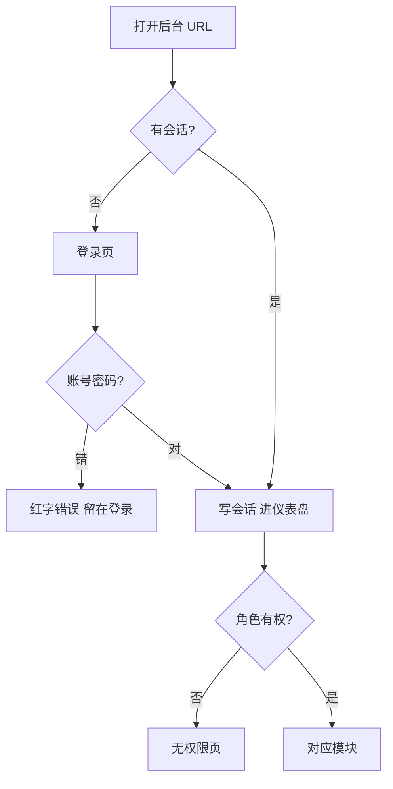
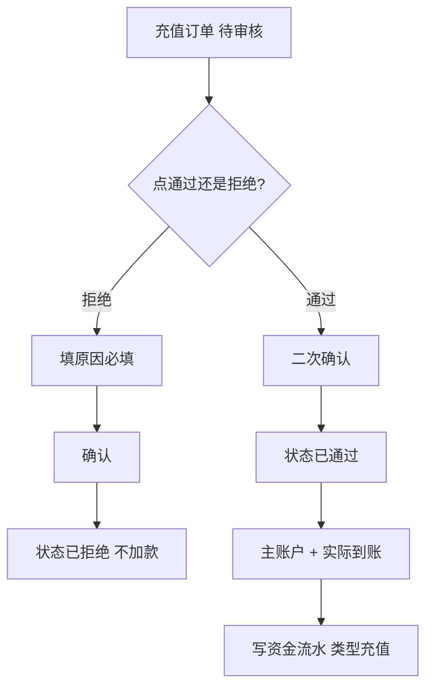
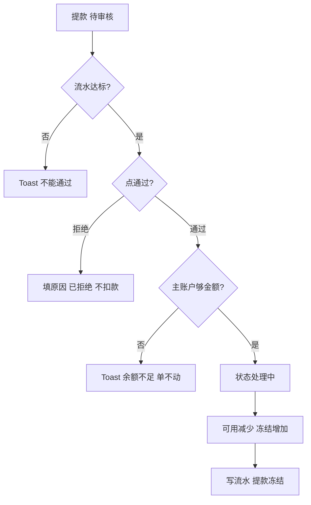
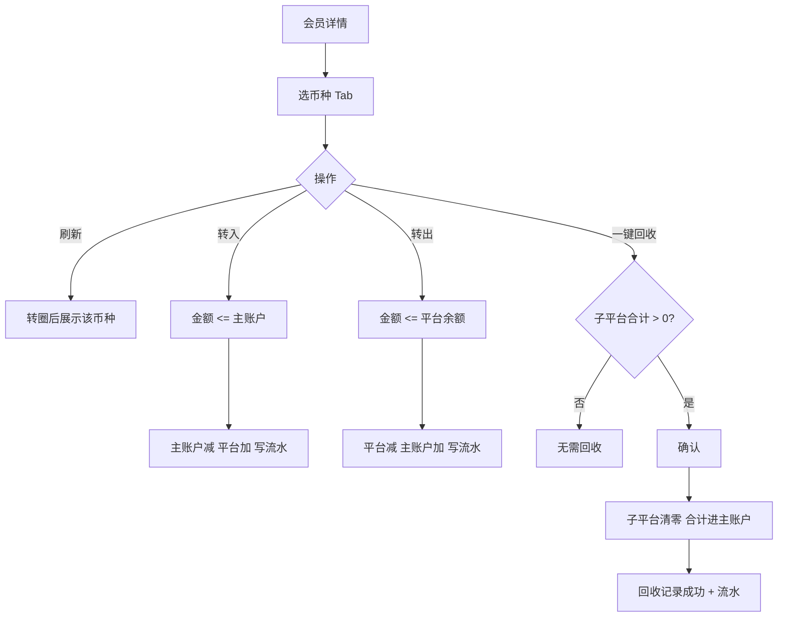
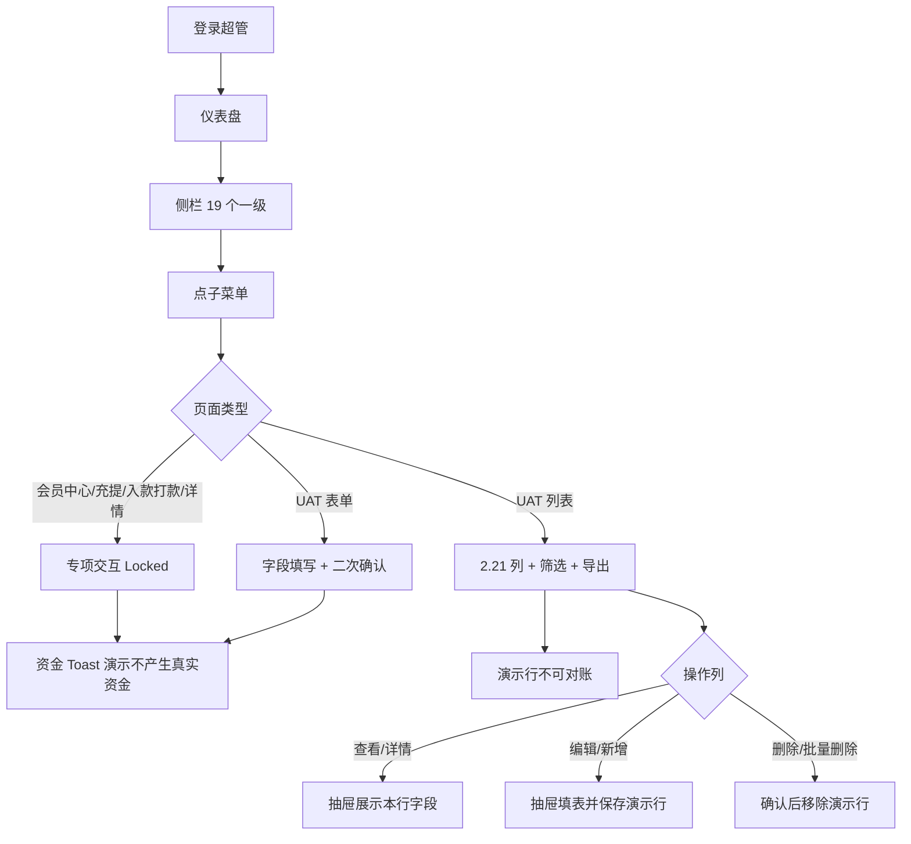
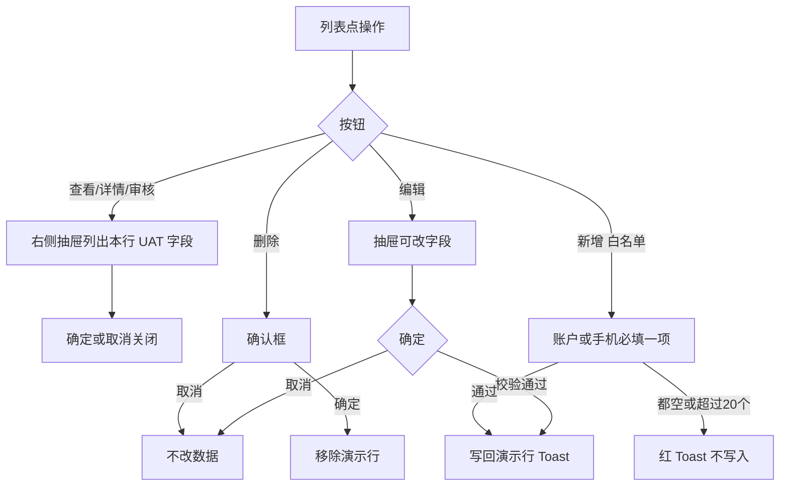
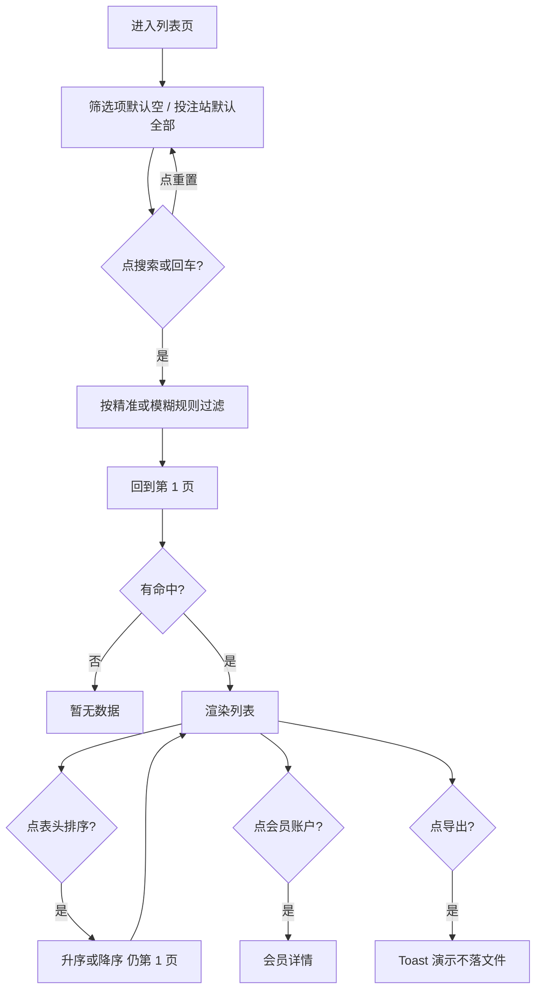
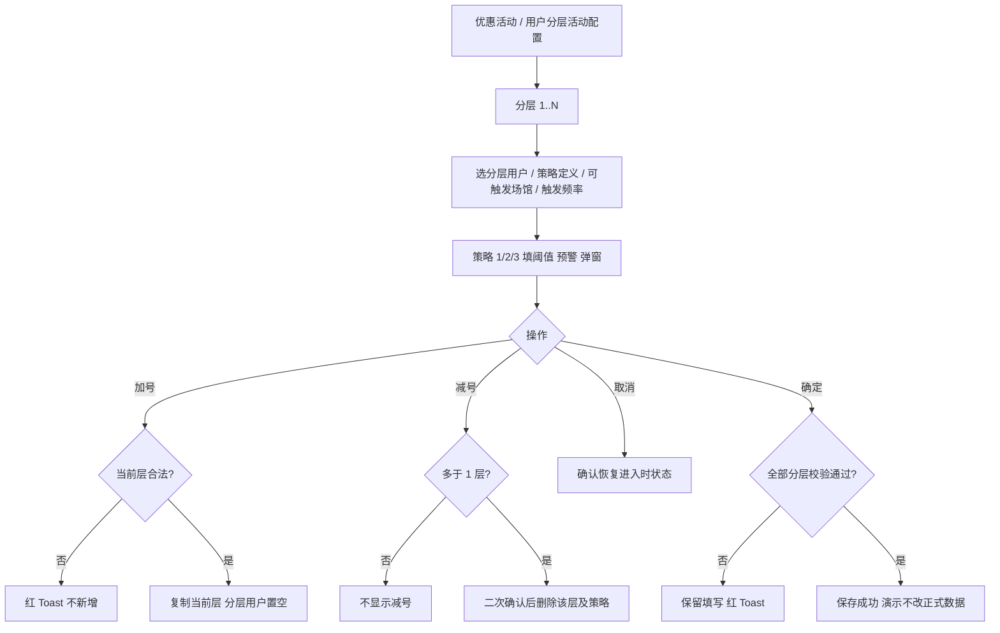
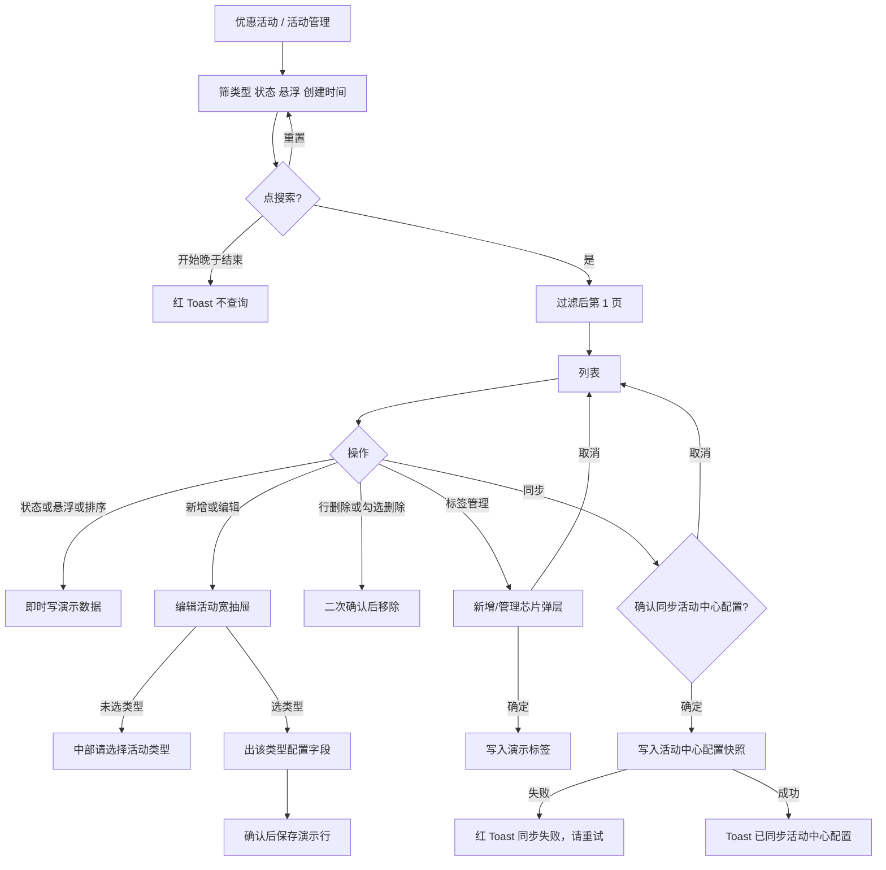

# 管理后台 PRD

> 按《产品文档规范要求》完整 PRD 输出。  
> 对照 **Juan365 线上后台** 做可交互原型，供开发、测试宣讲与验收。  
> 冲突时以 **用户最新明示的线上截图 + 本文件 Locked 条款** 为准。  
> 用户将提供的全套后台截图到达后，子菜单名称、列字段、弹窗文案按截图 **1:1 校正**，不得用改结构删掉已锁定规则。

| 项 | 内容 |
|----|------|
| **项目名称** | 管理后台 |
| **端** | PC 后台（桌面浏览器） |
| **语言** | 界面 **全中文** |
| **原型** | `admin/login.html` → `admin/index.html` |
| **本地预览** | http://localhost:8769/admin/login.html |
| **文档性质** | 给开发、测试宣讲与验收的完整 PRD |
| **演示数据** | 浏览器 `localStorage` key `juan365_admin_v3`；**不产生真实资金、不连正式接口** |

**Locked 2026-08-16：** 演示数据 key 现为 `juan365_admin_v4`（分组枚举与冻结状态=2 与 UAT 对齐）。上表 v3 为原文。

**Locked 2026-08-16：** 原型打开即进后台，**不再校验登录页**。入口 `admin/index.html#/dashboard`；`login.html` 只跳转仪表盘。正式环境仍要登录。

**Locked 2026-08-16 虚拟数据：** 目录列表禁止「字段名 + A/B/C」。行数据按列语义生成（会员 / 订单 / 金额 / 状态 / 时间 / 平台），与 seed 会员复用；`catalogVer=5` 会重刷旧占位行。演示不可对账。以后新原型页同样自动填合适虚拟数据。

---

## 一、需求背景与目标

### 1. 需求背景

说明为什么做这个需求、当前存在什么问题。

Juan365 前台已有大厅、VIP、抽奖、QRPH 返利、萌宠等需求原型，但 **运营/客服/财务日常使用的是同一套管理后台**。目前后台能力散落在：

- 抽奖项目里只做出了「优惠活动」若干页；
- 会员详情平台余额、余额回收记录只存在旧文档，没有可点的全站后台；
- 充值提款、资金操作、平台游戏、会员列表等 **线上已有界面，但没有统一可交互原型**，开发和测试无法按同一套点击路径验收。

当前要解决的问题：

- 没有一份覆盖 **登录 → 侧栏全模块 → 列表/详情/审核/划转** 的可点原型，宣讲只能对着截图口述。  
- 资金类操作（充提审核、人工存提、一键回收、子平台划转）缺少统一的确认、流水、权限与异常处理说明。  
- 角色权限（超管 / 客服 / 财务 / 运营）没有可演示的拦截。  
- 抽奖复杂配置已在独立项目定稿，不应在本仓库再复制第二套真相，但全站后台必须能导航到同构的活动列表与报表。

宣讲主线：

1. **这是什么**：Juan365 运营后台，不是前台大厅。  
2. **谁用**：超管、客服、财务、运营。  
3. **干什么**：查会员与余额、审充提、做资金调整、开关游戏、配活动。  
4. **钱怎么走**：所有加款/扣款/划转必须二次确认，写流水，演示标明不产生真实资金。  
5. **和别的项目关系**：抽奖完整编辑抽屉看抽奖项目；QRPH 前台看返利项目；本项目是后台壳 + 全模块交互。

### 2. 需求路径以及权限说明

#### 前台路径

本需求 **不做** 玩家前台页面。前台大厅 / 充值 / 抽奖分别在既有项目中。

| 关联前台 | 仓库 | 本后台对应 |
|----------|------|------------|
| 大厅 / 账户 / VIP | qq-lottery-prototype `c-end/` | 会员列表、VIP 字段只读展示 |
| 抽奖活动 | qq-lottery-prototype | 活动管理列表 + 抽奖报表 |
| QRPH 充值返利 | qq-qrph-rebate-prototype | 优惠活动 → QRPH真金返利 |
| 萌宠乐园 | qq-pet-vip-prototype | 本需求不配置宠物玩法 |

#### 后台路径

| 页面 | 路径 / 入口 |
|------|-------------|
| 登录 | `admin/login.html` |
| 后台 SPA | `admin/index.html#/{路由}` |
| 仪表盘 | `#/dashboard`（登录后默认；点 Logo「JUAN」） |
| 会员中心 | 侧栏 会员管理 → 会员中心 |
| 会员详情 | 列表「详情」，`#/memberDetail?id={账号}` |
| 会员层级 / 登录日志 | 会员管理 子菜单 |
| 投注 / 游戏 / 红利记录 | 更多记录（截图名）；UAT 侧栏现为 **投注记录** |
| 充值订单 / 提款审核 / 通道 | 充值提款（UAT 文案：审核会员充值 / 审核会员提款 / 充值策略 / 提款策略） |
| 人工存入 / 提出 / 流水 / 回收记录 | 资金操作（UAT 文案：系统入款 / 系统打款；流水与回收仍在会员账单/会员详情） |
| 游戏列表 / 厂商 / 维护 | 平台游戏 |
| 活动管理及报表、兑换码、QRPH | 优惠活动 |

浏览器直接打开 `admin/index.html` 且无会话时，**必须跳转登录页**。

**Locked 2026-08-16：** 原型不再跳登录。打开 `admin/index.html` 即仪表盘（超管会话自动写入）。正式环境仍须登录。

#### 权限配置

| 角色 | 演示账号 | 密码 | 可进 |
|------|----------|------|------|
| 超级管理员 | admin | 123456 | 全部 |
| 客服 | kefu | 123456 | 仪表盘、会员管理、投注记录（截图曾写「更多记录」） |
| 财务 | caiwu | 123456 | 仪表盘、会员详情（含划转/回收）、充值提款、资金操作 |
| 运营 | yunying | 123456 | 仪表盘、平台游戏、优惠活动 |

- 无权限进入某路由：主区展示「无权限」，不展示该模块的金额操作按钮。  
- 客服可看会员详情，**不可**一键回收 / 转入 / 转出（按钮禁用）。  
- 财务不可改活动配置、不可开关游戏（侧栏可点但进页被拦）。  
- 底部演示栏可切换角色，仅原型使用，正式环境删除。

**Locked 2026-08-16 演示账号：** 原型登录只保留一套 **admin / 123456**（超级管理员，全部模块可进）。上表客服/财务/运营仍是正式环境角色权限说明，**不再提供独立演示账号**。底部演示栏去掉切角色，只留接口失败 / 空数据 / 重置。

#### 联通权限

- 与抽奖项目：**活动类型枚举、报表口径**对齐；不在本仓库实现抽奖分享任务 / 红包雨 / 奖品区间的完整编辑抽屉。  
- 与 QRPH 项目：返利比例、最低充值、封顶、打码倍数同一套字段；前台英语展示不在本仓库。  
- 与萌宠乐园：**无功能联通**。  
- 正式开发接服务端后，本文件规则仍有效，不绑定必须用 `localStorage`。

### 3. 需求目标

- 运营人员可以在一套后台里完成：登录、查会员、看多币种平台余额、审核充提、人工调账、回收子平台余额、开关游戏与通道、配置活动开关。  
- 开发和测试可以按本文件勾选验收，而不只对着静态截图。  
- 资金操作可追溯（资金流水必有操作人、前后余额、备注）。  
- 截图到达后，页面字段与线上一致，交互逻辑不丢。

### 4. 业务要求

- 后台语言中文；金额默认两位小数，可千分位。  
- **禁止跨币种汇总**。会员详情按币种 Tab 独立计算。  
- 充值通过后才加主账户；提款通过后先扣可用、增加提现冻结（处理中），不得直接凭空出款。  
- 人工存入 / 提出原因必填。  
- 一键回收只回收 **当前币种** 下全部子平台。  
- 流水未达标的提款不得审核通过。  
- 冻结会员后，列表状态为冻结；正式环境应禁止该会员登录前台（原型只改状态）。  
- 演示环境所有资金 Toast 必须带「演示，不产生真实资金」。  
- 不做：玩家注册开户的完整 KYC、三方支付真实回调、报表真实数仓、工单系统。  
- 子菜单若与后续截图不一致，**以截图为准改正文案与列**，资金与权限规则不因此作废。

---

## 二、详细功能说明

每个功能按规范写：功能名称、功能说明、展示规则、交互逻辑、业务规则、状态说明、延伸。

### 2.1 登录

| 项 | 内容 |
|----|------|
| **功能名称** | 后台登录 |
| **功能说明** | 用账号密码进入管理后台，按角色写入会话 |
| **展示规则** | 未登录访问后台任意 hash 都回到登录页；已登录打开登录页则进仪表盘。卡片展示 JUAN 365、演示账号说明 |
| **交互逻辑** | 点「登录」校验账号密码；失败红字「账号或密码错误」，留在本页；成功进入 `#/dashboard`。点侧栏「退出」清会话回登录页 |
| **业务规则** | 仅演示四套账号。连续失败原型不锁号（正式环境可按风控锁）。会话存在 `sessionStorage`，关标签即掉 |
| **状态说明** | 默认空表；错误；成功跳转 |
| **延伸** | 正式环境接 SSO / 验证码 / 谷歌验证；截图若有验证码，按截图补。**现演示只认 admin / 123456**，登录页预填该套账号；错误红字仍为「账号或密码错误」 |

**Locked 2026-08-16：** 原型去掉登录校验。打开后台即整套可点页面；`login.html` 仅跳转 `#/dashboard`。顶栏「退出登录」仍展示（截图锁定），点了 Toast「演示环境直接打开后台，无需登录」，不离开后台。正式环境登录规则以上表为准。

### 2.2 侧栏、顶栏与演示栏

| 项 | 内容 |
|----|------|
| **功能名称** | 后台壳 |
| **功能说明** | 一级菜单折叠、子菜单跳转、顶栏、底部演示开关 |
| **展示规则** | 左侧深色栏，Logo 为彩色块 + **JUAN**（无 365）。**无「首页」菜单**。一级菜单锁定（2026-08-16 仪表盘截图）：**会员管理、更多记录、充值提款、资金操作、平台游戏、优惠活动、报表管理**。进仪表盘时默认展开「会员管理」。会员管理子菜单锁定 11 项：会员中心、会员分组、会员账单、KYC审核管理、自我限制、短信查询、登录日志、用户行为日志、提款账户管理、会员ID查询、用户分层。顶栏左：折叠 + 当前页名（仪表盘）；右：搜索、全屏、通知、设置、猫头像。头像下拉「退出登录」 |
| **交互逻辑** | 点 Logo 进仪表盘。点一级菜单只展开/收起。点子菜单改 hash。折叠按钮收起侧栏。搜索/通知/设置 Toast 演示。全屏走浏览器 Fullscreen API。演示栏：超管/客服/财务/运营、接口失败、空数据、重置数据 |
| **业务规则** | 接口失败打开后，列表页展示失败块 + 重试。空数据打开后表格「暂无数据」。重置恢复 seed，不清会话 |
| **状态说明** | 展开 / 收起；当前子菜单高亮；演示开关 on |
| **延伸** | 优惠活动、报表管理的子菜单在对应截图到达后 1:1 校正；不得删本段已锁定的 7 个一级与会员管理 11 项。**Locked 2026-08-16 UAT getInfo：** 超管侧栏以 `GET /prod/system/getInfo` 可见菜单为准。截图「更多记录」对应线上「投注记录」。一级共 19 项：会员管理、投注记录、充值提款、资金操作、平台游戏、优惠活动、报表管理、任务系统、联盟管理、综合报告、渠道管理、信息配置、平台配置、负责任博彩管理、投注站管理、风控管理、盈亏异常用户名单、地推管理、系统设置。抽奖相关报表挂在优惠活动下；报表管理为留存 / LTV / 盈利等。UAT 侧栏无 QRPH，本仓库仍保留 `#/qrph` 供联通返利项目。列字段仍待各页截图 1:1。**Locked 演示栏：** 不再切角色；一套超管账号看全站。**Locked 排版：** 页名只在顶栏；列表为筛选卡 + 表卡（工具栏/表/分页一体）；筛选四列标签在左、控件高 32px；分页「共 N 条 / 页码 / N 条/页」；操作列与勾选列吸边；侧栏分组图标，底栏可折到 64px。 |

### 2.3 仪表盘

| 项 | 内容 |
|----|------|
| **功能名称** | 仪表盘 |
| **功能说明** | 登录后首页：管理员信息、站点币种语言、实时时钟、六张今日指标卡、今日注册折线 |
| **展示规则** | 对照 2026-08-16 线上截图。白底管理员卡：猫头像、「管理员, 反馈!」、**平台币种: PHP**、**平台语言: 菲律宾语**；右侧黑底数字钟（时分秒 + YYYY/MM/DD）。六张彩色卡 3×2：橙「今日新增」、蓝「会员总数」、粉「充提差额」、深蓝「今日投注」、绿「今日损益」、紫「今日优惠」。每卡含同比角标、主数字、分行明细、右下角图标。底部白卡「今日注册」折线，X 轴 00:00:00–23:00:00，Y 轴 0–1 |
| **交互逻辑** | 时钟每秒刷新。今日新增 / 充提 / 投注 / 优惠主数字按本地「今天」数据汇总；无今日数据时主数字为 0，角标 **-100%**（与截图空闲日一致）。会员总数角标 **0%**。总首充 500,101 / 总代理 22 / 总大R 2,822,945 为截图锁定的累计示数（seed `dashSnap`）。点 Logo 回到本页 |
| **业务规则** | 站点展示币种 PHP。今日充值只计当天「已通过」；今日提现计当天「已通过 + 处理中」。禁止把多币种加进这些 KPI |
| **状态说明** | 有今日数据则主数字非 0、角标 0%；无则 0 与 -100%。折线无注册时贴着 0 轴 |
| **延伸** | 截图中的图标样式以线上为准，可用等价线性图标 |

### 2.4 会员中心

| 项 | 内容 |
|----|------|
| **功能名称** | 会员中心 |
| **功能说明** | 查询会员，进详情，冻结/解冻，演示新增 |
| **展示规则** | 侧栏文案为「会员中心」（不是「会员列表」）。筛选：账号、状态、层级。表格：账号、VIP、层级、上级代理、状态、最后登录、注册时间、操作。工具栏 + 新增 |
| **交互逻辑** | 搜索按当前筛选刷新并回到第 1 页；重置清空条件。详情跳转会员详情页签。冻结/解冻先确认。新增打开抽屉，账号必填且不可重复 |
| **业务规则** | 冻结确认文案：「确认冻结该会员？冻结后无法登录前台。」解冻反向。新增不是正式开户，Toast 标明演示 |
| **状态说明** | 正常 / 冻结；空表；分页 10/20/50 |
| **延伸** | 截图列（手机、注册 IP、标签等）按截图加列，本段操作不删。**UAT 源码列（2026-08-16）：** 会员账户、会员分组、所属平台、真实姓名、出生日期、推荐码、推荐码访问次数、邮箱账号、手机号、上级账户、余额、彩金余额、进行中任务、彩金转真金总金额、在线状态、注册时间、账号状态、是否试玩、最后登录时间、注册 IP、备注、操作。筛选含会员账户、会员分组、推荐码、邮箱、手机、上级、进行中任务、注册时间、账号状态、是否试玩、最后登录、注册 IP。工具栏：新增、批量冻结、批量排除、导出。**Locked 勾选列：** 表格首列为勾选框，表头可全选当前页。未勾选点批量冻结/排除 Toast「请先勾选会员」；勾选后二次确认再改状态（冻结=账号状态冻结，排除=排除中）。**Locked 2026-08-16 搜索/表格尺寸：** 筛选四列横排，标签在左约 112–160px，控件高 32px、圆角 2px；占位「请输入{字段}」「请选择{字段}」。搜索蓝底、重置白底描边，居中。下拉枚举：账号状态 正常=1 / 冻结=2 / 排除中=3 / 未完善=-1；进行中任务 是=1 否=2；是否试玩与是否测试账户 是=1 否=0。表格字号 14、行高 40、表头 #f2f3f5、单元格居中；会员账户下划线可点进详情。 |

### 2.4.1 会员管理其余子页（截图列待对齐）

| 项 | 内容 |
|----|------|
| **功能名称** | 会员分组 / 账单 / KYC / 自我限制 / 短信 / 行为日志 / 提款账户 / 会员ID查询 / 用户分层 |
| **功能说明** | 侧栏 11 项中除会员中心、登录日志外的页面，先做成可点列表或查询 |
| **展示规则** | 名称与截图侧栏一字不差。KYC 列：账号、姓名、证件类型、状态、提交时间、操作。会员ID查询为精确查询表单，命中后可进详情 |
| **交互逻辑** | 分组可新增/编辑。KYC 待审核可「通过 / 拒绝」（二次确认）。ID 查询未找到提示「未找到该会员」。其余只读筛选 + 分页 |
| **业务规则** | KYC 通过/拒绝只改审核状态，不改余额。自我限制为只读展示。列字段以后续各页截图为准 |
| **状态说明** | KYC：待审核 / 已通过 / 已拒绝。自我限制：生效中 |
| **延伸** | 各页截图到达后按列名 1:1 校正，不得改侧栏名称。UAT 各子页列见 **2.21** |

### 2.5 会员详情 — 资料与多币种平台余额

| 项 | 内容 |
|----|------|
| **功能名称** | 会员详情（平台余额） |
| **功能说明** | 左侧会员摘要，右侧按币种看主账户、冻结、24 个子平台余额，并做刷新 / 一键回收 / 转入 / 转出 |
| **展示规则** | 顶栏标题 `会员-{账号}` + 返回。左：头像占位、账号、等级、脱敏手机、昵称、玩家层级、上级代理、邀请人（空为 `-`）、注册时间、状态。右：币种 Tab 默认 **CNY**，顺序 CNY / VND / MYR / USDT / THB / JPY / USD / BRL。主账户余额强调色。子平台三列网格，每项：名称、余额、转入、转出。平台清单锁定为既有文档 24 项（B体育 … QM棋牌） |
| **交互逻辑** | 切 Tab 只换当前币种数据，左侧资料不变。刷新按钮旋转约 0.5s 后 Toast 已刷新。一键回收：子平台合计为 0 则 Toast「无需回收」；否则确认「确认将所有子平台余额回收到主账户？」。转入/转出开抽屉：平台只读、可用只读、金额必填。返回回会员中心。无权限角色按钮禁用 |
| **业务规则** | 各币种独立，禁止跨币种加总。金额 > 0 且 ≤ 可用。转入：主账户减少、该平台增加。转出相反。一键回收：当前币种全部子平台清零，合计加入主账户，写回收记录（成功）+ 资金流水。精度 2 位 |
| **状态说明** | 会员不存在：提示并引导返回。刷新中：按钮旋转。划转中：确定后关抽屉再刷新。维护中厂商的划转：后续截图若有置灰规则，与「维护开关」联通 |
| **延伸** | 正式环境失败要保留旧余额。演示 seed：`wjfytn329022` 的 CNY 主账户 2,710.00，冻结 0，子平台多为 0 |

锁定示例会员（来自既有《会员详情—平台余额》，不得改掉当验收对照）：

| 项 | 值 |
|----|-----|
| 会员 ID | wjfytn329022 |
| 等级 | Lv.1 |
| 手机 | 134****4423 |
| 玩家层级 | lalalal |
| 上级代理 | nekousdt2026 (中国) |
| 邀请人 | - |
| 注册时间 | 2026-06-10 17:32:09 |

### 2.6 会员层级

| 项 | 内容 |
|----|------|
| **功能名称** | 会员层级 |
| **功能说明** | 维护层级名称、存款区间、返水%、备注 |
| **展示规则** | 列表 + 新增/编辑抽屉 |
| **交互逻辑** | 名称必填。保存写回本地。列表「编辑」带入原值 |
| **业务规则** | 层级名称给会员列表筛选使用。改名不自动改已打在会员上的旧字符串（原型不级联刷新历史会员，正式环境按是否级联产品再定） |
| **状态说明** | 默认若干演示层级（新客 / 普通 / lalalal / VIP高价值 / 观察） |
| **延伸** | 截图若有自动升降级规则，补进本段，不得只写「可配置」 |

### 2.7 登录日志

| 项 | 内容 |
|----|------|
| **功能名称** | 登录日志 |
| **功能说明** | 查会员后台可见的登录成功/失败 |
| **展示规则** | 筛账号、结果；列：账号、IP、设备、结果、时间 |
| **交互逻辑** | 搜索 / 重置 / 分页 |
| **业务规则** | 只读，不提供删除 |
| **状态说明** | 成功绿、失败灰/默认 |
| **延伸** | 无 |

### 2.8 更多记录（投注 / 游戏 / 红利）

| 项 | 内容 |
|----|------|
| **功能名称** | 投注记录、游戏记录、红利记录 |
| **功能说明** | 只读查询与导出演示 |
| **展示规则** | 投注含注单号、厂商、游戏、投注额、有效流水、输赢、状态（已结算/未结算）。红利含类型、金额、操作人 |
| **交互逻辑** | 筛选后点导出 → Toast「已按当前筛选生成导出任务（演示 CSV，不落真实文件）」 |
| **业务规则** | 导出范围为 **当前筛选全量**，不是仅当前页。未结算注单有效流水可为 0 |
| **状态说明** | 已结算 / 未结算；红利已发放 |
| **延伸** | 截图列名以截图为准。**UAT getInfo：** 一级菜单名为「投注记录」；子项为会员投注、电子/视讯/体育投注记录、投注统计、Basic Data、活动注单白名单。游戏记录、红利记录不再出现在该一级下 |

### 2.9 充值订单

| 项 | 内容 |
|----|------|
| **功能名称** | 充值审核 |
| **功能说明** | 财务审核三方/钱包充值单 |
| **展示规则** | 筛账号、状态、通道。列含订单号、金额、手续费、实际到账、状态、申请时间、操作人。待审核行显示通过 / 拒绝 |
| **交互逻辑** | 通过：确认「确认通过？演示环境不产生真实资金。」成功后状态=已通过，会员主账户（演示走 CNY）加上实际到账，写流水类型「充值」。拒绝：先抽屉填原因（必填）再确认，状态=已拒绝，不加款 |
| **业务规则** | 非待审核行操作列为 —。已通过不得再审。拒绝原因留给客服解释。QRPH 通道通过后，正式环境按 QRPH 配置自动发返利；**本原型审核通过不加自动返利**，避免和返利项目两套发放打架（Locked） |
| **状态说明** | 待审核 / 已通过 / 已拒绝 |
| **延伸** | 三方回调成功自动通过不在本期原型；截图若有「补单」按截图加。UAT 侧栏文案为「审核会员充值」，规则不变 |

### 2.10 提款审核

| 项 | 内容 |
|----|------|
| **功能名称** | 提款审核 |
| **功能说明** | 审核会员出款，校验流水与余额 |
| **展示规则** | 同充值列表结构。待审核显示通过 / 拒绝 |
| **交互逻辑** | 通过前若 `turnoverOk === false`，Toast「流水未达标，不能通过」，不改状态。通过后：若主账户不足，Toast「主账户余额不足，无法出款」且不改单。成功则状态=处理中，可用减少、冻结增加，流水类型「提款冻结」 |
| **业务规则** | 处理中表示已扣可用、钱在冻结，等待通道出款（原型不模拟通道回调成功）。拒绝必填原因，不扣款 |
| **状态说明** | 待审核 / 处理中 / 已拒绝 / 已通过（seed 可含历史已拒绝） |
| **延伸** | 正式环境通道成功后冻结转已出款；失败应解冻退回可用。截图到达后补「打款成功/失败」操作 |

### 2.11 充值通道 / 提款通道

| 项 | 内容 |
|----|------|
| **功能名称** | 通道配置 |
| **功能说明** | 开关通道、改限额与手续费 |
| **展示规则** | 名称、类型、最小/最大、手续费、状态开关、排序、备注。QRPH 备注写明与优惠活动返利的关系 |
| **交互逻辑** | 开关立即保存并 Toast。新增/编辑抽屉，名称必填 |
| **业务规则** | 关闭的通道正式环境前台不可选（本原型不改前台）。限额只作展示与后续校验预留 |
| **状态说明** | 开启 / 关闭 |
| **延伸** | 截图中的三方商户号、回调地址按截图加字段，原型可不接真商户 |

### 2.12 人工存入 / 人工提出

| 项 | 内容 |
|----|------|
| **功能名称** | 人工调账 |
| **功能说明** | 财务对指定会员主账户加款或扣款 |
| **展示规则** | 表单：账号、金额、币种、原因。文案写明演示不产生真实资金 |
| **交互逻辑** | 账号必须已存在。金额 > 0。原因必填。确认框带账号、金额、币种。确定后写流水并改主账户。按钮在确认过程中保持可点一次（确认未完成前不提交） |
| **业务规则** | 提出不得超过该币种主账户可用（不含冻结）。禁止用本功能替代提款审核出款。操作人取当前登录名 |
| **状态说明** | 默认空表单；成功 Toast；失败红 Toast |
| **延伸** | 截图若需审核流（先申请再复审），按截图加状态，不得改成无确认直接改余额。UAT 侧栏文案为「系统入款 / 系统打款」，交互与资金规则不变 |

### 2.13 资金流水

| 项 | 内容 |
|----|------|
| **功能名称** | 资金流水 |
| **功能说明** | 所有资金变动的只读账本 |
| **展示规则** | 列：流水号、账号、类型、金额、变动前、变动后、时间、操作人、备注。可按类型筛 |
| **交互逻辑** | 搜索、重置、导出演示 |
| **业务规则** | 充值、提款冻结、人工存入/提出、一键回收、转入/转出子平台、QRPH返利（seed）均应能出现。导出当前筛选全量 |
| **状态说明** | 只读 |
| **延伸** | 无 |

### 2.14 余额回收记录

| 项 | 内容 |
|----|------|
| **功能名称** | 余额回收记录 |
| **功能说明** | 追溯一键回收任务，失败可再次回收 |
| **展示规则** | 筛：回收结束时间、游戏渠道ID、任务状态。列：用户名、开始/结束时间、回收金额、回收前/后、渠道、状态、操作人、操作。成功绿 / 失败红 / 处理中蓝。失败行「再次回收」，其它 — |
| **交互逻辑** | 进入即查。时间起 > 止应提示且不查（原型若未填时间则不限）。再次回收先确认「确认再次回收该用户在【渠道名】的余额？」确认后本行改处理中，约 1.2s 后演示转为成功并补结束时间、回收后金额 0。导出按当前筛选 |
| **业务规则** | 金额快照保留。同一用户多渠道多条。处理中时结束时间、回收后可为 —。再次回收是 **更新原记录**（原型约定，避免重复金额）；正式若改为新增一条，以接口为准并改文档 |
| **状态说明** | 成功 / 失败 / 处理中 |
| **延伸** | 顶栏若截图有「数据补录 / ES数据 / 余额回收记录」三个 Tab，按截图加上入口；本期不展开前两个 Tab 的功能 |

锁定表示例（来自既有《余额回收记录》）：

| 用户名 | 状态 | 操作 |
|--------|------|------|
| Zipper123 | 成功 | — |
| Zipper123 | 失败 | 再次回收 |
| Zipper133 | 处理中 | — |

### 2.15 游戏列表 / 厂商管理 / 维护开关

| 项 | 内容 |
|----|------|
| **功能名称** | 平台游戏开关 |
| **功能说明** | 上架游戏、厂商启用、维护 |
| **展示规则** | 游戏：厂商、名称、分类、热门、状态。厂商：启用 + 维护。维护页说明：维护中前台该平台划转应禁用 |
| **交互逻辑** | 开关即时保存。维护页与厂商管理共用 `maintain` 字段 |
| **业务规则** | 下架游戏正式环境前台不可进。厂商维护 ≠ 关闭通道。印度彩票 seed 为维护中 |
| **状态说明** | 上架/下架；维护中 |
| **延伸** | 截图中的排序、图标、多语言名按截图加 |

### 2.16 活动管理

| 项 | 内容 |
|----|------|
| **功能名称** | 活动管理列表与基础编辑 |
| **功能说明** | 全站活动开关、类型、时间、悬浮；抽奖深配置不在本页做第二真相 |
| **展示规则** | 筛类型/状态/标题。列对齐既有活动管理：ID、标题、类型、标签、排序、状态、悬浮、开始/结束。工具栏：新增、删除 |
| **交互逻辑** | 勾选后删除需确认。状态/悬浮开关即改。新增/编辑抽屉：标题必填。抽屉顶部提示：抽奖分享任务、红包雨、奖品区间以抽奖项目为准 |
| **业务规则** | 类型枚举锁定：次日救援金、宝箱裂变、习俗、当日首存、押金返水、广告、抽奖、金钱如雨、周亏损返现、日亏损返现、兑换码 |
| **状态说明** | 开启/关闭；悬浮开/关 |
| **延伸** | 完整抽奖编辑抽屉见 qq-lottery-prototype `admin/activity.html` |

**Locked 2026-08-16 截图：** 上表「筛类型/状态/标题」「列对齐…开始/结束」「工具栏：新增、删除」为原文。现对照 UAT 活动管理截图，入口 `优惠活动 / 活动管理`，路由 `#/activity`。本页是配置列表，**不是报表，表底无金额合计**。演示只写 `localStorage`，不改正式活动、不产生真实资金。

| 项 | 内容 |
|----|------|
| **功能名称** | 活动管理 |
| **功能说明** | 全站活动列表开关、类型、标签、排序、悬浮；抽奖深配置仍不在本页做第二真相 |
| **展示规则** | 筛类型 / 状态 / 悬浮开关 / 创建时间，占位「请选择…」。工具栏：+ 新增、删除（红）、标签管理。列：勾选、活动ID、标题、移动端图标、PC端图标、类型、选择标签、排序（−/+ 步进）、状态开关、悬浮开关（不适用为 `--`）、操作（编辑 / 删除）。默认 30 条/页。2.21 的开始/结束/创建时间留在编辑抽屉，列表按截图不展示 |
| **交互逻辑** | 搜索按筛选项过滤，创建时间开始晚于结束红 Toast 且不查。重置清空。状态/悬浮/排序步进即改即存。新增/编辑为右侧抽屉，标题必填，标签从标签管理选项选。行删除与批量删除先确认「演示环境不改正式数据」。未勾选点删除 Toast「请先勾选数据」。标签管理为居中弹层，可新增/改名/删除演示标签 |
| **业务规则** | 锁定 11 种类型保留。截图补充 **每日签到、自定义活动**。部分类型（次日救援金、每日签到、当日首存、押金返水、周/日亏损返现、兑换码、习俗）悬浮列为 `--`。活动 ID 为数字。图标无图时用标题首字色块占位。抽奖奖品区间仍认抽奖项目 |
| **状态说明** | 状态开启/关闭；悬浮开启/关闭/不适用（`--`） |
| **延伸** | 抽奖深配置见 qq-lottery-prototype。运营报表 `#/ops` 会读本页活动标题与类型 |

**Locked 2026-08-16 标签弹窗：** 上表「标签管理为居中弹层，可新增/改名/删除」为原文。现对照截图：点「标签管理」打开居中弹层，标题 **新增/管理**。标签以两列灰底芯片展示（New / GO活动 / 广告活动 / 亏损返现活动 / 返水活动 / 活动平台活动）。点名称进入输入态（无 ×）；点芯片 × 从草稿移除；下方虚线「+ 新增」追加空芯片并进入输入。底栏「取消」丢弃草稿，「确定」校验后写入演示标签（空名 / 重名红 Toast）。不改正式数据。

**Locked 2026-09-03 同步活动中心：** 上表工具栏「+ 新增、删除、标签管理」为原文。现「标签管理」右侧增加「同步」。

| 项 | 内容 |
|----|------|
| **功能名称** | 同步活动中心配置 |
| **功能说明** | 把当前活动管理列表配置推到活动中心，前台活动中心按这次快照展示 |
| **展示规则** | 工具栏黑底按钮，文案「同步」，在「标签管理」右侧。悬停说明「同步活动中心配置」 |
| **交互逻辑** | 点「同步」弹出确认「确认同步活动中心配置？」。取消不写。确定后按钮变为「同步中…」且不可连点；成功 Toast「已同步活动中心配置」并恢复「同步」；失败 Toast「同步失败，请重试」并恢复按钮 |
| **业务规则** | 写入当前全部活动（含关闭）的配置快照，含同步时间与操作人。不改会员余额、不改活动列表本身。正式环境以后端同步接口为准 |
| **状态说明** | 默认可点 / 确认中 / 同步中 / 成功 / 失败可重试 |
| **延伸** | 活动中心读本次快照；未点同步则活动中心仍用上次已同步配置 |

**Locked 2026-08-16 新增抽屉：** 上表「新增/编辑为右侧抽屉，标题必填」为原文。现对照截图：点 + 新增或行编辑均打开右侧宽抽屉，标题一律 **编辑活动**。必填三项：活动标题（占位「请输入活动标题」，右侧 `0/100`，最多 100 字）、活动类型（占位「请选择活动类型」）、选择标签（新增默认 New）。未选类型时中部灰框居中「请选择活动类型」；选类型后才出该类型配置。底栏「取消 / 确认」（确认为黑底）。抽奖深配置仍不在本页保存。

**Locked 2026-08-16 类型枚举与分类型配置：** 上表锁定 11 种为原文。现下拉按 UAT 截图补全并按此顺序：当日首存活动、周亏损返现、日亏损返现、金钱如雨、转盘奖励、广告活动、自定义活动、注册免费送、投注返水、抽奖活动、视频完播奖励、回归玩家福利赠送、奖上奖、宝箱裂变活动、slot日返利、周邀请活动、vip、每日签到、天天砸金蛋、次日救援金、礼金周周送、天天好运金、月存好礼。选中某一类型后中部换成该类型字段（当日首存为四个 −/+：返真金次数 / 返彩金次数 / 首存保留彩金打码倍数 / 续存保留彩金打码倍数，默认 30 / 30 / 1 / 1）。抽奖只保存循环周期，奖品区间仍认抽奖项目。原「习俗活动 / 押金返水 / 兑换码」不进本下拉。

**Locked 2026-08-16 周亏损返现配置：** 对照三张截图。选「周亏损返现」后上卡补移动端/PC 图标（虚线「+ 本地上传」，说明「前端活动页面显示用」）。下卡：最高返现奖励（步进，默认 0，旁 ?）；打码量倍数必填（占位「请输入打码量倍数」，? 文案为设置为 0 不限流水）；活动允许游戏（黑按钮「选择游戏」，未选确认 Toast「请选择活动允许游戏」）；VIP返现比例表 vip0～VIP5，列「返现比例」，默认 0.00%；额外周亏损返奖开关，开后出额外周亏损返奖比例表（默认 1.00%）及必填额外周亏损返奖时间（周一至周日勾选，全空 Toast「额外周亏损返奖时间不能为空」）；用户总输开关（?：打开判平台总输，关闭只判周输）。演示不产生真实资金。

**Locked 2026-09-07：** 上句「打码量倍数」为原文。现字段名改为 **周亏损打码量倍数**（必填，占位「请输入周亏损打码量倍数」；空值确认 Toast「请输入周亏损打码量倍数」）。日亏损返现、金钱如雨仍用「打码量倍数」。

**Locked 2026-09-07 额外周亏损打码：** 上表额外周亏损开后直接出比例表与星期。现开关打开后，比例表上方新增必填 **周亏损额外奖励打码倍数**（步进 0～999，占位「请输入周亏损额外奖励打码倍数」，0 为不限流水）。空值确认 Toast「请输入周亏损额外奖励打码倍数」。开关关闭不展示、不校验该项。

**Locked 2026-09-08 周亏损额外返奖打码倍数方案：** 上段为字段落地原文。现该方案定稿如下，开发 / 测试 / 正式发奖只认这一套，不得把额外周亏损奖励拿去乘「周亏损打码量倍数」。

| 项 | 内容 |
|----|------|
| **功能名称** | 周亏损额外奖励打码倍数 |
| **功能说明** | 额外周亏损返奖与普通周亏损返现分开打码。打开额外周亏损返奖后，额外奖金按本字段计流水，不沿用「周亏损打码量倍数」 |
| **展示规则** | 仅活动类型「周亏损返现」编辑抽屉。位置：额外周亏损返奖开关下方、额外周亏损返奖比例表上方。开关打开才出现，红 * 必填。标签「周亏损额外奖励打码倍数」，占位「请输入周亏损额外奖励打码倍数」，步进 − / +，范围 0～999。旁 ?：额外周亏损奖励领取后打码倍数，设置为 0 时不限流水。日亏损返现、金钱如雨无此字段 |
| **交互逻辑** | 打开额外周亏损返奖开关后立刻展示本字段，关闭则隐藏且不校验。改步进或输入后点确认才写入。空或非数字红 Toast「请输入周亏损额外奖励打码倍数」，抽屉不关、不保存。填 0 可通过。取消不写 |
| **业务规则** | 普通周亏损返现金额 × 周亏损打码量倍数 = 普通周返现流水。额外周亏损返奖金额 × 周亏损额外奖励打码倍数 = 额外返奖流水。两套倍数互不替代。本字段 = 0 时额外返奖不限流水。开关关闭时额外返奖不发放，本字段不参与结算。已领取的额外周亏损奖励以领取当时保存的倍数为准，事后改配置不回溯。不改会员余额 |
| **状态说明** | 开关关：字段隐藏。开关开未填：校验失败。开关开已填 0：不限流水。开关开已填 1～999：按该倍数打码。保存成功 / 取消保持进入时 |
| **延伸** | 额外周亏损返奖比例、额外周亏损返奖时间仍按 2.16 Locked 周亏损返现配置。活动中心展示以前台同步后的配置为准 |

**Locked 2026-08-16 日亏损返现配置：** 对照两张截图。上卡同周亏损（标题/类型/标签/双端图标）。下卡：最高返现奖励、打码量倍数、选择游戏、VIP返现比例表（vip0～VIP5，默认 0.00%）、用户总输开关（默认关，?：打开判平台总输，关闭只判日输）、救援金开关（必填，默认关）。**没有**额外周亏损返奖开关/比例/星期。演示不产生真实资金。

**Locked 2026-08-16 金钱如雨配置：** 对照三张截图。上卡同周亏损（标题/类型/标签/双端图标）。下卡：参与充值金额（步进，默认 0，?）；每场活动奖励（步进，默认 0，说明「只用于前端用户展示」）；最高获得金额（步进，默认 0，说明「只用于前端用户展示」）；打码量倍数必填（占位「请输入打码量倍数」）。其下 Tab「每日活动 / 额外活动」。每日：显示文案（占位「请输入客户端展示文案（请尽量精简）」）、时间段配置表（流水号 / 开始时间 / 结束时间，表头黑 + 新增；红字「已配置的时间会被占用，不可再选择。修改时间段只能先删除再新增」）。额外：活动日期、显示文案、活动周期、显示文案、同样时间段表。下雨配置在 Tab 下方共用：奖励总额步进、黑按钮「均分奖金」、已配置/未配置计数；VIP0～VIP5 表列派奖总额 / 奖金最低值 / 奖金最高值。演示不产生真实资金。抽奖项目里的红包雨仍认抽奖项目，不在本页复制。

**Locked 2026-08-16 转盘奖励配置：** 对照两张截图。上卡同周亏损（标题/类型/标签/双端图标）。下卡：奖励金额（默认 0）；初始奖励金额区间 `0 P ~ 0 P`；活动周期默认 3 天；每次随机奖励金额为提款剩余金额的最低%~最高%；随机奖励最多次数（说明：不中奖概率随次数递增，到达最高次数时不中奖率为 100%）。区块「完成任务领取最终奖励金」（红字：以下条件完成，获得最终奖励金，即提款剩余金额）。任务1：所邀请用户累计输额 >= P + 领取概率%；指定游戏 Slot / Casino / Arcade / Perya / Sports / Card / Fishing / Bingo / Numeric（全不选不限制），可「展开明细」。任务2：邀请人数且其中 N 人三方注册 + 领取概率%。简讯内容模板必填（占位「请输入短信分享简写内容，分享链接以代替」）。演示不产生真实资金。抽奖转盘奖品区间仍认抽奖项目。

**Locked 2026-08-16 抽奖活动配置：** 上表「抽奖深配置不在本页 / 只保存循环周期」为原文。现按抽奖项目已定稿规则 + 八张 UAT 截图挪入本页「编辑活动」。选「抽奖活动」后：标题计数 `0/200`；上卡双端图标；下卡活动开始时间、循环周期（天）。分享任务配置默认「分享至FB并@5个好友」+ 任务排序；宣传图英文/菲语分组（jpg/png，+ 增组、🗑 删组）；宣传视频英文/菲语「点击上传」（mp4/webm）。可选任务：选择游戏、新增任务表（排序 / 条件 / 数值 / 操作）。红包雨：打码倍数、全天/时间段下雨、下雨配置（奖励总额、红包雨总数、VIP0～VIP5 最低~最高）。流水排名：`top min ~ max` + 说明 + 新增，按有效流水排名且区间不可重叠。抽奖配置：新增奖品须选所属排名；保底金额与保底图；分享链接、官方账号。规则与抽奖项目一致：循环周期重置任务/排名/抽奖次数；分享任务需添加才在前台展示；未添加或任务1关闭时完成任务2/3/4 强制红包雨，倒计时后强制抽奖弹窗；前台不做 Extra money rain / 额外奖励。演示不产生真实资金。前台抽奖页仍在抽奖项目。

**Locked 2026-08-19 分享任务开关：** 上段「分享任务配置默认…+ 任务排序」为原文。现对照截图：分享任务配置内、**任务排序上方**增加 **分享任务开关**（默认开；旧数据未写该字段视为开）。开：前台展示分享任务，完成本期分享才按分享计资格。关：前台不展示分享任务，**本期无需完成分享即可参与抽奖**（任选任务 2/3/4 完成后仍走强制红包雨 → 倒计时后强制抽奖弹窗）。上段「需添加才展示 / 任务1关闭」为原文，本开关与之同一口径，不得另写第二套资格公式。

**Locked 2026-08-19 分享任务无需添加：** 上段「需添加才展示」为原文。现改为：分享任务配置**始终展示开关和任务排序**，**按钮默认保持打开**。不再需要添加才生效。关开关 = 原「未添加」资格口径。

**Locked 2026-08-19 任务至少开启一条：** 点编辑活动底栏「确认」时，分享任务开关与任选任务（含任务表开关，未写开关视为开）合计至少一条生效。全部关闭或未添加任选且分享关闭时，红 Toast「必须选中一个任务开启」，不保存、不关抽屉。演示不产生真实资金。

### 2.17 兑换码配置

| 项 | 内容 |
|----|------|
| **功能名称** | 兑换码 |
| **功能说明** | 配码、配额、过期、开关 |
| **展示规则** | 码、活动、配额、已用、状态、过期、编辑 |
| **交互逻辑** | 新增码必填。开关即保存 |
| **业务规则** | 已用 ≥ 配额时 seed 为关闭。原型不模拟会员兑码 |
| **状态说明** | 开启/关闭 |
| **延伸** | 截图若有批次导入，按截图加 |

### 2.18 QRPH 真金返利配置

| 项 | 内容 |
|----|------|
| **功能名称** | QRPH 返利开关与比例 |
| **功能说明** | 仅 QRPH 成功充值按比例入真金钱包 |
| **展示规则** | 开启、比例%、最低充值₱、单笔封顶（空=不封顶）、打码倍数 |
| **交互逻辑** | 保存写 `qrph` 节点并 Toast |
| **业务规则** | 流水 = 倍数 × (本金 + 返利)。与充值审核 **不在本原型自动连发**，避免双发。前台英语角标在返利项目 |
| **状态说明** | 开启/关闭 |
| **延伸** | 完整前台见 qq-qrph-rebate-prototype。UAT `getInfo` 侧栏无此项；本仓库保留 `#/qrph` 供联通返利项目，不出现在超管侧栏 |

### 2.19 优惠活动报表类页面

| 项 | 内容 |
|----|------|
| **功能名称** | 抽奖任务列表、红包雨报表、抽奖会员报表、分层配置/报表、运营报表、会员统计、优惠明细、奖金报表 |
| **功能说明** | 只读查询 + 导出演示；分层两页在截图前用同构列表占位 |
| **展示规则** | 均有账号（或等价维度）筛选、分页、导出。任务列表展示本期任务、有效流水、资格、已抽次数 |
| **交互逻辑** | 搜索/重置/导出 Toast |
| **业务规则** | 口径按抽奖项目：资格来自分享或任选任务；红包雨按 VIP 区间。本页不改发奖 |
| **状态说明** | 有数据 / 空数据 / 接口失败 |
| **延伸** | **截图到达后必须按线上列名、筛选项 1:1 校正**；在校正前不得删本段已写的抽奖报表口径。UAT 这些页挂在「优惠活动」下，不在「报表管理」 |

**Locked 2026-08-16 Axure：** 「分层配置/报表」不再用同构列表占位。用户分层活动配置以 [Axure 用户分层活动配置](https://85cnzd.axshare.com/?g=14&id=kow2b6&p=%E3%80%90%E8%8F%B2%E7%9B%98-backend%E3%80%91%E7%94%A8%E6%88%B7%E5%88%86%E5%B1%82%E6%B4%BB%E5%8A%A8%E9%85%8D%E7%BD%AE&sc=3) 为展示与交互真相，细则见 **2.19.2**。上表「占位」为原文。

### 2.19.1 UAT 其余模块（getInfo 可见、列待截图）

| 项 | 内容 |
|----|------|
| **功能名称** | 任务系统、联盟管理、综合报告、渠道管理、信息配置、平台配置、负责任博彩、投注站、风控、盈亏异常、地推、系统设置，以及充值提款/资金/游戏/报表中 getInfo 新增子页 |
| **功能说明** | 超管侧栏与 UAT 可见菜单一致，每页可进、可筛、可分页；列字段在对应截图到达前用占位列表 |
| **展示规则** | 名称与 getInfo `meta.title` 一字不差（hidden / 按钮级权限不进侧栏）。列字段以 **2.21** UAT 源码表为准，不再用「名称/状态/更新时间」三列占位 |
| **交互逻辑** | 点子菜单改 hash。搜索/重置/导出 Toast。点查看 Toast「详情以截图到达后 1:1 校正」 |
| **业务规则** | 占位页不改余额、不产生真实资金。资金类已实现页（审核充提、系统入款/打款、会员划转）仍走原 Locked 规则 |
| **状态说明** | 有演示行 / 空数据 / 接口失败 / 无权限 |
| **延伸** | 各页截图到达后按线上列、筛选项、抽屉 1:1 替换占位，不得删本段菜单范围 |

**Locked 2026-08-16 操作列：** 上表「点查看 Toast」为原文。现目录列表点操作不再打开占位抽屉：查看/详情展示本行 UAT 列字段；编辑保存演示行；删除/批量删除先确认再移除演示行；新增打开对应表单。不改正式数据、不改会员余额。

### 2.19.2 用户分层活动配置（Axure）

**Locked 2026-08-16：** 对照 [Axure 【菲盘-Backend】用户分层活动配置](https://85cnzd.axshare.com/?g=14&id=kow2b6&p=%E3%80%90%E8%8F%B2%E7%9B%98-backend%E3%80%91%E7%94%A8%E6%88%B7%E5%88%86%E5%B1%82%E6%B4%BB%E5%8A%A8%E9%85%8D%E7%BD%AE&sc=3)。适用场景：按分层给用户文案劝导、流水奖金、任务奖金。入口 `优惠活动 / 用户分层活动配置`，路由 `#/layer`。本页是整页表单，不是 2.21 占位列表。演示保存只写 `localStorage`，**不产生真实资金、不发真实预警**。

| 项 | 内容 |
|----|------|
| **功能名称** | 用户分层活动配置 |
| **功能说明** | 为每个分层配置策略定义、可触发场馆、触发频率，以及固定 3 条策略（阈值、预警、弹窗奖励） |
| **展示规则** | 顶栏页名「用户分层活动配置」。顶栏右侧与页底各有「取消 / 确定」。分层按「分层 1、分层 2…」编号。每层固定 3 张策略卡。分层用户、可触发场馆为下拉多选框，选中项用英文逗号拼接，超出框宽显示可见部分 + `...` |
| **交互逻辑** | 改策略弹窗类型或是否预警后即时刷新该策略卡字段。点「+」先校验当前层再复制（分层用户置空）。仅多于 1 层时显示「−」，删除先确认并同步删该层全部策略。点「取消」二次确认后恢复进入页时状态。点「确定」校验全部层后 Toast「保存成功」 |
| **业务规则** | 触发：达阈值先发预警，60 秒后校验，条件未变才发弹窗/奖励；条件已变则再等 60 秒按最新条件校验。只允许单向触发。用户每次成功充值到账后策略重置。定义 1 同时触发取**最大**阈值，高阈值触发后不可再触发低阈值。定义 2 同时触发取**最小**阈值，低阈值触发后不可再触发高阈值。10 秒内多策略并发时字段表原文写「执行最低阈值」，与定义 1「最大优先」冲突时**以策略定义条为准** |
| **状态说明** | 未保存草稿 / 已保存演示配置 / 校验失败保留填写 / 接口失败可重试 |
| **延伸** | C 端弹窗见 Axure「用户分层活动弹窗」。报表 `#/layerReport`。可触发场馆清单待开发确认可实时统计的场馆；原型默认 Slot，另给 Live / Sports / Fishing / Bingo 供演示。弹窗字数上限原型暂 100，正式以 UI 定稿为准 |

#### 分层用户

| 项 | 内容 |
|----|------|
| **功能名称** | 分层用户 |
| **功能说明** | 指定本层策略作用的用户分层 |
| **展示规则** | 下拉。选项读取会员管理「用户分层」列表的【分层名称】（演示含 Day2用户、Day3用户、Day4用户、新客、普通、VIP高价值、lalalal、观察）。默认「无」。选中项在框内用 `,` 隔开 |
| **交互逻辑** | 选「无」时不可再勾其他层，已选清空。勾任一分层则取消「无」。必选 |
| **业务规则** | 选中则对该分层用户群体设置。每层含分层名称、策略定义、是否预警、预警地址；每层固定策略 1/2/3，各含阈值与奖励 |
| **状态说明** | 默认无；已选一层或多层；超宽省略 |
| **延伸** | 对应字段见会员管理「用户分层」 |

#### 策略定义

| 项 | 内容 |
|----|------|
| **功能名称** | 策略定义 |
| **功能说明** | 定义本层用哪条公式判断阈值 |
| **展示规则** | 单选下拉。默认「无」。选项：① 用户实时净负盈利 / 用户最近一笔存款金额 ≥ 阈值；② 用户实时余额 / 用户最近一笔存款金额 ≤ 阈值 |
| **交互逻辑** | 必选。确认时「无」不可提交 |
| **业务规则** | 每层策略只允许单向触发一次，多个策略可被多次单向触发。定义 1：同时触发以阈值最大为优先，高阈值触发后不可再触发低阈值。定义 2：同时触发以阈值最小为优先，低阈值触发后不可再触发高阈值 |
| **状态说明** | 无 / 定义 1 / 定义 2 |
| **延伸** | 正式环境达阈值实时先预警，60 秒后校验相同策略才触发 |

#### 可触发场馆

| 项 | 内容 |
|----|------|
| **功能名称** | 可触发场馆 |
| **功能说明** | 该活动只在勾选场馆实时计算并交互 |
| **展示规则** | 下拉多选。默认 Slot。选中项 `,` 拼接，超宽 `...` |
| **交互逻辑** | 必选至少一项 |
| **业务规则** | 下拉仅为支持实时数据统计的场馆 |
| **状态说明** | 默认 Slot；已多选 |
| **延伸** | 可实时触发场馆待开发确认 |

#### 触发频率

| 项 | 内容 |
|----|------|
| **功能名称** | 触发频率 |
| **功能说明** | 限制同一策略在时间窗内触发次数 |
| **展示规则** | 「X 小时内，只能触发 Y 次」。X、Y 默认 0 |
| **交互逻辑** | 只允许 0～999 正整数。确认时校验 |
| **业务规则** | 对应分层用户**第一次成功触发策略后**，X 小时内只能触发 Y 次相同策略 |
| **状态说明** | 默认 0 / 0；非法不可保存 |
| **延伸** | 无 |

#### 策略配置 / 阈值比例 / 策略弹窗

| 项 | 内容 |
|----|------|
| **功能名称** | 策略配置 |
| **功能说明** | 配置触发不同策略后的用户交互 |
| **展示规则** | 每层固定 3 个策略。每条含阈值比例、是否预警、预警地址、策略弹窗 |
| **交互逻辑** | 弹窗类型：无（默认）/ 文案弹窗 / 奖金弹窗 / 充值任务弹窗。切类型后展示对应输入 |
| **业务规则** | 阈值比例 0～1000% 整数。10 秒内多策略并发原文「执行最低阈值」；与定义 1/2 优先级冲突时以策略定义条为准 |
| **状态说明** | 三张卡始终在；类型「无」不展示弹窗字段 |
| **延伸** | 需校验阈值合法性 |

#### 是否预警

| 项 | 内容 |
|----|------|
| **功能名称** | 是否预警 |
| **功能说明** | 向对应 URL 发布预警 |
| **展示规则** | 单选「是 / 否」，默认否。否时预警地址灰不可编。是时可编，占位「请填入发布预警地址」 |
| **交互逻辑** | 选「是」时地址必填，确认时校验合法 URL |
| **业务规则** | 预警文案：用户【用户ID】【所属分层】已触发【策略定义】【阈值】，请注意！今日累计触发X次！预警时间：达到阈值时 |
| **状态说明** | 否（地址禁用）/ 是（地址可编） |
| **延伸** | 原型点确定不真实请求 URL，Toast 标明演示 |

#### 文案弹窗

| 项 | 内容 |
|----|------|
| **功能名称** | 文案弹窗 |
| **功能说明** | 运营配置劝导文案；触发时同步发相同站内信 |
| **展示规则** | 下拉为「文案弹窗」（Axure 亦写「文字弹窗」）。右侧文案框，提示「请编辑弹窗文案，不超过 X 个字」。原型 X=100，旁显示剩余字数 |
| **交互逻辑** | 选文案弹窗时文案必填，空不可提交 |
| **业务规则** | 触发时同时发出与弹窗文案相同的站内信（无单独开关） |
| **状态说明** | 未填 / 已填 / 超字截断 |
| **延伸** | C 端见「用户分层活动弹窗-文字弹窗」。字数待 UI 定稿 |

#### 奖金弹窗

| 项 | 内容 |
|----|------|
| **功能名称** | 奖金弹窗 |
| **功能说明** | 配置固定奖金与打码倍数 |
| **展示规则** | 奖金金额、打码倍数。提示「奖金额倍数」 |
| **交互逻辑** | 奖金金额正整数且 > 0，展示千分位。打码倍数 1～999 整数，必填 |
| **业务规则** | 空填或错填确认时红 Toast。演示不入账 |
| **状态说明** | 未填 / 合法 / 非法 |
| **延伸** | 无 |

#### 充值任务弹窗

| 项 | 内容 |
|----|------|
| **功能名称** | 充值任务弹窗 |
| **功能说明** | 配置限时充值任务 |
| **展示规则** | 充值金额、奖金比例、打码倍数。提示「本金+奖金额倍数」 |
| **交互逻辑** | 充值金额正整数 > 0。奖金比例 0～100% 整数。打码倍数 1～999 整数必填 |
| **业务规则** | 空填或错填确认时红 Toast。演示不入账 |
| **状态说明** | 未填 / 合法 / 非法 |
| **延伸** | 无 |

#### 分层增删与取消确认

| 项 | 内容 |
|----|------|
| **功能名称** | 【−】【+】与【取消】【确定】 |
| **功能说明** | 增删分层区块；放弃或提交整页配置 |
| **展示规则** | 「−」仅多于 1 层时出现。新增后自动编号分层 1、2、3… |
| **交互逻辑** | 「+」先校验当前层；新层除分层用户为空外，复制当前层其余项。删层二次确认。取消文案固定：「用户分层策略未执行，确定取消恢复上一次进入时状态？」确定校验后保存 |
| **业务规则** | 至少保留 1 层。删层同步删其下全部策略。提交失败保留填写并返回原因 |
| **状态说明** | 至少 1 层；未保存 / 已保存 / 校验失败 |
| **延伸** | 提交前校验：分层名称、策略定义、阈值比例、奖励类型对应项、开启预警时的地址 |

### 2.21 UAT 全量页面字段（2026-08-16 线上源码）

| 项 | 内容 |
|----|------|
| **功能名称** | 管理后台全量列表 / 表单（按 UAT Vue 列还原） |
| **功能说明** | 超管侧栏 19 个一级下每一页均可进入。列表列名、筛选项来自 UAT 页面源码 `dataIndex` + 中文 `title`；资金审核与会员划转仍走上文 Locked 规则 |
| **展示规则** | 下列各表「筛选 / 列」与线上源码一致（hidden 菜单、按钮级权限不进侧栏）。宽表横向滚动。演示行不是正式数仓数据 |
| **交互逻辑** | 搜索 / 重置 / 分页 / 导出 Toast。点操作打开演示抽屉。系统入款等表单页点提交须二次确认，Toast「演示，不产生真实资金」。会员中心 / 充提审核 / 系统入款打款 / 会员详情仍用上文专项交互 |
| **业务规则** | 目录页不改余额。禁止把演示行当成对账依据。抽奖深配置仍以抽奖项目为准 |
| **状态说明** | 列表：有演示行 / 空数据 / 接口失败 / 无权限。表单：未提交 / 已演示提交 |
| **延伸** | 用户后续截图若与源码列不一致，以截图为准改正文案；不得删本段菜单范围与 Locked 资金规则 |

**Locked 2026-08-16 操作列：** 上表「点操作打开演示抽屉」为原文。现禁止占位文案「字段以 UAT 列表为准。本抽屉为演示…」。查看/详情抽屉按本行列出全部 UAT 列（只读）；编辑抽屉可改演示行，确定后写回 localStorage；删除弹确认「确认删除该条记录？演示环境不改正式数据。」；有批量删除的页须勾选后才能删。资金相关 Toast 仍带「演示，不产生真实资金」。会员中心 / 充提审核 / 系统入款打款 / 会员详情 / 活动管理 / 游戏管理仍用上文专项交互，不被目录页通用抽屉覆盖。

**Locked 2026-08-16 操作层样式：** 点操作后的层按 UAT MineAdmin / Arco 还原：新增/编辑为右侧抽屉宽 600px，标题「新增/编辑」，表单标签在左（约 112px 右对齐）、控件高 32px、圆角 2px；查看为只读描述表（两列，标签底 #f7f8fa）；用户分层「查看会员明细」为居中弹层，先描述本层再会员表，可搜账户，底栏仅「关闭」。遮罩 `rgba(29,33,41,.6)`；顶栏高 48px、字重 500；底栏取消为白底描边、确定/关闭为蓝 `#165dff`。确认框标题「提示」，按钮同样式。不得再用黑底确定或上下堆叠大标题表单冒充线上。

#### 2.21 会员管理

| 页面 | 类型 | 筛选 | 列 / 表单字段 |
|------|------|------|----------------|
| 会员中心 | 列表 | 会员账户；会员分组；推荐码；邮箱账号；手机号；上级账户；是否有正在进行任务；注册时间；账号状态；是否试玩；最后登录时间；注册IP | 会员账户；会员分组；所属平台；真实姓名；出生日期；推荐码；推荐码访问次数；邮箱账号；手机号；上级账户；余额；彩金余额；是否有正在进行任务；彩金转真金总金额；在线状态；注册时间；账号状态；是否试玩；最后登录时间；注册IP；affiliatedBettingStation；测试账户 |
| 会员分组 | 列表 | 关键字 | 等级全称；等级简称；等级图标；会员级别；会员人数；晋级经验；注册默认；客服 |
| 会员账单 | 列表 | 关键字 | 会员账户；所属平台；钱包类型；类型；交易金额；交易前余额；交易后余额；注单号；创建时间；备注 |
| KYC审核管理 | 表单 | ManualReviewRequired；statusPlaceholder；selectKycStatusRequired | ManualReviewRequired；statusPlaceholder；selectKycStatusRequired |
| 自我限制 | 表单 | remarksRequiredTips；remarksMaxlengthTips | remarksRequiredTips；remarksMaxlengthTips |
| 短信查询 | 列表 | 发送时间；类型；会员账户 | 发送时间；类型；所属平台；手机号；会员账户；内容；状态 |
| 登录日志 | 列表 | 所属平台；登录IP；登录时间；登出时间 | 会员账户；所属平台；登录地点；登录IP；设备；登录时间；登出时间；活动时长 |
| 用户行为日志 | 列表 | 会员账户；所属平台；操作IP；操作时间 | 会员账户；requestRouting；所属平台；操作IP；IPLocation；requestResults；statusCode；操作时间 |
| 提款账户管理 | 列表 | 关键字 | 提款账户ID；会员账户；所属平台；提款账户类型；提款账户；状态；绑定日期；提交IP；设备号；操作人；更新时间 |
| 会员ID查询 | 列表 | 会员账户 | 流水号；会员账户；会员ID |
| 用户分层 | 列表 | 用户分层 | 用户分层；分层规则；备注；操作 |

| 项 | 内容 |
|----|------|
| **功能名称** | 会员管理 |
| **功能说明** | 运营在侧栏进入本模块各子页，查询或配置对应业务 |
| **展示规则** | 子页名称与上表一致；无权限角色侧栏不显示该组或进页见「无权限」 |
| **交互逻辑** | 点子菜单进入对应 hash；筛选后搜索回第 1 页；导出只 Toast 不落真实文件 |
| **业务规则** | 冻结后列表为冻结；详情划转禁止跨币种；KYC 只改审核状态不改余额 |
| **状态说明** | 见各页列中的状态字段；空表「暂无数据」 |
| **延伸** | 列以本节表格为准；截图到达后 1:1 校正抽屉字段 |

**Locked 2026-08-16 用户分层：** 上表列为原文。UAT 另有会员人数（按充值天数落在本层区间、状态正常、非测试账户统计）。操作是 **查看会员明细**，打开宽抽屉：先展示本层名称 / 规则 / 备注 / 人数，再列出该层会员（账户、手机、状态、分组、最后登录），点账户或「查看详情」进会员详情。不是占位文案，也不是编辑/删除本层。演示不改正式分层。

#### 2.21 投注记录

| 页面 | 类型 | 筛选 | 列 / 表单字段 |
|------|------|------|----------------|
| 会员投注 | 列表 | 关键字 | 会员账户；母单号；子单号；游戏平台；游戏名称；下注类型；起始余额；下注金额；盈亏；结束余额；输赢状态；betTime；结束时间；affiliatedBettingStation |
| 电子投注记录 | 列表 | 关键字 | 会员账户；affiliatedBettingStation；母单号；子单号；游戏平台；游戏名称；betTime；下注类型；下注金额；输赢状态；奖金；盈亏；触发jackpot；betIP；driverNum |
| 视讯投注记录 | 列表 | 关键字 | 会员账户；affiliatedBettingStation；注单号；游戏平台；游戏名称；betTime；局号；下注类型；下注金额；输赢状态；奖金；盈亏；触发jackpot；结束时间；betIP；driverNum |
| 体育投注记录 | 列表 | betID；betTime；下注金额；odds | betID；用户账户；betTime；体育类型；下注类型；bettingItems；homeScore；awayScore；homeName；awayName；事件名称；下注金额；settlementAmount；odds；settlementStatus；结算时间；betIP；设备号；affiliatedBettingStation |
| 投注统计 | 列表 | 关键字 | 注单量；总注单量；总有效投注；会员输赢；占单量；获利比；affiliatedBettingStation |
| Basic Data | 列表 | 会员账户；母单号；子单号；游戏名称；下注类型 | 会员账户；母单号；子单号；游戏类型；类型；游戏厂商；游戏名称；下注类型；下注金额；赠送彩金金额；盈亏；输赢状态；开始时间；结束时间；affiliatedBettingStation |
| 活动注单白名单 | 列表 | 会员账户；手机号码 | 会员账户；手机号码；操作 |

| 项 | 内容 |
|----|------|
| **功能名称** | 投注记录 |
| **功能说明** | 运营在侧栏进入本模块各子页，查询或配置对应业务 |
| **展示规则** | 子页名称与上表一致；无权限角色侧栏不显示该组或进页见「无权限」 |
| **交互逻辑** | 点子菜单进入对应 hash；筛选后搜索回第 1 页；导出只 Toast 不落真实文件 |
| **业务规则** | 本模块目录页不改会员余额；开关类 Toast 演示生效；正式环境以后端鉴权为准 |
| **状态说明** | 见各页列中的状态字段；空表「暂无数据」 |
| **延伸** | 列以本节表格为准；截图到达后 1:1 校正抽屉字段 |

**Locked 2026-08-16 活动注单白名单：** 上表列为原文。UAT 列表另有真实姓名（新增表单不展示）。操作列是 **删除**（确认后移除演示行），不是查看详情。工具栏：新增、批量删除（须先勾选）。新增抽屉：会员账户与手机号码必须填一项，填一项则另一项禁用；多个用英文逗号分隔，最多 20 个；两项都空红 Toast「会员账户与手机号码必须填一项」且不写入。演示数据不改正式白名单、不改会员余额。

#### 2.21 充值提款

| 页面 | 类型 | 筛选 | 列 / 表单字段 |
|------|------|------|----------------|
| 充值策略 | 列表 | 通道编码 | 通道名；三方名；通道编码；移动端图标；PC端图标；展示名称；支付费率；最小充值；最大充值；首存赠送奖金任务；真金打码倍率；奖励设置；续充赠送比例（%）；热门金额；客户端展示；首充赠送真金的打码倍率；wagerMultiplierForTop-upBonus；首充赠送彩金的打码倍率；wagerMultiplierForTop-upBonusCredits；首充彩金任务过期时间（小时）；top-upBonusTaskExpiry；自定义金额 |
| 提款策略 | 列表 | 货币；状态 | 货币；提款类型；展示类型名称；手续费比例（%）；最低提现金额；最高提现金额；状态 |
| 审核会员充值 | 列表 | 关键字 | 订单编号；会员账户；所属平台；申请时间；处理时间；会员组；订单金额；实际支付金额；状态；支付通道；通道订单号；充值类型；赠送形式；赠送金额；备注；操作人；来源；客户端IP；第一次存款；affiliatedBettingStation |
| 审核会员提款 | 列表 | 关键字 | 订单编号；会员账户；所属平台；审核时间；出款时间；会员组；货币；三方渠道；三方订单号；网络类型；费率；总手续费；真金手续费；彩金手续费；提现金额；提现时余额；实际支付金额；状态；提现地址；提现时间；审核人；审核备注 |
| 超时审查表 | 列表 | 关键字 | 订单编号；会员账户；用户组；货币；三方渠道；网络类型；费率；总手续费；真金手续费；彩金手续费；提现金额；提现时余额；实际支付金额；状态；提现地址；提现时间；审核人；审核时间；出款时间；出款人；后台出款；affiliatedBettingStation |
| 财务配置 | 列表 | 关键字 | 名称；状态；更新时间 |
| 金流渠道管理 | 列表 | 关键字 | 通道名；优先级(权重)；支持银行；归属玩家数；归属玩家数占比；成功率；渠道状态 |

| 项 | 内容 |
|----|------|
| **功能名称** | 充值提款 |
| **功能说明** | 运营在侧栏进入本模块各子页，查询或配置对应业务 |
| **展示规则** | 子页名称与上表一致；无权限角色侧栏不显示该组或进页见「无权限」 |
| **交互逻辑** | 点子菜单进入对应 hash；筛选后搜索回第 1 页；导出只 Toast 不落真实文件 |
| **业务规则** | 金额类提交必须二次确认；演示不产生真实资金；流水不达标不得过提款；系统入款/打款原因或金额校验失败红 Toast |
| **状态说明** | 见各页列中的状态字段；空表「暂无数据」 |
| **延伸** | 列以本节表格为准；截图到达后 1:1 校正抽屉字段 |

#### 2.21 资金操作

| 页面 | 类型 | 筛选 | 列 / 表单字段 |
|------|------|------|----------------|
| 投注站出入款 | 表单 | 请输入需要操作的账号；请选择存款类型；请输入存款金额；请输入 | 请输入需要操作的账号；请选择存款类型；请输入存款金额；请输入 |
| 异常资金处理 | 表单 | 请输入需要操作的账号 | 请输入需要操作的账号 |
| 投注站出入款 | 表单 | 请输入需要操作的账号；请选择存款类型；请输入存款金额；请输入 | 请输入需要操作的账号；请选择存款类型；请输入存款金额；请输入 |
| 系统入款 | 表单 | 请输入需要操作的账号；请选择存款类型；请输入存款金额 | 请输入需要操作的账号；请选择存款类型；请输入存款金额 |
| 系统入款记录 | 列表 | 关键字 | 创建时间；存款类型；领取方式；存款金额；流水倍数；派发数量；已领数量；未领数量；操作人；详情 |
| 系统打款 | 列表 | 关键字 | 会员账户；通道；收款人；账号；提现到账金额；是否验证打码；备注 |
| 彩金模板 | 列表 | 名称 | 模板ID；名称；金额；流水倍数；创建时间；过期时间；状态 |
| 彩金配置 | 列表 | 关键字 | 名称；状态；更新时间 |
| 违规资金管理 | 列表 | 关键字 | 名称；状态；更新时间 |

| 项 | 内容 |
|----|------|
| **功能名称** | 资金操作 |
| **功能说明** | 运营在侧栏进入本模块各子页，查询或配置对应业务 |
| **展示规则** | 子页名称与上表一致；无权限角色侧栏不显示该组或进页见「无权限」 |
| **交互逻辑** | 点子菜单进入对应 hash；筛选后搜索回第 1 页；导出只 Toast 不落真实文件 |
| **业务规则** | 金额类提交必须二次确认；演示不产生真实资金；流水不达标不得过提款；系统入款/打款原因或金额校验失败红 Toast |
| **状态说明** | 见各页列中的状态字段；空表「暂无数据」 |
| **延伸** | 列以本节表格为准；截图到达后 1:1 校正抽屉字段 |

#### 2.21 平台游戏

| 页面 | 类型 | 筛选 | 列 / 表单字段 |
|------|------|------|----------------|
| 游戏厂商 | 列表 | 名称；状态 | 移动端图标；PC端图标；名称；排序；状态 |
| 游戏类型 | 列表 | 关键字 | 分类名称；点击前图标；点击后图标；排序；状态；返佣状态 |
| 游戏平台 | 列表 | 名称；类型；游戏厂商；状态 | PC端图标；移动端图标；入口logo；名称；类型；游戏厂商；排序；状态 |
| 游戏管理 | 列表 | 名称；游戏类型；游戏厂商；状态；维护；热门分类；精选分类；热门标签；最新标签；彩金标签；列表隐藏；显示平台 | 名称；图片；代码；游戏类型；游戏厂商；平台；状态；维护；热门分类；精选分类；热门标签；最新标签；彩金标签；列表隐藏；排序；显示平台 |

| 项 | 内容 |
|----|------|
| **功能名称** | 平台游戏 |
| **功能说明** | 运营在侧栏进入本模块各子页，查询或配置对应业务 |
| **展示规则** | 子页名称与上表一致；无权限角色侧栏不显示该组或进页见「无权限」 |
| **交互逻辑** | 点子菜单进入对应 hash；筛选后搜索回第 1 页；导出只 Toast 不落真实文件 |
| **业务规则** | 本模块目录页不改会员余额；开关类 Toast 演示生效；正式环境以后端鉴权为准 |
| **状态说明** | 见各页列中的状态字段；空表「暂无数据」 |
| **延伸** | 列以本节表格为准；截图到达后 1:1 校正抽屉字段 |

#### 2.21 优惠活动

| 页面 | 类型 | 筛选 | 列 / 表单字段 |
|------|------|------|----------------|
| 用户分层活动配置 | 列表 | 关键字 | 名称；状态；更新时间 |
| 用户分层活动报表 | 列表 | 关键字 | triggerTime；会员账户；hierarchicalUsers；赠送形式；奖励金额；codingMultiple；consumeStatus；rewardConsumeTime；lastDepositAmount；userNetProfitAtTrigger；userBalanceAtTrigger |
| 抽奖活动任务列表 | 列表 | 会员账户；期数；通过类型；领奖进度 | 操作；操作人；会员账户；期数；uploadTime；操作时间；领奖进度；uploadLink；thirdGame:manage:image |
| 抽奖红包雨报表 | 列表 | 日期；期数 | 日期；期数；参加人数；总抢金额；用户平均成本 |
| 抽奖会员报表 | 列表 | 关键字 | 任务ID；会员账户；期数；会员分组；奖励种类；奖品名称；奖励金额；打码倍率；领取状态；发放时间；发放人；活动成本；affiliatedBettingStation；stationsType |
| 兑换码配置 | 列表 | 创建时间；奖励种类；redeemCode；状态 | systemId；创建时间；expireTime；奖励种类；redeemCode；limitCount；amountRange；taskValidDays；claimCondition；claimedUserCount；claimAmount；状态；备注 |
| 活动管理 | 列表 | 类型；状态；悬浮开关；创建时间 | 活动ID；标题；移动端图标；PC端图标；类型；选择标签；排序；状态；悬浮开关；开始时间；结束时间；创建时间 |
| 活动运营报表 | 列表 | 关键字 | 名称；状态；更新时间 |
| 会员统计报表 | 列表 | 关键字 | 会员账户；总奖励金额；完成次数；邀请人数；affiliatedBettingStation |
| 优惠明细 | 列表 | 会员账户；来源；领取日期；affiliatedBettingStation；bettingStationType | 会员账户；来源；金额；起始余额；结束余额；领取日期；备注；affiliatedBettingStation |
| 奖金报表 | 列表 | 关键字 | 任务ID；会员账户；所属平台；任务类型；任务派发奖金；流水倍数；总流水要求；奖励种类；任务创建时间；实际开始时间；到期截止时间；任务状态；当前进度；开始时奖金余额；结束时奖金余额；当前奖金余额；彩金转真金比例；转真金额度；关闭原因；affiliatedBettingStation |
| 金钱如雨报表 | 列表 | 关键字 | 日期；时间段；参加人数；总抢金额 |
| 免费获得报表 | 列表 | 关键字 | 会员账户；总充值；总参与次数；完成次数；总获得奖励；额外奖励；affiliatedBettingStation |
| 日亏损返现明细表 | 列表 | 会员账户；统计时间；领取状态；affiliatedBettingStation；bettingStationType | 会员账户；原VIP等级；原奖励比例（%）；领取状态；领取时间；过期时间；affiliatedBettingStation；bettingStationType |
| 周亏损返现明细表 | 列表 | 关键字 | 会员账户；上周日期；原VIP等级；原奖励比例（%）；是否领取；额外奖励；统计时间；最后更新时间；过期时间；affiliatedBettingStation；领取时间；可领日；领取状态 |
| 返水活动详情 | 列表 | 创建时间；领取时间；会员账户；游戏类型；状态；affiliatedBettingStation；bettingStationType | 创建时间；会员账户；游戏类型；有效投注金额；原返水比例；状态；过期时间；affiliatedBettingStation |
| 活动领取统计 | 列表 | 活动名称；奖励创建日期 | 活动名称；奖励创建日期；活动数据统计周期；派发人次；派发金额；已领人次；已领金额；未领人次；未领金额 |
| 宝箱裂变报表 | 列表 | 会员账户；奖励金额；领取状态 | 奖励时间；会员账户；有效用户数；奖励金额；领取状态 |
| 回归玩家福利赠送表 | 列表 | 派发时间；会员账户；状态 | 会员账户；金额；状态；领取时间；派发时间；活动准入条件 |
| 视频完播报表 | 列表 | 日期；会员账户 | 会员账户；观看日期；观看时长；奖励金额 |

**Locked 2026-08-16 Axure：** 上表「用户分层活动配置」列为 UAT 源码占位原文。现页按 Axure 做成整页表单（分层用户 / 策略定义 / 可触发场馆 / 触发频率 / 三策略卡），不再用名称/状态/更新时间列表。细则见 **2.19.2**。

**Locked 2026-08-16 截图：** 上表活动管理列为 UAT 源码原文。现列表按截图展示勾选 + 可见字段 + 操作（编辑/删除）；开始/结束/创建时间在编辑抽屉。工具栏另有「标签管理」。

**Locked 2026-09-03：** 上句工具栏「另有标签管理」为原文。现另有「同步」，点后确认并写入活动中心配置。

| 项 | 内容 |
|----|------|
| **功能名称** | 优惠活动 |
| **功能说明** | 运营在侧栏进入本模块各子页，查询或配置对应业务 |
| **展示规则** | 子页名称与上表一致；无权限角色侧栏不显示该组或进页见「无权限」 |
| **交互逻辑** | 点子菜单进入对应 hash；筛选后搜索回第 1 页；导出只 Toast 不落真实文件 |
| **业务规则** | 本模块目录页不改会员余额；开关类 Toast 演示生效；正式环境以后端鉴权为准 |
| **状态说明** | 见各页列中的状态字段；空表「暂无数据」 |
| **延伸** | 列以本节表格为准；截图到达后 1:1 校正抽屉字段 |

#### 2.21 报表管理

| 页面 | 类型 | 筛选 | 列 / 表单字段 |
|------|------|------|----------------|
| 新增付费留存 | 列表 | promoter；渠道名称 | 日期；首充人数；1DayRecharge；2DaysRetention；2日充值；3DaysRetention；3日充值；4DaysRetention；4日充值；5DaysRetention；5日充值；6DaysRetention；6日充值；7DaysRetention；7日充值；15日留存；15日充值；30日留存；30日充值；2dayRetentionRate；3dayRetentionRate；4dayRetentionRate |
| 充值提现报表 | 列表 | 日期 | 日期；所属平台；新增人数；充值人数；渠道首充人数；官网首充人数；充值笔数；充值金额 ；提现人数；提现笔数；提现金额；提现手续费；提现到账金额；充提差；新增充值人数；新增充值金额；首充人数；firstRechargeFisrtRechargeTotalAmount；firstRechargeTodayTotalAmount；首充复充人数；首充提现人数；首充提现金额 |
| 留存率 | 列表 | 日期；promoter；渠道名称 | 日期；首充人数；1DayRecharge；2DaysRetention；2日充值；3DaysRetention；3日充值；4DaysRetention；4日充值；5DaysRetention；5日充值；6DaysRetention；6日充值；7DaysRetention；7日充值；15日留存；15日充值；30日留存；30日充值；1DayRetentionRate；2dayRetentionRate；3dayRetentionRate |
| 玩家流失统计报表 | 列表 | 会员账户；最长流失时间；当前流失时间 | 会员账户；充值成功笔数；充值总额度；首次充值日期；最后充值日期；最长流失时间；当前流失时间 |
| 渠道首充留存率 | 列表 | 日期；promoter；渠道名称 | 日期；首充人数；1DayRecharge；2DaysRetention；2日充值；3DaysRetention；3日充值；4DaysRetention；4日充值；5DaysRetention；5日充值；6DaysRetention；6日充值；7DaysRetention；7日充值；15日留存；15日充值；30日留存；30日充值；2dayRetentionRate；3dayRetentionRate；4dayRetentionRate |
| 活动留存率 | 列表 | 活动类型；日期；统计目标；VIP等级 | 日期；活动类型；统计目标人数；2dayNumberOfActivePeople；2dayRetentionRate；2dayChurnRate；3dayNumberOfActivePeople；3dayRetentionRate；3dayChurnRate；4dayNumberOfActivePeople；4dayRetentionRate；4dayChurnRate；5dayNumberOfActivePeople；5dayRetentionRate；5dayChurnRate；6dayNumberOfActivePeople；6dayRetentionRate；6dayChurnRate；7dayNumberOfActivePeople；7dayRetentionRate；7dayChurnRate；15日统计人数 |
| 新增充值复充留存 | 列表 | 日期；promoter；渠道名称 | 日期；首充人数；1DayRetention；1DayRecharge；2DaysRetention；2日充值；3DaysRetention；3日充值；4DaysRetention；4日充值；5DaysRetention；5日充值；6DaysRetention；6日充值；7DaysRetention；7日充值；15日留存；15日充值；30日留存；30日充值；1DayRetentionRate；2dayRetentionRate |
| 用户输赢报表 | 列表 | 日期 | 日期；投注人数；下注总金额；净输赢总额；赢钱人数；赢钱总金额；赢钱人均；输钱人数；输钱总金额；输钱人均；平局人数；老用户投注人数；首充用户投注人数；用户赢钱率；用户盈利率 |
| 会员游戏报表 | 列表 | 关键字 | 日期；会员账户；游戏类型；游戏平台；游戏名称；真金游戏局数；真金下注金额；真金取消下注金额；真金盈亏金额；彩金游戏局数；彩金下注金额；彩金取消下注金额；彩金盈亏金额 |
| LTV记录 | 列表 | 日期；promoter；渠道名称 | 日期；首充人数；首充当日总充值；首充提现金额；2ndLTV；3dayLTV；4dayLTV；5dayLTV；6thLTV；7dayLTV；15thLTV；30DayLTV；60DayLTV；90DayLTV；180DayLTV；1yearLTV；2DaysPerCapita；3DaysPerCapita；4DaysPerCapita；5DaysPerCapita；6DaysPerCapita；7DaysPerCapita |
| 首充复充记录 | 列表 | 会员账户；复充日期；首充日期；充值金额 ；提现金额 | 会员账户；复充日期；首充日期；充值金额 ；提现金额 |
| 首充记录 | 列表 | 日期；会员账户；首充第一笔金额；首充提现金额 | 日期；会员账户；首充第一笔金额；首充提现金额 |
| 复充率 | 列表 | 关键字 | 日期；充值人数；充值金额 ；第二日充值人数；第二日充值金额；第二日复充率；第三日充值人数；第三日充值金额；第三日复充率；第四日充值人数；第四日充值金额；第四日复充率；第五日充值人数；第五日充值金额；第五日复充率；第六日充值人数；第六日充值金额；第六日复充率；第七日充值人数；第七日充值金额；第七日复充率；第十五日充值人数 |
| 掉线统计报表 | 列表 | 日期 | 日期；重新输账号的登录次数；主动退出次数；被动退出次数（同账号在其他设备登录）；掉线次数 |
| 支付成功率 | 列表 | 关键字 | 通道名；三方名称；展示名称；0Oclock；1Hour；2Oclock；3Oclock；4Oclock；5Oclock；6Oclock；7Oclock；8Oclock；9Oclock；10Oclock；11Oclock；12Oclock；13Oclock；14Oclock；15Oclock；16Oclock；17Oclock；18Oclock |
| 玩家行为分析 | 列表 | 日期 | 日期；时间；总在线人数；总在线时长(h)；总游戏人数；细分项目；电子；视讯；体育 |
| 游戏盈利报表 | 列表 | userNum；日期；游戏平台；游戏名称 | 所属平台；userNum；gameBetMoney；gameValidBet；gameWinMoney；gameReturnRate；gameProfitRate；gameGgrMoney；游戏ID；游戏名称；gameBetRate |
| 平台盈利分析 | 列表 | 关键字 | 日期；category；总注单量；totalEffectiveBets；赢钱总金额；platformProfitability；profitRate |
| 回本周期报表 | 列表 | 数据日期；数据统计截止；promoter；渠道名称 | 日期；注册用户数量；充值人数；充值金额 ；提现人数；提现金额；收益 |
| 玩家数据报告 | 列表 | 日期；会员账户；stationsType | 会员账户；真实姓名；affiliatedBettingStation；deposits；withdrawals；bets；effectiveBetting；profitLoss；currentAccountBalance；注册时间；最后登录时间；activeAccounts；activeDuration |
| 财务与税收管理 | 列表 | totalAmountPaidIn | totalConfiscatedAmount；jackpotTax；totalAmountPaidIn；有效投注；中奖金额；GGR；settlementTaxRate；legacyTaxCharges；turnIn |

| 项 | 内容 |
|----|------|
| **功能名称** | 报表管理 |
| **功能说明** | 运营在侧栏进入本模块各子页，查询或配置对应业务 |
| **展示规则** | 子页名称与上表一致；无权限角色侧栏不显示该组或进页见「无权限」 |
| **交互逻辑** | 点子菜单进入对应 hash；筛选后搜索回第 1 页；导出只 Toast 不落真实文件 |
| **业务规则** | 本模块目录页不改会员余额；开关类 Toast 演示生效；正式环境以后端鉴权为准 |
| **状态说明** | 见各页列中的状态字段；空表「暂无数据」 |
| **延伸** | 列以本节表格为准；截图到达后 1:1 校正抽屉字段 |

#### 2.21 任务系统

| 页面 | 类型 | 筛选 | 列 / 表单字段 |
|------|------|------|----------------|
| 每日任务配置 | 列表 | 关键字 | taskId；taskName；clientDisplayName；gameGenre；completionConditions；状态；bettingAmount；activityReward；trueGoldReward；流水倍数；taskDescription |
| 每日任务报表 | 列表 | 日期；游戏类型；任务类型 | 期数；名称；游戏类型；赠送人数；总领取金额；领取时间；activityReward；trueGoldReward |

| 项 | 内容 |
|----|------|
| **功能名称** | 任务系统 |
| **功能说明** | 运营在侧栏进入本模块各子页，查询或配置对应业务 |
| **展示规则** | 子页名称与上表一致；无权限角色侧栏不显示该组或进页见「无权限」 |
| **交互逻辑** | 点子菜单进入对应 hash；筛选后搜索回第 1 页；导出只 Toast 不落真实文件 |
| **业务规则** | 本模块目录页不改会员余额；开关类 Toast 演示生效；正式环境以后端鉴权为准 |
| **状态说明** | 见各页列中的状态字段；空表「暂无数据」 |
| **延伸** | 列以本节表格为准；截图到达后 1:1 校正抽屉字段 |

#### 2.21 联盟管理

| 页面 | 类型 | 筛选 | 列 / 表单字段 |
|------|------|------|----------------|
| 全民推广 | 列表 | 关键字 | 代理级别 |
| 会员返佣 | 列表 | 所属平台 | 日期；节点；会员账户；所属平台；直属团队业绩；团队总业绩；团队总佣金；代理级别；节点开始；节点结束；结算时间 |
| 联盟报表(每天) | 列表 | 会员账户 | 日期；会员账户；邀请码；一级下属注册数；二级及以下下属注册数；一级下属首充数；一级下属首充额；一级下属充值；二级下属充值；三级下属充值；一级下属提现；二级下属提现；三级下属提现；一级下属流水；一级下属盈亏；一级下属贡献佣金；一级下属注册24小时后充值人数；二级下属注册24小时后充值人数；三级下属注册24小时后充值人数 |
| 联盟报表(总计) | 列表 | 会员账户；所属平台 | 会员账户；所属平台；邀请码；一级下属注册数；二级及以下下属注册数；一级下属充值；二级下属充值；三级下属充值；一级下属提现；二级下属提现；三级下属提现；一级下属余额；二级下属余额；三级下属余额；一级下属总流水；一级下属真金流水；一级下属贡献佣金；一级下属注册24小时后充值人数；二级下属注册24小时后充值人数；三级下属注册24小时后充值人数 |
| 推广团队报表 | 列表 | 关键字 | 会员账户；代理级别；推荐人；在线状态；会员组；注册时间 |
| 代理统计 | 列表 | 关键字 | 名称；状态；更新时间 |

| 项 | 内容 |
|----|------|
| **功能名称** | 联盟管理 |
| **功能说明** | 运营在侧栏进入本模块各子页，查询或配置对应业务 |
| **展示规则** | 子页名称与上表一致；无权限角色侧栏不显示该组或进页见「无权限」 |
| **交互逻辑** | 点子菜单进入对应 hash；筛选后搜索回第 1 页；导出只 Toast 不落真实文件 |
| **业务规则** | 本模块目录页不改会员余额；开关类 Toast 演示生效；正式环境以后端鉴权为准 |
| **状态说明** | 见各页列中的状态字段；空表「暂无数据」 |
| **延伸** | 列以本节表格为准；截图到达后 1:1 校正抽屉字段 |

#### 2.21 综合报告

| 页面 | 类型 | 筛选 | 列 / 表单字段 |
|------|------|------|----------------|
| 综合财务报告 | 列表 | 日期 | 日期；游戏类型；投注用户数；BetAmount；TurnoverValue；PayoutValue；winOrLoss；grossIncome；Jackpot |
| 年龄区间数据统计 | 列表 | numericGamesBettingNumber | completedKycPeopleCount；activeNumber；bettingRealMoneyUserCount；electronicECasinoGamesBettingNumber；specialtyGamesBettingNumber；electronicBingoGamesBettingNumber；sportsBettingGamesBettingNumber；numericGamesBettingNumber；ageRange |
| 礼物赠送报告 | 列表 | 日期 | 日期；赠送游戏；赠送人数；赠送金额 |
| 玩家信息报告 | 列表 | 关键字 | 真实姓名；出生日期；用户账户；emailDesensitization；手机号；账号状态；所属投注站；是否测试账户 |
| 投注记录 | 列表 | 会员账户；母单号；子单号；游戏名称；下注类型；affiliatedBettingStation | 会员账户；母单号；子单号；注单退还；游戏类型；类型；游戏厂商；游戏名称；游戏编号；体育下注详情；体育游戏名称；体育游戏类型；联赛名称；赛事名称；赛事详情；下注类型；下注金额；Jackpot；payoutAmount；盈亏；输赢状态；投注时间 |
| 风险与合规报告 | 列表 | 日期 | 日期；kycCount；hightRiskTrading；moneyLaunderingTransaction；ndrpCount；selfExcludePlayers；selfDeletePlayers |
| NDRP违规资金上缴报告 | 列表 | 关键字 | 日期；NumberOfForfeitedAccounts；AmountOfForfeitedFundsCashBalance；AmountOfForfeitedFundsBonusCredit；GovernmentMoney；IncludedInNDRP；IneligiblePlayer；ViolationOnTermsOfUse(TOU)；OtherReason |
| 玩家数据报告 | 列表 | 日期 | 日期；newPlayerCount；activePlayer；betPlayer；kycPlayerCount |
| 交易流水与支付 | 列表 | 日期 | 日期；totalDepositAmount；总提现金额；largeTransactionCount |
| GGR结算报告 | 列表 | 关键字 | 名称；状态；更新时间 |

| 项 | 内容 |
|----|------|
| **功能名称** | 综合报告 |
| **功能说明** | 运营在侧栏进入本模块各子页，查询或配置对应业务 |
| **展示规则** | 子页名称与上表一致；无权限角色侧栏不显示该组或进页见「无权限」 |
| **交互逻辑** | 点子菜单进入对应 hash；筛选后搜索回第 1 页；导出只 Toast 不落真实文件 |
| **业务规则** | 本模块目录页不改会员余额；开关类 Toast 演示生效；正式环境以后端鉴权为准 |
| **状态说明** | 见各页列中的状态字段；空表「暂无数据」 |
| **延伸** | 列以本节表格为准；截图到达后 1:1 校正抽屉字段 |

#### 2.21 渠道管理

| 页面 | 类型 | 筛选 | 列 / 表单字段 |
|------|------|------|----------------|
| 推广商设置 | 列表 | channelCodeChannelMark | 通道名；channelCodeChannelMark |
| 渠道列表 | 列表 | 渠道账号；通道名；渠道标识；状态 | 编号；事件名称；事件code；事件说明；操作；渠道账号；通道名；渠道标识；渠道链接；状态；投放商；是否测试；弹窗开关；Android 左（APK）；Android 右（PWA）；iOS 左（AppStore）；iOS 右（添加桌面）；创建时间 |
| 自定义渠道 | 列表 | 自定义渠道ID；渠道标识；推广渠道；投放人员；状态 | 自定义渠道ID；通道名；渠道标识；推广渠道；投放人员；创建时间；状态 |
| 渠道统计 | 列表 | 日期；渠道标识；渠道链接 | 日期；渠道标识；渠道链接；打开次数；注册人数；投注人数；充值人数；充值金额 ；提现人数；提现金额 |
| 渠道游戏统计 | 列表 | 日期；渠道标识 | 日期；渠道标识；游戏厂商；游戏名称；游戏下注人数；新游戏下注人数；下注次数；下注金额；输赢 |
| 广告投放报表 | 列表 | allType；promoter；通道名；通道名 | 通道名；注册用户数量 |

| 项 | 内容 |
|----|------|
| **功能名称** | 渠道管理 |
| **功能说明** | 运营在侧栏进入本模块各子页，查询或配置对应业务 |
| **展示规则** | 子页名称与上表一致；无权限角色侧栏不显示该组或进页见「无权限」 |
| **交互逻辑** | 点子菜单进入对应 hash；筛选后搜索回第 1 页；导出只 Toast 不落真实文件 |
| **业务规则** | 本模块目录页不改会员余额；开关类 Toast 演示生效；正式环境以后端鉴权为准 |
| **状态说明** | 见各页列中的状态字段；空表「暂无数据」 |
| **延伸** | 列以本节表格为准；截图到达后 1:1 校正抽屉字段 |

#### 2.21 信息配置

| 页面 | 类型 | 筛选 | 列 / 表单字段 |
|------|------|------|----------------|
| 站内信 | 表单 | titleMaxlengthTips；btnNamePlaceholder；btnNameMaxlengthTips；contentMaxlengthTips；acceptingMembersPlaceholder；importExcelPlaceholder；selectSendTimePlaceholder；coverPlaceholder；contentPlaceholder；coverConfigPlaceholder；btnConfigPlaceholder | titleMaxlengthTips；btnNamePlaceholder；btnNameMaxlengthTips；contentMaxlengthTips；acceptingMembersPlaceholder；importExcelPlaceholder；selectSendTimePlaceholder；coverPlaceholder；contentPlaceholder；coverConfigPlaceholder；btnConfigPlaceholder |
| 广告管理 | 列表 | 位置；创建时间 | 名称；位置；PC端图标；移动端图标；状态；排序；创建时间 |
| 首页配置 | 列表 | 关键字 | 名称；状态；更新时间 |
| 联系信息 | 列表 | 关键字 | 名称；状态；更新时间 |
| 合作伙伴 | 列表 | 关键字 | 名称；状态；更新时间 |
| 系统公告 | 列表 | 公告标题；公告类型；状态 | 公告标题；公告类型；状态；创建时间；更新时间 |
| 宣传资料 | 列表 | 资料类型；创建时间 | 流水号；资料类型；创建时间；内容；排序 |
| 首页-品牌&新闻配置 | 列表 | newsID；创建时间；newsTitle；状态 | newsID；排序；创建时间；newsTitle；newsPublishTime；newsCover；跳转类型；状态 |

| 项 | 内容 |
|----|------|
| **功能名称** | 信息配置 |
| **功能说明** | 运营在侧栏进入本模块各子页，查询或配置对应业务 |
| **展示规则** | 子页名称与上表一致；无权限角色侧栏不显示该组或进页见「无权限」 |
| **交互逻辑** | 点子菜单进入对应 hash；筛选后搜索回第 1 页；导出只 Toast 不落真实文件 |
| **业务规则** | 本模块目录页不改会员余额；开关类 Toast 演示生效；正式环境以后端鉴权为准 |
| **状态说明** | 见各页列中的状态字段；空表「暂无数据」 |
| **延伸** | 列以本节表格为准；截图到达后 1:1 校正抽屉字段 |

#### 2.21 平台配置

| 页面 | 类型 | 筛选 | 列 / 表单字段 |
|------|------|------|----------------|
| 基本配置 | 列表 | 关键字 | 名称；状态；更新时间 |
| 安全配置 | 表单 | 被选中的渠道将受到开关控制 | 被选中的渠道将受到开关控制 |
| 语言货币配置 | 列表 | 货币代码 | 货币icon；语言icon；货币代码；语言包；货币符号；显示小数位；前端名称；排序；状态 |
| 短信通道配置 | 列表 | 关键字 | 名称；代码；笔费；使用通道 |
| 模拟数据 | 列表 | 关键字 | 名称；状态；更新时间 |
| 消息推送Telegram设置 | 列表 | 关键字 | 名称；状态；更新时间 |
| 系统邮箱配置 | 列表 | 关键字 | 名称；状态；更新时间 |
| APP分发管理 | 列表 | 设备 | 名称；图标；版本号；下载地址；设备；强制更新；应用描述；应用大小；发布日期 |
| 防封禁域名管理 | 列表 | 关键字 | 标题；链接ID；投放域名；启动域名；PWA内嵌域名；创建时间；备注 |
| 银行配置管理 | 列表 | 更新日期 | bankId；bankFullName；排序；银行代码；bankSatus；操作人；更新时间 |
| 客服管理 | 列表 | 关键字 | 客服系统名称；客服链接；createAt |
| 顶部导航配置 | 列表 | 关键字 | 名称；状态；更新时间 |
| 侧边栏配置 | 列表 | 关键字 | 名称；状态；更新时间 |

| 项 | 内容 |
|----|------|
| **功能名称** | 平台配置 |
| **功能说明** | 运营在侧栏进入本模块各子页，查询或配置对应业务 |
| **展示规则** | 子页名称与上表一致；无权限角色侧栏不显示该组或进页见「无权限」 |
| **交互逻辑** | 点子菜单进入对应 hash；筛选后搜索回第 1 页；导出只 Toast 不落真实文件 |
| **业务规则** | 本模块目录页不改会员余额；开关类 Toast 演示生效；正式环境以后端鉴权为准 |
| **状态说明** | 见各页列中的状态字段；空表「暂无数据」 |
| **延伸** | 列以本节表格为准；截图到达后 1:1 校正抽屉字段 |

#### 2.21 负责任博彩管理

| 页面 | 类型 | 筛选 | 列 / 表单字段 |
|------|------|------|----------------|
| NDRP名单 | 列表 | 关键字 | 名称；状态；更新时间 |

| 项 | 内容 |
|----|------|
| **功能名称** | 负责任博彩管理 |
| **功能说明** | 运营在侧栏进入本模块各子页，查询或配置对应业务 |
| **展示规则** | 子页名称与上表一致；无权限角色侧栏不显示该组或进页见「无权限」 |
| **交互逻辑** | 点子菜单进入对应 hash；筛选后搜索回第 1 页；导出只 Toast 不落真实文件 |
| **业务规则** | 本模块目录页不改会员余额；开关类 Toast 演示生效；正式环境以后端鉴权为准 |
| **状态说明** | 见各页列中的状态字段；空表「暂无数据」 |
| **延伸** | 列以本节表格为准；截图到达后 1:1 校正抽屉字段 |

#### 2.21 投注站管理

| 页面 | 类型 | 筛选 | 列 / 表单字段 |
|------|------|------|----------------|
| 投注站列表 | 列表 | 关键字 | 名称；状态；更新时间 |

| 项 | 内容 |
|----|------|
| **功能名称** | 投注站管理 |
| **功能说明** | 运营在侧栏进入本模块各子页，查询或配置对应业务 |
| **展示规则** | 子页名称与上表一致；无权限角色侧栏不显示该组或进页见「无权限」 |
| **交互逻辑** | 点子菜单进入对应 hash；筛选后搜索回第 1 页；导出只 Toast 不落真实文件 |
| **业务规则** | 本模块目录页不改会员余额；开关类 Toast 演示生效；正式环境以后端鉴权为准 |
| **状态说明** | 见各页列中的状态字段；空表「暂无数据」 |
| **延伸** | 列以本节表格为准；截图到达后 1:1 校正抽屉字段 |

#### 2.21 风控管理

| 页面 | 类型 | 筛选 | 列 / 表单字段 |
|------|------|------|----------------|
| 安全锁定管理 | 列表 | 关键字 | 名称；状态；更新时间 |
| 会员排除管理 | 列表 | 关键字 | 名称；状态；更新时间 |
| 风险事件设置 | 列表 | 风控类型；是否启用 | 编号；风险行为；行为类型；风控节点；风控类型；限制内容；客户端提示；是否启用 |
| 风控名单 | 列表 | 风控类型 | 会员账户；注册时间；真金实时余额；风控类型；处理方式；记录时间 |
| 风险行为日志 | 列表 | 操作 | 会员账户；触发时间；风险行为；详细事件；操作；操作人 |
| 流水异常清零用户名单 | 列表 | 关键字 | 会员账户；注册时间；receivedBonusType；receivedBonusAmount；remainingWaterAmount；abnormalType；记录时间；cumulativeCount |

| 项 | 内容 |
|----|------|
| **功能名称** | 风控管理 |
| **功能说明** | 运营在侧栏进入本模块各子页，查询或配置对应业务 |
| **展示规则** | 子页名称与上表一致；无权限角色侧栏不显示该组或进页见「无权限」 |
| **交互逻辑** | 点子菜单进入对应 hash；筛选后搜索回第 1 页；导出只 Toast 不落真实文件 |
| **业务规则** | 本模块目录页不改会员余额；开关类 Toast 演示生效；正式环境以后端鉴权为准 |
| **状态说明** | 见各页列中的状态字段；空表「暂无数据」 |
| **延伸** | 列以本节表格为准；截图到达后 1:1 校正抽屉字段 |

#### 2.21 盈亏异常用户名单

| 页面 | 类型 | 筛选 | 列 / 表单字段 |
|------|------|------|----------------|
| 盈亏异常用户名单 | 列表 | 用户账户；创建时间；注册标签 | 创建时间；用户账户；昨日盈亏；昨日盈亏排名；当日盈亏；过去7日盈亏；注册标签；当前标签 |

| 项 | 内容 |
|----|------|
| **功能名称** | 盈亏异常用户名单 |
| **功能说明** | 运营在侧栏进入本模块各子页，查询或配置对应业务 |
| **展示规则** | 子页名称与上表一致；无权限角色侧栏不显示该组或进页见「无权限」 |
| **交互逻辑** | 点子菜单进入对应 hash；筛选后搜索回第 1 页；导出只 Toast 不落真实文件 |
| **业务规则** | 本模块目录页不改会员余额；开关类 Toast 演示生效；正式环境以后端鉴权为准 |
| **状态说明** | 见各页列中的状态字段；空表「暂无数据」 |
| **延伸** | 列以本节表格为准；截图到达后 1:1 校正抽屉字段 |

#### 2.21 地推管理

| 页面 | 类型 | 筛选 | 列 / 表单字段 |
|------|------|------|----------------|
| 地推管理 | 列表 | 发放时间；物料名称 | 发放时间；物料名称；已发放数量；可发放上限；领取条件 |

| 项 | 内容 |
|----|------|
| **功能名称** | 地推管理 |
| **功能说明** | 运营在侧栏进入本模块各子页，查询或配置对应业务 |
| **展示规则** | 子页名称与上表一致；无权限角色侧栏不显示该组或进页见「无权限」 |
| **交互逻辑** | 点子菜单进入对应 hash；筛选后搜索回第 1 页；导出只 Toast 不落真实文件 |
| **业务规则** | 本模块目录页不改会员余额；开关类 Toast 演示生效；正式环境以后端鉴权为准 |
| **状态说明** | 见各页列中的状态字段；空表「暂无数据」 |
| **延伸** | 列以本节表格为准；截图到达后 1:1 校正抽屉字段 |

#### 2.21 地推用户留存

| 页面 | 类型 | 筛选 | 列 / 表单字段 |
|------|------|------|----------------|
| 地推用户留存 | 列表 | 日期；账户类型 | 日期；领取人数 |

| 项 | 内容 |
|----|------|
| **功能名称** | 地推用户留存 |
| **功能说明** | 运营在侧栏进入本模块各子页，查询或配置对应业务 |
| **展示规则** | 子页名称与上表一致；无权限角色侧栏不显示该组或进页见「无权限」 |
| **交互逻辑** | 点子菜单进入对应 hash；筛选后搜索回第 1 页；导出只 Toast 不落真实文件 |
| **业务规则** | 本模块目录页不改会员余额；开关类 Toast 演示生效；正式环境以后端鉴权为准 |
| **状态说明** | 见各页列中的状态字段；空表「暂无数据」 |
| **延伸** | 列以本节表格为准；截图到达后 1:1 校正抽屉字段 |

#### 2.21 物料管理

| 页面 | 类型 | 筛选 | 列 / 表单字段 |
|------|------|------|----------------|
| 物料管理 | 列表 | 发放时间；物料名称 | 发放时间；物料名称；已发放数量；可发放上限；领取条件 |

| 项 | 内容 |
|----|------|
| **功能名称** | 物料管理 |
| **功能说明** | 运营在侧栏进入本模块各子页，查询或配置对应业务 |
| **展示规则** | 子页名称与上表一致；无权限角色侧栏不显示该组或进页见「无权限」 |
| **交互逻辑** | 点子菜单进入对应 hash；筛选后搜索回第 1 页；导出只 Toast 不落真实文件 |
| **业务规则** | 本模块目录页不改会员余额；开关类 Toast 演示生效；正式环境以后端鉴权为准 |
| **状态说明** | 见各页列中的状态字段；空表「暂无数据」 |
| **延伸** | 列以本节表格为准；截图到达后 1:1 校正抽屉字段 |

#### 2.21 发放记录

| 页面 | 类型 | 筛选 | 列 / 表单字段 |
|------|------|------|----------------|
| 发放记录 | 列表 | 发放时间；领取账户；账户类型；物料名称；发放确认人员 | 发放时间；领取账户；账户类型；注册时间；首存时间；首存金额；当日用户充值金额；物料名称；领取数量；发放确认人员 |

| 项 | 内容 |
|----|------|
| **功能名称** | 发放记录 |
| **功能说明** | 运营在侧栏进入本模块各子页，查询或配置对应业务 |
| **展示规则** | 子页名称与上表一致；无权限角色侧栏不显示该组或进页见「无权限」 |
| **交互逻辑** | 点子菜单进入对应 hash；筛选后搜索回第 1 页；导出只 Toast 不落真实文件 |
| **业务规则** | 本模块目录页不改会员余额；开关类 Toast 演示生效；正式环境以后端鉴权为准 |
| **状态说明** | 见各页列中的状态字段；空表「暂无数据」 |
| **延伸** | 列以本节表格为准；截图到达后 1:1 校正抽屉字段 |

#### 2.21 系统设置

| 页面 | 类型 | 筛选 | 列 / 表单字段 |
|------|------|------|----------------|
| 系统设置 | 列表 | 关键字 | 名称；状态；更新时间 |
| 系统设置 | 列表 | 关键字 | 名称；状态；更新时间 |

| 项 | 内容 |
|----|------|
| **功能名称** | 系统设置 |
| **功能说明** | 运营在侧栏进入本模块各子页，查询或配置对应业务 |
| **展示规则** | 子页名称与上表一致；无权限角色侧栏不显示该组或进页见「无权限」 |
| **交互逻辑** | 点子菜单进入对应 hash；筛选后搜索回第 1 页；导出只 Toast 不落真实文件 |
| **业务规则** | 本模块目录页不改会员余额；开关类 Toast 演示生效；正式环境以后端鉴权为准 |
| **状态说明** | 见各页列中的状态字段；空表「暂无数据」 |
| **延伸** | 列以本节表格为准；截图到达后 1:1 校正抽屉字段 |

#### 2.21 权限

| 页面 | 类型 | 筛选 | 列 / 表单字段 |
|------|------|------|----------------|
| 用户管理 | 列表 | 账号；手机号；邮箱；状态；注册时间 | avatar；账号；昵称；手机号；邮箱；状态；谷歌验证；注册时间 |
| 角色管理 | 列表 | characterName；roleID；状态；创建时间 | characterName；roleID；排序；状态；创建时间 |
| 菜单管理 | 列表 | menuName；menuLogo；hide；状态；创建时间 | menuName；menuType；图标；menuLogo；routingAddress；viewComponent；排序；hide；状态；创建时间 |

| 项 | 内容 |
|----|------|
| **功能名称** | 权限 |
| **功能说明** | 运营在侧栏进入本模块各子页，查询或配置对应业务 |
| **展示规则** | 子页名称与上表一致；无权限角色侧栏不显示该组或进页见「无权限」 |
| **交互逻辑** | 点子菜单进入对应 hash；筛选后搜索回第 1 页；导出只 Toast 不落真实文件 |
| **业务规则** | 本模块目录页不改会员余额；开关类 Toast 演示生效；正式环境以后端鉴权为准 |
| **状态说明** | 见各页列中的状态字段；空表「暂无数据」 |
| **延伸** | 列以本节表格为准；截图到达后 1:1 校正抽屉字段 |

#### 2.21 数据

| 页面 | 类型 | 筛选 | 列 / 表单字段 |
|------|------|------|----------------|
| 数据字典 | 列表 | dictionaryName；dictionaryID；状态；创建时间 | dictionaryName；dictionaryID；状态；创建时间 |

| 项 | 内容 |
|----|------|
| **功能名称** | 数据 |
| **功能说明** | 运营在侧栏进入本模块各子页，查询或配置对应业务 |
| **展示规则** | 子页名称与上表一致；无权限角色侧栏不显示该组或进页见「无权限」 |
| **交互逻辑** | 点子菜单进入对应 hash；筛选后搜索回第 1 页；导出只 Toast 不落真实文件 |
| **业务规则** | 本模块目录页不改会员余额；开关类 Toast 演示生效；正式环境以后端鉴权为准 |
| **状态说明** | 见各页列中的状态字段；空表「暂无数据」 |
| **延伸** | 列以本节表格为准；截图到达后 1:1 校正抽屉字段 |

#### 2.21 日志监控

| 页面 | 类型 | 筛选 | 列 / 表单字段 |
|------|------|------|----------------|
| 操作日志 | 列表 | loginUser；登录IP；操作时间 | loginUser；routing；登录IP；登录地点；statusCode；操作时间 |
| 登录日志 | 列表 | loginUser；loginStatus；登录IP；登录时间 | loginUser；loginStatus；登录IP；登录地点；operatingSystem；browser；登录时间 |

| 项 | 内容 |
|----|------|
| **功能名称** | 日志监控 |
| **功能说明** | 运营在侧栏进入本模块各子页，查询或配置对应业务 |
| **展示规则** | 子页名称与上表一致；无权限角色侧栏不显示该组或进页见「无权限」 |
| **交互逻辑** | 点子菜单进入对应 hash；筛选后搜索回第 1 页；导出只 Toast 不落真实文件 |
| **业务规则** | 本模块目录页不改会员余额；开关类 Toast 演示生效；正式环境以后端鉴权为准 |
| **状态说明** | 见各页列中的状态字段；空表「暂无数据」 |
| **延伸** | 列以本节表格为准；截图到达后 1:1 校正抽屉字段 |

#### 2.21 会员详情左侧字段（UAT userInfo）

展示规则补充（不得替代平台余额 Locked）：用户详情、在线、离线、未知、男、女、 的详情、会员详情、会员账户、会员昵称、会员推荐码、会员状态、正常、禁用、是否在线、VIP等级、非会员、VIP晋级时间、下级会员数、登录密码、重置、重置用户登录密码为：A12345678、邮箱地址、手机号、注册时间、注册设备信息、后台注册、渠道标识。

### 2.22 搜索项与列表项逻辑（按字段表）

| 项 | 内容 |
|----|------|
| **功能名称** | 全站搜索项 / 列表项字段说明书 |
| **功能说明** | 把 2.21 已锁定的列名拆成可开发、可测试的字段表。搜索表按「1、搜索字段说明」五列：字段名称、数据类型、最大长度、搜索框、备注。列表表三列：字段名称、字段显示、字段注释。2.21 源码总表仍是列范围原文，不得删除。 |
| **展示规则** | 每页先「1、搜索字段说明」再「2、列表字段说明」。搜索默认空。时间/IP/状态可做成左侧类型下拉 + 右侧控件。列表空值 `——`；金额最多两位小数；时间到秒。字段显示列为真实形态样例，不是对账数据。 |
| **交互逻辑** | 点搜索回第 1 页；重置清空条件并重拉；回车等同搜索。选项默认单选，领取状态等注明 **复选**。可排序列点表头切换升/降序。会员账户下划线进详情。导出只 Toast，范围=当前筛选结果。 |
| **业务规则** | ID / 账户 / 订单 / 手机 / IP / 兑换码精准等值；名称 / 标题模糊。时间未选不限。目录页不改余额。周/日亏损返现只出有亏损且有返现额的会员。资金审核页遵守 Locked：通过才动账，拒绝必填原因。 |
| **状态说明** | 搜索：未提交 / 已筛选 / 无命中（暂无数据）。列表：有演示行 / 空数据开关 / 接口失败。领取：未领取 / 已领取 / 已过期。审核：待审核 / 已通过 / 已拒绝 / 处理中。 |
| **延伸** | 用户截图与本表不一致时以截图改正文案，不得删 2.21 与 Locked 资金规则。标「新增推荐搜索项 / 新增列表说明项」的是补全逻辑，不是删列。英文残留列名以 `AdminShell.zh()` 中文为准。 |

**Locked 2026-08-16：** 本节为新增字段说明书。2.21 各模块「筛选 / 列」总表仍是原文，不得因本节改结构而删除。

**通用约定（新增说明项）**

| 说明项 | 规则 |
|--------|------|
| 空值 | 无数据、未领取时间、不可用操作展示 `——`，不写 0、空单元格或「null」充数。 |
| 金额精度 | 最多两位小数，截断不四舍五入到第三位；千分位。禁止跨币种加总。真金与彩金分列，不得混加。 |
| 时间精度 | 列表到秒 `YYYY-MM-DD HH:mm:ss`。搜索「统计时间」可只到日。周返现统计窗：上周一 00:00:00～周日 23:59:59。周返现可领窗：周一 06:00:00～周五 23:59:59。 |
| 排序 | 金额、人数、时间、VIP、比例、排名支持升/降序；默认按业务时间倒序。未注明排序的文本列不要求。 |
| 对齐 | 与线上截图一致：表头 `#f2f3f5`、单元格居中、字号 14px、行高约 40px。金额若线上右对齐则以截图为准。 |
| 脱敏 | 手机中间四位 `*`；邮箱可脱敏本地部分。搜索可用完整值。 |
| 可点账户 | 会员账户 / 账号名称 / 用户账户下划线，进 `#/memberDetail?id=`。 |
| 勾选列 | 仅批量删除 / 批量冻结 / 批量排除等页最左吸边勾选；全选只作用于当前页。 |
| 操作列 | 最右吸边。文案以该页 UAT 为准（删除 / 查看会员明细 / 通过拒绝等），不用「字段以 UAT 列表为准」占位。 |
| 分页 | 筛选、排序后回到第 1 页。总数按筛选后结果。 |
| 导出 | 只 Toast「演示，不产生真实文件」；范围=当前筛选，不是全库。 |
| 口径 | 演示行不可对账。正式环境以资金流水 + 三方对账单为准。 |
| 时区 | 后台展示用运营时区（演示按本地日历日）。跨日切分以业务日 00:00:00 为准。 |
| 搜索数据类型 | **字符**：账号、手机、邮箱、单号。**数字+字符串符号**：时间区间、IP、金额。**选项**：下拉/复选。 |
| 搜索最大长度 | 时间区间写「年月日时分秒*2」。IP 为 128（含 IPv6）。账号/上级 32（本站可超过他站 10 位）。选项写「选项」。 |
| 组合筛选项 | 时间：左下拉切换注册/最后登录等，右为开始时间 ~ 结束时间。IP：左下拉切换注册 IP / 最后登录 IP。状态：左下拉切换账号状态 / 在线状态。 |
| 他站枚举不抄入 | 截图里的 BRONZE/SILVER、VIP0～75、VND、投注锁定/登录锁定/充提锁定，不是本站字段。本站分组用 VIP高价值；账号状态用正常/冻结/排除中/未完善；主币种演示 CNY。 |
| 列表注释写法 | 先写字段含义（何时生成、从哪来），再写编号规则、颜色、复制、空值。不要只写「按 UAT 列展示」。 |
| 复制 | 会员账户、上级账户、推荐码旁可复制，Toast「复制成功」。 |
| 状态颜色 | 在线/离线、账号状态、领取状态、审核状态用颜色区分。 |

#### 2.22 会员管理

##### 会员中心

**1、搜索字段说明**

| 字段名称 | 数据类型 | 最大长度 | 搜索框 | 备注 |
|----------|----------|----------|--------|------|
| 注册时间 | 数字+字符串符号 | 年月日时分秒*2 | 点击唤起时间组件，默认空，展示「开始时间 ~ 结束时间」 | 1、时间类型：默认「注册时间」，可切换：注册时间、最后登录时间。左侧下拉决定右侧区间按哪一列过滤。2、精确到秒，格式 YYYY-MM-DD HH:mm:ss。例：2026-08-16 00:00:00 至 2026-08-16 23:59:59。3、未选不限；开始晚于结束应提示不查询。 |
| 会员账户 | 字符 | 32 | 默认空，展示「请输入会员账户」 | 1、精准搜索（后台按账号定位）。去首尾空格。空不参与筛选。2、本站账户可超过 10 位（如 wjfytn329022），最大长度按 32，不以他站 10 位为准。 |
| 注册IP | 数字+字符串符号 | 128 | 默认空，展示「请输入注册IP」或「请输入最后登录IP」 | 1、IP 类型：默认「注册IP」，可切换：注册IP、最后登录IP。2、支持 IPv4 / IPv6。3、精准搜索。去首尾空格；空不参与筛选。 |
| 上级账户 | 字符 | 32 | 默认空，展示「请输入上级账户」 | 1、支持模糊搜索。去首尾空格。空不参与筛选。2、本站账户可超过 10 位（如 wjfytn329022），最大长度按 32，不以他站 10 位为准。 |
| 会员分组 | 选项 | 选项 | 默认空，展示「请选择会员分组」 | 1、单选。2、选项来自会员分组配置（演示：VIP高价值、普通会员等）。空=不限。不以他站 BRONZE/SILVER 或 VIP0～75 为准。 |
| 所属平台 | 选项 | 选项 | 默认空，展示「请选择所属平台」 | 1、单选。2、选项来自已开通平台（演示：PHP）。空=不限。 |
| 邮箱账号 | 字符 | 64 | 默认空，展示「请输入邮箱账号」 | 1、精准搜索。去首尾空格。空不参与筛选。 |
| 手机号 | 字符 | 20 | 默认空，展示「请输入手机号」 | 1、精准搜索。去首尾空格。2、可输入完整号或脱敏号。空不参与筛选。 |
| 推荐码 | 字符 | 64 | 默认空，展示「请输入推荐码」 | 1、支持模糊搜索。空不参与筛选。 |
| 是否有正在进行任务 | 选项 | 选项 | 默认空，展示「请选择是否有正在进行任务」 | 1、单选。2、选项：请选择是否有正在进行任务、是、否。 |
| 状态 | 选项 | 选项 | 默认空，展示「请选择账号状态」 | 1、状态类型：默认「账号状态」，可切换：账号状态、在线状态。2、账号状态选项：请选择账号状态、正常、冻结、排除中、未完善（正常=1，冻结=2，排除中=3，未完善=-1）。3、在线状态选项：在线、离线。 |
| 是否试玩 | 选项 | 选项 | 默认空，展示「请选择是否试玩」 | 1、单选。2、选项：请选择是否试玩、是、否。 |
| 所属投注站 | 选项 | 选项 | 默认空，展示「请选择所属投注站」；未选视为全部 | 1、单选。默认全部。2、导入所有存在的投注站信息。 |
| 投注站类型 | 选项 | 选项 | 默认空，展示「请选择投注站类型」；未选视为全部 | 1、单选。默认全部。2、会员中心选项：请选择投注站类型、自营、加盟。3、活动报表类选项：请选择投注站类型、线上、线下。 |
| 是否测试账户 | 选项 | 选项 | 默认空，展示「请选择是否测试账户」 | 1、单选。2、选项：请选择是否测试账户、是、否。 |

会员中心搜索按组合控件写：时间、IP、状态各占一行，左侧切类型、右侧填值。原型若仍拆成「注册时间 / 最后登录时间」两项，正式按本表收口，不得删 2.21 列名。

会员中心列表按「2、列表字段说明」写含义 + 编号规则。新增会员ID、主币种两列补口径；复制与状态颜色见通用约定。

**2、列表字段说明**

| 字段名称 | 字段显示 | 字段注释 |
|----------|----------|----------|
| 注册时间 | `2026-06-10 17:32:09` | 会员账号注册成功时的时间。展示 `YYYY-MM-DD HH:mm:ss`。支持按时间排序，默认倒序。空为 ——。 |
| 会员ID | `32902286` | **新增列表说明项**。2.21 源码列仍保留。 注册成功后系统生成的唯一数字，不重复、不脱敏。本站不以固定 8 位为限（演示 `32902286`）。精准展示。 |
| 会员账户 | `wjfytn329022` | 注册成功后的登录账号。 下划线，点击进入会员详情。 旁有复制按钮，点击 Toast「复制成功」。 只展示本页业务有数据的会员。 空为 ——。 |
| 是否测试账户 | `否` | 开户时指定的会员类型。展示：是=测试 / 否=正式。后台开户可选；客户端自助注册默认正式（否）。 |
| 主币种 | `CNY` | **新增列表说明项**。2.21 源码列仍保留。 注册或后台开户时选定的主币种。演示默认 CNY。详情按币种 Tab 独立计算，禁止跨币种加总。 |
| 会员分组 | `VIP高价值` | 后台开户时选择，或按升降级规则变更。客户端自助注册落入「注册默认」分组。本站用 VIP高价值 等分组名，不是他站 SILVER / VIP0。 |
| 所属平台 | `PHP` | 会员归属平台。演示：PHP。空为 ——。 |
| 真实姓名 | `Maria Santos` | KYC 或资料里的真实姓名。未完善显示 ——。 |
| 出生日期 | `1995-01-01` | 资料中的出生日期。有值展示 `YYYY-MM-DD`；未填为 ——。 |
| 推荐码 | `ref_88` | 开户时系统生成的推荐码。空为 ——。可复制，点击 Toast「复制成功」。 |
| 推荐码访问次数 | `12` | 该推荐码被访问的次数。整数，支持排序。无为 0。 |
| 邮箱账号 | `zipper123@gmail.com` | 绑定邮箱。列表可脱敏本地部分。空为 ——。 |
| 手机号 | `134****4423` | 注册或绑定的手机号。列表中间四位脱敏；详情或白名单新增可用完整号。空为 ——。 |
| 上级账户 | `nekousdt2026` | 通过注册链接绑定，或后台开户时选择的上级账号。可复制，点击 Toast「复制成功」。无上级为 ——。 |
| 余额 | `2,710.00` | 当前主钱包真金可用余额。最多两位小数，截断不四舍五入到第三位；千分位。支持升/降序。禁止与彩金或其他币种加总。 |
| 彩金余额 | `20.00` | 当前彩金钱包余额。最多两位小数；千分位。支持排序。与真金分列。 |
| 是否有正在进行任务 | `否` | 该会员是否有未完成的活动/任务。展示：是 / 否。 |
| 彩金转真金总金额 | `80.00` | 历史彩金转入真金的累计额。最多两位小数；千分位。支持排序。 |
| 在线状态 | `在线` | 1、按服务端会话/心跳判定在线或离线（正式间隔以后端为准；演示不模拟 15 分钟 Redis）。2、在线 / 离线用颜色区分。 |
| 账号状态 | `正常` | 1、正常：可登录、充提、游戏（仍受操作列单项禁止约束）。2、冻结：不可登录；已登录应踢下线（对局中以后端为准）。3、排除中：不参与活动与部分运营名单。4、未完善：资料未完成。5、状态用颜色区分。本站枚举不是他站「投注锁定 / 登录锁定 / 充提锁定」。 |
| 是否试玩 | `否` | 是否试玩账号。展示：是 / 否。试玩账号不计入正式资金对账。 |
| 最后登录时间 | `2026-08-15 21:04:11` | 最近一次成功登录的时间。展示 `YYYY-MM-DD HH:mm:ss`。从未登录为 ——。支持排序。 |
| 注册IP | `124.83.12.44` | 注册成功时的客户端 IP。支持 IPv4 / IPv6。空为 ——。 |
| 所属投注站 | `官网` | 会员当前所属投注站名称。空为 ——。 |
| 操作 | `查看` | 1、操作：冻结、禁止存款、禁止提款、禁止游戏。工具栏另有新增、批量冻结、批量排除。2、本站不用他站「投注锁定 / 登录锁定 / 充提锁定」枚举名；禁止存款/提款/游戏对应本站操作列。3、冻结后列表账号状态为冻结，详情划转禁用。 |

**3. 操作说明** 本页操作文案：批量冻结、批量排除、冻结、禁止存款、禁止提款、禁止游戏。确认框标题「提示」；取消不改数据。

##### 会员分组

**1、搜索字段说明**

| 字段名称 | 数据类型 | 最大长度 | 搜索框 | 备注 |
|----------|----------|----------|--------|------|
| （无独立筛选项） | —— | —— | 本页进入即拉列表 | 不提供搜索，或仅分页/导出。导出仍按当前结果。正式补筛选项时不得删本行，另增行。 |

**2、列表字段说明**

| 字段名称 | 字段显示 | 字段注释 |
|----------|----------|----------|
| 等级全称 | `VIP高价值` | 按 UAT 列展示；空为 ——。演示行不可对账。 |
| 等级简称 | `VIP` | 按 UAT 列展示；空为 ——。演示行不可对账。 |
| 等级图标 | `[图]` | 有图展示缩略图，加载失败用字母占位，不阻断列表。 |
| 会员级别 | `3` | 按 UAT 列展示；空为 ——。演示行不可对账。 |
| 会员人数 | `2` | 按 UAT 列展示；空为 ——。演示行不可对账。 |
| 晋级经验 | `10000` | 按 UAT 列展示；空为 ——。演示行不可对账。 |
| 注册默认 | `——` | 按 UAT 列展示；空为 ——。演示行不可对账。 |
| 客服 | `——` | 按 UAT 列展示；空为 ——。演示行不可对账。 |

##### 会员账单

**1、搜索字段说明**

| 字段名称 | 数据类型 | 最大长度 | 搜索框 | 备注 |
|----------|----------|----------|--------|------|
| 会员账户 | 字符 | 32 | 默认空，展示「请输入会员账户」 | **新增推荐搜索项**（UAT 源码本页无筛选项，补便于运营检索）。1、精准搜索（后台按账号定位）。去首尾空格。空不参与筛选。2、本站账户可超过 10 位（如 wjfytn329022），最大长度按 32，不以他站 10 位为准。 |
| 注单号 | 字符 | 64 | 默认空，展示「请输入注单号」 | **新增推荐搜索项**（UAT 源码本页无筛选项，补便于运营检索）。1、精准搜索。去首尾空格。空不参与筛选。 |
| 创建时间 | 数字+字符串符号 | 年月日时分秒*2 | 点击唤起时间组件，默认空，展示「开始时间 ~ 结束时间」 | **新增推荐搜索项**（UAT 源码本页无筛选项，补便于运营检索）。1、时间类型：默认「创建时间」。2、精确到秒，格式 YYYY-MM-DD HH:mm:ss。例：2026-08-16 00:00:00 至 2026-08-16 23:59:59。3、未选不限；开始晚于结束应提示不查询。 |

**2、列表字段说明**

| 字段名称 | 字段显示 | 字段注释 |
|----------|----------|----------|
| 会员账户 | `wjfytn329022` | 注册成功后的登录账号。 下划线，点击进入会员详情。 旁有复制按钮，点击 Toast「复制成功」。 只展示本页业务有数据的会员。 空为 ——。 |
| 所属平台 | `PHP` | 会员归属平台。演示：PHP。空为 ——。 |
| 钱包类型 | `真金` | 按 UAT 列展示；空为 ——。演示行不可对账。 |
| 类型 | `充值` | 按 UAT 列展示；空为 ——。演示行不可对账。 |
| 交易金额 | `1,550.00` | 最多两位小数，截断不四舍五入到第三位；千分位展示。 支持升/降序。 空为 ——。演示行不可对账。 |
| 交易前余额 | `1,160.00` | 最多两位小数，截断不四舍五入到第三位；千分位展示。 支持升/降序。 空为 ——。演示行不可对账。 |
| 交易后余额 | `2,710.00` | 最多两位小数，截断不四舍五入到第三位；千分位展示。 支持升/降序。 空为 ——。演示行不可对账。 |
| 注单号 | `SN26081610086` | 按 UAT 列展示；空为 ——。演示行不可对账。 |
| 创建时间 | `2026-08-16 10:12:08` | 展示 `YYYY-MM-DD HH:mm:ss`；无值或不可用为 ——。支持按时间排序，默认倒序。 |
| 备注 | `高价值活跃用户` | 运营备注原文；空为 ——。超长按列宽省略，拉宽或进详情看全文。 |

##### KYC审核管理

**1、搜索字段说明**

| 字段名称 | 数据类型 | 最大长度 | 搜索框 | 备注 |
|----------|----------|----------|--------|------|
| 需人工审核 | 字符 | 64 | 默认空，展示「请输入需人工审核」 | 1、按输入匹配。空不参与筛选。 |
| 请选择KYC状态 | 选项 | 选项 | 默认空，展示「请选择状态」 | 1、单选。2、选项：请选择状态、待审核、已通过、已拒绝、处理中。 |

**2、列表字段说明**

| 字段名称 | 字段显示 | 字段注释 |
|----------|----------|----------|
| KYC状态 | `未领取` | 按 UAT 列展示；空为 ——。演示行不可对账。 |
| 备注 | `高价值活跃用户` | 运营备注原文；空为 ——。超长按列宽省略，拉宽或进详情看全文。 |

**3. 操作说明** 本页操作文案：用户账户、真实姓名、待认证、认证中、认证失败。确认框标题「提示」；取消不改数据。

##### 自我限制

本页为表单页（kind=form）。下列「搜索字段」实际是提交项；无业务列表时列表表写占位说明。

**1、搜索字段说明**

| 字段名称 | 数据类型 | 最大长度 | 搜索框 | 备注 |
|----------|----------|----------|--------|------|
| 备注必填 | 字符 | 64 | 表单输入，默认空，展示「请输入备注必填」 | 本页为表单页，此项是提交字段不是列表筛选。1、支持模糊搜索。空不参与筛选。 |

**2、列表字段说明**

| 字段名称 | 字段显示 | 字段注释 |
|----------|----------|----------|
| （无业务列表） | —— | 本页提交后 Toast 反馈；不落会员余额，除非该页属于资金 Locked 专项。 |

##### 短信查询

**1、搜索字段说明**

| 字段名称 | 数据类型 | 最大长度 | 搜索框 | 备注 |
|----------|----------|----------|--------|------|
| 发送时间 | 数字+字符串符号 | 年月日时分秒*2 | 点击唤起时间组件，默认空，展示「开始时间 ~ 结束时间」 | 1、时间类型：默认「发送时间」。2、精确到秒，格式 YYYY-MM-DD HH:mm:ss。例：2026-08-16 00:00:00 至 2026-08-16 23:59:59。3、未选不限；开始晚于结束应提示不查询。 |
| 类型 | 选项 | 选项 | 默认空，展示「请选择类型」 | 1、单选。2、选项来自该字段枚举或后台配置；空=不限。 |
| 会员账户 | 字符 | 32 | 默认空，展示「请输入会员账户」 | 1、精准搜索（后台按账号定位）。去首尾空格。空不参与筛选。2、本站账户可超过 10 位（如 wjfytn329022），最大长度按 32，不以他站 10 位为准。 |

**2、列表字段说明**

| 字段名称 | 字段显示 | 字段注释 |
|----------|----------|----------|
| 发送时间 | `2026-08-16 10:12:08` | 展示 `YYYY-MM-DD HH:mm:ss`；无值或不可用为 ——。支持按时间排序，默认倒序。 |
| 类型 | `充值` | 按 UAT 列展示；空为 ——。演示行不可对账。 |
| 所属平台 | `PHP` | 会员归属平台。演示：PHP。空为 ——。 |
| 手机号 | `134****4423` | 注册或绑定的手机号。列表中间四位脱敏；详情或白名单新增可用完整号。空为 ——。 |
| 会员账户 | `wjfytn329022` | 注册成功后的登录账号。 下划线，点击进入会员详情。 旁有复制按钮，点击 Toast「复制成功」。 只展示本页业务有数据的会员。 空为 ——。 |
| 内容 | `——` | 按 UAT 列展示；空为 ——。演示行不可对账。 |
| 状态 | `已通过` | 按 UAT 列展示；空为 ——。演示行不可对账。 |

##### 登录日志

**1、搜索字段说明**

| 字段名称 | 数据类型 | 最大长度 | 搜索框 | 备注 |
|----------|----------|----------|--------|------|
| 所属平台 | 选项 | 选项 | 默认空，展示「请选择所属平台」 | 1、单选。2、选项来自已开通平台（演示：PHP）。空=不限。 |
| 登录IP | 数字+字符串符号 | 128 | 默认空，展示「请输入注册IP」或「请输入最后登录IP」 | 1、IP 类型：默认「注册IP」，可切换：注册IP、最后登录IP。2、支持 IPv4 / IPv6。3、精准搜索。去首尾空格；空不参与筛选。 |
| 登录时间 | 数字+字符串符号 | 年月日时分秒*2 | 点击唤起时间组件，默认空，展示「开始时间 ~ 结束时间」 | 1、时间类型：默认「登录时间」。2、精确到秒，格式 YYYY-MM-DD HH:mm:ss。例：2026-08-16 00:00:00 至 2026-08-16 23:59:59。3、未选不限；开始晚于结束应提示不查询。 |
| 登出时间 | 数字+字符串符号 | 年月日时分秒*2 | 点击唤起时间组件，默认空，展示「开始时间 ~ 结束时间」 | 1、时间类型：默认「登出时间」。2、精确到秒，格式 YYYY-MM-DD HH:mm:ss。例：2026-08-16 00:00:00 至 2026-08-16 23:59:59。3、未选不限；开始晚于结束应提示不查询。 |

**2、列表字段说明**

| 字段名称 | 字段显示 | 字段注释 |
|----------|----------|----------|
| 会员账户 | `wjfytn329022` | 注册成功后的登录账号。 下划线，点击进入会员详情。 旁有复制按钮，点击 Toast「复制成功」。 只展示本页业务有数据的会员。 空为 ——。 |
| 所属平台 | `PHP` | 会员归属平台。演示：PHP。空为 ——。 |
| 登录地点 | `——` | 按 UAT 列展示；空为 ——。演示行不可对账。 |
| 登录IP | `49.145.8.19` | 按 UAT 列展示；空为 ——。演示行不可对账。 |
| 设备 | `——` | 按 UAT 列展示；空为 ——。演示行不可对账。 |
| 登录时间 | `2026-08-16 10:12:08` | 展示 `YYYY-MM-DD HH:mm:ss`；无值或不可用为 ——。支持按时间排序，默认倒序。 |
| 登出时间 | `2026-08-16 10:12:08` | 展示 `YYYY-MM-DD HH:mm:ss`；无值或不可用为 ——。支持按时间排序，默认倒序。 |
| 活动时长 | `——` | 按 UAT 列展示；空为 ——。演示行不可对账。 |

##### 用户行为日志

**1、搜索字段说明**

| 字段名称 | 数据类型 | 最大长度 | 搜索框 | 备注 |
|----------|----------|----------|--------|------|
| 会员账户 | 字符 | 32 | 默认空，展示「请输入会员账户」 | 1、精准搜索（后台按账号定位）。去首尾空格。空不参与筛选。2、本站账户可超过 10 位（如 wjfytn329022），最大长度按 32，不以他站 10 位为准。 |
| 所属平台 | 选项 | 选项 | 默认空，展示「请选择所属平台」 | 1、单选。2、选项来自已开通平台（演示：PHP）。空=不限。 |
| 操作IP | 数字+字符串符号 | 128 | 默认空，展示「请输入注册IP」或「请输入最后登录IP」 | 1、IP 类型：默认「注册IP」，可切换：注册IP、最后登录IP。2、支持 IPv4 / IPv6。3、精准搜索。去首尾空格；空不参与筛选。 |
| 操作时间 | 数字+字符串符号 | 年月日时分秒*2 | 点击唤起时间组件，默认空，展示「开始时间 ~ 结束时间」 | 1、时间类型：默认「操作时间」。2、精确到秒，格式 YYYY-MM-DD HH:mm:ss。例：2026-08-16 00:00:00 至 2026-08-16 23:59:59。3、未选不限；开始晚于结束应提示不查询。 |

**2、列表字段说明**

| 字段名称 | 字段显示 | 字段注释 |
|----------|----------|----------|
| 会员账户 | `wjfytn329022` | 注册成功后的登录账号。 下划线，点击进入会员详情。 旁有复制按钮，点击 Toast「复制成功」。 只展示本页业务有数据的会员。 空为 ——。 |
| 请求路由 | `——` | 按 UAT 列展示；空为 ——。演示行不可对账。 |
| 所属平台 | `PHP` | 会员归属平台。演示：PHP。空为 ——。 |
| 操作IP | `49.145.8.19` | 按 UAT 列展示；空为 ——。演示行不可对账。 |
| IP归属地 | `49.145.8.19` | 按 UAT 列展示；空为 ——。演示行不可对账。 |
| 请求结果 | `——` | 按 UAT 列展示；空为 ——。演示行不可对账。 |
| 状态码 | `未领取` | 按 UAT 列展示；空为 ——。演示行不可对账。 |
| 操作时间 | `2026-08-16 10:12:08` | 展示 `YYYY-MM-DD HH:mm:ss`；无值或不可用为 ——。支持按时间排序，默认倒序。 |

##### 提款账户管理

**1、搜索字段说明**

| 字段名称 | 数据类型 | 最大长度 | 搜索框 | 备注 |
|----------|----------|----------|--------|------|
| 会员账户 | 字符 | 32 | 默认空，展示「请输入会员账户」 | **新增推荐搜索项**（UAT 源码本页无筛选项，补便于运营检索）。1、精准搜索（后台按账号定位）。去首尾空格。空不参与筛选。2、本站账户可超过 10 位（如 wjfytn329022），最大长度按 32，不以他站 10 位为准。 |
| 状态 | 选项 | 选项 | 默认空，展示「请选择状态」 | **新增推荐搜索项**（UAT 源码本页无筛选项，补便于运营检索）。1、单选。2、选项：请选择状态、待审核、已通过、已拒绝、处理中。 |
| 绑定日期 | 数字+字符串符号 | 年月日时分秒*2 | 点击唤起时间组件，默认空，展示「开始时间 ~ 结束时间」 | **新增推荐搜索项**（UAT 源码本页无筛选项，补便于运营检索）。1、时间类型：默认「绑定日期」。2、精确到秒，格式 YYYY-MM-DD HH:mm:ss。例：2026-08-16 00:00:00 至 2026-08-16 23:59:59。3、未选不限；开始晚于结束应提示不查询。 |

**2、列表字段说明**

| 字段名称 | 字段显示 | 字段注释 |
|----------|----------|----------|
| 提款账户ID | `——` | 按 UAT 列展示；空为 ——。演示行不可对账。 |
| 会员账户 | `wjfytn329022` | 注册成功后的登录账号。 下划线，点击进入会员详情。 旁有复制按钮，点击 Toast「复制成功」。 只展示本页业务有数据的会员。 空为 ——。 |
| 所属平台 | `PHP` | 会员归属平台。演示：PHP。空为 ——。 |
| 提款账户类型 | `——` | 按 UAT 列展示；空为 ——。演示行不可对账。 |
| 提款账户 | `——` | 按 UAT 列展示；空为 ——。演示行不可对账。 |
| 状态 | `已通过` | 1、待审核 / 已通过 / 已拒绝 / 处理中。2、状态用颜色区分。3、资金页遵守 Locked，不得重复加款。 |
| 绑定日期 | `2026-08-16 10:12:08` | 展示 `YYYY-MM-DD HH:mm:ss`；无值或不可用为 ——。支持按时间排序，默认倒序。 |
| 提交IP | `49.145.8.19` | 按 UAT 列展示；空为 ——。演示行不可对账。 |
| 设备号 | `——` | 按 UAT 列展示；空为 ——。演示行不可对账。 |
| 操作人 | `查看` | 按 UAT 列展示；空为 ——。演示行不可对账。 |
| 更新时间 | `2026-08-16 10:12:08` | 展示 `YYYY-MM-DD HH:mm:ss`；无值或不可用为 ——。支持按时间排序，默认倒序。 |

##### 会员ID查询

**1、搜索字段说明**

| 字段名称 | 数据类型 | 最大长度 | 搜索框 | 备注 |
|----------|----------|----------|--------|------|
| 会员账户 | 字符 | 32 | 默认空，展示「请输入会员账户」 | 1、精准搜索（后台按账号定位）。去首尾空格。空不参与筛选。2、本站账户可超过 10 位（如 wjfytn329022），最大长度按 32，不以他站 10 位为准。 |

**2、列表字段说明**

| 字段名称 | 字段显示 | 字段注释 |
|----------|----------|----------|
| 流水号 | `1` | 按 UAT 列展示；空为 ——。演示行不可对账。 |
| 会员账户 | `wjfytn329022` | 注册成功后的登录账号。 下划线，点击进入会员详情。 旁有复制按钮，点击 Toast「复制成功」。 只展示本页业务有数据的会员。 空为 ——。 |
| 会员ID | `32902286` | 注册成功后系统生成的唯一数字，不重复、不脱敏。本站不以固定 8 位为限（演示 `32902286`）。精准展示。 |

##### 用户分层

**1、搜索字段说明**

| 字段名称 | 数据类型 | 最大长度 | 搜索框 | 备注 |
|----------|----------|----------|--------|------|
| 用户分层 | 字符 | 64 | 默认空，展示「请输入用户分层」 | 1、按输入匹配。空不参与筛选。 |

**2、列表字段说明**

| 字段名称 | 字段显示 | 字段注释 |
|----------|----------|----------|
| 用户分层 | `VIP高价值` | 按 UAT 列展示；空为 ——。演示行不可对账。 |
| 分层规则 | `充值天数 ≥ 15 天` | 按 UAT 列展示；空为 ——。演示行不可对账。 |
| 备注 | `高价值活跃用户` | 运营备注原文；空为 ——。超长按列宽省略，拉宽或进详情看全文。 |
| 会员人数 | `2` | 充值天数落在本层区间、账号状态正常、非测试账户的人数。整数，支持排序。 |
| 操作 | `查看会员明细` | 查看会员明细：居中弹层展示该层会员（账户/手机/真实姓名/状态/分组/最后登录），可搜账户；点账户进会员详情。弹层页脚仅「关闭」。 |

**3. 操作说明** 本页操作文案：查看会员明细。确认框标题「提示」；取消不改数据。

#### 2.22 投注记录

##### 会员投注

**1、搜索字段说明**

| 字段名称 | 数据类型 | 最大长度 | 搜索框 | 备注 |
|----------|----------|----------|--------|------|
| 会员账户 | 字符 | 32 | 默认空，展示「请输入会员账户」 | 1、精准搜索（后台按账号定位）。去首尾空格。空不参与筛选。2、本站账户可超过 10 位（如 wjfytn329022），最大长度按 32，不以他站 10 位为准。 |
| 母单号 | 字符 | 64 | 默认空，展示「请输入母单号」 | 1、精准搜索。去首尾空格。空不参与筛选。 |
| 投注时间 | 数字+字符串符号 | 年月日时分秒*2 | 点击唤起时间组件，默认空，展示「开始时间 ~ 结束时间」 | 1、时间类型：默认「投注时间」。2、精确到秒，格式 YYYY-MM-DD HH:mm:ss。例：2026-08-16 00:00:00 至 2026-08-16 23:59:59。3、未选不限；开始晚于结束应提示不查询。 |
| 所属投注站 | 选项 | 选项 | 默认空，展示「请选择所属投注站」；未选视为全部 | 1、单选。默认全部。2、导入所有存在的投注站信息。 |
| 下注类型 | 选项 | 选项 | 默认空，展示「请选择下注类型」 | 1、单选。2、选项：请选择下注类型、真金、彩金。 |

**2、列表字段说明**

| 字段名称 | 字段显示 | 字段注释 |
|----------|----------|----------|
| 会员账户 | `wjfytn329022` | 注册成功后的登录账号。 下划线，点击进入会员详情。 旁有复制按钮，点击 Toast「复制成功」。 只展示本页业务有数据的会员。 空为 ——。 |
| 母单号 | `SN26081610086` | 按 UAT 列展示；空为 ——。演示行不可对账。 |
| 子单号 | `SN26081620011` | 按 UAT 列展示；空为 ——。演示行不可对账。 |
| 游戏平台 | `FG电子` | 按 UAT 列展示；空为 ——。演示行不可对账。 |
| 游戏名称 | `Fortune Ox` | 按 UAT 列展示；空为 ——。演示行不可对账。 |
| 下注类型 | `真金` | 按 UAT 列展示；空为 ——。演示行不可对账。 |
| 起始余额 | `1,550.00` | 最多两位小数，截断不四舍五入到第三位；千分位展示。 支持升/降序。 空为 ——。演示行不可对账。 |
| 下注金额 | `500.00` | 最多两位小数，截断不四舍五入到第三位；千分位展示。 支持升/降序。 空为 ——。演示行不可对账。 |
| 盈亏 | `-500.00` | 最多两位小数，截断不四舍五入到第三位；千分位展示。 支持升/降序。 空为 ——。演示行不可对账。 |
| 结束余额 | `1,550.00` | 最多两位小数，截断不四舍五入到第三位；千分位展示。 支持升/降序。 空为 ——。演示行不可对账。 |
| 输赢状态 | `已结算` | 按 UAT 列展示；空为 ——。演示行不可对账。 |
| 投注时间 | `2026-08-15 20:11:00` | 展示 `YYYY-MM-DD HH:mm:ss`；无值或不可用为 ——。支持按时间排序，默认倒序。 |
| 结束时间 | `2026-08-15 20:12:08` | 展示 `YYYY-MM-DD HH:mm:ss`；无值或不可用为 ——。支持按时间排序，默认倒序。 |
| 所属投注站 | `官网` | 会员当前所属投注站名称。空为 ——。 |

##### 电子投注记录

**1、搜索字段说明**

| 字段名称 | 数据类型 | 最大长度 | 搜索框 | 备注 |
|----------|----------|----------|--------|------|
| 会员账户 | 字符 | 32 | 默认空，展示「请输入会员账户」 | **新增推荐搜索项**（UAT 源码本页无筛选项，补便于运营检索）。1、精准搜索（后台按账号定位）。去首尾空格。空不参与筛选。2、本站账户可超过 10 位（如 wjfytn329022），最大长度按 32，不以他站 10 位为准。 |
| 所属投注站 | 选项 | 选项 | 默认空，展示「请选择所属投注站」；未选视为全部 | **新增推荐搜索项**（UAT 源码本页无筛选项，补便于运营检索）。1、单选。默认全部。2、导入所有存在的投注站信息。 |
| 母单号 | 字符 | 64 | 默认空，展示「请输入母单号」 | **新增推荐搜索项**（UAT 源码本页无筛选项，补便于运营检索）。1、精准搜索。去首尾空格。空不参与筛选。 |
| 子单号 | 字符 | 64 | 默认空，展示「请输入子单号」 | **新增推荐搜索项**（UAT 源码本页无筛选项，补便于运营检索）。1、精准搜索。去首尾空格。空不参与筛选。 |
| 投注时间 | 数字+字符串符号 | 年月日时分秒*2 | 点击唤起时间组件，默认空，展示「开始时间 ~ 结束时间」 | **新增推荐搜索项**（UAT 源码本页无筛选项，补便于运营检索）。1、时间类型：默认「投注时间」。2、精确到秒，格式 YYYY-MM-DD HH:mm:ss。例：2026-08-16 00:00:00 至 2026-08-16 23:59:59。3、未选不限；开始晚于结束应提示不查询。 |

**2、列表字段说明**

| 字段名称 | 字段显示 | 字段注释 |
|----------|----------|----------|
| 会员账户 | `wjfytn329022` | 注册成功后的登录账号。 下划线，点击进入会员详情。 旁有复制按钮，点击 Toast「复制成功」。 只展示本页业务有数据的会员。 空为 ——。 |
| 所属投注站 | `官网` | 会员当前所属投注站名称。空为 ——。 |
| 母单号 | `SN26081610086` | 按 UAT 列展示；空为 ——。演示行不可对账。 |
| 子单号 | `SN26081620011` | 按 UAT 列展示；空为 ——。演示行不可对账。 |
| 游戏平台 | `FG电子` | 按 UAT 列展示；空为 ——。演示行不可对账。 |
| 游戏名称 | `Fortune Ox` | 按 UAT 列展示；空为 ——。演示行不可对账。 |
| 投注时间 | `2026-08-15 20:11:00` | 展示 `YYYY-MM-DD HH:mm:ss`；无值或不可用为 ——。支持按时间排序，默认倒序。 |
| 下注类型 | `真金` | 按 UAT 列展示；空为 ——。演示行不可对账。 |
| 下注金额 | `500.00` | 最多两位小数，截断不四舍五入到第三位；千分位展示。 支持升/降序。 空为 ——。演示行不可对账。 |
| 输赢状态 | `已结算` | 按 UAT 列展示；空为 ——。演示行不可对账。 |
| 奖金 | `1,550.00` | 最多两位小数，截断不四舍五入到第三位；千分位展示。 支持升/降序。 空为 ——。演示行不可对账。 |
| 盈亏 | `-500.00` | 最多两位小数，截断不四舍五入到第三位；千分位展示。 支持升/降序。 空为 ——。演示行不可对账。 |
| 触发jackpot | `——` | 按 UAT 列展示；空为 ——。演示行不可对账。 |
| 投注IP | `49.145.8.19` | 按 UAT 列展示；空为 ——。演示行不可对账。 |
| 设备号 | `——` | 按 UAT 列展示；空为 ——。演示行不可对账。 |

##### 视讯投注记录

**1、搜索字段说明**

| 字段名称 | 数据类型 | 最大长度 | 搜索框 | 备注 |
|----------|----------|----------|--------|------|
| 会员账户 | 字符 | 32 | 默认空，展示「请输入会员账户」 | **新增推荐搜索项**（UAT 源码本页无筛选项，补便于运营检索）。1、精准搜索（后台按账号定位）。去首尾空格。空不参与筛选。2、本站账户可超过 10 位（如 wjfytn329022），最大长度按 32，不以他站 10 位为准。 |
| 所属投注站 | 选项 | 选项 | 默认空，展示「请选择所属投注站」；未选视为全部 | **新增推荐搜索项**（UAT 源码本页无筛选项，补便于运营检索）。1、单选。默认全部。2、导入所有存在的投注站信息。 |
| 注单号 | 字符 | 64 | 默认空，展示「请输入注单号」 | **新增推荐搜索项**（UAT 源码本页无筛选项，补便于运营检索）。1、精准搜索。去首尾空格。空不参与筛选。 |
| 投注时间 | 数字+字符串符号 | 年月日时分秒*2 | 点击唤起时间组件，默认空，展示「开始时间 ~ 结束时间」 | **新增推荐搜索项**（UAT 源码本页无筛选项，补便于运营检索）。1、时间类型：默认「投注时间」。2、精确到秒，格式 YYYY-MM-DD HH:mm:ss。例：2026-08-16 00:00:00 至 2026-08-16 23:59:59。3、未选不限；开始晚于结束应提示不查询。 |

**2、列表字段说明**

| 字段名称 | 字段显示 | 字段注释 |
|----------|----------|----------|
| 会员账户 | `wjfytn329022` | 注册成功后的登录账号。 下划线，点击进入会员详情。 旁有复制按钮，点击 Toast「复制成功」。 只展示本页业务有数据的会员。 空为 ——。 |
| 所属投注站 | `官网` | 会员当前所属投注站名称。空为 ——。 |
| 注单号 | `SN26081610086` | 按 UAT 列展示；空为 ——。演示行不可对账。 |
| 游戏平台 | `FG电子` | 按 UAT 列展示；空为 ——。演示行不可对账。 |
| 游戏名称 | `Fortune Ox` | 按 UAT 列展示；空为 ——。演示行不可对账。 |
| 投注时间 | `2026-08-15 20:11:00` | 展示 `YYYY-MM-DD HH:mm:ss`；无值或不可用为 ——。支持按时间排序，默认倒序。 |
| 局号 | `——` | 按 UAT 列展示；空为 ——。演示行不可对账。 |
| 下注类型 | `真金` | 按 UAT 列展示；空为 ——。演示行不可对账。 |
| 下注金额 | `500.00` | 最多两位小数，截断不四舍五入到第三位；千分位展示。 支持升/降序。 空为 ——。演示行不可对账。 |
| 输赢状态 | `已结算` | 按 UAT 列展示；空为 ——。演示行不可对账。 |
| 奖金 | `1,550.00` | 最多两位小数，截断不四舍五入到第三位；千分位展示。 支持升/降序。 空为 ——。演示行不可对账。 |
| 盈亏 | `-500.00` | 最多两位小数，截断不四舍五入到第三位；千分位展示。 支持升/降序。 空为 ——。演示行不可对账。 |
| 触发jackpot | `——` | 按 UAT 列展示；空为 ——。演示行不可对账。 |
| 结束时间 | `2026-08-15 20:12:08` | 展示 `YYYY-MM-DD HH:mm:ss`；无值或不可用为 ——。支持按时间排序，默认倒序。 |
| 投注IP | `49.145.8.19` | 按 UAT 列展示；空为 ——。演示行不可对账。 |
| 设备号 | `——` | 按 UAT 列展示；空为 ——。演示行不可对账。 |

##### 体育投注记录

**1、搜索字段说明**

| 字段名称 | 数据类型 | 最大长度 | 搜索框 | 备注 |
|----------|----------|----------|--------|------|
| 注单号 | 字符 | 64 | 默认空，展示「请输入注单号」 | 1、精准搜索。去首尾空格。空不参与筛选。 |
| 投注时间 | 数字+字符串符号 | 年月日时分秒*2 | 点击唤起时间组件，默认空，展示「开始时间 ~ 结束时间」 | 1、时间类型：默认「投注时间」。2、精确到秒，格式 YYYY-MM-DD HH:mm:ss。例：2026-08-16 00:00:00 至 2026-08-16 23:59:59。3、未选不限；开始晚于结束应提示不查询。 |
| 下注金额 | 数字+字符串符号 | 16 | 默认空，展示「请输入下注金额」 | 1、最多两位小数。2、按金额等值匹配。空不参与筛选。 |
| 赔率 | 字符 | 64 | 默认空，展示「请输入赔率」 | 1、按输入匹配。空不参与筛选。 |

**2、列表字段说明**

| 字段名称 | 字段显示 | 字段注释 |
|----------|----------|----------|
| 注单号 | `SN26081610086` | 按 UAT 列展示；空为 ——。演示行不可对账。 |
| 用户账户 | `Zipper123` | 注册成功后的登录账号。 下划线，点击进入会员详情。 旁有复制按钮，点击 Toast「复制成功」。 只展示本页业务有数据的会员。 空为 ——。 |
| 投注时间 | `2026-08-15 20:11:00` | 展示 `YYYY-MM-DD HH:mm:ss`；无值或不可用为 ——。支持按时间排序，默认倒序。 |
| 体育类型 | `——` | 按 UAT 列展示；空为 ——。演示行不可对账。 |
| 下注类型 | `真金` | 按 UAT 列展示；空为 ——。演示行不可对账。 |
| 投注项 | `——` | 按 UAT 列展示；空为 ——。演示行不可对账。 |
| 主队比分 | `——` | 按 UAT 列展示；空为 ——。演示行不可对账。 |
| 客队比分 | `——` | 按 UAT 列展示；空为 ——。演示行不可对账。 |
| 主队 | `——` | 按 UAT 列展示；空为 ——。演示行不可对账。 |
| 客队 | `——` | 按 UAT 列展示；空为 ——。演示行不可对账。 |
| 事件名称 | `——` | 按 UAT 列展示；空为 ——。演示行不可对账。 |
| 下注金额 | `500.00` | 最多两位小数，截断不四舍五入到第三位；千分位展示。 支持升/降序。 空为 ——。演示行不可对账。 |
| 结算金额 | `1,550.00` | 最多两位小数，截断不四舍五入到第三位；千分位展示。 支持升/降序。 空为 ——。演示行不可对账。 |
| 赔率 | `12.40%` | 最多两位小数，截断不四舍五入到第三位；千分位展示。 支持升/降序。 空为 ——。演示行不可对账。 |
| 结算状态 | `未领取` | 按 UAT 列展示；空为 ——。演示行不可对账。 |
| 结算时间 | `2026-08-16 10:12:08` | 展示 `YYYY-MM-DD HH:mm:ss`；无值或不可用为 ——。支持按时间排序，默认倒序。 |
| 投注IP | `49.145.8.19` | 按 UAT 列展示；空为 ——。演示行不可对账。 |
| 设备号 | `——` | 按 UAT 列展示；空为 ——。演示行不可对账。 |

##### 投注统计

**1、搜索字段说明**

| 字段名称 | 数据类型 | 最大长度 | 搜索框 | 备注 |
|----------|----------|----------|--------|------|
| 所属投注站 | 选项 | 选项 | 默认空，展示「请选择所属投注站」；未选视为全部 | **新增推荐搜索项**（UAT 源码本页无筛选项，补便于运营检索）。1、单选。默认全部。2、导入所有存在的投注站信息。 |

**2、列表字段说明**

| 字段名称 | 字段显示 | 字段注释 |
|----------|----------|----------|
| 注单量 | `——` | 按 UAT 列展示；空为 ——。演示行不可对账。 |
| 总注单量 | `——` | 按 UAT 列展示；空为 ——。演示行不可对账。 |
| 总有效投注 | `——` | 按 UAT 列展示；空为 ——。演示行不可对账。 |
| 会员输赢 | `——` | 按 UAT 列展示；空为 ——。演示行不可对账。 |
| 占单量 | `——` | 按 UAT 列展示；空为 ——。演示行不可对账。 |
| 获利比 | `——` | 按 UAT 列展示；空为 ——。演示行不可对账。 |
| 所属投注站 | `官网` | 会员当前所属投注站名称。空为 ——。 |

##### 基础数据

**1、搜索字段说明**

| 字段名称 | 数据类型 | 最大长度 | 搜索框 | 备注 |
|----------|----------|----------|--------|------|
| 会员账户 | 字符 | 32 | 默认空，展示「请输入会员账户」 | 1、精准搜索（后台按账号定位）。去首尾空格。空不参与筛选。2、本站账户可超过 10 位（如 wjfytn329022），最大长度按 32，不以他站 10 位为准。 |
| 母单号 | 字符 | 64 | 默认空，展示「请输入母单号」 | 1、精准搜索。去首尾空格。空不参与筛选。 |
| 子单号 | 字符 | 64 | 默认空，展示「请输入子单号」 | 1、精准搜索。去首尾空格。空不参与筛选。 |
| 游戏名称 | 字符 | 64 | 默认空，展示「请输入游戏名称」 | 1、支持模糊搜索。空不参与筛选。 |
| 下注类型 | 选项 | 选项 | 默认空，展示「请选择下注类型」 | 1、单选。2、选项：请选择下注类型、真金、彩金。 |

**2、列表字段说明**

| 字段名称 | 字段显示 | 字段注释 |
|----------|----------|----------|
| 会员账户 | `wjfytn329022` | 注册成功后的登录账号。 下划线，点击进入会员详情。 旁有复制按钮，点击 Toast「复制成功」。 只展示本页业务有数据的会员。 空为 ——。 |
| 母单号 | `SN26081610086` | 按 UAT 列展示；空为 ——。演示行不可对账。 |
| 子单号 | `SN26081620011` | 按 UAT 列展示；空为 ——。演示行不可对账。 |
| 游戏类型 | `——` | 按 UAT 列展示；空为 ——。演示行不可对账。 |
| 类型 | `充值` | 按 UAT 列展示；空为 ——。演示行不可对账。 |
| 游戏厂商 | `——` | 按 UAT 列展示；空为 ——。演示行不可对账。 |
| 游戏名称 | `Fortune Ox` | 按 UAT 列展示；空为 ——。演示行不可对账。 |
| 下注类型 | `真金` | 按 UAT 列展示；空为 ——。演示行不可对账。 |
| 下注金额 | `500.00` | 最多两位小数，截断不四舍五入到第三位；千分位展示。 支持升/降序。 空为 ——。演示行不可对账。 |
| 赠送彩金金额 | `1,550.00` | 最多两位小数，截断不四舍五入到第三位；千分位展示。 支持升/降序。 空为 ——。演示行不可对账。 |
| 盈亏 | `-500.00` | 最多两位小数，截断不四舍五入到第三位；千分位展示。 支持升/降序。 空为 ——。演示行不可对账。 |
| 输赢状态 | `已结算` | 按 UAT 列展示；空为 ——。演示行不可对账。 |
| 开始时间 | `2026-08-16 10:12:08` | 展示 `YYYY-MM-DD HH:mm:ss`；无值或不可用为 ——。支持按时间排序，默认倒序。 |
| 结束时间 | `2026-08-15 20:12:08` | 展示 `YYYY-MM-DD HH:mm:ss`；无值或不可用为 ——。支持按时间排序，默认倒序。 |
| 所属投注站 | `官网` | 会员当前所属投注站名称。空为 ——。 |

##### 活动注单白名单

**1、搜索字段说明**

| 字段名称 | 数据类型 | 最大长度 | 搜索框 | 备注 |
|----------|----------|----------|--------|------|
| 会员账户 | 字符 | 32 | 默认空，展示「请输入会员账户」 | 1、精准搜索（后台按账号定位）。去首尾空格。空不参与筛选。2、本站账户可超过 10 位（如 wjfytn329022），最大长度按 32，不以他站 10 位为准。 3、与另一项可只填一项；多项用英文逗号分隔，最多 20 个。 |
| 手机号码 | 字符 | 20 | 默认空，展示「请输入手机号码」 | 1、精准搜索。去首尾空格。2、可输入完整号或脱敏号。空不参与筛选。 3、与另一项可只填一项；多项用英文逗号分隔，最多 20 个。 |

**2、列表字段说明**

| 字段名称 | 字段显示 | 字段注释 |
|----------|----------|----------|
| 会员账户 | `wjfytn329022` | 注册成功后的登录账号。 下划线，点击进入会员详情。 旁有复制按钮，点击 Toast「复制成功」。 只展示本页业务有数据的会员。 空为 ——。 |
| 手机号码 | `13488884423` | 注册或绑定的手机号。列表中间四位脱敏；详情或白名单新增可用完整号。空为 ——。 |
| 真实姓名 | `Maria Santos` | KYC 或资料里的真实姓名。未完善显示 ——。 |
| 操作 | `查看` | 删除：确认后移除该行。工具栏另有新增、批量删除。账户与手机必须填一项，逗号分隔最多 20 个。 |

**3. 操作说明** 本页操作文案：新增、批量删除、删除。确认框标题「提示」；取消不改数据。

#### 2.22 充值提款

##### 充值策略

**1、搜索字段说明**

| 字段名称 | 数据类型 | 最大长度 | 搜索框 | 备注 |
|----------|----------|----------|--------|------|
| 通道编码 | 选项 | 选项 | 默认空，展示「请选择通道编码」 | 1、单选。2、选项来自该字段枚举或后台配置；空=不限。 |

**2、列表字段说明**

| 字段名称 | 字段显示 | 字段注释 |
|----------|----------|----------|
| 通道名 | `QRPH` | 按 UAT 列展示；空为 ——。演示行不可对账。 |
| 三方名 | `——` | 按 UAT 列展示；空为 ——。演示行不可对账。 |
| 通道编码 | `qrph_ph` | 按 UAT 列展示；空为 ——。演示行不可对账。 |
| 移动端图标 | `[图]` | 有图展示缩略图，加载失败用字母占位，不阻断列表。 |
| PC端图标 | `[图]` | 有图展示缩略图，加载失败用字母占位，不阻断列表。 |
| 展示名称 | `——` | 按 UAT 列展示；空为 ——。演示行不可对账。 |
| 支付费率 | `0.80` | 最多两位小数，截断不四舍五入到第三位；千分位展示。 支持升/降序。 空为 ——。演示行不可对账。 |
| 最小充值 | `100.00` | 按 UAT 列展示；空为 ——。演示行不可对账。 |
| 最大充值 | `50,000.00` | 按 UAT 列展示；空为 ——。演示行不可对账。 |
| 首存赠送奖金任务 | `1,550.00` | 最多两位小数，截断不四舍五入到第三位；千分位展示。 支持升/降序。 空为 ——。演示行不可对账。 |
| 真金打码倍率 | `12.40%` | 按 UAT 列展示；空为 ——。演示行不可对账。 |
| 奖励设置 | `——` | 按 UAT 列展示；空为 ——。演示行不可对账。 |
| 续充赠送比例（%） | `1,550.00` | 最多两位小数，截断不四舍五入到第三位；千分位展示。 支持升/降序。 空为 ——。演示行不可对账。 |
| 热门金额 | `1,550.00` | 最多两位小数，截断不四舍五入到第三位；千分位展示。 支持升/降序。 空为 ——。演示行不可对账。 |
| 客户端展示 | `——` | 按 UAT 列展示；空为 ——。演示行不可对账。 |
| 首充赠送真金的打码倍率 | `12.40%` | 按 UAT 列展示；空为 ——。演示行不可对账。 |
| 续充真金打码倍率 | `12.40%` | 按 UAT 列展示；空为 ——。演示行不可对账。 |
| 首充赠送彩金的打码倍率 | `1,550.00` | 最多两位小数，截断不四舍五入到第三位；千分位展示。 支持升/降序。 空为 ——。演示行不可对账。 |

##### 提款策略

**1、搜索字段说明**

| 字段名称 | 数据类型 | 最大长度 | 搜索框 | 备注 |
|----------|----------|----------|--------|------|
| 货币 | 选项 | 选项 | 默认空，展示「请选择货币」 | 1、单选。2、选项来自该字段枚举或后台配置；空=不限。 |
| 状态 | 选项 | 选项 | 默认空，展示「请选择状态」 | 1、单选。2、选项：请选择状态、待审核、已通过、已拒绝、处理中。 |

**2、列表字段说明**

| 字段名称 | 字段显示 | 字段注释 |
|----------|----------|----------|
| 货币 | `CNY` | 按 UAT 列展示；空为 ——。演示行不可对账。 |
| 提款类型 | `——` | 按 UAT 列展示；空为 ——。演示行不可对账。 |
| 展示类型名称 | `——` | 按 UAT 列展示；空为 ——。演示行不可对账。 |
| 手续费比例（%） | `1.20` | 最多两位小数，截断不四舍五入到第三位；千分位展示。 支持升/降序。 空为 ——。演示行不可对账。 |
| 最低提现金额 | `1,550.00` | 最多两位小数，截断不四舍五入到第三位；千分位展示。 支持升/降序。 空为 ——。演示行不可对账。 |
| 最高提现金额 | `1,550.00` | 最多两位小数，截断不四舍五入到第三位；千分位展示。 支持升/降序。 空为 ——。演示行不可对账。 |
| 状态 | `已通过` | 1、待审核 / 已通过 / 已拒绝 / 处理中。2、状态用颜色区分。3、资金页遵守 Locked，不得重复加款。 |

##### 审核会员充值

**1、搜索字段说明**

| 字段名称 | 数据类型 | 最大长度 | 搜索框 | 备注 |
|----------|----------|----------|--------|------|
| 会员账户 | 字符 | 32 | 默认空，展示「请输入会员账户」 | 1、精准搜索（后台按账号定位）。去首尾空格。空不参与筛选。2、本站账户可超过 10 位（如 wjfytn329022），最大长度按 32，不以他站 10 位为准。 |
| 订单编号 | 字符 | 64 | 默认空，展示「请输入订单编号」 | 1、精准搜索。去首尾空格。空不参与筛选。 |
| 状态 | 选项 | 选项 | 默认空，展示「请选择状态」 | 1、单选。2、选项：请选择状态、待审核、已通过、已拒绝、处理中。 |
| 支付通道 | 选项 | 选项 | 默认空，展示「请选择支付通道」 | 1、单选。2、选项来自该字段枚举或后台配置；空=不限。 |
| 申请时间 | 数字+字符串符号 | 年月日时分秒*2 | 点击唤起时间组件，默认空，展示「开始时间 ~ 结束时间」 | 1、时间类型：默认「申请时间」。2、精确到秒，格式 YYYY-MM-DD HH:mm:ss。例：2026-08-16 00:00:00 至 2026-08-16 23:59:59。3、未选不限；开始晚于结束应提示不查询。 |

**2、列表字段说明**

| 字段名称 | 字段显示 | 字段注释 |
|----------|----------|----------|
| 订单编号 | `D20260816001` | 按 UAT 列展示；空为 ——。演示行不可对账。 |
| 会员账户 | `wjfytn329022` | 注册成功后的登录账号。 下划线，点击进入会员详情。 旁有复制按钮，点击 Toast「复制成功」。 只展示本页业务有数据的会员。 空为 ——。 |
| 所属平台 | `PHP` | 会员归属平台。演示：PHP。空为 ——。 |
| 申请时间 | `2026-08-16 10:12:08` | 展示 `YYYY-MM-DD HH:mm:ss`；无值或不可用为 ——。支持按时间排序，默认倒序。 |
| 处理时间 | `2026-08-16 10:12:08` | 展示 `YYYY-MM-DD HH:mm:ss`；无值或不可用为 ——。支持按时间排序，默认倒序。 |
| 会员组 | `VIP高价值` | 按 UAT 列展示；空为 ——。演示行不可对账。 |
| 订单金额 | `1,550.00` | 最多两位小数，截断不四舍五入到第三位；千分位展示。 支持升/降序。 空为 ——。演示行不可对账。 |
| 实际支付金额 | `1,550.00` | 最多两位小数，截断不四舍五入到第三位；千分位展示。 支持升/降序。 空为 ——。演示行不可对账。 |
| 状态 | `已通过` | 1、待审核 / 已通过 / 已拒绝 / 处理中。2、状态用颜色区分。3、资金页遵守 Locked，不得重复加款。 |
| 支付通道 | `QRPH` | 按 UAT 列展示；空为 ——。演示行不可对账。 |
| 通道订单号 | `——` | 按 UAT 列展示；空为 ——。演示行不可对账。 |
| 充值类型 | `——` | 按 UAT 列展示；空为 ——。演示行不可对账。 |
| 赠送形式 | `——` | 按 UAT 列展示；空为 ——。演示行不可对账。 |
| 赠送金额 | `1,550.00` | 最多两位小数，截断不四舍五入到第三位；千分位展示。 支持升/降序。 空为 ——。演示行不可对账。 |
| 备注 | `高价值活跃用户` | 运营备注原文；空为 ——。超长按列宽省略，拉宽或进详情看全文。 |
| 操作人 | `查看` | 按 UAT 列展示；空为 ——。演示行不可对账。 |
| 来源 | `——` | 按 UAT 列展示；空为 ——。演示行不可对账。 |
| 客户端IP | `49.145.8.19` | 按 UAT 列展示；空为 ——。演示行不可对账。 |

**3. 操作说明** 本页操作文案：审核会员充值。确认框标题「提示」；取消不改数据。

##### 审核会员提款

**1、搜索字段说明**

| 字段名称 | 数据类型 | 最大长度 | 搜索框 | 备注 |
|----------|----------|----------|--------|------|
| 会员账户 | 字符 | 32 | 默认空，展示「请输入会员账户」 | 1、精准搜索（后台按账号定位）。去首尾空格。空不参与筛选。2、本站账户可超过 10 位（如 wjfytn329022），最大长度按 32，不以他站 10 位为准。 |
| 订单编号 | 字符 | 64 | 默认空，展示「请输入订单编号」 | 1、精准搜索。去首尾空格。空不参与筛选。 |
| 状态 | 选项 | 选项 | 默认空，展示「请选择状态」 | 1、单选。2、选项：请选择状态、待审核、已通过、已拒绝、处理中。 |
| 三方渠道 | 字符 | 64 | 默认空，展示「请输入三方渠道」 | 1、按输入匹配。空不参与筛选。 |
| 审核时间 | 数字+字符串符号 | 年月日时分秒*2 | 点击唤起时间组件，默认空，展示「开始时间 ~ 结束时间」 | 1、时间类型：默认「审核时间」。2、精确到秒，格式 YYYY-MM-DD HH:mm:ss。例：2026-08-16 00:00:00 至 2026-08-16 23:59:59。3、未选不限；开始晚于结束应提示不查询。 |

**2、列表字段说明**

| 字段名称 | 字段显示 | 字段注释 |
|----------|----------|----------|
| 订单编号 | `D20260816001` | 按 UAT 列展示；空为 ——。演示行不可对账。 |
| 会员账户 | `wjfytn329022` | 注册成功后的登录账号。 下划线，点击进入会员详情。 旁有复制按钮，点击 Toast「复制成功」。 只展示本页业务有数据的会员。 空为 ——。 |
| 所属平台 | `PHP` | 会员归属平台。演示：PHP。空为 ——。 |
| 审核时间 | `2026-08-16 10:12:08` | 展示 `YYYY-MM-DD HH:mm:ss`；无值或不可用为 ——。支持按时间排序，默认倒序。 |
| 出款时间 | `2026-08-16 10:12:08` | 展示 `YYYY-MM-DD HH:mm:ss`；无值或不可用为 ——。支持按时间排序，默认倒序。 |
| 会员组 | `VIP高价值` | 按 UAT 列展示；空为 ——。演示行不可对账。 |
| 货币 | `CNY` | 按 UAT 列展示；空为 ——。演示行不可对账。 |
| 三方渠道 | `——` | 按 UAT 列展示；空为 ——。演示行不可对账。 |
| 三方订单号 | `——` | 按 UAT 列展示；空为 ——。演示行不可对账。 |
| 网络类型 | `——` | 按 UAT 列展示；空为 ——。演示行不可对账。 |
| 费率 | `1,550.00` | 最多两位小数，截断不四舍五入到第三位；千分位展示。 支持升/降序。 空为 ——。演示行不可对账。 |
| 总手续费 | `1,550.00` | 最多两位小数，截断不四舍五入到第三位；千分位展示。 支持升/降序。 空为 ——。演示行不可对账。 |
| 真金手续费 | `1,550.00` | 最多两位小数，截断不四舍五入到第三位；千分位展示。 支持升/降序。 空为 ——。演示行不可对账。 |
| 彩金手续费 | `1,550.00` | 最多两位小数，截断不四舍五入到第三位；千分位展示。 支持升/降序。 空为 ——。演示行不可对账。 |
| 提现金额 | `800.00` | 最多两位小数，截断不四舍五入到第三位；千分位展示。 支持升/降序。 空为 ——。演示行不可对账。 |
| 提现时余额 | `1,550.00` | 最多两位小数，截断不四舍五入到第三位；千分位展示。 支持升/降序。 空为 ——。演示行不可对账。 |
| 实际支付金额 | `1,550.00` | 最多两位小数，截断不四舍五入到第三位；千分位展示。 支持升/降序。 空为 ——。演示行不可对账。 |
| 状态 | `已通过` | 1、待审核 / 已通过 / 已拒绝 / 处理中。2、状态用颜色区分。3、资金页遵守 Locked，不得重复加款。 |

**3. 操作说明** 本页操作文案：审核、拒绝提现、审核会员提款。确认框标题「提示」；取消不改数据。

##### 超时审查表

**1、搜索字段说明**

| 字段名称 | 数据类型 | 最大长度 | 搜索框 | 备注 |
|----------|----------|----------|--------|------|
| 订单编号 | 字符 | 64 | 默认空，展示「请输入订单编号」 | **新增推荐搜索项**（UAT 源码本页无筛选项，补便于运营检索）。1、精准搜索。去首尾空格。空不参与筛选。 |
| 会员账户 | 字符 | 32 | 默认空，展示「请输入会员账户」 | **新增推荐搜索项**（UAT 源码本页无筛选项，补便于运营检索）。1、精准搜索（后台按账号定位）。去首尾空格。空不参与筛选。2、本站账户可超过 10 位（如 wjfytn329022），最大长度按 32，不以他站 10 位为准。 |
| 状态 | 选项 | 选项 | 默认空，展示「请选择状态」 | **新增推荐搜索项**（UAT 源码本页无筛选项，补便于运营检索）。1、单选。2、选项来自该字段枚举或后台配置；空=不限。 |

**2、列表字段说明**

| 字段名称 | 字段显示 | 字段注释 |
|----------|----------|----------|
| 订单编号 | `D20260816001` | 按 UAT 列展示；空为 ——。演示行不可对账。 |
| 会员账户 | `wjfytn329022` | 注册成功后的登录账号。 下划线，点击进入会员详情。 旁有复制按钮，点击 Toast「复制成功」。 只展示本页业务有数据的会员。 空为 ——。 |
| 用户组 | `VIP高价值` | 按 UAT 列展示；空为 ——。演示行不可对账。 |
| 货币 | `CNY` | 按 UAT 列展示；空为 ——。演示行不可对账。 |
| 三方渠道 | `——` | 按 UAT 列展示；空为 ——。演示行不可对账。 |
| 网络类型 | `——` | 按 UAT 列展示；空为 ——。演示行不可对账。 |
| 费率 | `1,550.00` | 最多两位小数，截断不四舍五入到第三位；千分位展示。 支持升/降序。 空为 ——。演示行不可对账。 |
| 总手续费 | `1,550.00` | 最多两位小数，截断不四舍五入到第三位；千分位展示。 支持升/降序。 空为 ——。演示行不可对账。 |
| 真金手续费 | `1,550.00` | 最多两位小数，截断不四舍五入到第三位；千分位展示。 支持升/降序。 空为 ——。演示行不可对账。 |
| 彩金手续费 | `1,550.00` | 最多两位小数，截断不四舍五入到第三位；千分位展示。 支持升/降序。 空为 ——。演示行不可对账。 |
| 提现金额 | `800.00` | 最多两位小数，截断不四舍五入到第三位；千分位展示。 支持升/降序。 空为 ——。演示行不可对账。 |
| 提现时余额 | `1,550.00` | 最多两位小数，截断不四舍五入到第三位；千分位展示。 支持升/降序。 空为 ——。演示行不可对账。 |
| 实际支付金额 | `1,550.00` | 最多两位小数，截断不四舍五入到第三位；千分位展示。 支持升/降序。 空为 ——。演示行不可对账。 |
| 状态 | `已通过` | 按 UAT 列展示；空为 ——。演示行不可对账。 |
| 提现地址 | `——` | 按 UAT 列展示；空为 ——。演示行不可对账。 |
| 提现时间 | `2026-08-16 10:12:08` | 展示 `YYYY-MM-DD HH:mm:ss`；无值或不可用为 ——。支持按时间排序，默认倒序。 |
| 审核人 | `——` | 按 UAT 列展示；空为 ——。演示行不可对账。 |
| 审核时间 | `2026-08-16 10:12:08` | 展示 `YYYY-MM-DD HH:mm:ss`；无值或不可用为 ——。支持按时间排序，默认倒序。 |

**3. 操作说明** 本页操作文案：审核会员提款。确认框标题「提示」；取消不改数据。

##### 财务配置

**1、搜索字段说明**

| 字段名称 | 数据类型 | 最大长度 | 搜索框 | 备注 |
|----------|----------|----------|--------|------|
| 状态 | 选项 | 选项 | 默认空，展示「请选择状态」 | **新增推荐搜索项**（UAT 源码本页无筛选项，补便于运营检索）。1、单选。2、选项来自该字段枚举或后台配置；空=不限。 |

**2、列表字段说明**

| 字段名称 | 字段显示 | 字段注释 |
|----------|----------|----------|
| 名称 | `——` | UAT 源码未抽出细列时的占位列；截图到达后按线上替换。空为 ——。单元格居中，字号 14px。 |
| 状态 | `已通过` | UAT 源码未抽出细列时的占位列；截图到达后按线上替换。空为 ——。单元格居中，字号 14px。 |
| 更新时间 | `2026-08-16 10:12:08` | UAT 源码未抽出细列时的占位列；截图到达后按线上替换。空为 ——。单元格居中，字号 14px。 |
| 操作 | 编辑 / 删除 | 按该页 UAT 操作列：查看 / 编辑 / 删除 / 审核等。查看为描述表，编辑为 600px 右侧抽屉。见 2.21 Locked 操作列。 |

##### 金流渠道管理

**1、搜索字段说明**

| 字段名称 | 数据类型 | 最大长度 | 搜索框 | 备注 |
|----------|----------|----------|--------|------|
| （无独立筛选项） | —— | —— | 本页进入即拉列表 | 不提供搜索，或仅分页/导出。导出仍按当前结果。正式补筛选项时不得删本行，另增行。 |

**2、列表字段说明**

| 字段名称 | 字段显示 | 字段注释 |
|----------|----------|----------|
| 通道名 | `QRPH` | 按 UAT 列展示；空为 ——。演示行不可对账。 |
| 优先级(权重) | `——` | 按 UAT 列展示；空为 ——。演示行不可对账。 |
| 支持银行 | `——` | 按 UAT 列展示；空为 ——。演示行不可对账。 |
| 归属玩家数 | `——` | 按 UAT 列展示；空为 ——。演示行不可对账。 |
| 归属玩家数占比 | `12.40%` | 按 UAT 列展示；空为 ——。演示行不可对账。 |
| 成功率 | `12.40%` | 按 UAT 列展示；空为 ——。演示行不可对账。 |
| 渠道状态 | `未领取` | 按 UAT 列展示；空为 ——。演示行不可对账。 |

#### 2.22 资金操作

##### 投注站出入款

**1、搜索字段说明**

| 字段名称 | 数据类型 | 最大长度 | 搜索框 | 备注 |
|----------|----------|----------|--------|------|
| 请输入需要操作的账号 | 字符 | 32 | 默认空，展示「请输入请输入需要操作的账号」 | 1、精准搜索（后台按账号定位）。去首尾空格。空不参与筛选。2、本站账户可超过 10 位（如 wjfytn329022），最大长度按 32，不以他站 10 位为准。 |
| 请选择存款类型 | 选项 | 选项 | 默认空，展示「请选择请选择存款类型」 | 1、单选。2、选项来自该字段枚举或后台配置；空=不限。 |
| 请输入存款金额 | 数字+字符串符号 | 16 | 默认空，展示「请输入请输入存款金额」 | 1、最多两位小数。2、按金额等值匹配。空不参与筛选。 |
| 请输入 | 字符 | 64 | 默认空，展示「请输入请输入」 | 1、按输入匹配。空不参与筛选。 |

**2、列表字段说明**

| 字段名称 | 字段显示 | 字段注释 |
|----------|----------|----------|
| （无业务列表） | —— | 本页提交后 Toast 反馈；不落会员余额，除非该页属于资金 Locked 专项。 |

##### 异常资金处理

**1、搜索字段说明**

| 字段名称 | 数据类型 | 最大长度 | 搜索框 | 备注 |
|----------|----------|----------|--------|------|
| 请输入需要操作的账号 | 字符 | 32 | 默认空，展示「请输入请输入需要操作的账号」 | 1、精准搜索（后台按账号定位）。去首尾空格。空不参与筛选。2、本站账户可超过 10 位（如 wjfytn329022），最大长度按 32，不以他站 10 位为准。 |

**2、列表字段说明**

| 字段名称 | 字段显示 | 字段注释 |
|----------|----------|----------|
| （无业务列表） | —— | 本页提交后 Toast 反馈；不落会员余额，除非该页属于资金 Locked 专项。 |

**3. 操作说明** 本页操作文案：导入失败。确认框标题「提示」；取消不改数据。

##### 系统入款

**1、搜索字段说明**

| 字段名称 | 数据类型 | 最大长度 | 搜索框 | 备注 |
|----------|----------|----------|--------|------|
| 请输入需要操作的账号 | 字符 | 32 | 默认空，展示「请输入请输入需要操作的账号」 | 1、精准搜索（后台按账号定位）。去首尾空格。空不参与筛选。2、本站账户可超过 10 位（如 wjfytn329022），最大长度按 32，不以他站 10 位为准。 |
| 请选择存款类型 | 选项 | 选项 | 默认空，展示「请选择请选择存款类型」 | 1、单选。2、选项来自该字段枚举或后台配置；空=不限。 |
| 请输入存款金额 | 数字+字符串符号 | 16 | 默认空，展示「请输入请输入存款金额」 | 1、最多两位小数。2、按金额等值匹配。空不参与筛选。 |

**2、列表字段说明**

| 字段名称 | 字段显示 | 字段注释 |
|----------|----------|----------|
| （无业务列表） | —— | 本页提交后 Toast 反馈；不落会员余额，除非该页属于资金 Locked 专项。 |

**3. 操作说明** 本页操作文案：导入失败。确认框标题「提示」；取消不改数据。

##### 系统入款记录

**1、搜索字段说明**

| 字段名称 | 数据类型 | 最大长度 | 搜索框 | 备注 |
|----------|----------|----------|--------|------|
| 创建时间 | 数字+字符串符号 | 年月日时分秒*2 | 点击唤起时间组件，默认空，展示「开始时间 ~ 结束时间」 | **新增推荐搜索项**（UAT 源码本页无筛选项，补便于运营检索）。1、时间类型：默认「创建时间」。2、精确到秒，格式 YYYY-MM-DD HH:mm:ss。例：2026-08-16 00:00:00 至 2026-08-16 23:59:59。3、未选不限；开始晚于结束应提示不查询。 |

**2、列表字段说明**

| 字段名称 | 字段显示 | 字段注释 |
|----------|----------|----------|
| 创建时间 | `2026-08-16 10:12:08` | 展示 `YYYY-MM-DD HH:mm:ss`；无值或不可用为 ——。支持按时间排序，默认倒序。 |
| 存款类型 | `——` | 按 UAT 列展示；空为 ——。演示行不可对账。 |
| 领取方式 | `——` | 按 UAT 列展示；空为 ——。演示行不可对账。 |
| 存款金额 | `1,550.00` | 最多两位小数，截断不四舍五入到第三位；千分位展示。 支持升/降序。 空为 ——。演示行不可对账。 |
| 流水倍数 | `——` | 按 UAT 列展示；空为 ——。演示行不可对账。 |
| 派发数量 | `12` | 按 UAT 列展示；空为 ——。演示行不可对账。 |
| 已领数量 | `12` | 按 UAT 列展示；空为 ——。演示行不可对账。 |
| 未领数量 | `12` | 按 UAT 列展示；空为 ——。演示行不可对账。 |
| 操作人 | `查看` | 按 UAT 列展示；空为 ——。演示行不可对账。 |
| 详情 | `——` | 按 UAT 列展示；空为 ——。演示行不可对账。 |

##### 系统打款

**1、搜索字段说明**

| 字段名称 | 数据类型 | 最大长度 | 搜索框 | 备注 |
|----------|----------|----------|--------|------|
| 会员账户 | 字符 | 32 | 默认空，展示「请输入会员账户」 | **新增推荐搜索项**（UAT 源码本页无筛选项，补便于运营检索）。1、精准搜索（后台按账号定位）。去首尾空格。空不参与筛选。2、本站账户可超过 10 位（如 wjfytn329022），最大长度按 32，不以他站 10 位为准。 |

**2、列表字段说明**

| 字段名称 | 字段显示 | 字段注释 |
|----------|----------|----------|
| 会员账户 | `wjfytn329022` | 注册成功后的登录账号。 下划线，点击进入会员详情。 旁有复制按钮，点击 Toast「复制成功」。 只展示本页业务有数据的会员。 空为 ——。 |
| 通道 | `——` | 按 UAT 列展示；空为 ——。演示行不可对账。 |
| 收款人 | `——` | 按 UAT 列展示；空为 ——。演示行不可对账。 |
| 账号 | `admin` | 按 UAT 列展示；空为 ——。演示行不可对账。 |
| 提现到账金额 | `1,550.00` | 最多两位小数，截断不四舍五入到第三位；千分位展示。 支持升/降序。 空为 ——。演示行不可对账。 |
| 是否验证打码 | `——` | 按 UAT 列展示；空为 ——。演示行不可对账。 |
| 备注 | `高价值活跃用户` | 运营备注原文；空为 ——。超长按列宽省略，拉宽或进详情看全文。 |

##### 彩金模板

**1、搜索字段说明**

| 字段名称 | 数据类型 | 最大长度 | 搜索框 | 备注 |
|----------|----------|----------|--------|------|
| 名称 | 字符 | 64 | 默认空，展示「请输入名称」 | 1、支持模糊搜索。空不参与筛选。 |

**2、列表字段说明**

| 字段名称 | 字段显示 | 字段注释 |
|----------|----------|----------|
| 模板ID | `——` | 按 UAT 列展示；空为 ——。演示行不可对账。 |
| 名称 | `——` | 按 UAT 列展示；空为 ——。演示行不可对账。 |
| 金额 | `1,550.00` | 最多两位小数，截断不四舍五入到第三位；千分位展示。 支持升/降序。 空为 ——。演示行不可对账。 |
| 流水倍数 | `——` | 按 UAT 列展示；空为 ——。演示行不可对账。 |
| 创建时间 | `2026-08-16 10:12:08` | 展示 `YYYY-MM-DD HH:mm:ss`；无值或不可用为 ——。支持按时间排序，默认倒序。 |
| 过期时间 | `2026-08-15 23:59:59` | 超过此时点未领则状态变为已过期，领取时间保持 ——。展示 `YYYY-MM-DD HH:mm:ss`。 |
| 状态 | `已通过` | 按 UAT 列展示；空为 ——。演示行不可对账。 |

##### 彩金配置

**1、搜索字段说明**

| 字段名称 | 数据类型 | 最大长度 | 搜索框 | 备注 |
|----------|----------|----------|--------|------|
| 状态 | 选项 | 选项 | 默认空，展示「请选择状态」 | **新增推荐搜索项**（UAT 源码本页无筛选项，补便于运营检索）。1、单选。2、选项来自该字段枚举或后台配置；空=不限。 |

**2、列表字段说明**

| 字段名称 | 字段显示 | 字段注释 |
|----------|----------|----------|
| 名称 | `——` | UAT 源码未抽出细列时的占位列；截图到达后按线上替换。空为 ——。单元格居中，字号 14px。 |
| 状态 | `已通过` | UAT 源码未抽出细列时的占位列；截图到达后按线上替换。空为 ——。单元格居中，字号 14px。 |
| 更新时间 | `2026-08-16 10:12:08` | UAT 源码未抽出细列时的占位列；截图到达后按线上替换。空为 ——。单元格居中，字号 14px。 |
| 操作 | 编辑 / 删除 | 按该页 UAT 操作列：查看 / 编辑 / 删除 / 审核等。查看为描述表，编辑为 600px 右侧抽屉。见 2.21 Locked 操作列。 |

##### 违规资金管理

**1、搜索字段说明**

| 字段名称 | 数据类型 | 最大长度 | 搜索框 | 备注 |
|----------|----------|----------|--------|------|
| 状态 | 选项 | 选项 | 默认空，展示「请选择状态」 | **新增推荐搜索项**（UAT 源码本页无筛选项，补便于运营检索）。1、单选。2、选项来自该字段枚举或后台配置；空=不限。 |

**2、列表字段说明**

| 字段名称 | 字段显示 | 字段注释 |
|----------|----------|----------|
| 名称 | `——` | UAT 源码未抽出细列时的占位列；截图到达后按线上替换。空为 ——。单元格居中，字号 14px。 |
| 状态 | `已通过` | UAT 源码未抽出细列时的占位列；截图到达后按线上替换。空为 ——。单元格居中，字号 14px。 |
| 更新时间 | `2026-08-16 10:12:08` | UAT 源码未抽出细列时的占位列；截图到达后按线上替换。空为 ——。单元格居中，字号 14px。 |
| 操作 | 编辑 / 删除 | 按该页 UAT 操作列：查看 / 编辑 / 删除 / 审核等。查看为描述表，编辑为 600px 右侧抽屉。见 2.21 Locked 操作列。 |

**3. 操作说明** 本页操作文案：申述审核记录。确认框标题「提示」；取消不改数据。

##### 资金流水

**1、搜索字段说明**

| 字段名称 | 数据类型 | 最大长度 | 搜索框 | 备注 |
|----------|----------|----------|--------|------|
| 会员账号 | 字符 | 32 | 默认空，展示「请输入会员账号」 | 1、精准搜索（后台按账号定位）。去首尾空格。空不参与筛选。2、本站账户可超过 10 位（如 wjfytn329022），最大长度按 32，不以他站 10 位为准。 |
| 类型 | 选项 | 选项 | 默认空，展示「请选择类型」 | 1、单选。2、选项来自该字段枚举或后台配置；空=不限。 |

**2、列表字段说明**

| 字段名称 | 字段显示 | 字段注释 |
|----------|----------|----------|
| 流水号 | `1` | 按 UAT 列展示；空为 ——。演示行不可对账。 |
| 会员账号 | `wjfytn329022` | 注册成功后的登录账号。 下划线，点击进入会员详情。 旁有复制按钮，点击 Toast「复制成功」。 只展示本页业务有数据的会员。 空为 ——。 |
| 类型 | `充值` | 按 UAT 列展示；空为 ——。演示行不可对账。 |
| 金额 | `1,550.00` | 最多两位小数，截断不四舍五入到第三位；千分位展示。 支持升/降序。 空为 ——。演示行不可对账。 |
| 交易前余额 | `1,160.00` | 最多两位小数，截断不四舍五入到第三位；千分位展示。 支持升/降序。 空为 ——。演示行不可对账。 |
| 交易后余额 | `2,710.00` | 最多两位小数，截断不四舍五入到第三位；千分位展示。 支持升/降序。 空为 ——。演示行不可对账。 |
| 时间 | `2026-08-16 10:12:08` | 展示 `YYYY-MM-DD HH:mm:ss`；无值或不可用为 ——。支持按时间排序，默认倒序。 |
| 操作人 | `查看` | 按 UAT 列展示；空为 ——。演示行不可对账。 |
| 备注 | `高价值活跃用户` | 运营备注原文；空为 ——。超长按列宽省略，拉宽或进详情看全文。 |

##### 余额回收记录

**1、搜索字段说明**

| 字段名称 | 数据类型 | 最大长度 | 搜索框 | 备注 |
|----------|----------|----------|--------|------|
| 会员账号 | 字符 | 32 | 默认空，展示「请输入会员账号」 | 1、精准搜索（后台按账号定位）。去首尾空格。空不参与筛选。2、本站账户可超过 10 位（如 wjfytn329022），最大长度按 32，不以他站 10 位为准。 |

**2、列表字段说明**

| 字段名称 | 字段显示 | 字段注释 |
|----------|----------|----------|
| 记录号 | `RC20260816003` | 按 UAT 列展示；空为 ——。演示行不可对账。 |
| 会员账号 | `wjfytn329022` | 注册成功后的登录账号。 下划线，点击进入会员详情。 旁有复制按钮，点击 Toast「复制成功」。 只展示本页业务有数据的会员。 空为 ——。 |
| 币种 | `CNY` | 按 UAT 列展示；空为 ——。演示行不可对账。 |
| 回收金额 | `120.00` | 最多两位小数，截断不四舍五入到第三位；千分位展示。 支持升/降序。 空为 ——。演示行不可对账。 |
| 状态 | `已通过` | 1、待审核 / 已通过 / 已拒绝 / 处理中。2、状态用颜色区分。3、资金页遵守 Locked，不得重复加款。 |
| 时间 | `2026-08-16 10:12:08` | 展示 `YYYY-MM-DD HH:mm:ss`；无值或不可用为 ——。支持按时间排序，默认倒序。 |
| 操作 | `查看` | 失败行可再次回收；成功/处理中无该按钮。回收确认后子平台归零、主账户增加、写流水。 |

#### 2.22 平台游戏

##### 游戏厂商

**1、搜索字段说明**

| 字段名称 | 数据类型 | 最大长度 | 搜索框 | 备注 |
|----------|----------|----------|--------|------|
| 名称 | 字符 | 64 | 默认空，展示「请输入名称」 | 1、支持模糊搜索。空不参与筛选。 |
| 状态 | 选项 | 选项 | 默认空，展示「请选择状态」 | 1、单选。2、选项来自该字段枚举或后台配置；空=不限。 |

**2、列表字段说明**

| 字段名称 | 字段显示 | 字段注释 |
|----------|----------|----------|
| 移动端图标 | `[图]` | 有图展示缩略图，加载失败用字母占位，不阻断列表。 |
| PC端图标 | `[图]` | 有图展示缩略图，加载失败用字母占位，不阻断列表。 |
| 名称 | `——` | 按 UAT 列展示；空为 ——。演示行不可对账。 |
| 排序 | `——` | 按 UAT 列展示；空为 ——。演示行不可对账。 |
| 状态 | `已通过` | 按 UAT 列展示；空为 ——。演示行不可对账。 |

##### 游戏类型

**1、搜索字段说明**

| 字段名称 | 数据类型 | 最大长度 | 搜索框 | 备注 |
|----------|----------|----------|--------|------|
| 状态 | 选项 | 选项 | 默认空，展示「请选择状态」 | **新增推荐搜索项**（UAT 源码本页无筛选项，补便于运营检索）。1、单选。2、选项来自该字段枚举或后台配置；空=不限。 |

**2、列表字段说明**

| 字段名称 | 字段显示 | 字段注释 |
|----------|----------|----------|
| 分类名称 | `——` | 按 UAT 列展示；空为 ——。演示行不可对账。 |
| 点击前图标 | `[图]` | 有图展示缩略图，加载失败用字母占位，不阻断列表。 |
| 点击后图标 | `[图]` | 有图展示缩略图，加载失败用字母占位，不阻断列表。 |
| 排序 | `——` | 按 UAT 列展示；空为 ——。演示行不可对账。 |
| 状态 | `已通过` | 按 UAT 列展示；空为 ——。演示行不可对账。 |
| 返佣状态 | `未领取` | 按 UAT 列展示；空为 ——。演示行不可对账。 |

##### 游戏平台

**1、搜索字段说明**

| 字段名称 | 数据类型 | 最大长度 | 搜索框 | 备注 |
|----------|----------|----------|--------|------|
| 名称 | 字符 | 64 | 默认空，展示「请输入名称」 | 1、支持模糊搜索。空不参与筛选。 |
| 类型 | 选项 | 选项 | 默认空，展示「请选择类型」 | 1、单选。2、选项来自该字段枚举或后台配置；空=不限。 |
| 游戏厂商 | 选项 | 选项 | 默认空，展示「请选择游戏厂商」 | 1、单选。2、选项来自该字段枚举或后台配置；空=不限。 |
| 状态 | 选项 | 选项 | 默认空，展示「请选择状态」 | 1、单选。2、选项来自该字段枚举或后台配置；空=不限。 |

**2、列表字段说明**

| 字段名称 | 字段显示 | 字段注释 |
|----------|----------|----------|
| PC端图标 | `[图]` | 有图展示缩略图，加载失败用字母占位，不阻断列表。 |
| 移动端图标 | `[图]` | 有图展示缩略图，加载失败用字母占位，不阻断列表。 |
| 入口logo | `——` | 按 UAT 列展示；空为 ——。演示行不可对账。 |
| 名称 | `——` | 按 UAT 列展示；空为 ——。演示行不可对账。 |
| 类型 | `充值` | 按 UAT 列展示；空为 ——。演示行不可对账。 |
| 游戏厂商 | `——` | 按 UAT 列展示；空为 ——。演示行不可对账。 |
| 排序 | `——` | 按 UAT 列展示；空为 ——。演示行不可对账。 |
| 状态 | `已通过` | 按 UAT 列展示；空为 ——。演示行不可对账。 |

##### 游戏管理

**1、搜索字段说明**

| 字段名称 | 数据类型 | 最大长度 | 搜索框 | 备注 |
|----------|----------|----------|--------|------|
| 名称 | 字符 | 64 | 默认空，展示「请输入名称」 | 1、支持模糊搜索。空不参与筛选。 |
| 游戏类型 | 选项 | 选项 | 默认空，展示「请选择游戏类型」 | 1、单选。2、选项来自该字段枚举或后台配置；空=不限。 |
| 游戏厂商 | 选项 | 选项 | 默认空，展示「请选择游戏厂商」 | 1、单选。2、选项来自该字段枚举或后台配置；空=不限。 |
| 状态 | 选项 | 选项 | 默认空，展示「请选择状态」 | 1、单选。2、选项来自该字段枚举或后台配置；空=不限。 |
| 维护 | 选项 | 选项 | 默认空，展示「请选择维护」 | 1、单选。2、选项来自该字段枚举或后台配置；空=不限。 |
| 热门分类 | 选项 | 选项 | 默认空，展示「请选择热门分类」 | 1、单选。2、选项来自该字段枚举或后台配置；空=不限。 |
| 精选分类 | 选项 | 选项 | 默认空，展示「请选择精选分类」 | 1、单选。2、选项来自该字段枚举或后台配置；空=不限。 |
| 热门标签 | 选项 | 选项 | 默认空，展示「请选择热门标签」 | 1、单选。2、选项来自该字段枚举或后台配置；空=不限。 |
| 最新标签 | 选项 | 选项 | 默认空，展示「请选择最新标签」 | 1、单选。2、选项来自该字段枚举或后台配置；空=不限。 |
| 彩金标签 | 选项 | 选项 | 默认空，展示「请选择彩金标签」 | 1、单选。2、选项来自该字段枚举或后台配置；空=不限。 |

**2、列表字段说明**

| 字段名称 | 字段显示 | 字段注释 |
|----------|----------|----------|
| 名称 | `——` | 按 UAT 列展示；空为 ——。演示行不可对账。 |
| 图片 | `[图]` | 有图展示缩略图，加载失败用字母占位，不阻断列表。 |
| 代码 | `——` | 按 UAT 列展示；空为 ——。演示行不可对账。 |
| 游戏类型 | `——` | 按 UAT 列展示；空为 ——。演示行不可对账。 |
| 游戏厂商 | `——` | 按 UAT 列展示；空为 ——。演示行不可对账。 |
| 平台 | `——` | 按 UAT 列展示；空为 ——。演示行不可对账。 |
| 状态 | `已通过` | 按 UAT 列展示；空为 ——。演示行不可对账。 |
| 维护 | `——` | 按 UAT 列展示；空为 ——。演示行不可对账。 |
| 热门分类 | `——` | 按 UAT 列展示；空为 ——。演示行不可对账。 |
| 精选分类 | `——` | 按 UAT 列展示；空为 ——。演示行不可对账。 |
| 热门标签 | `——` | 按 UAT 列展示；空为 ——。演示行不可对账。 |
| 最新标签 | `——` | 按 UAT 列展示；空为 ——。演示行不可对账。 |
| 彩金标签 | `1,550.00` | 最多两位小数，截断不四舍五入到第三位；千分位展示。 支持升/降序。 空为 ——。演示行不可对账。 |
| 列表隐藏 | `——` | 按 UAT 列展示；空为 ——。演示行不可对账。 |
| 排序 | `——` | 按 UAT 列展示；空为 ——。演示行不可对账。 |
| 显示平台 | `——` | 按 UAT 列展示；空为 ——。演示行不可对账。 |

**3. 操作说明** 本页操作文案：编辑。确认框标题「提示」；取消不改数据。

#### 2.22 优惠活动

##### 用户分层活动配置

**1、搜索字段说明**

| 字段名称 | 数据类型 | 最大长度 | 搜索框 | 备注 |
|----------|----------|----------|--------|------|
| 状态 | 选项 | 选项 | 默认空，展示「请选择状态」 | **新增推荐搜索项**（UAT 源码本页无筛选项，补便于运营检索）。1、单选。2、选项来自该字段枚举或后台配置；空=不限。 |

**2、列表字段说明**

| 字段名称 | 字段显示 | 字段注释 |
|----------|----------|----------|
| 名称 | `——` | UAT 源码未抽出细列时的占位列；截图到达后按线上替换。空为 ——。单元格居中，字号 14px。 |
| 状态 | `已通过` | UAT 源码未抽出细列时的占位列；截图到达后按线上替换。空为 ——。单元格居中，字号 14px。 |
| 更新时间 | `2026-08-16 10:12:08` | UAT 源码未抽出细列时的占位列；截图到达后按线上替换。空为 ——。单元格居中，字号 14px。 |
| 操作 | 编辑 / 删除 | 按该页 UAT 操作列：查看 / 编辑 / 删除 / 审核等。查看为描述表，编辑为 600px 右侧抽屉。见 2.21 Locked 操作列。 |

**Locked 2026-08-16 Axure：** 上表为 UAT 占位列表原文，不得删。本页现不是列表：无搜索五项、无名称/状态/更新时间列。配置字段与校验以 **2.19.2** 为准。演示分层用户示例：`Day2用户,Day3用户,Day4用户`。

##### 用户分层活动报表

**1、搜索字段说明**

| 字段名称 | 数据类型 | 最大长度 | 搜索框 | 备注 |
|----------|----------|----------|--------|------|
| 会员账户 | 字符 | 32 | 默认空，展示「请输入会员账户」 | **新增推荐搜索项**（UAT 源码本页无筛选项，补便于运营检索）。1、精准搜索（后台按账号定位）。去首尾空格。空不参与筛选。2、本站账户可超过 10 位（如 wjfytn329022），最大长度按 32，不以他站 10 位为准。 |
| 领取状态 | 选项 | 选项 | 默认空，展示「请选择是否领取」 | **新增推荐搜索项**（UAT 源码本页无筛选项，补便于运营检索）。1、**复选**。选项：请选择是否领取、全部、已领取、未领取、已过期。2、选「全部」或空等同不限。 |

**2、列表字段说明**

| 字段名称 | 字段显示 | 字段注释 |
|----------|----------|----------|
| 触发时间 | `2026-08-16 10:12:08` | 展示 `YYYY-MM-DD HH:mm:ss`；无值或不可用为 ——。支持按时间排序，默认倒序。 |
| 会员账户 | `wjfytn329022` | 注册成功后的登录账号。 下划线，点击进入会员详情。 旁有复制按钮，点击 Toast「复制成功」。 只展示本页业务有数据的会员。 空为 ——。 |
| 分层用户 | `——` | 按 UAT 列展示；空为 ——。演示行不可对账。 |
| 赠送形式 | `——` | 按 UAT 列展示；空为 ——。演示行不可对账。 |
| 奖励金额 | `23.22` | 公式：亏损金额绝对值 × 该 VIP 当时配置的奖励百分比。最多两位小数。支持排序。抽奖深规则认抽奖项目。 |
| 打码倍数 | `——` | 按 UAT 列展示；空为 ——。演示行不可对账。 |
| 领取状态 | `未领取` | 1、未领取：奖励已派发、会员未手领。2、已领取：客户端领取成功。3、已过期：可领窗内未领。4、状态用颜色区分。 |
| 奖励消耗时间 | `2026-08-16 10:12:08` | 展示 `YYYY-MM-DD HH:mm:ss`；无值或不可用为 ——。支持按时间排序，默认倒序。 |
| 最后存款金额 | `1,550.00` | 最多两位小数，截断不四舍五入到第三位；千分位展示。 支持升/降序。 空为 ——。演示行不可对账。 |
| 触发时净盈亏 | `-652.20` | 最多两位小数，截断不四舍五入到第三位；千分位展示。 支持升/降序。 空为 ——。演示行不可对账。 |
| 触发时余额 | `1,550.00` | 最多两位小数，截断不四舍五入到第三位；千分位展示。 支持升/降序。 空为 ——。演示行不可对账。 |

**3. 操作说明** 本页操作文案：导出、转到配置。确认框标题「提示」；取消不改数据。

**Locked 2026-08-16 合计行：** 明细表底固定一行「合计」，按**当前筛选结果**加总（不是仅当前页）。空数据仍展示合计，金额为 `0.00`。加总列：奖励金额、打码金额、最后一次存款金额、触发时用户净负盈利。其余列「—」。奖励金额：限时奖金无论是否消费都计入；限时存款奖金仅已消费计入（未消费行只展示比例，不进合计）。打码金额只加已消费行。金额千分位、两位小数。演示不可对账。

##### 抽奖活动任务列表

**1、搜索字段说明**

| 字段名称 | 数据类型 | 最大长度 | 搜索框 | 备注 |
|----------|----------|----------|--------|------|
| 会员账户 | 字符 | 32 | 默认空，展示「请输入会员账户」 | 1、精准搜索（后台按账号定位）。去首尾空格。空不参与筛选。2、本站账户可超过 10 位（如 wjfytn329022），最大长度按 32，不以他站 10 位为准。 |
| 期数 | 字符 | 64 | 默认空，展示「请输入期数」 | 1、按输入匹配。空不参与筛选。 |
| 通过类型 | 选项 | 选项 | 默认空，展示「请选择通过类型」 | 1、单选。2、选项来自该字段枚举或后台配置；空=不限。 |
| 领奖进度 | 选项 | 选项 | 默认空，展示「请选择领奖进度」 | 1、单选。2、选项来自该字段枚举或后台配置；空=不限。 |

**2、列表字段说明**

| 字段名称 | 字段显示 | 字段注释 |
|----------|----------|----------|
| 操作 | `查看` | 按该页 UAT 操作列：查看 / 编辑 / 删除 / 审核等。查看为描述表，编辑为 600px 右侧抽屉。见 2.21 Locked 操作列。 |
| 操作人 | `查看` | 按 UAT 列展示；空为 ——。演示行不可对账。 |
| 会员账户 | `wjfytn329022` | 注册成功后的登录账号。 下划线，点击进入会员详情。 旁有复制按钮，点击 Toast「复制成功」。 只展示本页业务有数据的会员。 空为 ——。 |
| 期数 | `——` | 按 UAT 列展示；空为 ——。演示行不可对账。 |
| 上传时间 | `2026-08-16 10:12:08` | 展示 `YYYY-MM-DD HH:mm:ss`；无值或不可用为 ——。支持按时间排序，默认倒序。 |
| 操作时间 | `2026-08-16 10:12:08` | 展示 `YYYY-MM-DD HH:mm:ss`；无值或不可用为 ——。支持按时间排序，默认倒序。 |
| 领奖进度 | `——` | 按 UAT 列展示；空为 ——。演示行不可对账。 |
| 上传链接 | `——` | 按 UAT 列展示；空为 ——。演示行不可对账。 |
| 任务截图 | `——` | 按 UAT 列展示；空为 ——。演示行不可对账。 |

**3. 操作说明** 本页操作文案：此活动已过期，请谨慎通过审核！、通过。确认框标题「提示」；取消不改数据。

##### 抽奖红包雨报表

**1、搜索字段说明**

| 字段名称 | 数据类型 | 最大长度 | 搜索框 | 备注 |
|----------|----------|----------|--------|------|
| 日期 | 数字+字符串符号 | 年月日时分秒*2 | 点击唤起时间组件，默认空，展示「开始时间 ~ 结束时间」 | 1、时间类型：默认「日期」。2、精确到秒，格式 YYYY-MM-DD HH:mm:ss。例：2026-08-16 00:00:00 至 2026-08-16 23:59:59。3、未选不限；开始晚于结束应提示不查询。 |
| 期数 | 字符 | 64 | 默认空，展示「请输入期数」 | 1、按输入匹配。空不参与筛选。 |

**2、列表字段说明**

| 字段名称 | 字段显示 | 字段注释 |
|----------|----------|----------|
| 日期 | `2026-08-16 10:12:08` | 展示 `YYYY-MM-DD HH:mm:ss`；无值或不可用为 ——。支持按时间排序，默认倒序。 |
| 期数 | `——` | 按 UAT 列展示；空为 ——。演示行不可对账。 |
| 参加人数 | `12` | 按 UAT 列展示；空为 ——。演示行不可对账。 |
| 总抢金额 | `1,550.00` | 最多两位小数，截断不四舍五入到第三位；千分位展示。 支持升/降序。 空为 ——。演示行不可对账。 |
| 用户平均成本 | `——` | 最多两位小数，截断不四舍五入到第三位；千分位展示。 支持升/降序。 空为 ——。演示行不可对账。 |

##### 抽奖会员报表

**1、搜索字段说明**

| 字段名称 | 数据类型 | 最大长度 | 搜索框 | 备注 |
|----------|----------|----------|--------|------|
| 会员账户 | 字符 | 32 | 默认空，展示「请输入会员账户」 | **新增推荐搜索项**（UAT 源码本页无筛选项，补便于运营检索）。1、精准搜索（后台按账号定位）。去首尾空格。空不参与筛选。2、本站账户可超过 10 位（如 wjfytn329022），最大长度按 32，不以他站 10 位为准。 |
| 领取状态 | 选项 | 选项 | 默认空，展示「请选择是否领取」 | **新增推荐搜索项**（UAT 源码本页无筛选项，补便于运营检索）。1、**复选**。选项：请选择是否领取、全部、已领取、未领取、已过期。2、选「全部」或空等同不限。 |
| 发放时间 | 数字+字符串符号 | 年月日时分秒*2 | 点击唤起时间组件，默认空，展示「开始时间 ~ 结束时间」 | **新增推荐搜索项**（UAT 源码本页无筛选项，补便于运营检索）。1、时间类型：默认「发放时间」。2、精确到秒，格式 YYYY-MM-DD HH:mm:ss。例：2026-08-16 00:00:00 至 2026-08-16 23:59:59。3、未选不限；开始晚于结束应提示不查询。 |
| 所属投注站 | 选项 | 选项 | 默认空，展示「请选择所属投注站」；未选视为全部 | **新增推荐搜索项**（UAT 源码本页无筛选项，补便于运营检索）。1、单选。默认全部。2、导入所有存在的投注站信息。 |
| 投注站类型 | 选项 | 选项 | 默认空，展示「请选择投注站类型」；未选视为全部 | **新增推荐搜索项**（UAT 源码本页无筛选项，补便于运营检索）。1、单选。默认全部。2、选项：请选择投注站类型、全部、线上、线下。 |

**2、列表字段说明**

| 字段名称 | 字段显示 | 字段注释 |
|----------|----------|----------|
| 任务ID | `——` | 按 UAT 列展示；空为 ——。演示行不可对账。 |
| 会员账户 | `wjfytn329022` | 注册成功后的登录账号。 下划线，点击进入会员详情。 旁有复制按钮，点击 Toast「复制成功」。 只展示本页业务有数据的会员。 空为 ——。 |
| 期数 | `——` | 按 UAT 列展示；空为 ——。演示行不可对账。 |
| 会员分组 | `VIP高价值` | 后台开户时选择，或按升降级规则变更。客户端自助注册落入「注册默认」分组。本站用 VIP高价值 等分组名，不是他站 SILVER / VIP0。 |
| 奖励种类 | `——` | 按 UAT 列展示；空为 ——。演示行不可对账。 |
| 奖品名称 | `——` | 按 UAT 列展示；空为 ——。演示行不可对账。 |
| 奖励金额 | `23.22` | 公式：亏损金额绝对值 × 该 VIP 当时配置的奖励百分比。最多两位小数。支持排序。抽奖深规则认抽奖项目。 |
| 打码倍率 | `12.40%` | 按 UAT 列展示；空为 ——。演示行不可对账。 |
| 领取状态 | `未领取` | 1、未领取：奖励已派发、会员未手领。2、已领取：客户端领取成功。3、已过期：可领窗内未领。4、状态用颜色区分。 |
| 发放时间 | `2026-08-16 10:12:08` | 展示 `YYYY-MM-DD HH:mm:ss`；无值或不可用为 ——。支持按时间排序，默认倒序。 |
| 发放人 | `——` | 按 UAT 列展示；空为 ——。演示行不可对账。 |
| 活动成本 | `——` | 最多两位小数，截断不四舍五入到第三位；千分位展示。 支持升/降序。 空为 ——。演示行不可对账。 |
| 所属投注站 | `官网` | 会员当前所属投注站名称。空为 ——。 |
| 投注站类型 | `线上` | 线上 / 线下（会员中心 KEEP 页为自营 / 加盟）。空为 ——。 |

##### 兑换码配置

**1、搜索字段说明**

| 字段名称 | 数据类型 | 最大长度 | 搜索框 | 备注 |
|----------|----------|----------|--------|------|
| 创建时间 | 数字+字符串符号 | 年月日时分秒*2 | 点击唤起时间组件，默认空，展示「开始时间 ~ 结束时间」 | 1、时间类型：默认「创建时间」。2、精确到秒，格式 YYYY-MM-DD HH:mm:ss。例：2026-08-16 00:00:00 至 2026-08-16 23:59:59。3、未选不限；开始晚于结束应提示不查询。 |
| 奖励种类 | 选项 | 选项 | 默认空，展示「请选择奖励种类」 | 1、单选。2、选项来自该字段枚举或后台配置；空=不限。 |
| 兑换码 | 字符 | 64 | 默认空，展示「请输入兑换码」 | 1、精准搜索。去首尾空格。空不参与筛选。 |
| 状态 | 选项 | 选项 | 默认空，展示「请选择状态」 | 1、单选。2、选项来自该字段枚举或后台配置；空=不限。 |

**2、列表字段说明**

| 字段名称 | 字段显示 | 字段注释 |
|----------|----------|----------|
| 系统ID | `——` | 按 UAT 列展示；空为 ——。演示行不可对账。 |
| 创建时间 | `2026-08-16 10:12:08` | 展示 `YYYY-MM-DD HH:mm:ss`；无值或不可用为 ——。支持按时间排序，默认倒序。 |
| 过期时间 | `2026-08-15 23:59:59` | 超过此时点未领则状态变为已过期，领取时间保持 ——。展示 `YYYY-MM-DD HH:mm:ss`。 |
| 奖励种类 | `——` | 按 UAT 列展示；空为 ——。演示行不可对账。 |
| 兑换码 | `JUAN-88A2` | 按 UAT 列展示；空为 ——。演示行不可对账。 |
| 限领次数 | `12` | 按 UAT 列展示；空为 ——。演示行不可对账。 |
| 金额区间 | `1,550.00` | 最多两位小数，截断不四舍五入到第三位；千分位展示。 支持升/降序。 空为 ——。演示行不可对账。 |
| 任务有效天数 | `——` | 按 UAT 列展示；空为 ——。演示行不可对账。 |
| 领取条件 | `——` | 按 UAT 列展示；空为 ——。演示行不可对账。 |
| 已领人数 | `12` | 按 UAT 列展示；空为 ——。演示行不可对账。 |
| 领取金额 | `1,550.00` | 最多两位小数，截断不四舍五入到第三位；千分位展示。 支持升/降序。 空为 ——。演示行不可对账。 |
| 状态 | `已通过` | 按 UAT 列展示；空为 ——。演示行不可对账。 |
| 备注 | `高价值活跃用户` | 运营备注原文；空为 ——。超长按列宽省略，拉宽或进详情看全文。 |

##### 活动管理

**1、搜索字段说明**

| 字段名称 | 数据类型 | 最大长度 | 搜索框 | 备注 |
|----------|----------|----------|--------|------|
| 类型 | 选项 | 选项 | 默认空，展示「请选择类型」 | 1、单选。2、选项来自该字段枚举或后台配置；空=不限。 |
| 状态 | 选项 | 选项 | 默认空，展示「请选择状态」 | 1、单选。2、选项来自该字段枚举或后台配置；空=不限。 |
| 悬浮开关 | 选项 | 选项 | 默认空，展示「请选择悬浮开关」 | 1、单选。2、选项来自该字段枚举或后台配置；空=不限。 |
| 创建时间 | 数字+字符串符号 | 年月日时分秒*2 | 点击唤起时间组件，默认空，展示「开始时间 ~ 结束时间」 | 1、时间类型：默认「创建时间」。2、精确到秒，格式 YYYY-MM-DD HH:mm:ss。例：2026-08-16 00:00:00 至 2026-08-16 23:59:59。3、未选不限；开始晚于结束应提示不查询。 |

**2、列表字段说明**

| 字段名称 | 字段显示 | 字段注释 |
|----------|----------|----------|
| 活动ID | `——` | 按 UAT 列展示；空为 ——。演示行不可对账。 |
| 标题 | `——` | 按 UAT 列展示；空为 ——。演示行不可对账。 |
| 移动端图标 | `[图]` | 有图展示缩略图，加载失败用字母占位，不阻断列表。 |
| PC端图标 | `[图]` | 有图展示缩略图，加载失败用字母占位，不阻断列表。 |
| 类型 | `充值` | 按 UAT 列展示；空为 ——。演示行不可对账。 |
| 选择标签 | `——` | 按 UAT 列展示；空为 ——。演示行不可对账。 |
| 排序 | `——` | 按 UAT 列展示；空为 ——。演示行不可对账。 |
| 状态 | `已通过` | 按 UAT 列展示；空为 ——。演示行不可对账。 |
| 悬浮开关 | `——` | 按 UAT 列展示；空为 ——。演示行不可对账。 |
| 开始时间 | `2026-08-16 10:12:08` | 展示 `YYYY-MM-DD HH:mm:ss`；无值或不可用为 ——。支持按时间排序，默认倒序。 |
| 结束时间 | `2026-08-15 20:12:08` | 展示 `YYYY-MM-DD HH:mm:ss`；无值或不可用为 ——。支持按时间排序，默认倒序。 |
| 创建时间 | `2026-08-16 10:12:08` | 展示 `YYYY-MM-DD HH:mm:ss`；无值或不可用为 ——。支持按时间排序，默认倒序。 |

**Locked 2026-08-16 截图：** 上表「字段显示」为原文占位。现演示行按截图：活动ID `1500275`；标题 `次日救援金` / `每日签到` / `宝箱裂变0501` / `测试自定义跳转`；类型与标题对应；选择标签 `活动平台活动` / `GO活动` / `New`；排序 `1003` 起步进；状态为开关；悬浮不适用为 `--`。图标为色块字母占位。列表不展示开始/结束/创建时间。

##### 活动运营报表

**1、搜索字段说明**

| 字段名称 | 数据类型 | 最大长度 | 搜索框 | 备注 |
|----------|----------|----------|--------|------|
| 状态 | 选项 | 选项 | 默认空，展示「请选择状态」 | **新增推荐搜索项**（UAT 源码本页无筛选项，补便于运营检索）。1、单选。2、选项来自该字段枚举或后台配置；空=不限。 |

**2、列表字段说明**

| 字段名称 | 字段显示 | 字段注释 |
|----------|----------|----------|
| 名称 | `——` | UAT 源码未抽出细列时的占位列；截图到达后按线上替换。空为 ——。单元格居中，字号 14px。 |
| 状态 | `已通过` | UAT 源码未抽出细列时的占位列；截图到达后按线上替换。空为 ——。单元格居中，字号 14px。 |
| 更新时间 | `2026-08-16 10:12:08` | UAT 源码未抽出细列时的占位列；截图到达后按线上替换。空为 ——。单元格居中，字号 14px。 |
| 操作 | 编辑 / 删除 | 按该页 UAT 操作列：查看 / 编辑 / 删除 / 审核等。查看为描述表，编辑为 600px 右侧抽屉。见 2.21 Locked 操作列。 |

##### 会员统计报表

**1、搜索字段说明**

| 字段名称 | 数据类型 | 最大长度 | 搜索框 | 备注 |
|----------|----------|----------|--------|------|
| 会员账户 | 字符 | 32 | 默认空，展示「请输入会员账户」 | **新增推荐搜索项**（UAT 源码本页无筛选项，补便于运营检索）。1、精准搜索（后台按账号定位）。去首尾空格。空不参与筛选。2、本站账户可超过 10 位（如 wjfytn329022），最大长度按 32，不以他站 10 位为准。 |
| 所属投注站 | 选项 | 选项 | 默认空，展示「请选择所属投注站」；未选视为全部 | **新增推荐搜索项**（UAT 源码本页无筛选项，补便于运营检索）。1、单选。默认全部。2、导入所有存在的投注站信息。 |

**2、列表字段说明**

| 字段名称 | 字段显示 | 字段注释 |
|----------|----------|----------|
| 会员账户 | `wjfytn329022` | 注册成功后的登录账号。 下划线，点击进入会员详情。 旁有复制按钮，点击 Toast「复制成功」。 只展示本页业务有数据的会员。 空为 ——。 |
| 总奖励金额 | `1,550.00` | 最多两位小数，截断不四舍五入到第三位；千分位展示。 支持升/降序。 空为 ——。演示行不可对账。 |
| 完成次数 | `12` | 按 UAT 列展示；空为 ——。演示行不可对账。 |
| 邀请人数 | `12` | 按 UAT 列展示；空为 ——。演示行不可对账。 |
| 所属投注站 | `官网` | 会员当前所属投注站名称。空为 ——。 |

##### 优惠明细

**1、搜索字段说明**

| 字段名称 | 数据类型 | 最大长度 | 搜索框 | 备注 |
|----------|----------|----------|--------|------|
| 会员账户 | 字符 | 32 | 默认空，展示「请输入会员账户」 | 1、精准搜索（后台按账号定位）。去首尾空格。空不参与筛选。2、本站账户可超过 10 位（如 wjfytn329022），最大长度按 32，不以他站 10 位为准。 |
| 来源 | 字符 | 64 | 默认空，展示「请输入来源」 | 1、按输入匹配。空不参与筛选。 |
| 领取日期 | 数字+字符串符号 | 年月日时分秒*2 | 点击唤起时间组件，默认空，展示「开始时间 ~ 结束时间」 | 1、时间类型：默认「领取日期」。2、精确到秒，格式 YYYY-MM-DD HH:mm:ss。例：2026-08-16 00:00:00 至 2026-08-16 23:59:59。3、未选不限；开始晚于结束应提示不查询。 |
| 所属投注站 | 选项 | 选项 | 默认空，展示「请选择所属投注站」；未选视为全部 | 1、单选。默认全部。2、导入所有存在的投注站信息。 |
| 投注站类型 | 选项 | 选项 | 默认空，展示「请选择投注站类型」；未选视为全部 | 1、单选。默认全部。2、选项：请选择投注站类型、全部、线上、线下。 |

**2、列表字段说明**

| 字段名称 | 字段显示 | 字段注释 |
|----------|----------|----------|
| 会员账户 | `wjfytn329022` | 注册成功后的登录账号。 下划线，点击进入会员详情。 旁有复制按钮，点击 Toast「复制成功」。 只展示本页业务有数据的会员。 空为 ——。 |
| 来源 | `——` | 按 UAT 列展示；空为 ——。演示行不可对账。 |
| 金额 | `1,550.00` | 最多两位小数，截断不四舍五入到第三位；千分位展示。 支持升/降序。 空为 ——。演示行不可对账。 |
| 起始余额 | `1,550.00` | 最多两位小数，截断不四舍五入到第三位；千分位展示。 支持升/降序。 空为 ——。演示行不可对账。 |
| 结束余额 | `1,550.00` | 最多两位小数，截断不四舍五入到第三位；千分位展示。 支持升/降序。 空为 ——。演示行不可对账。 |
| 领取日期 | `2026-08-16 10:12:08` | 展示 `YYYY-MM-DD HH:mm:ss`；无值或不可用为 ——。支持按时间排序，默认倒序。 |
| 备注 | `高价值活跃用户` | 运营备注原文；空为 ——。超长按列宽省略，拉宽或进详情看全文。 |
| 所属投注站 | `官网` | 会员当前所属投注站名称。空为 ——。 |

##### 奖金报表

**1、搜索字段说明**

| 字段名称 | 数据类型 | 最大长度 | 搜索框 | 备注 |
|----------|----------|----------|--------|------|
| 会员账户 | 字符 | 32 | 默认空，展示「请输入会员账户」 | **新增推荐搜索项**（UAT 源码本页无筛选项，补便于运营检索）。1、精准搜索（后台按账号定位）。去首尾空格。空不参与筛选。2、本站账户可超过 10 位（如 wjfytn329022），最大长度按 32，不以他站 10 位为准。 |
| 任务创建时间 | 数字+字符串符号 | 年月日时分秒*2 | 点击唤起时间组件，默认空，展示「开始时间 ~ 结束时间」 | **新增推荐搜索项**（UAT 源码本页无筛选项，补便于运营检索）。1、时间类型：默认「任务创建时间」。2、精确到秒，格式 YYYY-MM-DD HH:mm:ss。例：2026-08-16 00:00:00 至 2026-08-16 23:59:59。3、未选不限；开始晚于结束应提示不查询。 |

**2、列表字段说明**

| 字段名称 | 字段显示 | 字段注释 |
|----------|----------|----------|
| 任务ID | `——` | 按 UAT 列展示；空为 ——。演示行不可对账。 |
| 会员账户 | `wjfytn329022` | 注册成功后的登录账号。 下划线，点击进入会员详情。 旁有复制按钮，点击 Toast「复制成功」。 只展示本页业务有数据的会员。 空为 ——。 |
| 所属平台 | `PHP` | 会员归属平台。演示：PHP。空为 ——。 |
| 任务类型 | `——` | 按 UAT 列展示；空为 ——。演示行不可对账。 |
| 任务派发奖金 | `1,550.00` | 最多两位小数，截断不四舍五入到第三位；千分位展示。 支持升/降序。 空为 ——。演示行不可对账。 |
| 流水倍数 | `——` | 按 UAT 列展示；空为 ——。演示行不可对账。 |
| 总流水要求 | `——` | 按 UAT 列展示；空为 ——。演示行不可对账。 |
| 奖励种类 | `——` | 按 UAT 列展示；空为 ——。演示行不可对账。 |
| 任务创建时间 | `2026-08-16 10:12:08` | 展示 `YYYY-MM-DD HH:mm:ss`；无值或不可用为 ——。支持按时间排序，默认倒序。 |
| 实际开始时间 | `2026-08-16 10:12:08` | 展示 `YYYY-MM-DD HH:mm:ss`；无值或不可用为 ——。支持按时间排序，默认倒序。 |
| 到期截止时间 | `2026-08-16 10:12:08` | 展示 `YYYY-MM-DD HH:mm:ss`；无值或不可用为 ——。支持按时间排序，默认倒序。 |
| 任务状态 | `未领取` | 按 UAT 列展示；空为 ——。演示行不可对账。 |
| 当前进度 | `——` | 按 UAT 列展示；空为 ——。演示行不可对账。 |
| 开始时奖金余额 | `1,550.00` | 最多两位小数，截断不四舍五入到第三位；千分位展示。 支持升/降序。 空为 ——。演示行不可对账。 |
| 结束时奖金余额 | `1,550.00` | 最多两位小数，截断不四舍五入到第三位；千分位展示。 支持升/降序。 空为 ——。演示行不可对账。 |
| 当前奖金余额 | `1,550.00` | 最多两位小数，截断不四舍五入到第三位；千分位展示。 支持升/降序。 空为 ——。演示行不可对账。 |
| 彩金转真金比例 | `1,550.00` | 最多两位小数，截断不四舍五入到第三位；千分位展示。 支持升/降序。 空为 ——。演示行不可对账。 |
| 转真金额度 | `1,550.00` | 最多两位小数，截断不四舍五入到第三位；千分位展示。 支持升/降序。 空为 ——。演示行不可对账。 |

**3. 操作说明** 本页操作文案：slot日返利活动。确认框标题「提示」；取消不改数据。

##### 金钱如雨报表

**1、搜索字段说明**

| 字段名称 | 数据类型 | 最大长度 | 搜索框 | 备注 |
|----------|----------|----------|--------|------|
| 日期 | 数字+字符串符号 | 年月日时分秒*2 | 点击唤起时间组件，默认空，展示「开始时间 ~ 结束时间」 | **新增推荐搜索项**（UAT 源码本页无筛选项，补便于运营检索）。1、时间类型：默认「日期」。2、精确到秒，格式 YYYY-MM-DD HH:mm:ss。例：2026-08-16 00:00:00 至 2026-08-16 23:59:59。3、未选不限；开始晚于结束应提示不查询。 |

**2、列表字段说明**

| 字段名称 | 字段显示 | 字段注释 |
|----------|----------|----------|
| 日期 | `2026-08-16 10:12:08` | 展示 `YYYY-MM-DD HH:mm:ss`；无值或不可用为 ——。支持按时间排序，默认倒序。 |
| 时间段 | `2026-08-16 10:12:08` | 展示 `YYYY-MM-DD HH:mm:ss`；无值或不可用为 ——。支持按时间排序，默认倒序。 |
| 参加人数 | `12` | 按 UAT 列展示；空为 ——。演示行不可对账。 |
| 总抢金额 | `1,550.00` | 最多两位小数，截断不四舍五入到第三位；千分位展示。 支持升/降序。 空为 ——。演示行不可对账。 |

##### 免费获得报表

**1、搜索字段说明**

| 字段名称 | 数据类型 | 最大长度 | 搜索框 | 备注 |
|----------|----------|----------|--------|------|
| 会员账户 | 字符 | 32 | 默认空，展示「请输入会员账户」 | **新增推荐搜索项**（UAT 源码本页无筛选项，补便于运营检索）。1、精准搜索（后台按账号定位）。去首尾空格。空不参与筛选。2、本站账户可超过 10 位（如 wjfytn329022），最大长度按 32，不以他站 10 位为准。 |
| 所属投注站 | 选项 | 选项 | 默认空，展示「请选择所属投注站」；未选视为全部 | **新增推荐搜索项**（UAT 源码本页无筛选项，补便于运营检索）。1、单选。默认全部。2、导入所有存在的投注站信息。 |

**2、列表字段说明**

| 字段名称 | 字段显示 | 字段注释 |
|----------|----------|----------|
| 会员账户 | `wjfytn329022` | 注册成功后的登录账号。 下划线，点击进入会员详情。 旁有复制按钮，点击 Toast「复制成功」。 只展示本页业务有数据的会员。 空为 ——。 |
| 总充值 | `——` | 按 UAT 列展示；空为 ——。演示行不可对账。 |
| 总参与次数 | `12` | 按 UAT 列展示；空为 ——。演示行不可对账。 |
| 完成次数 | `12` | 按 UAT 列展示；空为 ——。演示行不可对账。 |
| 总获得奖励 | `——` | 按 UAT 列展示；空为 ——。演示行不可对账。 |
| 额外奖励 | `0.00` | 活动额外加赠，最多两位小数；无为 0.00。支持排序。 |
| 所属投注站 | `官网` | 会员当前所属投注站名称。空为 ——。 |

##### 日亏损返现明细表

**1、搜索字段说明**

| 字段名称 | 数据类型 | 最大长度 | 搜索框 | 备注 |
|----------|----------|----------|--------|------|
| 会员账户 | 字符 | 32 | 默认空，展示「请输入会员账户」 | 1、精准搜索（后台按账号定位）。去首尾空格。空不参与筛选。2、本站账户可超过 10 位（如 wjfytn329022），最大长度按 32，不以他站 10 位为准。 |
| 统计时间 | 数字+字符串符号 | 年月日时分秒*2 | 点击唤起时间组件，默认空，展示「开始时间 ~ 结束时间」 | 1、时间类型：默认「统计时间」。周返现统计窗按上周一 00:00:00 至周日 23:59:59。2、精确到秒，格式 YYYY-MM-DD HH:mm:ss。例：2026-08-11 00:00:00 至 2026-08-16 23:59:59。3、未选不限；开始晚于结束应提示不查询。 |
| 领取状态 | 选项 | 选项 | 默认空，展示「请选择是否领取」 | 1、**复选**。选项：请选择是否领取、全部、已领取、未领取、已过期。2、选「全部」或空等同不限。 |
| 所属投注站 | 选项 | 选项 | 默认空，展示「请选择所属投注站」；未选视为全部 | 1、单选。默认全部。2、导入所有存在的投注站信息。 |
| 投注站类型 | 选项 | 选项 | 默认空，展示「请选择投注站类型」；未选视为全部 | 1、单选。默认全部。2、选项：请选择投注站类型、全部、线上、线下。 |

**2、列表字段说明**

| 字段名称 | 字段显示 | 字段注释 |
|----------|----------|----------|
| 会员账户 | `wjfytn329022` | 注册成功后的登录账号。 下划线，点击进入会员详情。 旁有复制按钮，点击 Toast「复制成功」。 只展示有亏损返现额的会员（含已领、未领、已过期）。盈利或盈亏为 0 不进本表。 空为 ——。 |
| 统计时间 | `2026-08-11 00:00:00` | 展示 `YYYY-MM-DD HH:mm:ss`；无值或不可用为 ——。支持按时间排序，默认倒序。 |
| 当日亏损金额 | `-652.20` | **新增列表说明项**。2.21 源码列仍保留。 当日 00:00:00 至 23:59:59 真金盈亏合计，亏损为负数。只统计真金。盈利或 0 不进本表。最多两位小数。支持排序。 |
| 原VIP等级 | `VIP高价值` | 该笔返现生成时的会员分组/VIP，不是当前等级。本站用 VIP高价值 等，不是他站 SILVER。支持排序。 |
| 原奖励比例（%） | `8.00` | 该 VIP 在返现生成时配置的数值比例，不是活动名称。最多两位小数。支持排序。 |
| 奖励金额 | `23.22` | **新增列表说明项**。2.21 源码列仍保留。 公式：亏损金额绝对值 × 该 VIP 当时配置的奖励百分比。最多两位小数。支持排序。抽奖深规则认抽奖项目。 |
| 领取状态 | `未领取` | 1、未领取：奖励已派发、会员未手领。2、已领取：客户端领取成功。3、已过期：可领窗内未领。4、状态用颜色区分。 |
| 领取时间 | `——` | 会员在客户端成功领取的时间。展示 `YYYY-MM-DD HH:mm:ss`。未领或已过期为 ——。 |
| 过期时间 | `2026-08-15 23:59:59` | 超过此时点未领则状态变为已过期，领取时间保持 ——。展示 `YYYY-MM-DD HH:mm:ss`。 |
| 所属投注站 | `官网` | 会员当前所属投注站名称。空为 ——。 |
| 投注站类型 | `线上` | 线上 / 线下（会员中心 KEEP 页为自营 / 加盟）。空为 ——。 |

##### 周亏损返现明细表

**1、搜索字段说明**

| 字段名称 | 数据类型 | 最大长度 | 搜索框 | 备注 |
|----------|----------|----------|--------|------|
| 用户ID | 字符 | 32 | 默认空，展示「请输入用户ID」 | 1、精准搜索。去首尾空格。空不参与筛选。 |
| 账号名称 | 字符 | 32 | 默认空，展示「请输入账号名称」 | 1、精准搜索（后台按账号定位）。去首尾空格。空不参与筛选。2、本站账户可超过 10 位（如 wjfytn329022），最大长度按 32，不以他站 10 位为准。 |
| 统计时间 | 数字+字符串符号 | 年月日时分秒*2 | 点击唤起时间组件，默认空，展示「开始时间 ~ 结束时间」 | 1、时间类型：默认「统计时间」。周返现统计窗按上周一 00:00:00 至周日 23:59:59。2、精确到秒，格式 YYYY-MM-DD HH:mm:ss。例：2026-08-11 00:00:00 至 2026-08-16 23:59:59。3、未选不限；开始晚于结束应提示不查询。 |
| 领取状态 | 选项 | 选项 | 默认空，展示「请选择是否领取」 | 1、**复选**。选项：请选择是否领取、全部、已领取、未领取、已过期。2、选「全部」或空等同不限。 |
| 所属投注站 | 选项 | 选项 | 默认空，展示「请选择所属投注站」；未选视为全部 | 1、单选。默认全部。2、导入所有存在的投注站信息。 |
| 投注站类型 | 选项 | 选项 | 默认空，展示「请选择投注站类型」；未选视为全部 | 1、单选。默认全部。2、选项：请选择投注站类型、全部、线上、线下。 |

**2、列表字段说明**

| 字段名称 | 字段显示 | 字段注释 |
|----------|----------|----------|
| 用户ID | `10086` | **新增列表说明项**。2.21 源码列仍保留。 注册成功后系统生成的唯一数字，不重复、不脱敏。本站不以固定 8 位为限（演示 `32902286`）。精准展示。 |
| 账号名称 | `wjfytn329022` | 注册成功后的登录账号。 下划线，点击进入会员详情。 旁有复制按钮，点击 Toast「复制成功」。 只展示有亏损返现额的会员（含已领、未领、已过期）。盈利或盈亏为 0 不进本表。 空为 ——。 |
| 返现时间 | `2026-08-11 00:00:00` | **新增列表说明项**。2.21 源码列仍保留。 周返现固定发放时点，每周一 00:00:00 起算，精确到秒。展示 `YYYY-MM-DD HH:mm:ss`。支持排序。 |
| 上周亏损金额 | `-6,522.00` | **新增列表说明项**。2.21 源码列仍保留。 上周一 00:00:00 至周日 23:59:59 真金盈亏合计，亏损为负数。只统计真金游戏，不含彩金局。盈利或 0 不进本表。最多两位小数；千分位。支持升/降序。每周一 00:00:00 起算展示。 |
| 原VIP等级 | `VIP高价值` | 该笔返现生成时的会员分组/VIP，不是当前等级。本站用 VIP高价值 等，不是他站 SILVER。支持排序。 |
| 原奖励百分比 | `8.00` | 该 VIP 在返现生成时配置的数值比例，不是活动名称。最多两位小数。支持排序。 |
| 奖励金额 | `23.22` | **新增列表说明项**。2.21 源码列仍保留。 公式：亏损金额绝对值 × 该 VIP 当时配置的奖励百分比。最多两位小数。支持排序。抽奖深规则认抽奖项目。 |
| 领取状态 | `未领取` | 1、未领取：奖励已派发、会员未手领。2、已领取：客户端领取成功。3、已过期：可领窗内未领。4、状态用颜色区分。 |
| 领取时间 | `——` | 会员在客户端成功领取的时间。展示 `YYYY-MM-DD HH:mm:ss`。未领或已过期为 ——。 可领窗：发放后周一 06:00:00 至当周五 23:59:59。 |
| 过期时间 | `2026-08-15 23:59:59` | 超过此时点未领则状态变为已过期，领取时间保持 ——。展示 `YYYY-MM-DD HH:mm:ss`。 |
| 所属投注站 | `官网` | 会员当前所属投注站名称。空为 ——。 |
| 投注站类型 | `线上` | 线上 / 线下（会员中心 KEEP 页为自营 / 加盟）。空为 ——。 |
| 可领日 | `周一至周五` | 周返现可领日为周一至周五；与可领窗周一 06:00:00～周五 23:59:59 对应。 |
| 上周日期 | `2026-08-04 ~ 2026-08-10` | 展示 `YYYY-MM-DD HH:mm:ss`；无值或不可用为 ——。支持按时间排序，默认倒序。 |
| 额外奖励 | `0.00` | 活动额外加赠，最多两位小数；无为 0.00。支持排序。 |
| 最后更新时间 | `2026-08-11 00:05:12` | 展示 `YYYY-MM-DD HH:mm:ss`；无值或不可用为 ——。支持按时间排序，默认倒序。 |

##### 返水活动详情

**1、搜索字段说明**

| 字段名称 | 数据类型 | 最大长度 | 搜索框 | 备注 |
|----------|----------|----------|--------|------|
| 创建时间 | 数字+字符串符号 | 年月日时分秒*2 | 点击唤起时间组件，默认空，展示「开始时间 ~ 结束时间」 | 1、时间类型：默认「创建时间」。2、精确到秒，格式 YYYY-MM-DD HH:mm:ss。例：2026-08-16 00:00:00 至 2026-08-16 23:59:59。3、未选不限；开始晚于结束应提示不查询。 |
| 领取时间 | 数字+字符串符号 | 年月日时分秒*2 | 点击唤起时间组件，默认空，展示「开始时间 ~ 结束时间」 | 1、时间类型：默认「领取时间」。2、精确到秒，格式 YYYY-MM-DD HH:mm:ss。例：2026-08-16 00:00:00 至 2026-08-16 23:59:59。3、未选不限；开始晚于结束应提示不查询。 |
| 会员账户 | 字符 | 32 | 默认空，展示「请输入会员账户」 | 1、精准搜索（后台按账号定位）。去首尾空格。空不参与筛选。2、本站账户可超过 10 位（如 wjfytn329022），最大长度按 32，不以他站 10 位为准。 |
| 游戏类型 | 选项 | 选项 | 默认空，展示「请选择游戏类型」 | 1、单选。2、选项来自该字段枚举或后台配置；空=不限。 |
| 状态 | 选项 | 选项 | 默认空，展示「请选择状态」 | 1、单选。2、选项来自该字段枚举或后台配置；空=不限。 |
| 所属投注站 | 选项 | 选项 | 默认空，展示「请选择所属投注站」；未选视为全部 | 1、单选。默认全部。2、导入所有存在的投注站信息。 |
| 投注站类型 | 选项 | 选项 | 默认空，展示「请选择投注站类型」；未选视为全部 | 1、单选。默认全部。2、选项：请选择投注站类型、全部、线上、线下。 |

**2、列表字段说明**

| 字段名称 | 字段显示 | 字段注释 |
|----------|----------|----------|
| 创建时间 | `2026-08-16 10:12:08` | 展示 `YYYY-MM-DD HH:mm:ss`；无值或不可用为 ——。支持按时间排序，默认倒序。 |
| 会员账户 | `wjfytn329022` | 注册成功后的登录账号。 下划线，点击进入会员详情。 旁有复制按钮，点击 Toast「复制成功」。 只展示本页业务有数据的会员。 空为 ——。 |
| 游戏类型 | `——` | 按 UAT 列展示；空为 ——。演示行不可对账。 |
| 有效投注金额 | `1,550.00` | 最多两位小数，截断不四舍五入到第三位；千分位展示。 支持升/降序。 空为 ——。演示行不可对账。 |
| 原返水比例 | `1,550.00` | 最多两位小数，截断不四舍五入到第三位；千分位展示。 支持升/降序。 空为 ——。演示行不可对账。 |
| 状态 | `已通过` | 按 UAT 列展示；空为 ——。演示行不可对账。 |
| 过期时间 | `2026-08-15 23:59:59` | 超过此时点未领则状态变为已过期，领取时间保持 ——。展示 `YYYY-MM-DD HH:mm:ss`。 |
| 所属投注站 | `官网` | 会员当前所属投注站名称。空为 ——。 |

##### 活动领取统计

**1、搜索字段说明**

| 字段名称 | 数据类型 | 最大长度 | 搜索框 | 备注 |
|----------|----------|----------|--------|------|
| 活动名称 | 选项 | 选项 | 默认空，展示「请选择活动名称」 | 1、单选。2、选项来自该字段枚举或后台配置；空=不限。 |
| 奖励创建日期 | 数字+字符串符号 | 年月日时分秒*2 | 点击唤起时间组件，默认空，展示「开始时间 ~ 结束时间」 | 1、时间类型：默认「奖励创建日期」。2、精确到秒，格式 YYYY-MM-DD HH:mm:ss。例：2026-08-16 00:00:00 至 2026-08-16 23:59:59。3、未选不限；开始晚于结束应提示不查询。 |

**2、列表字段说明**

| 字段名称 | 字段显示 | 字段注释 |
|----------|----------|----------|
| 活动名称 | `周亏损返现` | 按 UAT 列展示；空为 ——。演示行不可对账。 |
| 奖励创建日期 | `2026-08-16 10:12:08` | 展示 `YYYY-MM-DD HH:mm:ss`；无值或不可用为 ——。支持按时间排序，默认倒序。 |
| 活动数据统计周期 | `——` | 按 UAT 列展示；空为 ——。演示行不可对账。 |
| 派发人次 | `——` | 按 UAT 列展示；空为 ——。演示行不可对账。 |
| 派发金额 | `1,550.00` | 最多两位小数，截断不四舍五入到第三位；千分位展示。 支持升/降序。 空为 ——。演示行不可对账。 |
| 已领人次 | `——` | 按 UAT 列展示；空为 ——。演示行不可对账。 |
| 已领金额 | `1,550.00` | 最多两位小数，截断不四舍五入到第三位；千分位展示。 支持升/降序。 空为 ——。演示行不可对账。 |
| 未领人次 | `——` | 按 UAT 列展示；空为 ——。演示行不可对账。 |
| 未领金额 | `1,550.00` | 最多两位小数，截断不四舍五入到第三位；千分位展示。 支持升/降序。 空为 ——。演示行不可对账。 |

**3. 操作说明** 本页操作文案：详情。确认框标题「提示」；取消不改数据。

##### 宝箱裂变报表

**1、搜索字段说明**

| 字段名称 | 数据类型 | 最大长度 | 搜索框 | 备注 |
|----------|----------|----------|--------|------|
| 会员账户 | 字符 | 32 | 默认空，展示「请输入会员账户」 | 1、精准搜索（后台按账号定位）。去首尾空格。空不参与筛选。2、本站账户可超过 10 位（如 wjfytn329022），最大长度按 32，不以他站 10 位为准。 |
| 奖励金额 | 数字+字符串符号 | 16 | 默认空，展示「请输入奖励金额」 | 1、最多两位小数。2、按金额等值匹配。空不参与筛选。 |
| 领取状态 | 选项 | 选项 | 默认空，展示「请选择是否领取」 | 1、**复选**。选项：请选择是否领取、全部、已领取、未领取、已过期。2、选「全部」或空等同不限。 |

**2、列表字段说明**

| 字段名称 | 字段显示 | 字段注释 |
|----------|----------|----------|
| 奖励时间 | `2026-08-16 10:12:08` | 展示 `YYYY-MM-DD HH:mm:ss`；无值或不可用为 ——。支持按时间排序，默认倒序。 |
| 会员账户 | `wjfytn329022` | 注册成功后的登录账号。 下划线，点击进入会员详情。 旁有复制按钮，点击 Toast「复制成功」。 只展示本页业务有数据的会员。 空为 ——。 |
| 有效用户数 | `——` | 按 UAT 列展示；空为 ——。演示行不可对账。 |
| 奖励金额 | `23.22` | 公式：亏损金额绝对值 × 该 VIP 当时配置的奖励百分比。最多两位小数。支持排序。抽奖深规则认抽奖项目。 |
| 领取状态 | `未领取` | 1、未领取：奖励已派发、会员未手领。2、已领取：客户端领取成功。3、已过期：可领窗内未领。4、状态用颜色区分。 |

##### 回归玩家福利赠送表

**1、搜索字段说明**

| 字段名称 | 数据类型 | 最大长度 | 搜索框 | 备注 |
|----------|----------|----------|--------|------|
| 派发时间 | 数字+字符串符号 | 年月日时分秒*2 | 点击唤起时间组件，默认空，展示「开始时间 ~ 结束时间」 | 1、时间类型：默认「派发时间」。2、精确到秒，格式 YYYY-MM-DD HH:mm:ss。例：2026-08-16 00:00:00 至 2026-08-16 23:59:59。3、未选不限；开始晚于结束应提示不查询。 |
| 会员账户 | 字符 | 32 | 默认空，展示「请输入会员账户」 | 1、精准搜索（后台按账号定位）。去首尾空格。空不参与筛选。2、本站账户可超过 10 位（如 wjfytn329022），最大长度按 32，不以他站 10 位为准。 |
| 状态 | 选项 | 选项 | 默认空，展示「请选择状态」 | 1、单选。2、选项来自该字段枚举或后台配置；空=不限。 |

**2、列表字段说明**

| 字段名称 | 字段显示 | 字段注释 |
|----------|----------|----------|
| 会员账户 | `wjfytn329022` | 注册成功后的登录账号。 下划线，点击进入会员详情。 旁有复制按钮，点击 Toast「复制成功」。 只展示本页业务有数据的会员。 空为 ——。 |
| 金额 | `1,550.00` | 最多两位小数，截断不四舍五入到第三位；千分位展示。 支持升/降序。 空为 ——。演示行不可对账。 |
| 状态 | `已通过` | 按 UAT 列展示；空为 ——。演示行不可对账。 |
| 领取时间 | `——` | 会员在客户端成功领取的时间。展示 `YYYY-MM-DD HH:mm:ss`。未领或已过期为 ——。 |
| 派发时间 | `2026-08-16 10:12:08` | 展示 `YYYY-MM-DD HH:mm:ss`；无值或不可用为 ——。支持按时间排序，默认倒序。 |
| 活动准入条件 | `——` | 按 UAT 列展示；空为 ——。演示行不可对账。 |

##### 视频完播报表

**1、搜索字段说明**

| 字段名称 | 数据类型 | 最大长度 | 搜索框 | 备注 |
|----------|----------|----------|--------|------|
| 日期 | 数字+字符串符号 | 年月日时分秒*2 | 点击唤起时间组件，默认空，展示「开始时间 ~ 结束时间」 | 1、时间类型：默认「日期」。2、精确到秒，格式 YYYY-MM-DD HH:mm:ss。例：2026-08-16 00:00:00 至 2026-08-16 23:59:59。3、未选不限；开始晚于结束应提示不查询。 |
| 会员账户 | 字符 | 32 | 默认空，展示「请输入会员账户」 | 1、精准搜索（后台按账号定位）。去首尾空格。空不参与筛选。2、本站账户可超过 10 位（如 wjfytn329022），最大长度按 32，不以他站 10 位为准。 |

**2、列表字段说明**

| 字段名称 | 字段显示 | 字段注释 |
|----------|----------|----------|
| 会员账户 | `wjfytn329022` | 注册成功后的登录账号。 下划线，点击进入会员详情。 旁有复制按钮，点击 Toast「复制成功」。 只展示本页业务有数据的会员。 空为 ——。 |
| 观看日期 | `2026-08-16 10:12:08` | 展示 `YYYY-MM-DD HH:mm:ss`；无值或不可用为 ——。支持按时间排序，默认倒序。 |
| 观看时长 | `——` | 按 UAT 列展示；空为 ——。演示行不可对账。 |
| 奖励金额 | `23.22` | 公式：亏损金额绝对值 × 该 VIP 当时配置的奖励百分比。最多两位小数。支持排序。抽奖深规则认抽奖项目。 |

#### 2.22 报表管理

##### 新增付费留存

**1、搜索字段说明**

| 字段名称 | 数据类型 | 最大长度 | 搜索框 | 备注 |
|----------|----------|----------|--------|------|
| 推广员 | 字符 | 64 | 默认空，展示「请输入推广员」 | 1、按输入匹配。空不参与筛选。 |
| 渠道名称 | 字符 | 64 | 默认空，展示「请输入渠道名称」 | 1、支持模糊搜索。空不参与筛选。 |

**2、列表字段说明**

| 字段名称 | 字段显示 | 字段注释 |
|----------|----------|----------|
| 日期 | `2026-08-16 10:12:08` | 展示 `YYYY-MM-DD HH:mm:ss`；无值或不可用为 ——。支持按时间排序，默认倒序。 |
| 首充人数 | `12` | 按 UAT 列展示；空为 ——。演示行不可对账。 |
| 1日充值 | `——` | 按 UAT 列展示；空为 ——。演示行不可对账。 |
| 2日留存 | `——` | 按 UAT 列展示；空为 ——。演示行不可对账。 |
| 2日充值 | `——` | 按 UAT 列展示；空为 ——。演示行不可对账。 |
| 3日留存 | `——` | 按 UAT 列展示；空为 ——。演示行不可对账。 |
| 3日充值 | `——` | 按 UAT 列展示；空为 ——。演示行不可对账。 |
| 4日留存 | `——` | 按 UAT 列展示；空为 ——。演示行不可对账。 |
| 4日充值 | `——` | 按 UAT 列展示；空为 ——。演示行不可对账。 |
| 5日留存 | `——` | 按 UAT 列展示；空为 ——。演示行不可对账。 |
| 5日充值 | `——` | 按 UAT 列展示；空为 ——。演示行不可对账。 |
| 6日留存 | `——` | 按 UAT 列展示；空为 ——。演示行不可对账。 |
| 6日充值 | `——` | 按 UAT 列展示；空为 ——。演示行不可对账。 |
| 7日留存 | `——` | 按 UAT 列展示；空为 ——。演示行不可对账。 |
| 7日充值 | `——` | 按 UAT 列展示；空为 ——。演示行不可对账。 |
| 15日留存 | `——` | 按 UAT 列展示；空为 ——。演示行不可对账。 |
| 15日充值 | `——` | 按 UAT 列展示；空为 ——。演示行不可对账。 |
| 30日留存 | `——` | 按 UAT 列展示；空为 ——。演示行不可对账。 |

**3. 操作说明** 本页操作文案：新增留存率。确认框标题「提示」；取消不改数据。

##### 充值提现报表

**1、搜索字段说明**

| 字段名称 | 数据类型 | 最大长度 | 搜索框 | 备注 |
|----------|----------|----------|--------|------|
| 日期 | 数字+字符串符号 | 年月日时分秒*2 | 点击唤起时间组件，默认空，展示「开始时间 ~ 结束时间」 | 1、时间类型：默认「日期」。2、精确到秒，格式 YYYY-MM-DD HH:mm:ss。例：2026-08-16 00:00:00 至 2026-08-16 23:59:59。3、未选不限；开始晚于结束应提示不查询。 |

**2、列表字段说明**

| 字段名称 | 字段显示 | 字段注释 |
|----------|----------|----------|
| 日期 | `2026-08-16 10:12:08` | 展示 `YYYY-MM-DD HH:mm:ss`；无值或不可用为 ——。支持按时间排序，默认倒序。 |
| 所属平台 | `PHP` | 会员归属平台。演示：PHP。空为 ——。 |
| 新增人数 | `12` | 按 UAT 列展示；空为 ——。演示行不可对账。 |
| 充值人数 | `12` | 按 UAT 列展示；空为 ——。演示行不可对账。 |
| 渠道首充人数 | `12` | 按 UAT 列展示；空为 ——。演示行不可对账。 |
| 官网首充人数 | `12` | 按 UAT 列展示；空为 ——。演示行不可对账。 |
| 充值笔数 | `12` | 按 UAT 列展示；空为 ——。演示行不可对账。 |
| 充值金额 | `1,550.00` | 最多两位小数，截断不四舍五入到第三位；千分位展示。 支持升/降序。 空为 ——。演示行不可对账。 |
| 提现人数 | `12` | 按 UAT 列展示；空为 ——。演示行不可对账。 |
| 提现笔数 | `12` | 按 UAT 列展示；空为 ——。演示行不可对账。 |
| 提现金额 | `800.00` | 最多两位小数，截断不四舍五入到第三位；千分位展示。 支持升/降序。 空为 ——。演示行不可对账。 |
| 提现手续费 | `1,550.00` | 最多两位小数，截断不四舍五入到第三位；千分位展示。 支持升/降序。 空为 ——。演示行不可对账。 |
| 提现到账金额 | `1,550.00` | 最多两位小数，截断不四舍五入到第三位；千分位展示。 支持升/降序。 空为 ——。演示行不可对账。 |
| 充提差 | `——` | 按 UAT 列展示；空为 ——。演示行不可对账。 |
| 新增充值人数 | `12` | 按 UAT 列展示；空为 ——。演示行不可对账。 |
| 新增充值金额 | `1,550.00` | 最多两位小数，截断不四舍五入到第三位；千分位展示。 支持升/降序。 空为 ——。演示行不可对账。 |
| 首充人数 | `12` | 按 UAT 列展示；空为 ——。演示行不可对账。 |
| 首充总金额 | `1,550.00` | 最多两位小数，截断不四舍五入到第三位；千分位展示。 支持升/降序。 空为 ——。演示行不可对账。 |

**3. 操作说明** 本页操作文案：新增人数、新增充值人数、新增充值金额。确认框标题「提示」；取消不改数据。

##### 留存率

**1、搜索字段说明**

| 字段名称 | 数据类型 | 最大长度 | 搜索框 | 备注 |
|----------|----------|----------|--------|------|
| 日期 | 数字+字符串符号 | 年月日时分秒*2 | 点击唤起时间组件，默认空，展示「开始时间 ~ 结束时间」 | 1、时间类型：默认「日期」。2、精确到秒，格式 YYYY-MM-DD HH:mm:ss。例：2026-08-16 00:00:00 至 2026-08-16 23:59:59。3、未选不限；开始晚于结束应提示不查询。 |
| 推广员 | 字符 | 64 | 默认空，展示「请输入推广员」 | 1、按输入匹配。空不参与筛选。 |
| 渠道名称 | 字符 | 64 | 默认空，展示「请输入渠道名称」 | 1、支持模糊搜索。空不参与筛选。 |

**2、列表字段说明**

| 字段名称 | 字段显示 | 字段注释 |
|----------|----------|----------|
| 日期 | `2026-08-16 10:12:08` | 展示 `YYYY-MM-DD HH:mm:ss`；无值或不可用为 ——。支持按时间排序，默认倒序。 |
| 首充人数 | `12` | 按 UAT 列展示；空为 ——。演示行不可对账。 |
| 1日充值 | `——` | 按 UAT 列展示；空为 ——。演示行不可对账。 |
| 2日留存 | `——` | 按 UAT 列展示；空为 ——。演示行不可对账。 |
| 2日充值 | `——` | 按 UAT 列展示；空为 ——。演示行不可对账。 |
| 3日留存 | `——` | 按 UAT 列展示；空为 ——。演示行不可对账。 |
| 3日充值 | `——` | 按 UAT 列展示；空为 ——。演示行不可对账。 |
| 4日留存 | `——` | 按 UAT 列展示；空为 ——。演示行不可对账。 |
| 4日充值 | `——` | 按 UAT 列展示；空为 ——。演示行不可对账。 |
| 5日留存 | `——` | 按 UAT 列展示；空为 ——。演示行不可对账。 |
| 5日充值 | `——` | 按 UAT 列展示；空为 ——。演示行不可对账。 |
| 6日留存 | `——` | 按 UAT 列展示；空为 ——。演示行不可对账。 |
| 6日充值 | `——` | 按 UAT 列展示；空为 ——。演示行不可对账。 |
| 7日留存 | `——` | 按 UAT 列展示；空为 ——。演示行不可对账。 |
| 7日充值 | `——` | 按 UAT 列展示；空为 ——。演示行不可对账。 |
| 15日留存 | `——` | 按 UAT 列展示；空为 ——。演示行不可对账。 |
| 15日充值 | `——` | 按 UAT 列展示；空为 ——。演示行不可对账。 |
| 30日留存 | `——` | 按 UAT 列展示；空为 ——。演示行不可对账。 |

##### 玩家流失统计报表

**1、搜索字段说明**

| 字段名称 | 数据类型 | 最大长度 | 搜索框 | 备注 |
|----------|----------|----------|--------|------|
| 会员账户 | 字符 | 32 | 默认空，展示「请输入会员账户」 | 1、精准搜索（后台按账号定位）。去首尾空格。空不参与筛选。2、本站账户可超过 10 位（如 wjfytn329022），最大长度按 32，不以他站 10 位为准。 |
| 最长流失时间 | 数字+字符串符号 | 年月日时分秒*2 | 点击唤起时间组件，默认空，展示「开始时间 ~ 结束时间」 | 1、时间类型：默认「最长流失时间」。2、精确到秒，格式 YYYY-MM-DD HH:mm:ss。例：2026-08-16 00:00:00 至 2026-08-16 23:59:59。3、未选不限；开始晚于结束应提示不查询。 |
| 当前流失时间 | 数字+字符串符号 | 年月日时分秒*2 | 点击唤起时间组件，默认空，展示「开始时间 ~ 结束时间」 | 1、时间类型：默认「当前流失时间」。2、精确到秒，格式 YYYY-MM-DD HH:mm:ss。例：2026-08-16 00:00:00 至 2026-08-16 23:59:59。3、未选不限；开始晚于结束应提示不查询。 |

**2、列表字段说明**

| 字段名称 | 字段显示 | 字段注释 |
|----------|----------|----------|
| 会员账户 | `wjfytn329022` | 注册成功后的登录账号。 下划线，点击进入会员详情。 旁有复制按钮，点击 Toast「复制成功」。 只展示本页业务有数据的会员。 空为 ——。 |
| 充值成功笔数 | `12` | 按 UAT 列展示；空为 ——。演示行不可对账。 |
| 充值总额度 | `——` | 按 UAT 列展示；空为 ——。演示行不可对账。 |
| 首次充值日期 | `2026-08-16 10:12:08` | 展示 `YYYY-MM-DD HH:mm:ss`；无值或不可用为 ——。支持按时间排序，默认倒序。 |
| 最后充值日期 | `2026-08-16 10:12:08` | 展示 `YYYY-MM-DD HH:mm:ss`；无值或不可用为 ——。支持按时间排序，默认倒序。 |
| 最长流失时间 | `2026-08-16 10:12:08` | 展示 `YYYY-MM-DD HH:mm:ss`；无值或不可用为 ——。支持按时间排序，默认倒序。 |
| 当前流失时间 | `2026-08-16 10:12:08` | 展示 `YYYY-MM-DD HH:mm:ss`；无值或不可用为 ——。支持按时间排序，默认倒序。 |

**3. 操作说明** 本页操作文案：超过30天。确认框标题「提示」；取消不改数据。

##### 渠道首充留存率

**1、搜索字段说明**

| 字段名称 | 数据类型 | 最大长度 | 搜索框 | 备注 |
|----------|----------|----------|--------|------|
| 日期 | 数字+字符串符号 | 年月日时分秒*2 | 点击唤起时间组件，默认空，展示「开始时间 ~ 结束时间」 | 1、时间类型：默认「日期」。2、精确到秒，格式 YYYY-MM-DD HH:mm:ss。例：2026-08-16 00:00:00 至 2026-08-16 23:59:59。3、未选不限；开始晚于结束应提示不查询。 |
| 推广员 | 字符 | 64 | 默认空，展示「请输入推广员」 | 1、按输入匹配。空不参与筛选。 |
| 渠道名称 | 字符 | 64 | 默认空，展示「请输入渠道名称」 | 1、支持模糊搜索。空不参与筛选。 |

**2、列表字段说明**

| 字段名称 | 字段显示 | 字段注释 |
|----------|----------|----------|
| 日期 | `2026-08-16 10:12:08` | 展示 `YYYY-MM-DD HH:mm:ss`；无值或不可用为 ——。支持按时间排序，默认倒序。 |
| 首充人数 | `12` | 按 UAT 列展示；空为 ——。演示行不可对账。 |
| 1日充值 | `——` | 按 UAT 列展示；空为 ——。演示行不可对账。 |
| 2日留存 | `——` | 按 UAT 列展示；空为 ——。演示行不可对账。 |
| 2日充值 | `——` | 按 UAT 列展示；空为 ——。演示行不可对账。 |
| 3日留存 | `——` | 按 UAT 列展示；空为 ——。演示行不可对账。 |
| 3日充值 | `——` | 按 UAT 列展示；空为 ——。演示行不可对账。 |
| 4日留存 | `——` | 按 UAT 列展示；空为 ——。演示行不可对账。 |
| 4日充值 | `——` | 按 UAT 列展示；空为 ——。演示行不可对账。 |
| 5日留存 | `——` | 按 UAT 列展示；空为 ——。演示行不可对账。 |
| 5日充值 | `——` | 按 UAT 列展示；空为 ——。演示行不可对账。 |
| 6日留存 | `——` | 按 UAT 列展示；空为 ——。演示行不可对账。 |
| 6日充值 | `——` | 按 UAT 列展示；空为 ——。演示行不可对账。 |
| 7日留存 | `——` | 按 UAT 列展示；空为 ——。演示行不可对账。 |
| 7日充值 | `——` | 按 UAT 列展示；空为 ——。演示行不可对账。 |
| 15日留存 | `——` | 按 UAT 列展示；空为 ——。演示行不可对账。 |
| 15日充值 | `——` | 按 UAT 列展示；空为 ——。演示行不可对账。 |
| 30日留存 | `——` | 按 UAT 列展示；空为 ——。演示行不可对账。 |

##### 活动留存率

**1、搜索字段说明**

| 字段名称 | 数据类型 | 最大长度 | 搜索框 | 备注 |
|----------|----------|----------|--------|------|
| 活动类型 | 选项 | 选项 | 默认空，展示「请选择活动类型」 | 1、单选。2、选项来自该字段枚举或后台配置；空=不限。 |
| 日期 | 数字+字符串符号 | 年月日时分秒*2 | 点击唤起时间组件，默认空，展示「开始时间 ~ 结束时间」 | 1、时间类型：默认「日期」。2、精确到秒，格式 YYYY-MM-DD HH:mm:ss。例：2026-08-16 00:00:00 至 2026-08-16 23:59:59。3、未选不限；开始晚于结束应提示不查询。 |
| 统计目标 | 选项 | 选项 | 默认空，展示「请选择统计目标」 | 1、单选。2、选项来自该字段枚举或后台配置；空=不限。 |
| VIP等级 | 选项 | 选项 | 默认空，展示「请选择VIP等级」 | 1、单选。2、选项来自会员分组配置（演示：VIP高价值、普通会员等）。空=不限。不以他站 BRONZE/SILVER 或 VIP0～75 为准。 |

**2、列表字段说明**

| 字段名称 | 字段显示 | 字段注释 |
|----------|----------|----------|
| 日期 | `2026-08-16 10:12:08` | 展示 `YYYY-MM-DD HH:mm:ss`；无值或不可用为 ——。支持按时间排序，默认倒序。 |
| 活动类型 | `——` | 按 UAT 列展示；空为 ——。演示行不可对账。 |
| 统计目标人数 | `12` | 按 UAT 列展示；空为 ——。演示行不可对账。 |
| 2日活跃人数 | `12` | 按 UAT 列展示；空为 ——。演示行不可对账。 |
| 2日留存率 | `12.40%` | 按 UAT 列展示；空为 ——。演示行不可对账。 |
| 2日流失率 | `12.40%` | 按 UAT 列展示；空为 ——。演示行不可对账。 |
| 3日活跃人数 | `12` | 按 UAT 列展示；空为 ——。演示行不可对账。 |
| 3日留存率 | `12.40%` | 按 UAT 列展示；空为 ——。演示行不可对账。 |
| 3日流失率 | `12.40%` | 按 UAT 列展示；空为 ——。演示行不可对账。 |
| 4日活跃人数 | `12` | 按 UAT 列展示；空为 ——。演示行不可对账。 |
| 4日留存率 | `12.40%` | 按 UAT 列展示；空为 ——。演示行不可对账。 |
| 4日流失率 | `12.40%` | 按 UAT 列展示；空为 ——。演示行不可对账。 |
| 5日活跃人数 | `12` | 按 UAT 列展示；空为 ——。演示行不可对账。 |
| 5日留存率 | `12.40%` | 按 UAT 列展示；空为 ——。演示行不可对账。 |
| 5日流失率 | `12.40%` | 按 UAT 列展示；空为 ——。演示行不可对账。 |
| 6日活跃人数 | `12` | 按 UAT 列展示；空为 ——。演示行不可对账。 |
| 6日留存率 | `12.40%` | 按 UAT 列展示；空为 ——。演示行不可对账。 |
| 6日流失率 | `12.40%` | 按 UAT 列展示；空为 ——。演示行不可对账。 |

##### 新增充值复充留存

**1、搜索字段说明**

| 字段名称 | 数据类型 | 最大长度 | 搜索框 | 备注 |
|----------|----------|----------|--------|------|
| 日期 | 数字+字符串符号 | 年月日时分秒*2 | 点击唤起时间组件，默认空，展示「开始时间 ~ 结束时间」 | 1、时间类型：默认「日期」。2、精确到秒，格式 YYYY-MM-DD HH:mm:ss。例：2026-08-16 00:00:00 至 2026-08-16 23:59:59。3、未选不限；开始晚于结束应提示不查询。 |
| 推广员 | 字符 | 64 | 默认空，展示「请输入推广员」 | 1、按输入匹配。空不参与筛选。 |
| 渠道名称 | 字符 | 64 | 默认空，展示「请输入渠道名称」 | 1、支持模糊搜索。空不参与筛选。 |

**2、列表字段说明**

| 字段名称 | 字段显示 | 字段注释 |
|----------|----------|----------|
| 日期 | `2026-08-16 10:12:08` | 展示 `YYYY-MM-DD HH:mm:ss`；无值或不可用为 ——。支持按时间排序，默认倒序。 |
| 首充人数 | `12` | 按 UAT 列展示；空为 ——。演示行不可对账。 |
| 1日留存 | `——` | 按 UAT 列展示；空为 ——。演示行不可对账。 |
| 1日充值 | `——` | 按 UAT 列展示；空为 ——。演示行不可对账。 |
| 2日留存 | `——` | 按 UAT 列展示；空为 ——。演示行不可对账。 |
| 2日充值 | `——` | 按 UAT 列展示；空为 ——。演示行不可对账。 |
| 3日留存 | `——` | 按 UAT 列展示；空为 ——。演示行不可对账。 |
| 3日充值 | `——` | 按 UAT 列展示；空为 ——。演示行不可对账。 |
| 4日留存 | `——` | 按 UAT 列展示；空为 ——。演示行不可对账。 |
| 4日充值 | `——` | 按 UAT 列展示；空为 ——。演示行不可对账。 |
| 5日留存 | `——` | 按 UAT 列展示；空为 ——。演示行不可对账。 |
| 5日充值 | `——` | 按 UAT 列展示；空为 ——。演示行不可对账。 |
| 6日留存 | `——` | 按 UAT 列展示；空为 ——。演示行不可对账。 |
| 6日充值 | `——` | 按 UAT 列展示；空为 ——。演示行不可对账。 |
| 7日留存 | `——` | 按 UAT 列展示；空为 ——。演示行不可对账。 |
| 7日充值 | `——` | 按 UAT 列展示；空为 ——。演示行不可对账。 |
| 15日留存 | `——` | 按 UAT 列展示；空为 ——。演示行不可对账。 |
| 15日充值 | `——` | 按 UAT 列展示；空为 ——。演示行不可对账。 |

##### 用户输赢报表

**1、搜索字段说明**

| 字段名称 | 数据类型 | 最大长度 | 搜索框 | 备注 |
|----------|----------|----------|--------|------|
| 日期 | 数字+字符串符号 | 年月日时分秒*2 | 点击唤起时间组件，默认空，展示「开始时间 ~ 结束时间」 | 1、时间类型：默认「日期」。2、精确到秒，格式 YYYY-MM-DD HH:mm:ss。例：2026-08-16 00:00:00 至 2026-08-16 23:59:59。3、未选不限；开始晚于结束应提示不查询。 |

**2、列表字段说明**

| 字段名称 | 字段显示 | 字段注释 |
|----------|----------|----------|
| 日期 | `2026-08-16 10:12:08` | 展示 `YYYY-MM-DD HH:mm:ss`；无值或不可用为 ——。支持按时间排序，默认倒序。 |
| 投注人数 | `12` | 按 UAT 列展示；空为 ——。演示行不可对账。 |
| 下注总金额 | `1,550.00` | 最多两位小数，截断不四舍五入到第三位；千分位展示。 支持升/降序。 空为 ——。演示行不可对账。 |
| 净输赢总额 | `——` | 按 UAT 列展示；空为 ——。演示行不可对账。 |
| 赢钱人数 | `12` | 按 UAT 列展示；空为 ——。演示行不可对账。 |
| 赢钱总金额 | `1,550.00` | 最多两位小数，截断不四舍五入到第三位；千分位展示。 支持升/降序。 空为 ——。演示行不可对账。 |
| 赢钱人均 | `——` | 按 UAT 列展示；空为 ——。演示行不可对账。 |
| 输钱人数 | `12` | 按 UAT 列展示；空为 ——。演示行不可对账。 |
| 输钱总金额 | `-652.20` | 最多两位小数，截断不四舍五入到第三位；千分位展示。 支持升/降序。 空为 ——。演示行不可对账。 |
| 输钱人均 | `——` | 按 UAT 列展示；空为 ——。演示行不可对账。 |
| 平局人数 | `12` | 按 UAT 列展示；空为 ——。演示行不可对账。 |
| 老用户投注人数 | `12` | 按 UAT 列展示；空为 ——。演示行不可对账。 |
| 首充用户投注人数 | `12` | 按 UAT 列展示；空为 ——。演示行不可对账。 |
| 用户赢钱率 | `12.40%` | 按 UAT 列展示；空为 ——。演示行不可对账。 |
| 用户盈利率 | `12.40%` | 按 UAT 列展示；空为 ——。演示行不可对账。 |

##### 会员游戏报表

**1、搜索字段说明**

| 字段名称 | 数据类型 | 最大长度 | 搜索框 | 备注 |
|----------|----------|----------|--------|------|
| 日期 | 数字+字符串符号 | 年月日时分秒*2 | 点击唤起时间组件，默认空，展示「开始时间 ~ 结束时间」 | **新增推荐搜索项**（UAT 源码本页无筛选项，补便于运营检索）。1、时间类型：默认「日期」。2、精确到秒，格式 YYYY-MM-DD HH:mm:ss。例：2026-08-16 00:00:00 至 2026-08-16 23:59:59。3、未选不限；开始晚于结束应提示不查询。 |
| 会员账户 | 字符 | 32 | 默认空，展示「请输入会员账户」 | **新增推荐搜索项**（UAT 源码本页无筛选项，补便于运营检索）。1、精准搜索（后台按账号定位）。去首尾空格。空不参与筛选。2、本站账户可超过 10 位（如 wjfytn329022），最大长度按 32，不以他站 10 位为准。 |

**2、列表字段说明**

| 字段名称 | 字段显示 | 字段注释 |
|----------|----------|----------|
| 日期 | `2026-08-16 10:12:08` | 展示 `YYYY-MM-DD HH:mm:ss`；无值或不可用为 ——。支持按时间排序，默认倒序。 |
| 会员账户 | `wjfytn329022` | 注册成功后的登录账号。 下划线，点击进入会员详情。 旁有复制按钮，点击 Toast「复制成功」。 只展示本页业务有数据的会员。 空为 ——。 |
| 游戏类型 | `——` | 按 UAT 列展示；空为 ——。演示行不可对账。 |
| 游戏平台 | `FG电子` | 按 UAT 列展示；空为 ——。演示行不可对账。 |
| 游戏名称 | `Fortune Ox` | 按 UAT 列展示；空为 ——。演示行不可对账。 |
| 真金游戏局数 | `——` | 按 UAT 列展示；空为 ——。演示行不可对账。 |
| 真金下注金额 | `1,550.00` | 最多两位小数，截断不四舍五入到第三位；千分位展示。 支持升/降序。 空为 ——。演示行不可对账。 |
| 真金取消下注金额 | `1,550.00` | 最多两位小数，截断不四舍五入到第三位；千分位展示。 支持升/降序。 空为 ——。演示行不可对账。 |
| 真金盈亏金额 | `-652.20` | 最多两位小数，截断不四舍五入到第三位；千分位展示。 支持升/降序。 空为 ——。演示行不可对账。 |
| 彩金游戏局数 | `1,550.00` | 最多两位小数，截断不四舍五入到第三位；千分位展示。 支持升/降序。 空为 ——。演示行不可对账。 |
| 彩金下注金额 | `1,550.00` | 最多两位小数，截断不四舍五入到第三位；千分位展示。 支持升/降序。 空为 ——。演示行不可对账。 |
| 彩金取消下注金额 | `1,550.00` | 最多两位小数，截断不四舍五入到第三位；千分位展示。 支持升/降序。 空为 ——。演示行不可对账。 |
| 彩金盈亏金额 | `-652.20` | 最多两位小数，截断不四舍五入到第三位；千分位展示。 支持升/降序。 空为 ——。演示行不可对账。 |

##### LTV记录

**1、搜索字段说明**

| 字段名称 | 数据类型 | 最大长度 | 搜索框 | 备注 |
|----------|----------|----------|--------|------|
| 日期 | 数字+字符串符号 | 年月日时分秒*2 | 点击唤起时间组件，默认空，展示「开始时间 ~ 结束时间」 | 1、时间类型：默认「日期」。2、精确到秒，格式 YYYY-MM-DD HH:mm:ss。例：2026-08-16 00:00:00 至 2026-08-16 23:59:59。3、未选不限；开始晚于结束应提示不查询。 |
| 推广员 | 字符 | 64 | 默认空，展示「请输入推广员」 | 1、按输入匹配。空不参与筛选。 |
| 渠道名称 | 字符 | 64 | 默认空，展示「请输入渠道名称」 | 1、支持模糊搜索。空不参与筛选。 |

**2、列表字段说明**

| 字段名称 | 字段显示 | 字段注释 |
|----------|----------|----------|
| 日期 | `2026-08-16 10:12:08` | 展示 `YYYY-MM-DD HH:mm:ss`；无值或不可用为 ——。支持按时间排序，默认倒序。 |
| 首充人数 | `12` | 按 UAT 列展示；空为 ——。演示行不可对账。 |
| 首充当日总充值 | `——` | 按 UAT 列展示；空为 ——。演示行不可对账。 |
| 首充提现金额 | `1,550.00` | 最多两位小数，截断不四舍五入到第三位；千分位展示。 支持升/降序。 空为 ——。演示行不可对账。 |
| 2日LTV | `1,550.00` | 最多两位小数，截断不四舍五入到第三位；千分位展示。 支持升/降序。 空为 ——。演示行不可对账。 |
| 3日LTV | `1,550.00` | 最多两位小数，截断不四舍五入到第三位；千分位展示。 支持升/降序。 空为 ——。演示行不可对账。 |
| 4日LTV | `1,550.00` | 最多两位小数，截断不四舍五入到第三位；千分位展示。 支持升/降序。 空为 ——。演示行不可对账。 |
| 5日LTV | `1,550.00` | 最多两位小数，截断不四舍五入到第三位；千分位展示。 支持升/降序。 空为 ——。演示行不可对账。 |
| 6日LTV | `1,550.00` | 最多两位小数，截断不四舍五入到第三位；千分位展示。 支持升/降序。 空为 ——。演示行不可对账。 |
| 7日LTV | `1,550.00` | 最多两位小数，截断不四舍五入到第三位；千分位展示。 支持升/降序。 空为 ——。演示行不可对账。 |
| 15日LTV | `1,550.00` | 最多两位小数，截断不四舍五入到第三位；千分位展示。 支持升/降序。 空为 ——。演示行不可对账。 |
| 30日LTV | `1,550.00` | 最多两位小数，截断不四舍五入到第三位；千分位展示。 支持升/降序。 空为 ——。演示行不可对账。 |
| 60日LTV | `1,550.00` | 最多两位小数，截断不四舍五入到第三位；千分位展示。 支持升/降序。 空为 ——。演示行不可对账。 |
| 90日LTV | `1,550.00` | 最多两位小数，截断不四舍五入到第三位；千分位展示。 支持升/降序。 空为 ——。演示行不可对账。 |
| 180日LTV | `1,550.00` | 最多两位小数，截断不四舍五入到第三位；千分位展示。 支持升/降序。 空为 ——。演示行不可对账。 |
| 1年LTV | `1,550.00` | 最多两位小数，截断不四舍五入到第三位；千分位展示。 支持升/降序。 空为 ——。演示行不可对账。 |
| 2日人均 | `——` | 按 UAT 列展示；空为 ——。演示行不可对账。 |
| 3日人均 | `——` | 按 UAT 列展示；空为 ——。演示行不可对账。 |

##### 首充复充记录

**1、搜索字段说明**

| 字段名称 | 数据类型 | 最大长度 | 搜索框 | 备注 |
|----------|----------|----------|--------|------|
| 会员账户 | 字符 | 32 | 默认空，展示「请输入会员账户」 | 1、精准搜索（后台按账号定位）。去首尾空格。空不参与筛选。2、本站账户可超过 10 位（如 wjfytn329022），最大长度按 32，不以他站 10 位为准。 |
| 复充日期 | 数字+字符串符号 | 年月日时分秒*2 | 点击唤起时间组件，默认空，展示「开始时间 ~ 结束时间」 | 1、时间类型：默认「复充日期」。2、精确到秒，格式 YYYY-MM-DD HH:mm:ss。例：2026-08-16 00:00:00 至 2026-08-16 23:59:59。3、未选不限；开始晚于结束应提示不查询。 |
| 首充日期 | 数字+字符串符号 | 年月日时分秒*2 | 点击唤起时间组件，默认空，展示「开始时间 ~ 结束时间」 | 1、时间类型：默认「首充日期」。2、精确到秒，格式 YYYY-MM-DD HH:mm:ss。例：2026-08-16 00:00:00 至 2026-08-16 23:59:59。3、未选不限；开始晚于结束应提示不查询。 |
| 充值金额 | 数字+字符串符号 | 16 | 默认空，展示「请输入充值金额」 | 1、最多两位小数。2、按金额等值匹配。空不参与筛选。 |
| 提现金额 | 数字+字符串符号 | 16 | 默认空，展示「请输入提现金额」 | 1、最多两位小数。2、按金额等值匹配。空不参与筛选。 |

**2、列表字段说明**

| 字段名称 | 字段显示 | 字段注释 |
|----------|----------|----------|
| 会员账户 | `wjfytn329022` | 注册成功后的登录账号。 下划线，点击进入会员详情。 旁有复制按钮，点击 Toast「复制成功」。 只展示本页业务有数据的会员。 空为 ——。 |
| 复充日期 | `2026-08-16 10:12:08` | 展示 `YYYY-MM-DD HH:mm:ss`；无值或不可用为 ——。支持按时间排序，默认倒序。 |
| 首充日期 | `2026-08-16 10:12:08` | 展示 `YYYY-MM-DD HH:mm:ss`；无值或不可用为 ——。支持按时间排序，默认倒序。 |
| 充值金额 | `1,550.00` | 最多两位小数，截断不四舍五入到第三位；千分位展示。 支持升/降序。 空为 ——。演示行不可对账。 |
| 提现金额 | `800.00` | 最多两位小数，截断不四舍五入到第三位；千分位展示。 支持升/降序。 空为 ——。演示行不可对账。 |

##### 首充记录

**1、搜索字段说明**

| 字段名称 | 数据类型 | 最大长度 | 搜索框 | 备注 |
|----------|----------|----------|--------|------|
| 日期 | 数字+字符串符号 | 年月日时分秒*2 | 点击唤起时间组件，默认空，展示「开始时间 ~ 结束时间」 | 1、时间类型：默认「日期」。2、精确到秒，格式 YYYY-MM-DD HH:mm:ss。例：2026-08-16 00:00:00 至 2026-08-16 23:59:59。3、未选不限；开始晚于结束应提示不查询。 |
| 会员账户 | 字符 | 32 | 默认空，展示「请输入会员账户」 | 1、精准搜索（后台按账号定位）。去首尾空格。空不参与筛选。2、本站账户可超过 10 位（如 wjfytn329022），最大长度按 32，不以他站 10 位为准。 |
| 首充第一笔金额 | 数字+字符串符号 | 16 | 默认空，展示「请输入首充第一笔金额」 | 1、最多两位小数。2、按金额等值匹配。空不参与筛选。 |
| 首充提现金额 | 数字+字符串符号 | 16 | 默认空，展示「请输入首充提现金额」 | 1、最多两位小数。2、按金额等值匹配。空不参与筛选。 |

**2、列表字段说明**

| 字段名称 | 字段显示 | 字段注释 |
|----------|----------|----------|
| 日期 | `2026-08-16 10:12:08` | 展示 `YYYY-MM-DD HH:mm:ss`；无值或不可用为 ——。支持按时间排序，默认倒序。 |
| 会员账户 | `wjfytn329022` | 注册成功后的登录账号。 下划线，点击进入会员详情。 旁有复制按钮，点击 Toast「复制成功」。 只展示本页业务有数据的会员。 空为 ——。 |
| 首充第一笔金额 | `1,550.00` | 最多两位小数，截断不四舍五入到第三位；千分位展示。 支持升/降序。 空为 ——。演示行不可对账。 |
| 首充提现金额 | `1,550.00` | 最多两位小数，截断不四舍五入到第三位；千分位展示。 支持升/降序。 空为 ——。演示行不可对账。 |

##### 复充率

**1、搜索字段说明**

| 字段名称 | 数据类型 | 最大长度 | 搜索框 | 备注 |
|----------|----------|----------|--------|------|
| 日期 | 数字+字符串符号 | 年月日时分秒*2 | 点击唤起时间组件，默认空，展示「开始时间 ~ 结束时间」 | **新增推荐搜索项**（UAT 源码本页无筛选项，补便于运营检索）。1、时间类型：默认「日期」。2、精确到秒，格式 YYYY-MM-DD HH:mm:ss。例：2026-08-16 00:00:00 至 2026-08-16 23:59:59。3、未选不限；开始晚于结束应提示不查询。 |

**2、列表字段说明**

| 字段名称 | 字段显示 | 字段注释 |
|----------|----------|----------|
| 日期 | `2026-08-16 10:12:08` | 展示 `YYYY-MM-DD HH:mm:ss`；无值或不可用为 ——。支持按时间排序，默认倒序。 |
| 充值人数 | `12` | 按 UAT 列展示；空为 ——。演示行不可对账。 |
| 充值金额 | `1,550.00` | 最多两位小数，截断不四舍五入到第三位；千分位展示。 支持升/降序。 空为 ——。演示行不可对账。 |
| 第二日充值人数 | `12` | 按 UAT 列展示；空为 ——。演示行不可对账。 |
| 第二日充值金额 | `1,550.00` | 最多两位小数，截断不四舍五入到第三位；千分位展示。 支持升/降序。 空为 ——。演示行不可对账。 |
| 第二日复充率 | `12.40%` | 按 UAT 列展示；空为 ——。演示行不可对账。 |
| 第三日充值人数 | `12` | 按 UAT 列展示；空为 ——。演示行不可对账。 |
| 第三日充值金额 | `1,550.00` | 最多两位小数，截断不四舍五入到第三位；千分位展示。 支持升/降序。 空为 ——。演示行不可对账。 |
| 第三日复充率 | `12.40%` | 按 UAT 列展示；空为 ——。演示行不可对账。 |
| 第四日充值人数 | `12` | 按 UAT 列展示；空为 ——。演示行不可对账。 |
| 第四日充值金额 | `1,550.00` | 最多两位小数，截断不四舍五入到第三位；千分位展示。 支持升/降序。 空为 ——。演示行不可对账。 |
| 第四日复充率 | `12.40%` | 按 UAT 列展示；空为 ——。演示行不可对账。 |
| 第五日充值人数 | `12` | 按 UAT 列展示；空为 ——。演示行不可对账。 |
| 第五日充值金额 | `1,550.00` | 最多两位小数，截断不四舍五入到第三位；千分位展示。 支持升/降序。 空为 ——。演示行不可对账。 |
| 第五日复充率 | `12.40%` | 按 UAT 列展示；空为 ——。演示行不可对账。 |
| 第六日充值人数 | `12` | 按 UAT 列展示；空为 ——。演示行不可对账。 |
| 第六日充值金额 | `1,550.00` | 最多两位小数，截断不四舍五入到第三位；千分位展示。 支持升/降序。 空为 ——。演示行不可对账。 |
| 第六日复充率 | `12.40%` | 按 UAT 列展示；空为 ——。演示行不可对账。 |

##### 掉线统计报表

**1、搜索字段说明**

| 字段名称 | 数据类型 | 最大长度 | 搜索框 | 备注 |
|----------|----------|----------|--------|------|
| 日期 | 数字+字符串符号 | 年月日时分秒*2 | 点击唤起时间组件，默认空，展示「开始时间 ~ 结束时间」 | 1、时间类型：默认「日期」。2、精确到秒，格式 YYYY-MM-DD HH:mm:ss。例：2026-08-16 00:00:00 至 2026-08-16 23:59:59。3、未选不限；开始晚于结束应提示不查询。 |

**2、列表字段说明**

| 字段名称 | 字段显示 | 字段注释 |
|----------|----------|----------|
| 日期 | `2026-08-16 10:12:08` | 展示 `YYYY-MM-DD HH:mm:ss`；无值或不可用为 ——。支持按时间排序，默认倒序。 |
| 重新输账号的登录次数 | `12` | 按 UAT 列展示；空为 ——。演示行不可对账。 |
| 主动退出次数 | `12` | 按 UAT 列展示；空为 ——。演示行不可对账。 |
| 被动退出次数（同账号在其他设备登录） | `12` | 按 UAT 列展示；空为 ——。演示行不可对账。 |
| 掉线次数 | `12` | 按 UAT 列展示；空为 ——。演示行不可对账。 |

##### 支付成功率

**1、搜索字段说明**

| 字段名称 | 数据类型 | 最大长度 | 搜索框 | 备注 |
|----------|----------|----------|--------|------|
| （无独立筛选项） | —— | —— | 本页进入即拉列表 | 不提供搜索，或仅分页/导出。导出仍按当前结果。正式补筛选项时不得删本行，另增行。 |

**2、列表字段说明**

| 字段名称 | 字段显示 | 字段注释 |
|----------|----------|----------|
| 通道名 | `QRPH` | 按 UAT 列展示；空为 ——。演示行不可对账。 |
| 三方名称 | `——` | 按 UAT 列展示；空为 ——。演示行不可对账。 |
| 展示名称 | `——` | 按 UAT 列展示；空为 ——。演示行不可对账。 |
| 0点 | `——` | 按 UAT 列展示；空为 ——。演示行不可对账。 |
| 1点 | `——` | 按 UAT 列展示；空为 ——。演示行不可对账。 |
| 2点 | `——` | 按 UAT 列展示；空为 ——。演示行不可对账。 |
| 3点 | `——` | 按 UAT 列展示；空为 ——。演示行不可对账。 |
| 4点 | `——` | 按 UAT 列展示；空为 ——。演示行不可对账。 |
| 5点 | `——` | 按 UAT 列展示；空为 ——。演示行不可对账。 |
| 6点 | `——` | 按 UAT 列展示；空为 ——。演示行不可对账。 |
| 7点 | `——` | 按 UAT 列展示；空为 ——。演示行不可对账。 |
| 8点 | `——` | 按 UAT 列展示；空为 ——。演示行不可对账。 |
| 9点 | `——` | 按 UAT 列展示；空为 ——。演示行不可对账。 |
| 10点 | `——` | 按 UAT 列展示；空为 ——。演示行不可对账。 |
| 11点 | `——` | 按 UAT 列展示；空为 ——。演示行不可对账。 |
| 12点 | `——` | 按 UAT 列展示；空为 ——。演示行不可对账。 |
| 13点 | `——` | 按 UAT 列展示；空为 ——。演示行不可对账。 |
| 14点 | `——` | 按 UAT 列展示；空为 ——。演示行不可对账。 |

##### 玩家行为分析

**1、搜索字段说明**

| 字段名称 | 数据类型 | 最大长度 | 搜索框 | 备注 |
|----------|----------|----------|--------|------|
| 日期 | 数字+字符串符号 | 年月日时分秒*2 | 点击唤起时间组件，默认空，展示「开始时间 ~ 结束时间」 | 1、时间类型：默认「日期」。2、精确到秒，格式 YYYY-MM-DD HH:mm:ss。例：2026-08-16 00:00:00 至 2026-08-16 23:59:59。3、未选不限；开始晚于结束应提示不查询。 |

**2、列表字段说明**

| 字段名称 | 字段显示 | 字段注释 |
|----------|----------|----------|
| 日期 | `2026-08-16 10:12:08` | 展示 `YYYY-MM-DD HH:mm:ss`；无值或不可用为 ——。支持按时间排序，默认倒序。 |
| 时间 | `2026-08-16 10:12:08` | 展示 `YYYY-MM-DD HH:mm:ss`；无值或不可用为 ——。支持按时间排序，默认倒序。 |
| 总在线人数 | `12` | 按 UAT 列展示；空为 ——。演示行不可对账。 |
| 总在线时长(h) | `——` | 按 UAT 列展示；空为 ——。演示行不可对账。 |
| 总游戏人数 | `12` | 按 UAT 列展示；空为 ——。演示行不可对账。 |
| 细分项目 | `——` | 按 UAT 列展示；空为 ——。演示行不可对账。 |
| 电子 | `——` | 按 UAT 列展示；空为 ——。演示行不可对账。 |
| 视讯 | `——` | 按 UAT 列展示；空为 ——。演示行不可对账。 |
| 体育 | `——` | 按 UAT 列展示；空为 ——。演示行不可对账。 |

##### 游戏盈利报表

**1、搜索字段说明**

| 字段名称 | 数据类型 | 最大长度 | 搜索框 | 备注 |
|----------|----------|----------|--------|------|
| 用户数 | 字符 | 64 | 默认空，展示「请输入用户数」 | 1、按输入匹配。空不参与筛选。 |
| 日期 | 数字+字符串符号 | 年月日时分秒*2 | 点击唤起时间组件，默认空，展示「开始时间 ~ 结束时间」 | 1、时间类型：默认「日期」。2、精确到秒，格式 YYYY-MM-DD HH:mm:ss。例：2026-08-16 00:00:00 至 2026-08-16 23:59:59。3、未选不限；开始晚于结束应提示不查询。 |
| 游戏平台 | 选项 | 选项 | 默认空，展示「请选择游戏平台」 | 1、单选。2、选项来自该字段枚举或后台配置；空=不限。 |
| 游戏名称 | 字符 | 64 | 默认空，展示「请输入游戏名称」 | 1、支持模糊搜索。空不参与筛选。 |

**2、列表字段说明**

| 字段名称 | 字段显示 | 字段注释 |
|----------|----------|----------|
| 所属平台 | `PHP` | 会员归属平台。演示：PHP。空为 ——。 |
| 用户数 | `——` | 按 UAT 列展示；空为 ——。演示行不可对账。 |
| 投注金额 | `1,550.00` | 最多两位小数，截断不四舍五入到第三位；千分位展示。 支持升/降序。 空为 ——。演示行不可对账。 |
| 有效投注 | `——` | 按 UAT 列展示；空为 ——。演示行不可对账。 |
| 派彩金额 | `1,550.00` | 最多两位小数，截断不四舍五入到第三位；千分位展示。 支持升/降序。 空为 ——。演示行不可对账。 |
| 返还率 | `12.40%` | 按 UAT 列展示；空为 ——。演示行不可对账。 |
| 盈利率 | `12.40%` | 按 UAT 列展示；空为 ——。演示行不可对账。 |
| GGR | `1,550.00` | 最多两位小数，截断不四舍五入到第三位；千分位展示。 支持升/降序。 空为 ——。演示行不可对账。 |
| 游戏ID | `——` | 按 UAT 列展示；空为 ——。演示行不可对账。 |
| 游戏名称 | `Fortune Ox` | 按 UAT 列展示；空为 ——。演示行不可对账。 |
| 投注占比 | `12.40%` | 按 UAT 列展示；空为 ——。演示行不可对账。 |

##### 平台盈利分析

**1、搜索字段说明**

| 字段名称 | 数据类型 | 最大长度 | 搜索框 | 备注 |
|----------|----------|----------|--------|------|
| 日期 | 数字+字符串符号 | 年月日时分秒*2 | 点击唤起时间组件，默认空，展示「开始时间 ~ 结束时间」 | **新增推荐搜索项**（UAT 源码本页无筛选项，补便于运营检索）。1、时间类型：默认「日期」。2、精确到秒，格式 YYYY-MM-DD HH:mm:ss。例：2026-08-16 00:00:00 至 2026-08-16 23:59:59。3、未选不限；开始晚于结束应提示不查询。 |

**2、列表字段说明**

| 字段名称 | 字段显示 | 字段注释 |
|----------|----------|----------|
| 日期 | `2026-08-16 10:12:08` | 展示 `YYYY-MM-DD HH:mm:ss`；无值或不可用为 ——。支持按时间排序，默认倒序。 |
| 分类 | `——` | 按 UAT 列展示；空为 ——。演示行不可对账。 |
| 总注单量 | `——` | 按 UAT 列展示；空为 ——。演示行不可对账。 |
| 总有效投注 | `——` | 按 UAT 列展示；空为 ——。演示行不可对账。 |
| 赢钱总金额 | `1,550.00` | 最多两位小数，截断不四舍五入到第三位；千分位展示。 支持升/降序。 空为 ——。演示行不可对账。 |
| 平台盈利 | `——` | 按 UAT 列展示；空为 ——。演示行不可对账。 |
| 盈利率 | `12.40%` | 按 UAT 列展示；空为 ——。演示行不可对账。 |

##### 回本周期报表

**1、搜索字段说明**

| 字段名称 | 数据类型 | 最大长度 | 搜索框 | 备注 |
|----------|----------|----------|--------|------|
| 数据日期 | 数字+字符串符号 | 年月日时分秒*2 | 点击唤起时间组件，默认空，展示「开始时间 ~ 结束时间」 | 1、时间类型：默认「数据日期」。2、精确到秒，格式 YYYY-MM-DD HH:mm:ss。例：2026-08-16 00:00:00 至 2026-08-16 23:59:59。3、未选不限；开始晚于结束应提示不查询。 |
| 数据统计截止 | 数字+字符串符号 | 年月日时分秒*2 | 点击唤起时间组件，默认空，展示「开始时间 ~ 结束时间」 | 1、时间类型：默认「数据统计截止」。2、精确到秒，格式 YYYY-MM-DD HH:mm:ss。例：2026-08-16 00:00:00 至 2026-08-16 23:59:59。3、未选不限；开始晚于结束应提示不查询。 |
| 推广员 | 字符 | 64 | 默认空，展示「请输入推广员」 | 1、按输入匹配。空不参与筛选。 |
| 渠道名称 | 字符 | 64 | 默认空，展示「请输入渠道名称」 | 1、支持模糊搜索。空不参与筛选。 |

**2、列表字段说明**

| 字段名称 | 字段显示 | 字段注释 |
|----------|----------|----------|
| 日期 | `2026-08-16 10:12:08` | 展示 `YYYY-MM-DD HH:mm:ss`；无值或不可用为 ——。支持按时间排序，默认倒序。 |
| 注册用户数量 | `12` | 按 UAT 列展示；空为 ——。演示行不可对账。 |
| 充值人数 | `12` | 按 UAT 列展示；空为 ——。演示行不可对账。 |
| 充值金额 | `1,550.00` | 最多两位小数，截断不四舍五入到第三位；千分位展示。 支持升/降序。 空为 ——。演示行不可对账。 |
| 提现人数 | `12` | 按 UAT 列展示；空为 ——。演示行不可对账。 |
| 提现金额 | `800.00` | 最多两位小数，截断不四舍五入到第三位；千分位展示。 支持升/降序。 空为 ——。演示行不可对账。 |
| 收益 | `——` | 按 UAT 列展示；空为 ——。演示行不可对账。 |

##### 玩家数据报告

**1、搜索字段说明**

| 字段名称 | 数据类型 | 最大长度 | 搜索框 | 备注 |
|----------|----------|----------|--------|------|
| 日期 | 数字+字符串符号 | 年月日时分秒*2 | 点击唤起时间组件，默认空，展示「开始时间 ~ 结束时间」 | 1、时间类型：默认「日期」。2、精确到秒，格式 YYYY-MM-DD HH:mm:ss。例：2026-08-16 00:00:00 至 2026-08-16 23:59:59。3、未选不限；开始晚于结束应提示不查询。 |
| 会员账户 | 字符 | 32 | 默认空，展示「请输入会员账户」 | 1、精准搜索（后台按账号定位）。去首尾空格。空不参与筛选。2、本站账户可超过 10 位（如 wjfytn329022），最大长度按 32，不以他站 10 位为准。 |
| 投注站类型 | 选项 | 选项 | 默认空，展示「请选择投注站类型」；未选视为全部 | 1、单选。默认全部。2、选项：请选择投注站类型、全部、线上、线下。 |

**2、列表字段说明**

| 字段名称 | 字段显示 | 字段注释 |
|----------|----------|----------|
| 会员账户 | `wjfytn329022` | 注册成功后的登录账号。 下划线，点击进入会员详情。 旁有复制按钮，点击 Toast「复制成功」。 只展示本页业务有数据的会员。 空为 ——。 |
| 真实姓名 | `Maria Santos` | KYC 或资料里的真实姓名。未完善显示 ——。 |
| 所属投注站 | `官网` | 会员当前所属投注站名称。空为 ——。 |
| 充值金额 | `1,550.00` | 最多两位小数，截断不四舍五入到第三位；千分位展示。 支持升/降序。 空为 ——。演示行不可对账。 |
| 提现金额 | `800.00` | 最多两位小数，截断不四舍五入到第三位；千分位展示。 支持升/降序。 空为 ——。演示行不可对账。 |
| 投注金额 | `1,550.00` | 最多两位小数，截断不四舍五入到第三位；千分位展示。 支持升/降序。 空为 ——。演示行不可对账。 |
| 有效投注 | `——` | 按 UAT 列展示；空为 ——。演示行不可对账。 |
| 盈亏 | `-500.00` | 最多两位小数，截断不四舍五入到第三位；千分位展示。 支持升/降序。 空为 ——。演示行不可对账。 |
| 当前账户余额 | `1,550.00` | 最多两位小数，截断不四舍五入到第三位；千分位展示。 支持升/降序。 空为 ——。演示行不可对账。 |
| 注册时间 | `2026-06-10 17:32:09` | 会员账号注册成功时的时间。展示 `YYYY-MM-DD HH:mm:ss`。支持按时间排序，默认倒序。空为 ——。 |
| 最后登录时间 | `2026-08-15 21:04:11` | 最近一次成功登录的时间。展示 `YYYY-MM-DD HH:mm:ss`。从未登录为 ——。支持排序。 |
| 活跃账号 | `——` | 按 UAT 列展示；空为 ——。演示行不可对账。 |
| 活跃时长 | `——` | 按 UAT 列展示；空为 ——。演示行不可对账。 |

##### 财务与税收管理

**1、搜索字段说明**

| 字段名称 | 数据类型 | 最大长度 | 搜索框 | 备注 |
|----------|----------|----------|--------|------|
| 已缴总额 | 数字+字符串符号 | 年月日时分秒*2 | 点击唤起时间组件，默认空，展示「开始时间 ~ 结束时间」 | 1、时间类型：默认「已缴总额」。2、精确到秒，格式 YYYY-MM-DD HH:mm:ss。例：2026-08-16 00:00:00 至 2026-08-16 23:59:59。3、未选不限；开始晚于结束应提示不查询。 |

**2、列表字段说明**

| 字段名称 | 字段显示 | 字段注释 |
|----------|----------|----------|
| 罚没总额 | `——` | 按 UAT 列展示；空为 ——。演示行不可对账。 |
| 奖池税 | `——` | 按 UAT 列展示；空为 ——。演示行不可对账。 |
| 已缴总额 | `——` | 按 UAT 列展示；空为 ——。演示行不可对账。 |
| 有效投注 | `——` | 按 UAT 列展示；空为 ——。演示行不可对账。 |
| 中奖金额 | `1,550.00` | 最多两位小数，截断不四舍五入到第三位；千分位展示。 支持升/降序。 空为 ——。演示行不可对账。 |
| GGR | `1,550.00` | 最多两位小数，截断不四舍五入到第三位；千分位展示。 支持升/降序。 空为 ——。演示行不可对账。 |
| 结算税率 | `12.40%` | 按 UAT 列展示；空为 ——。演示行不可对账。 |
| 历史税负 | `——` | 按 UAT 列展示；空为 ——。演示行不可对账。 |
| 上缴 | `——` | 按 UAT 列展示；空为 ——。演示行不可对账。 |

#### 2.22 任务系统

##### 每日任务配置

**1、搜索字段说明**

| 字段名称 | 数据类型 | 最大长度 | 搜索框 | 备注 |
|----------|----------|----------|--------|------|
| 状态 | 选项 | 选项 | 默认空，展示「请选择状态」 | **新增推荐搜索项**（UAT 源码本页无筛选项，补便于运营检索）。1、单选。2、选项来自该字段枚举或后台配置；空=不限。 |

**2、列表字段说明**

| 字段名称 | 字段显示 | 字段注释 |
|----------|----------|----------|
| 任务ID | `——` | 按 UAT 列展示；空为 ——。演示行不可对账。 |
| 任务名称 | `——` | 按 UAT 列展示；空为 ——。演示行不可对账。 |
| 客户端展示名 | `——` | 按 UAT 列展示；空为 ——。演示行不可对账。 |
| 游戏类型 | `——` | 按 UAT 列展示；空为 ——。演示行不可对账。 |
| 完成条件 | `——` | 按 UAT 列展示；空为 ——。演示行不可对账。 |
| 状态 | `已通过` | 按 UAT 列展示；空为 ——。演示行不可对账。 |
| 投注金额 | `1,550.00` | 最多两位小数，截断不四舍五入到第三位；千分位展示。 支持升/降序。 空为 ——。演示行不可对账。 |
| 活动奖励 | `——` | 按 UAT 列展示；空为 ——。演示行不可对账。 |
| 真金奖励 | `——` | 按 UAT 列展示；空为 ——。演示行不可对账。 |
| 流水倍数 | `——` | 按 UAT 列展示；空为 ——。演示行不可对账。 |
| 任务说明 | `——` | 按 UAT 列展示；空为 ——。演示行不可对账。 |

##### 每日任务报表

**1、搜索字段说明**

| 字段名称 | 数据类型 | 最大长度 | 搜索框 | 备注 |
|----------|----------|----------|--------|------|
| 日期 | 数字+字符串符号 | 年月日时分秒*2 | 点击唤起时间组件，默认空，展示「开始时间 ~ 结束时间」 | 1、时间类型：默认「日期」。2、精确到秒，格式 YYYY-MM-DD HH:mm:ss。例：2026-08-16 00:00:00 至 2026-08-16 23:59:59。3、未选不限；开始晚于结束应提示不查询。 |
| 游戏类型 | 选项 | 选项 | 默认空，展示「请选择游戏类型」 | 1、单选。2、选项来自该字段枚举或后台配置；空=不限。 |
| 任务类型 | 选项 | 选项 | 默认空，展示「请选择任务类型」 | 1、单选。2、选项来自该字段枚举或后台配置；空=不限。 |

**2、列表字段说明**

| 字段名称 | 字段显示 | 字段注释 |
|----------|----------|----------|
| 期数 | `——` | 按 UAT 列展示；空为 ——。演示行不可对账。 |
| 名称 | `——` | 按 UAT 列展示；空为 ——。演示行不可对账。 |
| 游戏类型 | `——` | 按 UAT 列展示；空为 ——。演示行不可对账。 |
| 赠送人数 | `12` | 按 UAT 列展示；空为 ——。演示行不可对账。 |
| 总领取金额 | `1,550.00` | 最多两位小数，截断不四舍五入到第三位；千分位展示。 支持升/降序。 空为 ——。演示行不可对账。 |
| 领取时间 | `——` | 会员在客户端成功领取的时间。展示 `YYYY-MM-DD HH:mm:ss`。未领或已过期为 ——。 |
| 活动奖励 | `——` | 按 UAT 列展示；空为 ——。演示行不可对账。 |
| 真金奖励 | `——` | 按 UAT 列展示；空为 ——。演示行不可对账。 |

#### 2.22 联盟管理

##### 全民推广

**1、搜索字段说明**

| 字段名称 | 数据类型 | 最大长度 | 搜索框 | 备注 |
|----------|----------|----------|--------|------|
| （无独立筛选项） | —— | —— | 本页进入即拉列表 | 不提供搜索，或仅分页/导出。导出仍按当前结果。正式补筛选项时不得删本行，另增行。 |

**2、列表字段说明**

| 字段名称 | 字段显示 | 字段注释 |
|----------|----------|----------|
| 代理级别 | `——` | 按 UAT 列展示；空为 ——。演示行不可对账。 |

##### 会员返佣

**1、搜索字段说明**

| 字段名称 | 数据类型 | 最大长度 | 搜索框 | 备注 |
|----------|----------|----------|--------|------|
| 所属平台 | 选项 | 选项 | 默认空，展示「请选择所属平台」 | 1、单选。2、选项来自已开通平台（演示：PHP）。空=不限。 |

**2、列表字段说明**

| 字段名称 | 字段显示 | 字段注释 |
|----------|----------|----------|
| 日期 | `2026-08-16 10:12:08` | 展示 `YYYY-MM-DD HH:mm:ss`；无值或不可用为 ——。支持按时间排序，默认倒序。 |
| 节点 | `——` | 按 UAT 列展示；空为 ——。演示行不可对账。 |
| 会员账户 | `wjfytn329022` | 注册成功后的登录账号。 下划线，点击进入会员详情。 旁有复制按钮，点击 Toast「复制成功」。 只展示本页业务有数据的会员。 空为 ——。 |
| 所属平台 | `PHP` | 会员归属平台。演示：PHP。空为 ——。 |
| 直属团队业绩 | `——` | 按 UAT 列展示；空为 ——。演示行不可对账。 |
| 团队总业绩 | `——` | 按 UAT 列展示；空为 ——。演示行不可对账。 |
| 团队总佣金 | `——` | 按 UAT 列展示；空为 ——。演示行不可对账。 |
| 代理级别 | `——` | 按 UAT 列展示；空为 ——。演示行不可对账。 |
| 节点开始 | `——` | 按 UAT 列展示；空为 ——。演示行不可对账。 |
| 节点结束 | `——` | 按 UAT 列展示；空为 ——。演示行不可对账。 |
| 结算时间 | `2026-08-16 10:12:08` | 展示 `YYYY-MM-DD HH:mm:ss`；无值或不可用为 ——。支持按时间排序，默认倒序。 |

##### 联盟报表(每天)

**1、搜索字段说明**

| 字段名称 | 数据类型 | 最大长度 | 搜索框 | 备注 |
|----------|----------|----------|--------|------|
| 会员账户 | 字符 | 32 | 默认空，展示「请输入会员账户」 | 1、精准搜索（后台按账号定位）。去首尾空格。空不参与筛选。2、本站账户可超过 10 位（如 wjfytn329022），最大长度按 32，不以他站 10 位为准。 |

**2、列表字段说明**

| 字段名称 | 字段显示 | 字段注释 |
|----------|----------|----------|
| 日期 | `2026-08-16 10:12:08` | 展示 `YYYY-MM-DD HH:mm:ss`；无值或不可用为 ——。支持按时间排序，默认倒序。 |
| 会员账户 | `wjfytn329022` | 注册成功后的登录账号。 下划线，点击进入会员详情。 旁有复制按钮，点击 Toast「复制成功」。 只展示本页业务有数据的会员。 空为 ——。 |
| 邀请码 | `ref_88` | 按 UAT 列展示；空为 ——。演示行不可对账。 |
| 一级下属注册数 | `——` | 按 UAT 列展示；空为 ——。演示行不可对账。 |
| 二级及以下下属注册数 | `——` | 按 UAT 列展示；空为 ——。演示行不可对账。 |
| 一级下属首充数 | `——` | 按 UAT 列展示；空为 ——。演示行不可对账。 |
| 一级下属首充额 | `——` | 按 UAT 列展示；空为 ——。演示行不可对账。 |
| 一级下属充值 | `——` | 按 UAT 列展示；空为 ——。演示行不可对账。 |
| 二级下属充值 | `——` | 按 UAT 列展示；空为 ——。演示行不可对账。 |
| 三级下属充值 | `——` | 按 UAT 列展示；空为 ——。演示行不可对账。 |
| 一级下属提现 | `——` | 按 UAT 列展示；空为 ——。演示行不可对账。 |
| 二级下属提现 | `——` | 按 UAT 列展示；空为 ——。演示行不可对账。 |
| 三级下属提现 | `——` | 按 UAT 列展示；空为 ——。演示行不可对账。 |
| 一级下属流水 | `——` | 按 UAT 列展示；空为 ——。演示行不可对账。 |
| 一级下属盈亏 | `-652.20` | 最多两位小数，截断不四舍五入到第三位；千分位展示。 支持升/降序。 空为 ——。演示行不可对账。 |
| 一级下属贡献佣金 | `——` | 按 UAT 列展示；空为 ——。演示行不可对账。 |
| 一级下属注册24小时后充值人数 | `12` | 按 UAT 列展示；空为 ——。演示行不可对账。 |
| 二级下属注册24小时后充值人数 | `12` | 按 UAT 列展示；空为 ——。演示行不可对账。 |

##### 联盟报表(总计)

**1、搜索字段说明**

| 字段名称 | 数据类型 | 最大长度 | 搜索框 | 备注 |
|----------|----------|----------|--------|------|
| 会员账户 | 字符 | 32 | 默认空，展示「请输入会员账户」 | 1、精准搜索（后台按账号定位）。去首尾空格。空不参与筛选。2、本站账户可超过 10 位（如 wjfytn329022），最大长度按 32，不以他站 10 位为准。 |
| 所属平台 | 选项 | 选项 | 默认空，展示「请选择所属平台」 | 1、单选。2、选项来自已开通平台（演示：PHP）。空=不限。 |

**2、列表字段说明**

| 字段名称 | 字段显示 | 字段注释 |
|----------|----------|----------|
| 会员账户 | `wjfytn329022` | 注册成功后的登录账号。 下划线，点击进入会员详情。 旁有复制按钮，点击 Toast「复制成功」。 只展示本页业务有数据的会员。 空为 ——。 |
| 所属平台 | `PHP` | 会员归属平台。演示：PHP。空为 ——。 |
| 邀请码 | `ref_88` | 按 UAT 列展示；空为 ——。演示行不可对账。 |
| 一级下属注册数 | `——` | 按 UAT 列展示；空为 ——。演示行不可对账。 |
| 二级及以下下属注册数 | `——` | 按 UAT 列展示；空为 ——。演示行不可对账。 |
| 一级下属充值 | `——` | 按 UAT 列展示；空为 ——。演示行不可对账。 |
| 二级下属充值 | `——` | 按 UAT 列展示；空为 ——。演示行不可对账。 |
| 三级下属充值 | `——` | 按 UAT 列展示；空为 ——。演示行不可对账。 |
| 一级下属提现 | `——` | 按 UAT 列展示；空为 ——。演示行不可对账。 |
| 二级下属提现 | `——` | 按 UAT 列展示；空为 ——。演示行不可对账。 |
| 三级下属提现 | `——` | 按 UAT 列展示；空为 ——。演示行不可对账。 |
| 一级下属余额 | `1,550.00` | 最多两位小数，截断不四舍五入到第三位；千分位展示。 支持升/降序。 空为 ——。演示行不可对账。 |
| 二级下属余额 | `1,550.00` | 最多两位小数，截断不四舍五入到第三位；千分位展示。 支持升/降序。 空为 ——。演示行不可对账。 |
| 三级下属余额 | `1,550.00` | 最多两位小数，截断不四舍五入到第三位；千分位展示。 支持升/降序。 空为 ——。演示行不可对账。 |
| 一级下属总流水 | `——` | 按 UAT 列展示；空为 ——。演示行不可对账。 |
| 一级下属真金流水 | `——` | 按 UAT 列展示；空为 ——。演示行不可对账。 |
| 一级下属贡献佣金 | `——` | 按 UAT 列展示；空为 ——。演示行不可对账。 |
| 一级下属注册24小时后充值人数 | `12` | 按 UAT 列展示；空为 ——。演示行不可对账。 |

##### 推广团队报表

**1、搜索字段说明**

| 字段名称 | 数据类型 | 最大长度 | 搜索框 | 备注 |
|----------|----------|----------|--------|------|
| 会员账户 | 字符 | 32 | 默认空，展示「请输入会员账户」 | **新增推荐搜索项**（UAT 源码本页无筛选项，补便于运营检索）。1、精准搜索（后台按账号定位）。去首尾空格。空不参与筛选。2、本站账户可超过 10 位（如 wjfytn329022），最大长度按 32，不以他站 10 位为准。 |
| 注册时间 | 数字+字符串符号 | 年月日时分秒*2 | 点击唤起时间组件，默认空，展示「开始时间 ~ 结束时间」 | **新增推荐搜索项**（UAT 源码本页无筛选项，补便于运营检索）。1、时间类型：默认「注册时间」。2、精确到秒，格式 YYYY-MM-DD HH:mm:ss。例：2026-08-16 00:00:00 至 2026-08-16 23:59:59。3、未选不限；开始晚于结束应提示不查询。 |

**2、列表字段说明**

| 字段名称 | 字段显示 | 字段注释 |
|----------|----------|----------|
| 会员账户 | `wjfytn329022` | 注册成功后的登录账号。 下划线，点击进入会员详情。 旁有复制按钮，点击 Toast「复制成功」。 只展示本页业务有数据的会员。 空为 ——。 |
| 代理级别 | `——` | 按 UAT 列展示；空为 ——。演示行不可对账。 |
| 推荐人 | `nekousdt2026` | 按 UAT 列展示；空为 ——。演示行不可对账。 |
| 在线状态 | `在线` | 1、按服务端会话/心跳判定在线或离线（正式间隔以后端为准；演示不模拟 15 分钟 Redis）。2、在线 / 离线用颜色区分。 |
| 会员组 | `VIP高价值` | 按 UAT 列展示；空为 ——。演示行不可对账。 |
| 注册时间 | `2026-06-10 17:32:09` | 会员账号注册成功时的时间。展示 `YYYY-MM-DD HH:mm:ss`。支持按时间排序，默认倒序。空为 ——。 |

##### 代理统计

**1、搜索字段说明**

| 字段名称 | 数据类型 | 最大长度 | 搜索框 | 备注 |
|----------|----------|----------|--------|------|
| 状态 | 选项 | 选项 | 默认空，展示「请选择状态」 | **新增推荐搜索项**（UAT 源码本页无筛选项，补便于运营检索）。1、单选。2、选项来自该字段枚举或后台配置；空=不限。 |

**2、列表字段说明**

| 字段名称 | 字段显示 | 字段注释 |
|----------|----------|----------|
| 名称 | `——` | UAT 源码未抽出细列时的占位列；截图到达后按线上替换。空为 ——。单元格居中，字号 14px。 |
| 状态 | `已通过` | UAT 源码未抽出细列时的占位列；截图到达后按线上替换。空为 ——。单元格居中，字号 14px。 |
| 更新时间 | `2026-08-16 10:12:08` | UAT 源码未抽出细列时的占位列；截图到达后按线上替换。空为 ——。单元格居中，字号 14px。 |
| 操作 | 编辑 / 删除 | 按该页 UAT 操作列：查看 / 编辑 / 删除 / 审核等。查看为描述表，编辑为 600px 右侧抽屉。见 2.21 Locked 操作列。 |

#### 2.22 综合报告

##### 综合财务报告

**1、搜索字段说明**

| 字段名称 | 数据类型 | 最大长度 | 搜索框 | 备注 |
|----------|----------|----------|--------|------|
| 日期 | 数字+字符串符号 | 年月日时分秒*2 | 点击唤起时间组件，默认空，展示「开始时间 ~ 结束时间」 | 1、时间类型：默认「日期」。2、精确到秒，格式 YYYY-MM-DD HH:mm:ss。例：2026-08-16 00:00:00 至 2026-08-16 23:59:59。3、未选不限；开始晚于结束应提示不查询。 |

**2、列表字段说明**

| 字段名称 | 字段显示 | 字段注释 |
|----------|----------|----------|
| 日期 | `2026-08-16 10:12:08` | 展示 `YYYY-MM-DD HH:mm:ss`；无值或不可用为 ——。支持按时间排序，默认倒序。 |
| 游戏类型 | `——` | 按 UAT 列展示；空为 ——。演示行不可对账。 |
| 投注用户数 | `——` | 按 UAT 列展示；空为 ——。演示行不可对账。 |
| 投注金额 | `1,550.00` | 最多两位小数，截断不四舍五入到第三位；千分位展示。 支持升/降序。 空为 ——。演示行不可对账。 |
| 流水 | `——` | 按 UAT 列展示；空为 ——。演示行不可对账。 |
| 派彩 | `——` | 按 UAT 列展示；空为 ——。演示行不可对账。 |
| 输赢 | `——` | 按 UAT 列展示；空为 ——。演示行不可对账。 |
| 毛收入 | `——` | 按 UAT 列展示；空为 ——。演示行不可对账。 |
| 奖池 | `——` | 按 UAT 列展示；空为 ——。演示行不可对账。 |

##### 年龄区间数据统计

**1、搜索字段说明**

| 字段名称 | 数据类型 | 最大长度 | 搜索框 | 备注 |
|----------|----------|----------|--------|------|
| 数字游戏投注人数 | 字符 | 64 | 默认空，展示「请输入数字游戏投注人数」 | 1、按输入匹配。空不参与筛选。 |

**2、列表字段说明**

| 字段名称 | 字段显示 | 字段注释 |
|----------|----------|----------|
| 已完成KYC人数 | `12` | 按 UAT 列展示；空为 ——。演示行不可对账。 |
| 活跃人数 | `12` | 按 UAT 列展示；空为 ——。演示行不可对账。 |
| 真金投注人数 | `12` | 按 UAT 列展示；空为 ——。演示行不可对账。 |
| 电子娱乐场投注人数 | `12` | 按 UAT 列展示；空为 ——。演示行不可对账。 |
| 特色游戏投注人数 | `12` | 按 UAT 列展示；空为 ——。演示行不可对账。 |
| 电子宾果投注人数 | `12` | 按 UAT 列展示；空为 ——。演示行不可对账。 |
| 体育投注人数 | `12` | 按 UAT 列展示；空为 ——。演示行不可对账。 |
| 数字游戏投注人数 | `12` | 按 UAT 列展示；空为 ——。演示行不可对账。 |
| 年龄区间 | `——` | 按 UAT 列展示；空为 ——。演示行不可对账。 |

##### 礼物赠送报告

**1、搜索字段说明**

| 字段名称 | 数据类型 | 最大长度 | 搜索框 | 备注 |
|----------|----------|----------|--------|------|
| 日期 | 数字+字符串符号 | 年月日时分秒*2 | 点击唤起时间组件，默认空，展示「开始时间 ~ 结束时间」 | 1、时间类型：默认「日期」。2、精确到秒，格式 YYYY-MM-DD HH:mm:ss。例：2026-08-16 00:00:00 至 2026-08-16 23:59:59。3、未选不限；开始晚于结束应提示不查询。 |

**2、列表字段说明**

| 字段名称 | 字段显示 | 字段注释 |
|----------|----------|----------|
| 日期 | `2026-08-16 10:12:08` | 展示 `YYYY-MM-DD HH:mm:ss`；无值或不可用为 ——。支持按时间排序，默认倒序。 |
| 赠送游戏 | `——` | 按 UAT 列展示；空为 ——。演示行不可对账。 |
| 赠送人数 | `12` | 按 UAT 列展示；空为 ——。演示行不可对账。 |
| 赠送金额 | `1,550.00` | 最多两位小数，截断不四舍五入到第三位；千分位展示。 支持升/降序。 空为 ——。演示行不可对账。 |

##### 玩家信息报告

**1、搜索字段说明**

| 字段名称 | 数据类型 | 最大长度 | 搜索框 | 备注 |
|----------|----------|----------|--------|------|
| 出生日期 | 数字+字符串符号 | 年月日时分秒*2 | 点击唤起时间组件，默认空，展示「开始时间 ~ 结束时间」 | **新增推荐搜索项**（UAT 源码本页无筛选项，补便于运营检索）。1、时间类型：默认「出生日期」。2、精确到秒，格式 YYYY-MM-DD HH:mm:ss。例：2026-08-16 00:00:00 至 2026-08-16 23:59:59。3、未选不限；开始晚于结束应提示不查询。 |
| 用户账户 | 字符 | 32 | 默认空，展示「请输入用户账户」 | **新增推荐搜索项**（UAT 源码本页无筛选项，补便于运营检索）。1、精准搜索（后台按账号定位）。去首尾空格。空不参与筛选。2、本站账户可超过 10 位（如 wjfytn329022），最大长度按 32，不以他站 10 位为准。 |
| 账号状态 | 选项 | 选项 | 默认空，展示「请选择账号状态」 | **新增推荐搜索项**（UAT 源码本页无筛选项，补便于运营检索）。1、状态类型：默认「账号状态」。2、选项：请选择账号状态、正常、冻结、排除中、未完善（正常=1，冻结=2，排除中=3，未完善=-1）。 |
| 所属投注站 | 选项 | 选项 | 默认空，展示「请选择所属投注站」；未选视为全部 | **新增推荐搜索项**（UAT 源码本页无筛选项，补便于运营检索）。1、单选。默认全部。2、导入所有存在的投注站信息。 |

**2、列表字段说明**

| 字段名称 | 字段显示 | 字段注释 |
|----------|----------|----------|
| 真实姓名 | `Maria Santos` | KYC 或资料里的真实姓名。未完善显示 ——。 |
| 出生日期 | `1995-01-01` | 资料中的出生日期。有值展示 `YYYY-MM-DD`；未填为 ——。 |
| 用户账户 | `Zipper123` | 注册成功后的登录账号。 下划线，点击进入会员详情。 旁有复制按钮，点击 Toast「复制成功」。 只展示本页业务有数据的会员。 空为 ——。 |
| 邮箱（脱敏） | `zi***@gmail.com` | 按 UAT 列展示；空为 ——。演示行不可对账。 |
| 手机号 | `134****4423` | 注册或绑定的手机号。列表中间四位脱敏；详情或白名单新增可用完整号。空为 ——。 |
| 账号状态 | `正常` | 1、正常：可登录、充提、游戏（仍受操作列单项禁止约束）。2、冻结：不可登录；已登录应踢下线（对局中以后端为准）。3、排除中：不参与活动与部分运营名单。4、未完善：资料未完成。5、状态用颜色区分。本站枚举不是他站「投注锁定 / 登录锁定 / 充提锁定」。 |
| 所属投注站 | `官网` | 会员当前所属投注站名称。空为 ——。 |
| 是否测试账户 | `否` | 开户时指定的会员类型。展示：是=测试 / 否=正式。后台开户可选；客户端自助注册默认正式（否）。 |

##### 投注记录

**1、搜索字段说明**

| 字段名称 | 数据类型 | 最大长度 | 搜索框 | 备注 |
|----------|----------|----------|--------|------|
| 会员账户 | 字符 | 32 | 默认空，展示「请输入会员账户」 | 1、精准搜索（后台按账号定位）。去首尾空格。空不参与筛选。2、本站账户可超过 10 位（如 wjfytn329022），最大长度按 32，不以他站 10 位为准。 |
| 母单号 | 字符 | 64 | 默认空，展示「请输入母单号」 | 1、精准搜索。去首尾空格。空不参与筛选。 |
| 子单号 | 字符 | 64 | 默认空，展示「请输入子单号」 | 1、精准搜索。去首尾空格。空不参与筛选。 |
| 游戏名称 | 字符 | 64 | 默认空，展示「请输入游戏名称」 | 1、支持模糊搜索。空不参与筛选。 |
| 下注类型 | 选项 | 选项 | 默认空，展示「请选择下注类型」 | 1、单选。2、选项：请选择下注类型、真金、彩金。 |
| 所属投注站 | 选项 | 选项 | 默认空，展示「请选择所属投注站」；未选视为全部 | 1、单选。默认全部。2、导入所有存在的投注站信息。 |

**2、列表字段说明**

| 字段名称 | 字段显示 | 字段注释 |
|----------|----------|----------|
| 会员账户 | `wjfytn329022` | 注册成功后的登录账号。 下划线，点击进入会员详情。 旁有复制按钮，点击 Toast「复制成功」。 只展示本页业务有数据的会员。 空为 ——。 |
| 母单号 | `SN26081610086` | 按 UAT 列展示；空为 ——。演示行不可对账。 |
| 子单号 | `SN26081620011` | 按 UAT 列展示；空为 ——。演示行不可对账。 |
| 注单退还 | `——` | 按 UAT 列展示；空为 ——。演示行不可对账。 |
| 游戏类型 | `——` | 按 UAT 列展示；空为 ——。演示行不可对账。 |
| 类型 | `充值` | 按 UAT 列展示；空为 ——。演示行不可对账。 |
| 游戏厂商 | `——` | 按 UAT 列展示；空为 ——。演示行不可对账。 |
| 游戏名称 | `Fortune Ox` | 按 UAT 列展示；空为 ——。演示行不可对账。 |
| 游戏编号 | `——` | 按 UAT 列展示；空为 ——。演示行不可对账。 |
| 体育下注详情 | `——` | 按 UAT 列展示；空为 ——。演示行不可对账。 |
| 体育游戏名称 | `——` | 按 UAT 列展示；空为 ——。演示行不可对账。 |
| 体育游戏类型 | `——` | 按 UAT 列展示；空为 ——。演示行不可对账。 |
| 联赛名称 | `——` | 按 UAT 列展示；空为 ——。演示行不可对账。 |
| 赛事名称 | `——` | 按 UAT 列展示；空为 ——。演示行不可对账。 |
| 赛事详情 | `——` | 按 UAT 列展示；空为 ——。演示行不可对账。 |
| 下注类型 | `真金` | 按 UAT 列展示；空为 ——。演示行不可对账。 |
| 下注金额 | `500.00` | 最多两位小数，截断不四舍五入到第三位；千分位展示。 支持升/降序。 空为 ——。演示行不可对账。 |
| 奖池 | `——` | 按 UAT 列展示；空为 ——。演示行不可对账。 |

##### 风险与合规报告

**1、搜索字段说明**

| 字段名称 | 数据类型 | 最大长度 | 搜索框 | 备注 |
|----------|----------|----------|--------|------|
| 日期 | 数字+字符串符号 | 年月日时分秒*2 | 点击唤起时间组件，默认空，展示「开始时间 ~ 结束时间」 | 1、时间类型：默认「日期」。2、精确到秒，格式 YYYY-MM-DD HH:mm:ss。例：2026-08-16 00:00:00 至 2026-08-16 23:59:59。3、未选不限；开始晚于结束应提示不查询。 |

**2、列表字段说明**

| 字段名称 | 字段显示 | 字段注释 |
|----------|----------|----------|
| 日期 | `2026-08-16 10:12:08` | 展示 `YYYY-MM-DD HH:mm:ss`；无值或不可用为 ——。支持按时间排序，默认倒序。 |
| KYC人数 | `12` | 按 UAT 列展示；空为 ——。演示行不可对账。 |
| 高风险交易 | `——` | 按 UAT 列展示；空为 ——。演示行不可对账。 |
| 疑似洗钱交易 | `——` | 按 UAT 列展示；空为 ——。演示行不可对账。 |
| NDRP人数 | `12` | 按 UAT 列展示；空为 ——。演示行不可对账。 |
| 自我排除玩家 | `——` | 按 UAT 列展示；空为 ——。演示行不可对账。 |
| 自我删除玩家 | `——` | 按 UAT 列展示；空为 ——。演示行不可对账。 |

##### NDRP违规资金上缴报告

**1、搜索字段说明**

| 字段名称 | 数据类型 | 最大长度 | 搜索框 | 备注 |
|----------|----------|----------|--------|------|
| 日期 | 数字+字符串符号 | 年月日时分秒*2 | 点击唤起时间组件，默认空，展示「开始时间 ~ 结束时间」 | **新增推荐搜索项**（UAT 源码本页无筛选项，补便于运营检索）。1、时间类型：默认「日期」。2、精确到秒，格式 YYYY-MM-DD HH:mm:ss。例：2026-08-16 00:00:00 至 2026-08-16 23:59:59。3、未选不限；开始晚于结束应提示不查询。 |

**2、列表字段说明**

| 字段名称 | 字段显示 | 字段注释 |
|----------|----------|----------|
| 日期 | `2026-08-16 10:12:08` | 展示 `YYYY-MM-DD HH:mm:ss`；无值或不可用为 ——。支持按时间排序，默认倒序。 |
| 罚没账户数 | `——` | 按 UAT 列展示；空为 ——。演示行不可对账。 |
| 罚没真金余额 | `1,550.00` | 最多两位小数，截断不四舍五入到第三位；千分位展示。 支持升/降序。 空为 ——。演示行不可对账。 |
| 罚没彩金余额 | `1,550.00` | 最多两位小数，截断不四舍五入到第三位；千分位展示。 支持升/降序。 空为 ——。演示行不可对账。 |
| 上缴政府金额 | `1,550.00` | 最多两位小数，截断不四舍五入到第三位；千分位展示。 支持升/降序。 空为 ——。演示行不可对账。 |
| 纳入NDRP | `——` | 按 UAT 列展示；空为 ——。演示行不可对账。 |
| 不合格玩家 | `——` | 按 UAT 列展示；空为 ——。演示行不可对账。 |
| 违反使用条款 | `——` | 按 UAT 列展示；空为 ——。演示行不可对账。 |
| 其他原因 | `——` | 按 UAT 列展示；空为 ——。演示行不可对账。 |

##### 玩家数据报告

**1、搜索字段说明**

| 字段名称 | 数据类型 | 最大长度 | 搜索框 | 备注 |
|----------|----------|----------|--------|------|
| 日期 | 数字+字符串符号 | 年月日时分秒*2 | 点击唤起时间组件，默认空，展示「开始时间 ~ 结束时间」 | 1、时间类型：默认「日期」。2、精确到秒，格式 YYYY-MM-DD HH:mm:ss。例：2026-08-16 00:00:00 至 2026-08-16 23:59:59。3、未选不限；开始晚于结束应提示不查询。 |

**2、列表字段说明**

| 字段名称 | 字段显示 | 字段注释 |
|----------|----------|----------|
| 日期 | `2026-08-16 10:12:08` | 展示 `YYYY-MM-DD HH:mm:ss`；无值或不可用为 ——。支持按时间排序，默认倒序。 |
| 新增玩家 | `——` | 按 UAT 列展示；空为 ——。演示行不可对账。 |
| 活跃玩家 | `——` | 按 UAT 列展示；空为 ——。演示行不可对账。 |
| 投注玩家 | `——` | 按 UAT 列展示；空为 ——。演示行不可对账。 |
| KYC玩家数 | `——` | 按 UAT 列展示；空为 ——。演示行不可对账。 |

##### 交易流水与支付

**1、搜索字段说明**

| 字段名称 | 数据类型 | 最大长度 | 搜索框 | 备注 |
|----------|----------|----------|--------|------|
| 日期 | 数字+字符串符号 | 年月日时分秒*2 | 点击唤起时间组件，默认空，展示「开始时间 ~ 结束时间」 | 1、时间类型：默认「日期」。2、精确到秒，格式 YYYY-MM-DD HH:mm:ss。例：2026-08-16 00:00:00 至 2026-08-16 23:59:59。3、未选不限；开始晚于结束应提示不查询。 |

**2、列表字段说明**

| 字段名称 | 字段显示 | 字段注释 |
|----------|----------|----------|
| 日期 | `2026-08-16 10:12:08` | 展示 `YYYY-MM-DD HH:mm:ss`；无值或不可用为 ——。支持按时间排序，默认倒序。 |
| 总充值金额 | `1,550.00` | 最多两位小数，截断不四舍五入到第三位；千分位展示。 支持升/降序。 空为 ——。演示行不可对账。 |
| 总提现金额 | `1,550.00` | 最多两位小数，截断不四舍五入到第三位；千分位展示。 支持升/降序。 空为 ——。演示行不可对账。 |
| 大额交易笔数 | `12` | 按 UAT 列展示；空为 ——。演示行不可对账。 |

##### GGR结算报告

**1、搜索字段说明**

| 字段名称 | 数据类型 | 最大长度 | 搜索框 | 备注 |
|----------|----------|----------|--------|------|
| 状态 | 选项 | 选项 | 默认空，展示「请选择状态」 | **新增推荐搜索项**（UAT 源码本页无筛选项，补便于运营检索）。1、单选。2、选项来自该字段枚举或后台配置；空=不限。 |

**2、列表字段说明**

| 字段名称 | 字段显示 | 字段注释 |
|----------|----------|----------|
| 名称 | `——` | UAT 源码未抽出细列时的占位列；截图到达后按线上替换。空为 ——。单元格居中，字号 14px。 |
| 状态 | `已通过` | UAT 源码未抽出细列时的占位列；截图到达后按线上替换。空为 ——。单元格居中，字号 14px。 |
| 更新时间 | `2026-08-16 10:12:08` | UAT 源码未抽出细列时的占位列；截图到达后按线上替换。空为 ——。单元格居中，字号 14px。 |
| 操作 | 编辑 / 删除 | 按该页 UAT 操作列：查看 / 编辑 / 删除 / 审核等。查看为描述表，编辑为 600px 右侧抽屉。见 2.21 Locked 操作列。 |

#### 2.22 渠道管理

##### 推广商设置

**1、搜索字段说明**

| 字段名称 | 数据类型 | 最大长度 | 搜索框 | 备注 |
|----------|----------|----------|--------|------|
| 渠道标识 | 字符 | 64 | 默认空，展示「请输入渠道标识」 | 1、按输入匹配。空不参与筛选。 |

**2、列表字段说明**

| 字段名称 | 字段显示 | 字段注释 |
|----------|----------|----------|
| 通道名 | `QRPH` | 按 UAT 列展示；空为 ——。演示行不可对账。 |
| 渠道标识 | `——` | 按 UAT 列展示；空为 ——。演示行不可对账。 |

##### 渠道列表

**1、搜索字段说明**

| 字段名称 | 数据类型 | 最大长度 | 搜索框 | 备注 |
|----------|----------|----------|--------|------|
| 渠道账号 | 字符 | 32 | 默认空，展示「请输入渠道账号」 | 1、精准搜索（后台按账号定位）。去首尾空格。空不参与筛选。2、本站账户可超过 10 位（如 wjfytn329022），最大长度按 32，不以他站 10 位为准。 |
| 通道名 | 选项 | 选项 | 默认空，展示「请选择通道名」 | 1、单选。2、选项来自该字段枚举或后台配置；空=不限。 |
| 渠道标识 | 字符 | 64 | 默认空，展示「请输入渠道标识」 | 1、按输入匹配。空不参与筛选。 |
| 状态 | 选项 | 选项 | 默认空，展示「请选择状态」 | 1、单选。2、选项来自该字段枚举或后台配置；空=不限。 |

**2、列表字段说明**

| 字段名称 | 字段显示 | 字段注释 |
|----------|----------|----------|
| 编号 | `——` | 按 UAT 列展示；空为 ——。演示行不可对账。 |
| 事件名称 | `——` | 按 UAT 列展示；空为 ——。演示行不可对账。 |
| 事件code | `——` | 按 UAT 列展示；空为 ——。演示行不可对账。 |
| 事件说明 | `——` | 按 UAT 列展示；空为 ——。演示行不可对账。 |
| 操作 | `查看` | 按该页 UAT 操作列：查看 / 编辑 / 删除 / 审核等。查看为描述表，编辑为 600px 右侧抽屉。见 2.21 Locked 操作列。 |
| 渠道账号 | `——` | 按 UAT 列展示；空为 ——。演示行不可对账。 |
| 通道名 | `QRPH` | 按 UAT 列展示；空为 ——。演示行不可对账。 |
| 渠道标识 | `——` | 按 UAT 列展示；空为 ——。演示行不可对账。 |
| 渠道链接 | `——` | 按 UAT 列展示；空为 ——。演示行不可对账。 |
| 状态 | `已通过` | 按 UAT 列展示；空为 ——。演示行不可对账。 |
| 投放商 | `——` | 按 UAT 列展示；空为 ——。演示行不可对账。 |
| 是否测试 | `——` | 按 UAT 列展示；空为 ——。演示行不可对账。 |
| 弹窗开关 | `——` | 按 UAT 列展示；空为 ——。演示行不可对账。 |
| Android 左（APK） | `——` | 按 UAT 列展示；空为 ——。演示行不可对账。 |
| Android 右（PWA） | `——` | 按 UAT 列展示；空为 ——。演示行不可对账。 |
| iOS 左（AppStore） | `——` | 按 UAT 列展示；空为 ——。演示行不可对账。 |
| iOS 右（添加桌面） | `——` | 按 UAT 列展示；空为 ——。演示行不可对账。 |
| 创建时间 | `2026-08-16 10:12:08` | 展示 `YYYY-MM-DD HH:mm:ss`；无值或不可用为 ——。支持按时间排序，默认倒序。 |

##### 自定义渠道

**1、搜索字段说明**

| 字段名称 | 数据类型 | 最大长度 | 搜索框 | 备注 |
|----------|----------|----------|--------|------|
| 自定义渠道ID | 字符 | 32 | 默认空，展示「请输入自定义渠道ID」 | 1、精准搜索。去首尾空格。空不参与筛选。 |
| 渠道标识 | 字符 | 64 | 默认空，展示「请输入渠道标识」 | 1、按输入匹配。空不参与筛选。 |
| 推广渠道 | 字符 | 64 | 默认空，展示「请输入推广渠道」 | 1、按输入匹配。空不参与筛选。 |
| 投放人员 | 字符 | 64 | 默认空，展示「请输入投放人员」 | 1、按输入匹配。空不参与筛选。 |
| 状态 | 选项 | 选项 | 默认空，展示「请选择状态」 | 1、单选。2、选项来自该字段枚举或后台配置；空=不限。 |

**2、列表字段说明**

| 字段名称 | 字段显示 | 字段注释 |
|----------|----------|----------|
| 自定义渠道ID | `——` | 按 UAT 列展示；空为 ——。演示行不可对账。 |
| 通道名 | `QRPH` | 按 UAT 列展示；空为 ——。演示行不可对账。 |
| 渠道标识 | `——` | 按 UAT 列展示；空为 ——。演示行不可对账。 |
| 推广渠道 | `——` | 按 UAT 列展示；空为 ——。演示行不可对账。 |
| 投放人员 | `——` | 按 UAT 列展示；空为 ——。演示行不可对账。 |
| 创建时间 | `2026-08-16 10:12:08` | 展示 `YYYY-MM-DD HH:mm:ss`；无值或不可用为 ——。支持按时间排序，默认倒序。 |
| 状态 | `已通过` | 按 UAT 列展示；空为 ——。演示行不可对账。 |

##### 渠道统计

**1、搜索字段说明**

| 字段名称 | 数据类型 | 最大长度 | 搜索框 | 备注 |
|----------|----------|----------|--------|------|
| 日期 | 数字+字符串符号 | 年月日时分秒*2 | 点击唤起时间组件，默认空，展示「开始时间 ~ 结束时间」 | 1、时间类型：默认「日期」。2、精确到秒，格式 YYYY-MM-DD HH:mm:ss。例：2026-08-16 00:00:00 至 2026-08-16 23:59:59。3、未选不限；开始晚于结束应提示不查询。 |
| 渠道标识 | 字符 | 64 | 默认空，展示「请输入渠道标识」 | 1、按输入匹配。空不参与筛选。 |
| 渠道链接 | 字符 | 64 | 默认空，展示「请输入渠道链接」 | 1、按输入匹配。空不参与筛选。 |

**2、列表字段说明**

| 字段名称 | 字段显示 | 字段注释 |
|----------|----------|----------|
| 日期 | `2026-08-16 10:12:08` | 展示 `YYYY-MM-DD HH:mm:ss`；无值或不可用为 ——。支持按时间排序，默认倒序。 |
| 渠道标识 | `——` | 按 UAT 列展示；空为 ——。演示行不可对账。 |
| 渠道链接 | `——` | 按 UAT 列展示；空为 ——。演示行不可对账。 |
| 打开次数 | `12` | 按 UAT 列展示；空为 ——。演示行不可对账。 |
| 注册人数 | `12` | 按 UAT 列展示；空为 ——。演示行不可对账。 |
| 投注人数 | `12` | 按 UAT 列展示；空为 ——。演示行不可对账。 |
| 充值人数 | `12` | 按 UAT 列展示；空为 ——。演示行不可对账。 |
| 充值金额 | `1,550.00` | 最多两位小数，截断不四舍五入到第三位；千分位展示。 支持升/降序。 空为 ——。演示行不可对账。 |
| 提现人数 | `12` | 按 UAT 列展示；空为 ——。演示行不可对账。 |
| 提现金额 | `800.00` | 最多两位小数，截断不四舍五入到第三位；千分位展示。 支持升/降序。 空为 ——。演示行不可对账。 |

##### 渠道游戏统计

**1、搜索字段说明**

| 字段名称 | 数据类型 | 最大长度 | 搜索框 | 备注 |
|----------|----------|----------|--------|------|
| 日期 | 数字+字符串符号 | 年月日时分秒*2 | 点击唤起时间组件，默认空，展示「开始时间 ~ 结束时间」 | 1、时间类型：默认「日期」。2、精确到秒，格式 YYYY-MM-DD HH:mm:ss。例：2026-08-16 00:00:00 至 2026-08-16 23:59:59。3、未选不限；开始晚于结束应提示不查询。 |
| 渠道标识 | 字符 | 64 | 默认空，展示「请输入渠道标识」 | 1、按输入匹配。空不参与筛选。 |

**2、列表字段说明**

| 字段名称 | 字段显示 | 字段注释 |
|----------|----------|----------|
| 日期 | `2026-08-16 10:12:08` | 展示 `YYYY-MM-DD HH:mm:ss`；无值或不可用为 ——。支持按时间排序，默认倒序。 |
| 渠道标识 | `——` | 按 UAT 列展示；空为 ——。演示行不可对账。 |
| 游戏厂商 | `——` | 按 UAT 列展示；空为 ——。演示行不可对账。 |
| 游戏名称 | `Fortune Ox` | 按 UAT 列展示；空为 ——。演示行不可对账。 |
| 游戏下注人数 | `12` | 按 UAT 列展示；空为 ——。演示行不可对账。 |
| 新游戏下注人数 | `12` | 按 UAT 列展示；空为 ——。演示行不可对账。 |
| 下注次数 | `12` | 按 UAT 列展示；空为 ——。演示行不可对账。 |
| 下注金额 | `500.00` | 最多两位小数，截断不四舍五入到第三位；千分位展示。 支持升/降序。 空为 ——。演示行不可对账。 |
| 输赢 | `——` | 按 UAT 列展示；空为 ——。演示行不可对账。 |

##### 广告投放报表

**1、搜索字段说明**

| 字段名称 | 数据类型 | 最大长度 | 搜索框 | 备注 |
|----------|----------|----------|--------|------|
| 全部类型 | 选项 | 选项 | 默认空，展示「请选择全部类型」 | 1、单选。2、选项来自该字段枚举或后台配置；空=不限。 |
| 推广员 | 字符 | 64 | 默认空，展示「请输入推广员」 | 1、按输入匹配。空不参与筛选。 |
| 通道名 | 选项 | 选项 | 默认空，展示「请选择通道名」 | 1、单选。2、选项来自该字段枚举或后台配置；空=不限。 |
| 通道名 | 选项 | 选项 | 默认空，展示「请选择通道名」 | 1、单选。2、选项来自该字段枚举或后台配置；空=不限。 |

**2、列表字段说明**

| 字段名称 | 字段显示 | 字段注释 |
|----------|----------|----------|
| 通道名 | `QRPH` | 按 UAT 列展示；空为 ——。演示行不可对账。 |
| 注册用户数量 | `12` | 按 UAT 列展示；空为 ——。演示行不可对账。 |

#### 2.22 信息配置

##### 站内信

本页为表单页（kind=form）。下列「搜索字段」实际是提交项；无业务列表时列表表写占位说明。

**1、搜索字段说明**

| 字段名称 | 数据类型 | 最大长度 | 搜索框 | 备注 |
|----------|----------|----------|--------|------|
| btnNamePlaceholder | 字符 | 64 | 表单输入，默认空，展示「请输入btnNamePlaceholder」 | 本页为表单页，此项是提交字段不是列表筛选。1、按输入匹配。空不参与筛选。 |
| acceptingMembersPlaceholder | 字符 | 64 | 表单输入，默认空，展示「请输入acceptingMembersPlaceholder」 | 本页为表单页，此项是提交字段不是列表筛选。1、按输入匹配。空不参与筛选。 |
| importExcelPlaceholder | 字符 | 64 | 表单输入，默认空，展示「请输入importExcelPlaceholder」 | 本页为表单页，此项是提交字段不是列表筛选。1、按输入匹配。空不参与筛选。 |
| selectSendTimePlaceholder | 数字+字符串符号 | 年月日时分秒*2 | 表单输入，默认空，展示「请输入selectSendTimePlaceholder」 | 本页为表单页，此项是提交字段不是列表筛选。1、时间类型：默认「selectSendTimePlaceholder」。2、精确到秒，格式 YYYY-MM-DD HH:mm:ss。例：2026-08-16 00:00:00 至 2026-08-16 23:59:59。3、未选不限；开始晚于结束应提示不查询。 |
| coverPlaceholder | 字符 | 64 | 表单输入，默认空，展示「请输入coverPlaceholder」 | 本页为表单页，此项是提交字段不是列表筛选。1、按输入匹配。空不参与筛选。 |
| contentPlaceholder | 字符 | 64 | 表单输入，默认空，展示「请输入contentPlaceholder」 | 本页为表单页，此项是提交字段不是列表筛选。1、按输入匹配。空不参与筛选。 |
| coverConfigPlaceholder | 字符 | 64 | 表单输入，默认空，展示「请输入coverConfigPlaceholder」 | 本页为表单页，此项是提交字段不是列表筛选。1、按输入匹配。空不参与筛选。 |
| btnConfigPlaceholder | 字符 | 64 | 表单输入，默认空，展示「请输入btnConfigPlaceholder」 | 本页为表单页，此项是提交字段不是列表筛选。1、按输入匹配。空不参与筛选。 |

**2、列表字段说明**

| 字段名称 | 字段显示 | 字段注释 |
|----------|----------|----------|
| （无业务列表） | —— | 本页提交后 Toast 反馈；不落会员余额，除非该页属于资金 Locked 专项。 |

**3. 操作说明** 本页操作文案：编辑、sendDetails、导入Excel、createSendTask。确认框标题「提示」；取消不改数据。

##### 广告管理

**1、搜索字段说明**

| 字段名称 | 数据类型 | 最大长度 | 搜索框 | 备注 |
|----------|----------|----------|--------|------|
| 位置 | 选项 | 选项 | 默认空，展示「请选择位置」 | 1、单选。2、选项来自该字段枚举或后台配置；空=不限。 |
| 创建时间 | 数字+字符串符号 | 年月日时分秒*2 | 点击唤起时间组件，默认空，展示「开始时间 ~ 结束时间」 | 1、时间类型：默认「创建时间」。2、精确到秒，格式 YYYY-MM-DD HH:mm:ss。例：2026-08-16 00:00:00 至 2026-08-16 23:59:59。3、未选不限；开始晚于结束应提示不查询。 |

**2、列表字段说明**

| 字段名称 | 字段显示 | 字段注释 |
|----------|----------|----------|
| 名称 | `——` | 按 UAT 列展示；空为 ——。演示行不可对账。 |
| 位置 | `——` | 按 UAT 列展示；空为 ——。演示行不可对账。 |
| PC端图标 | `[图]` | 有图展示缩略图，加载失败用字母占位，不阻断列表。 |
| 移动端图标 | `[图]` | 有图展示缩略图，加载失败用字母占位，不阻断列表。 |
| 状态 | `已通过` | 按 UAT 列展示；空为 ——。演示行不可对账。 |
| 排序 | `——` | 按 UAT 列展示；空为 ——。演示行不可对账。 |
| 创建时间 | `2026-08-16 10:12:08` | 展示 `YYYY-MM-DD HH:mm:ss`；无值或不可用为 ——。支持按时间排序，默认倒序。 |

##### 首页配置

**1、搜索字段说明**

| 字段名称 | 数据类型 | 最大长度 | 搜索框 | 备注 |
|----------|----------|----------|--------|------|
| 状态 | 选项 | 选项 | 默认空，展示「请选择状态」 | **新增推荐搜索项**（UAT 源码本页无筛选项，补便于运营检索）。1、单选。2、选项来自该字段枚举或后台配置；空=不限。 |

**2、列表字段说明**

| 字段名称 | 字段显示 | 字段注释 |
|----------|----------|----------|
| 名称 | `——` | UAT 源码未抽出细列时的占位列；截图到达后按线上替换。空为 ——。单元格居中，字号 14px。 |
| 状态 | `已通过` | UAT 源码未抽出细列时的占位列；截图到达后按线上替换。空为 ——。单元格居中，字号 14px。 |
| 更新时间 | `2026-08-16 10:12:08` | UAT 源码未抽出细列时的占位列；截图到达后按线上替换。空为 ——。单元格居中，字号 14px。 |
| 操作 | 编辑 / 删除 | 按该页 UAT 操作列：查看 / 编辑 / 删除 / 审核等。查看为描述表，编辑为 600px 右侧抽屉。见 2.21 Locked 操作列。 |

**3. 操作说明** 本页操作文案：不可同时开启游戏搜索和社交方式。确认框标题「提示」；取消不改数据。

##### 联系信息

**1、搜索字段说明**

| 字段名称 | 数据类型 | 最大长度 | 搜索框 | 备注 |
|----------|----------|----------|--------|------|
| 状态 | 选项 | 选项 | 默认空，展示「请选择状态」 | **新增推荐搜索项**（UAT 源码本页无筛选项，补便于运营检索）。1、单选。2、选项来自该字段枚举或后台配置；空=不限。 |

**2、列表字段说明**

| 字段名称 | 字段显示 | 字段注释 |
|----------|----------|----------|
| 名称 | `——` | UAT 源码未抽出细列时的占位列；截图到达后按线上替换。空为 ——。单元格居中，字号 14px。 |
| 状态 | `已通过` | UAT 源码未抽出细列时的占位列；截图到达后按线上替换。空为 ——。单元格居中，字号 14px。 |
| 更新时间 | `2026-08-16 10:12:08` | UAT 源码未抽出细列时的占位列；截图到达后按线上替换。空为 ——。单元格居中，字号 14px。 |
| 操作 | 编辑 / 删除 | 按该页 UAT 操作列：查看 / 编辑 / 删除 / 审核等。查看为描述表，编辑为 600px 右侧抽屉。见 2.21 Locked 操作列。 |

##### 合作伙伴

**1、搜索字段说明**

| 字段名称 | 数据类型 | 最大长度 | 搜索框 | 备注 |
|----------|----------|----------|--------|------|
| 状态 | 选项 | 选项 | 默认空，展示「请选择状态」 | **新增推荐搜索项**（UAT 源码本页无筛选项，补便于运营检索）。1、单选。2、选项来自该字段枚举或后台配置；空=不限。 |

**2、列表字段说明**

| 字段名称 | 字段显示 | 字段注释 |
|----------|----------|----------|
| 名称 | `——` | UAT 源码未抽出细列时的占位列；截图到达后按线上替换。空为 ——。单元格居中，字号 14px。 |
| 状态 | `已通过` | UAT 源码未抽出细列时的占位列；截图到达后按线上替换。空为 ——。单元格居中，字号 14px。 |
| 更新时间 | `2026-08-16 10:12:08` | UAT 源码未抽出细列时的占位列；截图到达后按线上替换。空为 ——。单元格居中，字号 14px。 |
| 操作 | 编辑 / 删除 | 按该页 UAT 操作列：查看 / 编辑 / 删除 / 审核等。查看为描述表，编辑为 600px 右侧抽屉。见 2.21 Locked 操作列。 |

##### 系统公告

**1、搜索字段说明**

| 字段名称 | 数据类型 | 最大长度 | 搜索框 | 备注 |
|----------|----------|----------|--------|------|
| 公告标题 | 字符 | 64 | 默认空，展示「请输入公告标题」 | 1、支持模糊搜索。空不参与筛选。 |
| 公告类型 | 选项 | 选项 | 默认空，展示「请选择公告类型」 | 1、单选。2、选项来自该字段枚举或后台配置；空=不限。 |
| 状态 | 选项 | 选项 | 默认空，展示「请选择状态」 | 1、单选。2、选项来自该字段枚举或后台配置；空=不限。 |

**2、列表字段说明**

| 字段名称 | 字段显示 | 字段注释 |
|----------|----------|----------|
| 公告标题 | `——` | 按 UAT 列展示；空为 ——。演示行不可对账。 |
| 公告类型 | `——` | 按 UAT 列展示；空为 ——。演示行不可对账。 |
| 状态 | `已通过` | 按 UAT 列展示；空为 ——。演示行不可对账。 |
| 创建时间 | `2026-08-16 10:12:08` | 展示 `YYYY-MM-DD HH:mm:ss`；无值或不可用为 ——。支持按时间排序，默认倒序。 |
| 更新时间 | `2026-08-16 10:12:08` | 展示 `YYYY-MM-DD HH:mm:ss`；无值或不可用为 ——。支持按时间排序，默认倒序。 |

##### 宣传资料

**1、搜索字段说明**

| 字段名称 | 数据类型 | 最大长度 | 搜索框 | 备注 |
|----------|----------|----------|--------|------|
| 资料类型 | 选项 | 选项 | 默认空，展示「请选择资料类型」 | 1、单选。2、选项来自该字段枚举或后台配置；空=不限。 |
| 创建时间 | 数字+字符串符号 | 年月日时分秒*2 | 点击唤起时间组件，默认空，展示「开始时间 ~ 结束时间」 | 1、时间类型：默认「创建时间」。2、精确到秒，格式 YYYY-MM-DD HH:mm:ss。例：2026-08-16 00:00:00 至 2026-08-16 23:59:59。3、未选不限；开始晚于结束应提示不查询。 |

**2、列表字段说明**

| 字段名称 | 字段显示 | 字段注释 |
|----------|----------|----------|
| 流水号 | `1` | 按 UAT 列展示；空为 ——。演示行不可对账。 |
| 资料类型 | `——` | 按 UAT 列展示；空为 ——。演示行不可对账。 |
| 创建时间 | `2026-08-16 10:12:08` | 展示 `YYYY-MM-DD HH:mm:ss`；无值或不可用为 ——。支持按时间排序，默认倒序。 |
| 内容 | `——` | 按 UAT 列展示；空为 ——。演示行不可对账。 |
| 排序 | `——` | 按 UAT 列展示；空为 ——。演示行不可对账。 |

**3. 操作说明** 本页操作文案：文案。确认框标题「提示」；取消不改数据。

##### 首页-品牌&新闻配置

**1、搜索字段说明**

| 字段名称 | 数据类型 | 最大长度 | 搜索框 | 备注 |
|----------|----------|----------|--------|------|
| 新闻ID | 字符 | 32 | 默认空，展示「请输入新闻ID」 | 1、精准搜索。去首尾空格。空不参与筛选。 |
| 创建时间 | 数字+字符串符号 | 年月日时分秒*2 | 点击唤起时间组件，默认空，展示「开始时间 ~ 结束时间」 | 1、时间类型：默认「创建时间」。2、精确到秒，格式 YYYY-MM-DD HH:mm:ss。例：2026-08-16 00:00:00 至 2026-08-16 23:59:59。3、未选不限；开始晚于结束应提示不查询。 |
| 新闻标题 | 字符 | 64 | 默认空，展示「请输入新闻标题」 | 1、支持模糊搜索。空不参与筛选。 |
| 状态 | 选项 | 选项 | 默认空，展示「请选择状态」 | 1、单选。2、选项来自该字段枚举或后台配置；空=不限。 |

**2、列表字段说明**

| 字段名称 | 字段显示 | 字段注释 |
|----------|----------|----------|
| 新闻ID | `——` | 按 UAT 列展示；空为 ——。演示行不可对账。 |
| 排序 | `——` | 按 UAT 列展示；空为 ——。演示行不可对账。 |
| 创建时间 | `2026-08-16 10:12:08` | 展示 `YYYY-MM-DD HH:mm:ss`；无值或不可用为 ——。支持按时间排序，默认倒序。 |
| 新闻标题 | `——` | 按 UAT 列展示；空为 ——。演示行不可对账。 |
| 新闻发布时间 | `2026-08-16 10:12:08` | 展示 `YYYY-MM-DD HH:mm:ss`；无值或不可用为 ——。支持按时间排序，默认倒序。 |
| 新闻封面 | `[图]` | 有图展示缩略图，加载失败用字母占位，不阻断列表。 |
| 跳转类型 | `——` | 按 UAT 列展示；空为 ——。演示行不可对账。 |
| 状态 | `已通过` | 按 UAT 列展示；空为 ——。演示行不可对账。 |

#### 2.22 平台配置

##### 基本配置

**1、搜索字段说明**

| 字段名称 | 数据类型 | 最大长度 | 搜索框 | 备注 |
|----------|----------|----------|--------|------|
| 状态 | 选项 | 选项 | 默认空，展示「请选择状态」 | **新增推荐搜索项**（UAT 源码本页无筛选项，补便于运营检索）。1、单选。2、选项来自该字段枚举或后台配置；空=不限。 |

**2、列表字段说明**

| 字段名称 | 字段显示 | 字段注释 |
|----------|----------|----------|
| 名称 | `——` | UAT 源码未抽出细列时的占位列；截图到达后按线上替换。空为 ——。单元格居中，字号 14px。 |
| 状态 | `已通过` | UAT 源码未抽出细列时的占位列；截图到达后按线上替换。空为 ——。单元格居中，字号 14px。 |
| 更新时间 | `2026-08-16 10:12:08` | UAT 源码未抽出细列时的占位列；截图到达后按线上替换。空为 ——。单元格居中，字号 14px。 |
| 操作 | 编辑 / 删除 | 按该页 UAT 操作列：查看 / 编辑 / 删除 / 审核等。查看为描述表，编辑为 600px 右侧抽屉。见 2.21 Locked 操作列。 |

##### 安全配置

本页为表单页（kind=form）。下列「搜索字段」实际是提交项；无业务列表时列表表写占位说明。

**1、搜索字段说明**

| 字段名称 | 数据类型 | 最大长度 | 搜索框 | 备注 |
|----------|----------|----------|--------|------|
| 被选中的渠道将受到开关控制 | 字符 | 64 | 表单输入，默认空，展示「请输入被选中的渠道将受到开关控制」 | 本页为表单页，此项是提交字段不是列表筛选。1、按输入匹配。空不参与筛选。 |

**2、列表字段说明**

| 字段名称 | 字段显示 | 字段注释 |
|----------|----------|----------|
| （无业务列表） | —— | 本页提交后 Toast 反馈；不落会员余额，除非该页属于资金 Locked 专项。 |

##### 语言货币配置

**1、搜索字段说明**

| 字段名称 | 数据类型 | 最大长度 | 搜索框 | 备注 |
|----------|----------|----------|--------|------|
| 货币代码 | 选项 | 选项 | 默认空，展示「请选择货币代码」 | 1、单选。2、选项来自该字段枚举或后台配置；空=不限。 |

**2、列表字段说明**

| 字段名称 | 字段显示 | 字段注释 |
|----------|----------|----------|
| 货币icon | `——` | 按 UAT 列展示；空为 ——。演示行不可对账。 |
| 语言icon | `——` | 按 UAT 列展示；空为 ——。演示行不可对账。 |
| 货币代码 | `——` | 按 UAT 列展示；空为 ——。演示行不可对账。 |
| 语言包 | `——` | 按 UAT 列展示；空为 ——。演示行不可对账。 |
| 货币符号 | `——` | 按 UAT 列展示；空为 ——。演示行不可对账。 |
| 显示小数位 | `——` | 按 UAT 列展示；空为 ——。演示行不可对账。 |
| 前端名称 | `——` | 按 UAT 列展示；空为 ——。演示行不可对账。 |
| 排序 | `——` | 按 UAT 列展示；空为 ——。演示行不可对账。 |
| 状态 | `已通过` | 按 UAT 列展示；空为 ——。演示行不可对账。 |

##### 短信通道配置

**1、搜索字段说明**

| 字段名称 | 数据类型 | 最大长度 | 搜索框 | 备注 |
|----------|----------|----------|--------|------|
| （无独立筛选项） | —— | —— | 本页进入即拉列表 | 不提供搜索，或仅分页/导出。导出仍按当前结果。正式补筛选项时不得删本行，另增行。 |

**2、列表字段说明**

| 字段名称 | 字段显示 | 字段注释 |
|----------|----------|----------|
| 名称 | `——` | 按 UAT 列展示；空为 ——。演示行不可对账。 |
| 代码 | `——` | 按 UAT 列展示；空为 ——。演示行不可对账。 |
| 笔费 | `——` | 按 UAT 列展示；空为 ——。演示行不可对账。 |
| 使用通道 | `——` | 按 UAT 列展示；空为 ——。演示行不可对账。 |

##### 模拟数据

**1、搜索字段说明**

| 字段名称 | 数据类型 | 最大长度 | 搜索框 | 备注 |
|----------|----------|----------|--------|------|
| 状态 | 选项 | 选项 | 默认空，展示「请选择状态」 | **新增推荐搜索项**（UAT 源码本页无筛选项，补便于运营检索）。1、单选。2、选项来自该字段枚举或后台配置；空=不限。 |

**2、列表字段说明**

| 字段名称 | 字段显示 | 字段注释 |
|----------|----------|----------|
| 名称 | `——` | UAT 源码未抽出细列时的占位列；截图到达后按线上替换。空为 ——。单元格居中，字号 14px。 |
| 状态 | `已通过` | UAT 源码未抽出细列时的占位列；截图到达后按线上替换。空为 ——。单元格居中，字号 14px。 |
| 更新时间 | `2026-08-16 10:12:08` | UAT 源码未抽出细列时的占位列；截图到达后按线上替换。空为 ——。单元格居中，字号 14px。 |
| 操作 | 编辑 / 删除 | 按该页 UAT 操作列：查看 / 编辑 / 删除 / 审核等。查看为描述表，编辑为 600px 右侧抽屉。见 2.21 Locked 操作列。 |

##### 消息推送Telegram设置

**1、搜索字段说明**

| 字段名称 | 数据类型 | 最大长度 | 搜索框 | 备注 |
|----------|----------|----------|--------|------|
| 状态 | 选项 | 选项 | 默认空，展示「请选择状态」 | **新增推荐搜索项**（UAT 源码本页无筛选项，补便于运营检索）。1、单选。2、选项来自该字段枚举或后台配置；空=不限。 |

**2、列表字段说明**

| 字段名称 | 字段显示 | 字段注释 |
|----------|----------|----------|
| 名称 | `——` | UAT 源码未抽出细列时的占位列；截图到达后按线上替换。空为 ——。单元格居中，字号 14px。 |
| 状态 | `已通过` | UAT 源码未抽出细列时的占位列；截图到达后按线上替换。空为 ——。单元格居中，字号 14px。 |
| 更新时间 | `2026-08-16 10:12:08` | UAT 源码未抽出细列时的占位列；截图到达后按线上替换。空为 ——。单元格居中，字号 14px。 |
| 操作 | 编辑 / 删除 | 按该页 UAT 操作列：查看 / 编辑 / 删除 / 审核等。查看为描述表，编辑为 600px 右侧抽屉。见 2.21 Locked 操作列。 |

##### 系统邮箱配置

**1、搜索字段说明**

| 字段名称 | 数据类型 | 最大长度 | 搜索框 | 备注 |
|----------|----------|----------|--------|------|
| 状态 | 选项 | 选项 | 默认空，展示「请选择状态」 | **新增推荐搜索项**（UAT 源码本页无筛选项，补便于运营检索）。1、单选。2、选项来自该字段枚举或后台配置；空=不限。 |

**2、列表字段说明**

| 字段名称 | 字段显示 | 字段注释 |
|----------|----------|----------|
| 名称 | `——` | UAT 源码未抽出细列时的占位列；截图到达后按线上替换。空为 ——。单元格居中，字号 14px。 |
| 状态 | `已通过` | UAT 源码未抽出细列时的占位列；截图到达后按线上替换。空为 ——。单元格居中，字号 14px。 |
| 更新时间 | `2026-08-16 10:12:08` | UAT 源码未抽出细列时的占位列；截图到达后按线上替换。空为 ——。单元格居中，字号 14px。 |
| 操作 | 编辑 / 删除 | 按该页 UAT 操作列：查看 / 编辑 / 删除 / 审核等。查看为描述表，编辑为 600px 右侧抽屉。见 2.21 Locked 操作列。 |

##### APP分发管理

**1、搜索字段说明**

| 字段名称 | 数据类型 | 最大长度 | 搜索框 | 备注 |
|----------|----------|----------|--------|------|
| 设备 | 选项 | 选项 | 默认空，展示「请选择设备」 | 1、单选。2、选项来自该字段枚举或后台配置；空=不限。 |

**2、列表字段说明**

| 字段名称 | 字段显示 | 字段注释 |
|----------|----------|----------|
| 名称 | `——` | 按 UAT 列展示；空为 ——。演示行不可对账。 |
| 图标 | `[图]` | 有图展示缩略图，加载失败用字母占位，不阻断列表。 |
| 版本号 | `——` | 按 UAT 列展示；空为 ——。演示行不可对账。 |
| 下载地址 | `——` | 按 UAT 列展示；空为 ——。演示行不可对账。 |
| 设备 | `——` | 按 UAT 列展示；空为 ——。演示行不可对账。 |
| 强制更新 | `——` | 按 UAT 列展示；空为 ——。演示行不可对账。 |
| 应用描述 | `——` | 按 UAT 列展示；空为 ——。演示行不可对账。 |
| 应用大小 | `——` | 按 UAT 列展示；空为 ——。演示行不可对账。 |
| 发布日期 | `2026-08-16 10:12:08` | 展示 `YYYY-MM-DD HH:mm:ss`；无值或不可用为 ——。支持按时间排序，默认倒序。 |

**3. 操作说明** 本页操作文案：强制更新、更新内容。确认框标题「提示」；取消不改数据。

##### 防封禁域名管理

**1、搜索字段说明**

| 字段名称 | 数据类型 | 最大长度 | 搜索框 | 备注 |
|----------|----------|----------|--------|------|
| 创建时间 | 数字+字符串符号 | 年月日时分秒*2 | 点击唤起时间组件，默认空，展示「开始时间 ~ 结束时间」 | **新增推荐搜索项**（UAT 源码本页无筛选项，补便于运营检索）。1、时间类型：默认「创建时间」。2、精确到秒，格式 YYYY-MM-DD HH:mm:ss。例：2026-08-16 00:00:00 至 2026-08-16 23:59:59。3、未选不限；开始晚于结束应提示不查询。 |

**2、列表字段说明**

| 字段名称 | 字段显示 | 字段注释 |
|----------|----------|----------|
| 标题 | `——` | 按 UAT 列展示；空为 ——。演示行不可对账。 |
| 链接ID | `——` | 按 UAT 列展示；空为 ——。演示行不可对账。 |
| 投放域名 | `——` | 按 UAT 列展示；空为 ——。演示行不可对账。 |
| 启动域名 | `——` | 按 UAT 列展示；空为 ——。演示行不可对账。 |
| PWA内嵌域名 | `——` | 按 UAT 列展示；空为 ——。演示行不可对账。 |
| 创建时间 | `2026-08-16 10:12:08` | 展示 `YYYY-MM-DD HH:mm:ss`；无值或不可用为 ——。支持按时间排序，默认倒序。 |
| 备注 | `高价值活跃用户` | 运营备注原文；空为 ——。超长按列宽省略，拉宽或进详情看全文。 |

##### 银行配置管理

**1、搜索字段说明**

| 字段名称 | 数据类型 | 最大长度 | 搜索框 | 备注 |
|----------|----------|----------|--------|------|
| 更新日期 | 数字+字符串符号 | 年月日时分秒*2 | 点击唤起时间组件，默认空，展示「开始时间 ~ 结束时间」 | 1、时间类型：默认「更新日期」。2、精确到秒，格式 YYYY-MM-DD HH:mm:ss。例：2026-08-16 00:00:00 至 2026-08-16 23:59:59。3、未选不限；开始晚于结束应提示不查询。 |

**2、列表字段说明**

| 字段名称 | 字段显示 | 字段注释 |
|----------|----------|----------|
| 银行ID | `——` | 按 UAT 列展示；空为 ——。演示行不可对账。 |
| 银行全称 | `——` | 按 UAT 列展示；空为 ——。演示行不可对账。 |
| 排序 | `——` | 按 UAT 列展示；空为 ——。演示行不可对账。 |
| 银行代码 | `——` | 按 UAT 列展示；空为 ——。演示行不可对账。 |
| 银行状态 | `未领取` | 按 UAT 列展示；空为 ——。演示行不可对账。 |
| 操作人 | `查看` | 按 UAT 列展示；空为 ——。演示行不可对账。 |
| 更新时间 | `2026-08-16 10:12:08` | 展示 `YYYY-MM-DD HH:mm:ss`；无值或不可用为 ——。支持按时间排序，默认倒序。 |

##### 客服管理

**1、搜索字段说明**

| 字段名称 | 数据类型 | 最大长度 | 搜索框 | 备注 |
|----------|----------|----------|--------|------|
| 创建时间 | 数字+字符串符号 | 年月日时分秒*2 | 点击唤起时间组件，默认空，展示「开始时间 ~ 结束时间」 | **新增推荐搜索项**（UAT 源码本页无筛选项，补便于运营检索）。1、时间类型：默认「创建时间」。2、精确到秒，格式 YYYY-MM-DD HH:mm:ss。例：2026-08-16 00:00:00 至 2026-08-16 23:59:59。3、未选不限；开始晚于结束应提示不查询。 |

**2、列表字段说明**

| 字段名称 | 字段显示 | 字段注释 |
|----------|----------|----------|
| 客服系统名称 | `——` | 按 UAT 列展示；空为 ——。演示行不可对账。 |
| 客服链接 | `——` | 按 UAT 列展示；空为 ——。演示行不可对账。 |
| 创建时间 | `2026-08-16 10:12:08` | 展示 `YYYY-MM-DD HH:mm:ss`；无值或不可用为 ——。支持按时间排序，默认倒序。 |

##### 顶部导航配置

**1、搜索字段说明**

| 字段名称 | 数据类型 | 最大长度 | 搜索框 | 备注 |
|----------|----------|----------|--------|------|
| 状态 | 选项 | 选项 | 默认空，展示「请选择状态」 | **新增推荐搜索项**（UAT 源码本页无筛选项，补便于运营检索）。1、单选。2、选项来自该字段枚举或后台配置；空=不限。 |

**2、列表字段说明**

| 字段名称 | 字段显示 | 字段注释 |
|----------|----------|----------|
| 名称 | `——` | UAT 源码未抽出细列时的占位列；截图到达后按线上替换。空为 ——。单元格居中，字号 14px。 |
| 状态 | `已通过` | UAT 源码未抽出细列时的占位列；截图到达后按线上替换。空为 ——。单元格居中，字号 14px。 |
| 更新时间 | `2026-08-16 10:12:08` | UAT 源码未抽出细列时的占位列；截图到达后按线上替换。空为 ——。单元格居中，字号 14px。 |
| 操作 | 编辑 / 删除 | 按该页 UAT 操作列：查看 / 编辑 / 删除 / 审核等。查看为描述表，编辑为 600px 右侧抽屉。见 2.21 Locked 操作列。 |

##### 侧边栏配置

**1、搜索字段说明**

| 字段名称 | 数据类型 | 最大长度 | 搜索框 | 备注 |
|----------|----------|----------|--------|------|
| 状态 | 选项 | 选项 | 默认空，展示「请选择状态」 | **新增推荐搜索项**（UAT 源码本页无筛选项，补便于运营检索）。1、单选。2、选项来自该字段枚举或后台配置；空=不限。 |

**2、列表字段说明**

| 字段名称 | 字段显示 | 字段注释 |
|----------|----------|----------|
| 名称 | `——` | UAT 源码未抽出细列时的占位列；截图到达后按线上替换。空为 ——。单元格居中，字号 14px。 |
| 状态 | `已通过` | UAT 源码未抽出细列时的占位列；截图到达后按线上替换。空为 ——。单元格居中，字号 14px。 |
| 更新时间 | `2026-08-16 10:12:08` | UAT 源码未抽出细列时的占位列；截图到达后按线上替换。空为 ——。单元格居中，字号 14px。 |
| 操作 | 编辑 / 删除 | 按该页 UAT 操作列：查看 / 编辑 / 删除 / 审核等。查看为描述表，编辑为 600px 右侧抽屉。见 2.21 Locked 操作列。 |

#### 2.22 负责任博彩管理

##### NDRP名单

**1、搜索字段说明**

| 字段名称 | 数据类型 | 最大长度 | 搜索框 | 备注 |
|----------|----------|----------|--------|------|
| 状态 | 选项 | 选项 | 默认空，展示「请选择状态」 | **新增推荐搜索项**（UAT 源码本页无筛选项，补便于运营检索）。1、单选。2、选项来自该字段枚举或后台配置；空=不限。 |

**2、列表字段说明**

| 字段名称 | 字段显示 | 字段注释 |
|----------|----------|----------|
| 名称 | `——` | UAT 源码未抽出细列时的占位列；截图到达后按线上替换。空为 ——。单元格居中，字号 14px。 |
| 状态 | `已通过` | UAT 源码未抽出细列时的占位列；截图到达后按线上替换。空为 ——。单元格居中，字号 14px。 |
| 更新时间 | `2026-08-16 10:12:08` | UAT 源码未抽出细列时的占位列；截图到达后按线上替换。空为 ——。单元格居中，字号 14px。 |
| 操作 | 编辑 / 删除 | 按该页 UAT 操作列：查看 / 编辑 / 删除 / 审核等。查看为描述表，编辑为 600px 右侧抽屉。见 2.21 Locked 操作列。 |

**3. 操作说明** 本页操作文案：批量导入、系统。确认框标题「提示」；取消不改数据。

#### 2.22 投注站管理

##### 投注站列表

**1、搜索字段说明**

| 字段名称 | 数据类型 | 最大长度 | 搜索框 | 备注 |
|----------|----------|----------|--------|------|
| 状态 | 选项 | 选项 | 默认空，展示「请选择状态」 | **新增推荐搜索项**（UAT 源码本页无筛选项，补便于运营检索）。1、单选。2、选项来自该字段枚举或后台配置；空=不限。 |

**2、列表字段说明**

| 字段名称 | 字段显示 | 字段注释 |
|----------|----------|----------|
| 名称 | `——` | UAT 源码未抽出细列时的占位列；截图到达后按线上替换。空为 ——。单元格居中，字号 14px。 |
| 状态 | `已通过` | UAT 源码未抽出细列时的占位列；截图到达后按线上替换。空为 ——。单元格居中，字号 14px。 |
| 更新时间 | `2026-08-16 10:12:08` | UAT 源码未抽出细列时的占位列；截图到达后按线上替换。空为 ——。单元格居中，字号 14px。 |
| 操作 | 编辑 / 删除 | 按该页 UAT 操作列：查看 / 编辑 / 删除 / 审核等。查看为描述表，编辑为 600px 右侧抽屉。见 2.21 Locked 操作列。 |

#### 2.22 风控管理

##### 安全锁定管理

**1、搜索字段说明**

| 字段名称 | 数据类型 | 最大长度 | 搜索框 | 备注 |
|----------|----------|----------|--------|------|
| 状态 | 选项 | 选项 | 默认空，展示「请选择状态」 | **新增推荐搜索项**（UAT 源码本页无筛选项，补便于运营检索）。1、单选。2、选项来自该字段枚举或后台配置；空=不限。 |

**2、列表字段说明**

| 字段名称 | 字段显示 | 字段注释 |
|----------|----------|----------|
| 名称 | `——` | UAT 源码未抽出细列时的占位列；截图到达后按线上替换。空为 ——。单元格居中，字号 14px。 |
| 状态 | `已通过` | UAT 源码未抽出细列时的占位列；截图到达后按线上替换。空为 ——。单元格居中，字号 14px。 |
| 更新时间 | `2026-08-16 10:12:08` | UAT 源码未抽出细列时的占位列；截图到达后按线上替换。空为 ——。单元格居中，字号 14px。 |
| 操作 | 编辑 / 删除 | 按该页 UAT 操作列：查看 / 编辑 / 删除 / 审核等。查看为描述表，编辑为 600px 右侧抽屉。见 2.21 Locked 操作列。 |

##### 会员排除管理

**1、搜索字段说明**

| 字段名称 | 数据类型 | 最大长度 | 搜索框 | 备注 |
|----------|----------|----------|--------|------|
| 状态 | 选项 | 选项 | 默认空，展示「请选择状态」 | **新增推荐搜索项**（UAT 源码本页无筛选项，补便于运营检索）。1、单选。2、选项来自该字段枚举或后台配置；空=不限。 |

**2、列表字段说明**

| 字段名称 | 字段显示 | 字段注释 |
|----------|----------|----------|
| 名称 | `——` | UAT 源码未抽出细列时的占位列；截图到达后按线上替换。空为 ——。单元格居中，字号 14px。 |
| 状态 | `已通过` | UAT 源码未抽出细列时的占位列；截图到达后按线上替换。空为 ——。单元格居中，字号 14px。 |
| 更新时间 | `2026-08-16 10:12:08` | UAT 源码未抽出细列时的占位列；截图到达后按线上替换。空为 ——。单元格居中，字号 14px。 |
| 操作 | 编辑 / 删除 | 按该页 UAT 操作列：查看 / 编辑 / 删除 / 审核等。查看为描述表，编辑为 600px 右侧抽屉。见 2.21 Locked 操作列。 |

##### 风险事件设置

**1、搜索字段说明**

| 字段名称 | 数据类型 | 最大长度 | 搜索框 | 备注 |
|----------|----------|----------|--------|------|
| 风控类型 | 选项 | 选项 | 默认空，展示「请选择风控类型」 | 1、单选。2、选项来自该字段枚举或后台配置；空=不限。 |
| 是否启用 | 选项 | 选项 | 默认空，展示「请选择是否启用」 | 1、单选。2、选项：请选择是否启用、是、否。 |

**2、列表字段说明**

| 字段名称 | 字段显示 | 字段注释 |
|----------|----------|----------|
| 编号 | `——` | 按 UAT 列展示；空为 ——。演示行不可对账。 |
| 风险行为 | `——` | 按 UAT 列展示；空为 ——。演示行不可对账。 |
| 行为类型 | `——` | 按 UAT 列展示；空为 ——。演示行不可对账。 |
| 风控节点 | `——` | 按 UAT 列展示；空为 ——。演示行不可对账。 |
| 风控类型 | `——` | 按 UAT 列展示；空为 ——。演示行不可对账。 |
| 限制内容 | `——` | 按 UAT 列展示；空为 ——。演示行不可对账。 |
| 客户端提示 | `——` | 按 UAT 列展示；空为 ——。演示行不可对账。 |
| 是否启用 | `——` | 按 UAT 列展示；空为 ——。演示行不可对账。 |

##### 风控名单

**1、搜索字段说明**

| 字段名称 | 数据类型 | 最大长度 | 搜索框 | 备注 |
|----------|----------|----------|--------|------|
| 风控类型 | 选项 | 选项 | 默认空，展示「请选择风控类型」 | 1、单选。2、选项来自该字段枚举或后台配置；空=不限。 |

**2、列表字段说明**

| 字段名称 | 字段显示 | 字段注释 |
|----------|----------|----------|
| 会员账户 | `wjfytn329022` | 注册成功后的登录账号。 下划线，点击进入会员详情。 旁有复制按钮，点击 Toast「复制成功」。 只展示本页业务有数据的会员。 空为 ——。 |
| 注册时间 | `2026-06-10 17:32:09` | 会员账号注册成功时的时间。展示 `YYYY-MM-DD HH:mm:ss`。支持按时间排序，默认倒序。空为 ——。 |
| 真金实时余额 | `1,550.00` | 最多两位小数，截断不四舍五入到第三位；千分位展示。 支持升/降序。 空为 ——。演示行不可对账。 |
| 风控类型 | `——` | 按 UAT 列展示；空为 ——。演示行不可对账。 |
| 处理方式 | `——` | 按 UAT 列展示；空为 ——。演示行不可对账。 |
| 记录时间 | `2026-08-16 10:12:08` | 展示 `YYYY-MM-DD HH:mm:ss`；无值或不可用为 ——。支持按时间排序，默认倒序。 |

**3. 操作说明** 本页操作文案：移除用户、查看日志。确认框标题「提示」；取消不改数据。

##### 风险行为日志

**1、搜索字段说明**

| 字段名称 | 数据类型 | 最大长度 | 搜索框 | 备注 |
|----------|----------|----------|--------|------|
| 操作 | 字符 | 64 | 默认空，展示「请输入操作」 | 1、按输入匹配。空不参与筛选。 |

**2、列表字段说明**

| 字段名称 | 字段显示 | 字段注释 |
|----------|----------|----------|
| 会员账户 | `wjfytn329022` | 注册成功后的登录账号。 下划线，点击进入会员详情。 旁有复制按钮，点击 Toast「复制成功」。 只展示本页业务有数据的会员。 空为 ——。 |
| 触发时间 | `2026-08-16 10:12:08` | 展示 `YYYY-MM-DD HH:mm:ss`；无值或不可用为 ——。支持按时间排序，默认倒序。 |
| 风险行为 | `——` | 按 UAT 列展示；空为 ——。演示行不可对账。 |
| 详细事件 | `——` | 按 UAT 列展示；空为 ——。演示行不可对账。 |
| 操作 | `查看` | 按该页 UAT 操作列：查看 / 编辑 / 删除 / 审核等。查看为描述表，编辑为 600px 右侧抽屉。见 2.21 Locked 操作列。 |
| 操作人 | `查看` | 按 UAT 列展示；空为 ——。演示行不可对账。 |

**3. 操作说明** 本页操作文案：从风控名单移除。确认框标题「提示」；取消不改数据。

##### 流水异常清零用户名单

**1、搜索字段说明**

| 字段名称 | 数据类型 | 最大长度 | 搜索框 | 备注 |
|----------|----------|----------|--------|------|
| 会员账户 | 字符 | 32 | 默认空，展示「请输入会员账户」 | **新增推荐搜索项**（UAT 源码本页无筛选项，补便于运营检索）。1、精准搜索（后台按账号定位）。去首尾空格。空不参与筛选。2、本站账户可超过 10 位（如 wjfytn329022），最大长度按 32，不以他站 10 位为准。 |
| 注册时间 | 数字+字符串符号 | 年月日时分秒*2 | 点击唤起时间组件，默认空，展示「开始时间 ~ 结束时间」 | **新增推荐搜索项**（UAT 源码本页无筛选项，补便于运营检索）。1、时间类型：默认「注册时间」。2、精确到秒，格式 YYYY-MM-DD HH:mm:ss。例：2026-08-16 00:00:00 至 2026-08-16 23:59:59。3、未选不限；开始晚于结束应提示不查询。 |

**2、列表字段说明**

| 字段名称 | 字段显示 | 字段注释 |
|----------|----------|----------|
| 会员账户 | `wjfytn329022` | 注册成功后的登录账号。 下划线，点击进入会员详情。 旁有复制按钮，点击 Toast「复制成功」。 只展示本页业务有数据的会员。 空为 ——。 |
| 注册时间 | `2026-06-10 17:32:09` | 会员账号注册成功时的时间。展示 `YYYY-MM-DD HH:mm:ss`。支持按时间排序，默认倒序。空为 ——。 |
| 已领彩金类型 | `1,550.00` | 最多两位小数，截断不四舍五入到第三位；千分位展示。 支持升/降序。 空为 ——。演示行不可对账。 |
| 已领彩金金额 | `1,550.00` | 最多两位小数，截断不四舍五入到第三位；千分位展示。 支持升/降序。 空为 ——。演示行不可对账。 |
| 剩余流水 | `——` | 按 UAT 列展示；空为 ——。演示行不可对账。 |
| 异常类型 | `——` | 按 UAT 列展示；空为 ——。演示行不可对账。 |
| 记录时间 | `2026-08-16 10:12:08` | 展示 `YYYY-MM-DD HH:mm:ss`；无值或不可用为 ——。支持按时间排序，默认倒序。 |
| 累计次数 | `12` | 按 UAT 列展示；空为 ——。演示行不可对账。 |

#### 2.22 盈亏异常用户名单

##### 盈亏异常用户名单

**1、搜索字段说明**

| 字段名称 | 数据类型 | 最大长度 | 搜索框 | 备注 |
|----------|----------|----------|--------|------|
| 用户账户 | 字符 | 32 | 默认空，展示「请输入用户账户」 | 1、精准搜索（后台按账号定位）。去首尾空格。空不参与筛选。2、本站账户可超过 10 位（如 wjfytn329022），最大长度按 32，不以他站 10 位为准。 |
| 创建时间 | 数字+字符串符号 | 年月日时分秒*2 | 点击唤起时间组件，默认空，展示「开始时间 ~ 结束时间」 | 1、时间类型：默认「创建时间」。2、精确到秒，格式 YYYY-MM-DD HH:mm:ss。例：2026-08-16 00:00:00 至 2026-08-16 23:59:59。3、未选不限；开始晚于结束应提示不查询。 |
| 注册标签 | 选项 | 选项 | 默认空，展示「请选择注册标签」 | 1、单选。2、选项来自该字段枚举或后台配置；空=不限。 |

**2、列表字段说明**

| 字段名称 | 字段显示 | 字段注释 |
|----------|----------|----------|
| 创建时间 | `2026-08-16 10:12:08` | 展示 `YYYY-MM-DD HH:mm:ss`；无值或不可用为 ——。支持按时间排序，默认倒序。 |
| 用户账户 | `Zipper123` | 注册成功后的登录账号。 下划线，点击进入会员详情。 旁有复制按钮，点击 Toast「复制成功」。 只展示本页业务有数据的会员。 空为 ——。 |
| 昨日盈亏 | `-652.20` | 最多两位小数，截断不四舍五入到第三位；千分位展示。 支持升/降序。 空为 ——。演示行不可对账。 |
| 昨日盈亏排名 | `-652.20` | 最多两位小数，截断不四舍五入到第三位；千分位展示。 支持升/降序。 空为 ——。演示行不可对账。 |
| 当日盈亏 | `-652.20` | 最多两位小数，截断不四舍五入到第三位；千分位展示。 支持升/降序。 空为 ——。演示行不可对账。 |
| 过去7日盈亏 | `-652.20` | 最多两位小数，截断不四舍五入到第三位；千分位展示。 支持升/降序。 空为 ——。演示行不可对账。 |
| 注册标签 | `——` | 按 UAT 列展示；空为 ——。演示行不可对账。 |
| 当前标签 | `——` | 按 UAT 列展示；空为 ——。演示行不可对账。 |

#### 2.22 地推用户留存

##### 地推用户留存

**1、搜索字段说明**

| 字段名称 | 数据类型 | 最大长度 | 搜索框 | 备注 |
|----------|----------|----------|--------|------|
| 日期 | 数字+字符串符号 | 年月日时分秒*2 | 点击唤起时间组件，默认空，展示「开始时间 ~ 结束时间」 | 1、时间类型：默认「日期」。2、精确到秒，格式 YYYY-MM-DD HH:mm:ss。例：2026-08-16 00:00:00 至 2026-08-16 23:59:59。3、未选不限；开始晚于结束应提示不查询。 |
| 账户类型 | 选项 | 选项 | 默认空，展示「请选择账户类型」 | 1、单选。2、选项来自该字段枚举或后台配置；空=不限。 |

**2、列表字段说明**

| 字段名称 | 字段显示 | 字段注释 |
|----------|----------|----------|
| 日期 | `2026-08-16 10:12:08` | 展示 `YYYY-MM-DD HH:mm:ss`；无值或不可用为 ——。支持按时间排序，默认倒序。 |
| 领取人数 | `12` | 按 UAT 列展示；空为 ——。演示行不可对账。 |

#### 2.22 物料管理

##### 物料管理

**1、搜索字段说明**

| 字段名称 | 数据类型 | 最大长度 | 搜索框 | 备注 |
|----------|----------|----------|--------|------|
| 发放时间 | 数字+字符串符号 | 年月日时分秒*2 | 点击唤起时间组件，默认空，展示「开始时间 ~ 结束时间」 | 1、时间类型：默认「发放时间」。2、精确到秒，格式 YYYY-MM-DD HH:mm:ss。例：2026-08-16 00:00:00 至 2026-08-16 23:59:59。3、未选不限；开始晚于结束应提示不查询。 |
| 物料名称 | 字符 | 64 | 默认空，展示「请输入物料名称」 | 1、支持模糊搜索。空不参与筛选。 |

**2、列表字段说明**

| 字段名称 | 字段显示 | 字段注释 |
|----------|----------|----------|
| 发放时间 | `2026-08-16 10:12:08` | 展示 `YYYY-MM-DD HH:mm:ss`；无值或不可用为 ——。支持按时间排序，默认倒序。 |
| 物料名称 | `——` | 按 UAT 列展示；空为 ——。演示行不可对账。 |
| 已发放数量 | `12` | 按 UAT 列展示；空为 ——。演示行不可对账。 |
| 可发放上限 | `——` | 按 UAT 列展示；空为 ——。演示行不可对账。 |
| 领取条件 | `——` | 按 UAT 列展示；空为 ——。演示行不可对账。 |

#### 2.22 发放记录

##### 发放记录

**1、搜索字段说明**

| 字段名称 | 数据类型 | 最大长度 | 搜索框 | 备注 |
|----------|----------|----------|--------|------|
| 发放时间 | 数字+字符串符号 | 年月日时分秒*2 | 点击唤起时间组件，默认空，展示「开始时间 ~ 结束时间」 | 1、时间类型：默认「发放时间」。2、精确到秒，格式 YYYY-MM-DD HH:mm:ss。例：2026-08-16 00:00:00 至 2026-08-16 23:59:59。3、未选不限；开始晚于结束应提示不查询。 |
| 领取账户 | 字符 | 32 | 默认空，展示「请输入领取账户」 | 1、精准搜索（后台按账号定位）。去首尾空格。空不参与筛选。2、本站账户可超过 10 位（如 wjfytn329022），最大长度按 32，不以他站 10 位为准。 |
| 账户类型 | 选项 | 选项 | 默认空，展示「请选择账户类型」 | 1、单选。2、选项来自该字段枚举或后台配置；空=不限。 |
| 物料名称 | 字符 | 64 | 默认空，展示「请输入物料名称」 | 1、支持模糊搜索。空不参与筛选。 |
| 发放确认人员 | 字符 | 64 | 默认空，展示「请输入发放确认人员」 | 1、按输入匹配。空不参与筛选。 |

**2、列表字段说明**

| 字段名称 | 字段显示 | 字段注释 |
|----------|----------|----------|
| 发放时间 | `2026-08-16 10:12:08` | 展示 `YYYY-MM-DD HH:mm:ss`；无值或不可用为 ——。支持按时间排序，默认倒序。 |
| 领取账户 | `——` | 注册成功后的登录账号。 下划线，点击进入会员详情。 旁有复制按钮，点击 Toast「复制成功」。 只展示本页业务有数据的会员。 空为 ——。 |
| 账户类型 | `——` | 按 UAT 列展示；空为 ——。演示行不可对账。 |
| 注册时间 | `2026-06-10 17:32:09` | 会员账号注册成功时的时间。展示 `YYYY-MM-DD HH:mm:ss`。支持按时间排序，默认倒序。空为 ——。 |
| 首存时间 | `2026-08-16 10:12:08` | 展示 `YYYY-MM-DD HH:mm:ss`；无值或不可用为 ——。支持按时间排序，默认倒序。 |
| 首存金额 | `1,550.00` | 最多两位小数，截断不四舍五入到第三位；千分位展示。 支持升/降序。 空为 ——。演示行不可对账。 |
| 当日用户充值金额 | `1,550.00` | 最多两位小数，截断不四舍五入到第三位；千分位展示。 支持升/降序。 空为 ——。演示行不可对账。 |
| 物料名称 | `——` | 按 UAT 列展示；空为 ——。演示行不可对账。 |
| 领取数量 | `12` | 按 UAT 列展示；空为 ——。演示行不可对账。 |
| 发放确认人员 | `——` | 按 UAT 列展示；空为 ——。演示行不可对账。 |

#### 2.22 权限

##### 用户管理

**1、搜索字段说明**

| 字段名称 | 数据类型 | 最大长度 | 搜索框 | 备注 |
|----------|----------|----------|--------|------|
| 账号 | 字符 | 32 | 默认空，展示「请输入账号」 | 1、精准搜索（后台按账号定位）。去首尾空格。空不参与筛选。2、本站账户可超过 10 位（如 wjfytn329022），最大长度按 32，不以他站 10 位为准。 |
| 手机号 | 字符 | 20 | 默认空，展示「请输入手机号」 | 1、精准搜索。去首尾空格。2、可输入完整号或脱敏号。空不参与筛选。 |
| 邮箱 | 字符 | 64 | 默认空，展示「请输入邮箱」 | 1、精准搜索。去首尾空格。空不参与筛选。 |
| 状态 | 选项 | 选项 | 默认空，展示「请选择状态」 | 1、单选。2、选项来自该字段枚举或后台配置；空=不限。 |
| 注册时间 | 数字+字符串符号 | 年月日时分秒*2 | 点击唤起时间组件，默认空，展示「开始时间 ~ 结束时间」 | 1、时间类型：默认「注册时间」。2、精确到秒，格式 YYYY-MM-DD HH:mm:ss。例：2026-08-16 00:00:00 至 2026-08-16 23:59:59。3、未选不限；开始晚于结束应提示不查询。 |

**2、列表字段说明**

| 字段名称 | 字段显示 | 字段注释 |
|----------|----------|----------|
| 头像 | `[图]` | 有图展示缩略图，加载失败用字母占位，不阻断列表。 |
| 账号 | `admin` | 按 UAT 列展示；空为 ——。演示行不可对账。 |
| 昵称 | `超管` | 按 UAT 列展示；空为 ——。演示行不可对账。 |
| 手机号 | `134****4423` | 注册或绑定的手机号。列表中间四位脱敏；详情或白名单新增可用完整号。空为 ——。 |
| 邮箱 | `ops@juan365.com` | 绑定邮箱。列表可脱敏本地部分。空为 ——。 |
| 状态 | `已通过` | 按 UAT 列展示；空为 ——。演示行不可对账。 |
| 谷歌验证 | `——` | 按 UAT 列展示；空为 ——。演示行不可对账。 |
| 注册时间 | `2026-06-10 17:32:09` | 会员账号注册成功时的时间。展示 `YYYY-MM-DD HH:mm:ss`。支持按时间排序，默认倒序。空为 ——。 |

**3. 操作说明** 本页操作文案：密码。确认框标题「提示」；取消不改数据。

##### 角色管理

**1、搜索字段说明**

| 字段名称 | 数据类型 | 最大长度 | 搜索框 | 备注 |
|----------|----------|----------|--------|------|
| 角色名称 | 字符 | 64 | 默认空，展示「请输入角色名称」 | 1、支持模糊搜索。空不参与筛选。 |
| 角色ID | 字符 | 32 | 默认空，展示「请输入角色ID」 | 1、精准搜索。去首尾空格。空不参与筛选。 |
| 状态 | 选项 | 选项 | 默认空，展示「请选择状态」 | 1、单选。2、选项来自该字段枚举或后台配置；空=不限。 |
| 创建时间 | 数字+字符串符号 | 年月日时分秒*2 | 点击唤起时间组件，默认空，展示「开始时间 ~ 结束时间」 | 1、时间类型：默认「创建时间」。2、精确到秒，格式 YYYY-MM-DD HH:mm:ss。例：2026-08-16 00:00:00 至 2026-08-16 23:59:59。3、未选不限；开始晚于结束应提示不查询。 |

**2、列表字段说明**

| 字段名称 | 字段显示 | 字段注释 |
|----------|----------|----------|
| 角色名称 | `——` | 按 UAT 列展示；空为 ——。演示行不可对账。 |
| 角色ID | `——` | 按 UAT 列展示；空为 ——。演示行不可对账。 |
| 排序 | `——` | 按 UAT 列展示；空为 ——。演示行不可对账。 |
| 状态 | `已通过` | 按 UAT 列展示；空为 ——。演示行不可对账。 |
| 创建时间 | `2026-08-16 10:12:08` | 展示 `YYYY-MM-DD HH:mm:ss`；无值或不可用为 ——。支持按时间排序，默认倒序。 |

##### 菜单管理

**1、搜索字段说明**

| 字段名称 | 数据类型 | 最大长度 | 搜索框 | 备注 |
|----------|----------|----------|--------|------|
| 菜单名称 | 字符 | 64 | 默认空，展示「请输入菜单名称」 | 1、支持模糊搜索。空不参与筛选。 |
| 菜单标识 | 字符 | 64 | 默认空，展示「请输入菜单标识」 | 1、按输入匹配。空不参与筛选。 |
| 隐藏 | 选项 | 选项 | 默认空，展示「请选择隐藏」 | 1、单选。2、选项来自该字段枚举或后台配置；空=不限。 |
| 状态 | 选项 | 选项 | 默认空，展示「请选择状态」 | 1、单选。2、选项来自该字段枚举或后台配置；空=不限。 |
| 创建时间 | 数字+字符串符号 | 年月日时分秒*2 | 点击唤起时间组件，默认空，展示「开始时间 ~ 结束时间」 | 1、时间类型：默认「创建时间」。2、精确到秒，格式 YYYY-MM-DD HH:mm:ss。例：2026-08-16 00:00:00 至 2026-08-16 23:59:59。3、未选不限；开始晚于结束应提示不查询。 |

**2、列表字段说明**

| 字段名称 | 字段显示 | 字段注释 |
|----------|----------|----------|
| 菜单名称 | `——` | 按 UAT 列展示；空为 ——。演示行不可对账。 |
| 菜单类型 | `——` | 按 UAT 列展示；空为 ——。演示行不可对账。 |
| 图标 | `[图]` | 有图展示缩略图，加载失败用字母占位，不阻断列表。 |
| 菜单标识 | `——` | 按 UAT 列展示；空为 ——。演示行不可对账。 |
| 路由地址 | `——` | 按 UAT 列展示；空为 ——。演示行不可对账。 |
| 视图组件 | `——` | 按 UAT 列展示；空为 ——。演示行不可对账。 |
| 排序 | `——` | 按 UAT 列展示；空为 ——。演示行不可对账。 |
| 隐藏 | `——` | 按 UAT 列展示；空为 ——。演示行不可对账。 |
| 状态 | `已通过` | 按 UAT 列展示；空为 ——。演示行不可对账。 |
| 创建时间 | `2026-08-16 10:12:08` | 展示 `YYYY-MM-DD HH:mm:ss`；无值或不可用为 ——。支持按时间排序，默认倒序。 |

**3. 操作说明** 本页操作文案：路由地址、视图组件。确认框标题「提示」；取消不改数据。

#### 2.22 数据

##### 数据字典

**1、搜索字段说明**

| 字段名称 | 数据类型 | 最大长度 | 搜索框 | 备注 |
|----------|----------|----------|--------|------|
| 字典名称 | 字符 | 64 | 默认空，展示「请输入字典名称」 | 1、支持模糊搜索。空不参与筛选。 |
| 字典ID | 字符 | 32 | 默认空，展示「请输入字典ID」 | 1、精准搜索。去首尾空格。空不参与筛选。 |
| 状态 | 选项 | 选项 | 默认空，展示「请选择状态」 | 1、单选。2、选项来自该字段枚举或后台配置；空=不限。 |
| 创建时间 | 数字+字符串符号 | 年月日时分秒*2 | 点击唤起时间组件，默认空，展示「开始时间 ~ 结束时间」 | 1、时间类型：默认「创建时间」。2、精确到秒，格式 YYYY-MM-DD HH:mm:ss。例：2026-08-16 00:00:00 至 2026-08-16 23:59:59。3、未选不限；开始晚于结束应提示不查询。 |

**2、列表字段说明**

| 字段名称 | 字段显示 | 字段注释 |
|----------|----------|----------|
| 字典名称 | `——` | 按 UAT 列展示；空为 ——。演示行不可对账。 |
| 字典ID | `——` | 按 UAT 列展示；空为 ——。演示行不可对账。 |
| 状态 | `已通过` | 按 UAT 列展示；空为 ——。演示行不可对账。 |
| 创建时间 | `2026-08-16 10:12:08` | 展示 `YYYY-MM-DD HH:mm:ss`；无值或不可用为 ——。支持按时间排序，默认倒序。 |

#### 2.22 日志监控

##### 操作日志

**1、搜索字段说明**

| 字段名称 | 数据类型 | 最大长度 | 搜索框 | 备注 |
|----------|----------|----------|--------|------|
| 登录用户 | 字符 | 64 | 默认空，展示「请输入登录用户」 | 1、按输入匹配。空不参与筛选。 |
| 登录IP | 数字+字符串符号 | 128 | 默认空，展示「请输入注册IP」或「请输入最后登录IP」 | 1、IP 类型：默认「注册IP」，可切换：注册IP、最后登录IP。2、支持 IPv4 / IPv6。3、精准搜索。去首尾空格；空不参与筛选。 |
| 操作时间 | 数字+字符串符号 | 年月日时分秒*2 | 点击唤起时间组件，默认空，展示「开始时间 ~ 结束时间」 | 1、时间类型：默认「操作时间」。2、精确到秒，格式 YYYY-MM-DD HH:mm:ss。例：2026-08-16 00:00:00 至 2026-08-16 23:59:59。3、未选不限；开始晚于结束应提示不查询。 |

**2、列表字段说明**

| 字段名称 | 字段显示 | 字段注释 |
|----------|----------|----------|
| 登录用户 | `admin` | 按 UAT 列展示；空为 ——。演示行不可对账。 |
| 请求路由 | `——` | 按 UAT 列展示；空为 ——。演示行不可对账。 |
| 登录IP | `49.145.8.19` | 按 UAT 列展示；空为 ——。演示行不可对账。 |
| 登录地点 | `——` | 按 UAT 列展示；空为 ——。演示行不可对账。 |
| 状态码 | `未领取` | 按 UAT 列展示；空为 ——。演示行不可对账。 |
| 操作时间 | `2026-08-16 10:12:08` | 展示 `YYYY-MM-DD HH:mm:ss`；无值或不可用为 ——。支持按时间排序，默认倒序。 |

##### 登录日志

**1、搜索字段说明**

| 字段名称 | 数据类型 | 最大长度 | 搜索框 | 备注 |
|----------|----------|----------|--------|------|
| 登录用户 | 字符 | 64 | 默认空，展示「请输入登录用户」 | 1、按输入匹配。空不参与筛选。 |
| 登录状态 | 选项 | 选项 | 默认空，展示「请选择登录状态」 | 1、单选。2、选项来自该字段枚举或后台配置；空=不限。 |
| 登录IP | 数字+字符串符号 | 128 | 默认空，展示「请输入注册IP」或「请输入最后登录IP」 | 1、IP 类型：默认「注册IP」，可切换：注册IP、最后登录IP。2、支持 IPv4 / IPv6。3、精准搜索。去首尾空格；空不参与筛选。 |
| 登录时间 | 数字+字符串符号 | 年月日时分秒*2 | 点击唤起时间组件，默认空，展示「开始时间 ~ 结束时间」 | 1、时间类型：默认「登录时间」。2、精确到秒，格式 YYYY-MM-DD HH:mm:ss。例：2026-08-16 00:00:00 至 2026-08-16 23:59:59。3、未选不限；开始晚于结束应提示不查询。 |

**2、列表字段说明**

| 字段名称 | 字段显示 | 字段注释 |
|----------|----------|----------|
| 登录用户 | `admin` | 按 UAT 列展示；空为 ——。演示行不可对账。 |
| 登录状态 | `未领取` | 按 UAT 列展示；空为 ——。演示行不可对账。 |
| 登录IP | `49.145.8.19` | 按 UAT 列展示；空为 ——。演示行不可对账。 |
| 登录地点 | `——` | 按 UAT 列展示；空为 ——。演示行不可对账。 |
| 操作系统 | `查看` | 按 UAT 列展示；空为 ——。演示行不可对账。 |
| 浏览器 | `——` | 按 UAT 列展示；空为 ——。演示行不可对账。 |
| 登录时间 | `2026-08-16 10:12:08` | 展示 `YYYY-MM-DD HH:mm:ss`；无值或不可用为 ——。支持按时间排序，默认倒序。 |

### 2.20 演示工具（仅原型）

| 项 | 内容 |
|----|------|
| **功能名称** | 底部演示栏 |
| **功能说明** | 切换角色、模拟接口失败、空数据、重置 |
| **展示规则** | 固定在内容区底部，正式环境删除 |
| **交互逻辑** | 切角色立即重渲染并按权限拦页。接口失败/空数据对列表 `mountList` 生效 |
| **业务规则** | 重置调用 `AdminStore.reset()`，seed 恢复，包括 wjfytn329022 与三条回收记录 |
| **状态说明** | 按钮 on 表示该模拟开启 |
| **延伸** | 无；不得把演示栏当正式功能验收 |

**Locked 2026-08-16：** 演示栏不再切角色。原型只登录 **admin / 123456**，超管看全站。接口失败 / 空数据 / 重置仍保留。上表「切换角色」为权限规格原文，不再作为演示入口。

---

## 三、流程图 / 交互说明

### 3.1 登录进入

**Locked 2026-08-16：** 原型打开 URL 直接进仪表盘，不经登录页。上图为正式环境流程。

### 3.2 充值审核

### 3.3 提款审核

### 3.4 会员详情划转与回收

### 3.5 人工调账

### 3.6 全站菜单还原路径

### 3.7 目录页操作列

### 3.8 列表搜索与排序

### 3.9 用户分层活动配置

正式触发（非本原型执行）：达阈值先预警 → 等 60 秒校验条件未变 → 按策略定义单向触发弹窗/奖励 → 成功充值到账后重置。

### 3.10 活动管理

**Locked 2026-09-03 同步：** 上图 G 原无「同步」。现工具栏「同步」走确认 → 快照写入活动中心。取消不写。接口失败可重试。

**Locked 2026-08-16 金钱如雨：** 上图 I2「出该类型配置字段」为原文。选「金钱如雨」后为专属表单（双端图标、参与充值/每场奖励/最高获得、打码倍数、每日/额外 Tab、时段表、下雨 VIP 与均分奖金），不是周/日亏损表单。细则见 **2.16 Locked 金钱如雨配置**。

**Locked 2026-08-16 转盘奖励：** 选「转盘奖励」后为专属表单（双端图标、奖励金额、初始 P~P、周期天、随机比例/次数、任务1/2、简讯模板），不是抽奖奖品编辑。细则见 **2.16 Locked 转盘奖励配置**。

**Locked 2026-08-16 抽奖活动：** 选「抽奖活动」后 I2 为抽奖项目已定稿的完整配置（分享任务、宣传素材、任选任务、红包雨、流水排名、奖品、保底），不再只保存循环周期。细则见 **2.16 Locked 抽奖活动配置**。前台仍在抽奖项目。

**Locked 2026-09-08 周亏损额外打码：** 上图 I2 周亏损额外周亏损打开后，须先填 **周亏损额外奖励打码倍数**，再配比例表与星期。关闭额外开关则跳过本字段。普通周亏损流水只认「周亏损打码量倍数」。

---

## 四、异常场景

| 异常场景 | 触发条件 | 用户感知 | 系统处理 | 是否可重试 | 备注 |
|---|---|---|---|---|---|
| 接口失败 / 超时 | 演示栏打开「接口失败」，或正式环境接口 5xx/超时 | 列表主区「页面加载失败」+ 重试 | 不覆盖旧 localStorage；正式应保留上次列表 | 是，点重试 | 资金提交失败不得改余额 |
| 空数据 / 无记录 | 筛选无命中或演示「空数据」 | 表格「暂无数据」 | 分页总数 0 | 是，改条件再搜 | 空 ≠ 失败 |
| 未登录 | 无会话打开 index | 跳转登录页 | 不渲染业务数据 | 是，登录后进入 | |

**Locked 2026-08-16：** 原型无「未登录」态，打开即超管后台。上表为正式环境异常。
| 无权限 | 角色不在 allow 列表 | 「无权限」说明当前角色 | 不展示操作按钮数据提交入口 | 否（除非换角色） | 客服看详情但划转禁用 |
| 重复提交 | 连续点通过/确定 | 确认框一次；保存后行状态已变，操作列变 — | 非待审核不再处理 | 否 | 正式需服务端幂等 |
| 图片 / 资源加载失败 | 无强制图片 | 头像用字母占位 | 不阻断页面 | 不适用 | 后台无必需宣传图 |
| 页面加载失败 | JS 异常或失败开关 | 失败块 | 见上 | 是 | |
| 第三方降级 | 通道关闭或厂商维护 | 通道开关关；维护中文案 | 不自动改历史订单 | 是，开通道/关维护 | 不模拟三方支付宕机自动退款 |
| 余额不足 | 提款通过或人工提出或转入超额 | 红 Toast，订单/表单不提交成功 | 不写流水、不改余额 | 是，改金额 | 资金安全优先 |
| 流水未达标 | 提款 `turnoverOk=false` | Toast 不能通过 | 状态仍待审核 | 否（除非流水达标后重审） | |
| 会员不存在 | 详情 id 无效；人工调账账号错误 | 详情引导返回；调账 Toast | 不创建幽灵会员 | 是，改账号 | |
| 回收无需处理 | 子平台全 0 | Toast 无需回收 | 不写记录 | 否 | |
| 时间范围非法 | 开始 > 结束 | 应提示不查询 | 原型未填则不限 | 是 | 截图对齐后补硬校验提示 |
| 白名单两项都空 | 新增活动注单白名单账户与手机都空 | 红 Toast「会员账户与手机号码必须填一项」 | 不写入演示行 | 是，补填一项 | 超过 20 个同样拦截 |
| 批量删除未勾选 | 点批量删除但未勾行 | Toast「请先勾选数据」 | 不删 | 是 | |
| 分层用户为无 | 确定时该层仍选「无」 | 红 Toast「分层用户不能为无」 | 不保存 | 是，改选分层 | Axure 必选 |
| 策略定义为无 | 确定时仍为「无」 | 红 Toast | 不保存 | 是 | 必选定义 1 或 2 |
| 预警地址非法 | 是否预警=是且地址空或非 URL | 红 Toast | 不保存、不发预警 | 是 | 否时地址灰不可编 |
| 弹窗配置缺项 | 文案空 / 奖金或打码倍数非法 / 充值金额或比例非法 | 红 Toast 指出策略卡 | 保留填写 | 是 | 打码倍数 1～999 |
| 新增分层时当前层非法 | 点 + 但当前层未填完 | 红 Toast 不新增 | 不复制 | 是 | Axure：新增前校验当前层 |
| 只剩一层点删除 | 仅 1 个分层 | 不展示「−」 | 至少保留 1 层 | 否 | |
| 活动创建时间非法 | 活动管理开始日期晚于结束 | 红 Toast「开始时间不能晚于结束时间」 | 不查询 | 是 | 未选不限 |
| 活动未勾选删除 | 点工具栏删除但未勾行 | Toast「请先勾选数据」 | 不删 | 是 | |
| 活动标题为空 | 编辑活动未填标题 | 红 Toast「请输入活动标题」 | 不保存 | 是 | 最多 100 字 |
| 活动类型未选 | 编辑活动未选类型点确认 | 红 Toast「请选择活动类型」 | 不保存 | 是 | 中部保持空态文案 |
| 类型配置越界 | 步进值小于最小值（如首存次数小于 1） | 红 Toast 指出字段 | 不保存 | 是 | 当日首存倍数/次数均不少于 1 |
| 活动标签未选 | 编辑活动未选标签点确认 | 红 Toast「请选择标签」 | 不保存 | 是 | 新增默认 New |
| 周亏损打码量倍数为空 | 周亏损返现未填该倍数点确认 | 红 Toast「请输入周亏损打码量倍数」 | 不保存 | 是 | 日亏损 / 金钱如雨仍提示「请输入打码量倍数」 |
| 周亏损额外奖励打码倍数为空 | 额外周亏损返奖开关打开且未填该倍数点确认 | 红 Toast「请输入周亏损额外奖励打码倍数」 | 不保存 | 是 | 开关关闭不展示、不校验 |
| 标签名称重复或空 | 新增/管理弹层确定时空名或重名 | 红 Toast | 不写入 | 是 | 取消丢弃草稿；删除芯片会清空引用该标签的活动 |
| 同步活动中心失败 | 演示栏打开「接口失败」，或正式同步接口 5xx/超时 | 红 Toast「同步失败，请重试」 | 不覆盖上次活动中心快照；按钮恢复可点 | 是 | 活动列表本身不改 |
| 同步中连点 | 同步未结束再次点「同步」 | 按钮为「同步中…」，不可点 | 只发一次 | 否（等本次结束） | 确认框取消也不写 |

---

## 五、验收标准

必须可勾选、可打回。

### 功能

- [ ] 四套演示账号登录角色正确，错误密码留在登录页。

**Locked 2026-08-16：** 原型打开即进后台，不验收登录页。上条「四套 / 一套账号」为权限规格原文。
- [ ] 七个一级菜单均可展开（无「首页」项）；会员管理 11 个子菜单能进入对应页。
- [ ] UAT getInfo 校正后：超管可见 19 个一级（投注记录对应截图「更多记录」）；2.21 所列每一页能进入，列表列名与该表一致。
- [ ] 仪表盘含管理员卡、PHP/菲律宾语、实时钟、六色指标卡、今日注册折线。
- [ ] 会员中心列含所属平台、出生日期、彩金余额、进行中任务、是否试玩；可批量冻结/排除/导出（演示）。
- [ ] `wjfytn329022` 详情左侧字段与 Locked 表示例一致，手机脱敏。
- [ ] 默认 CNY；主账户 2,710.00；24 个平台网格含转入转出。
- [ ] 切 USDT 后金额独立变化，左侧资料不变。
- [ ] 一键回收确认后子平台归零、主账户增加、回收记录 + 流水都有。
- [ ] 转入/转出超额、金额 ≤0 有提示且不改余额。
- [ ] 充值通过加款写流水；拒绝必填原因不加款。
- [ ] 提款流水不达标不能过；余额不足不能过；通过后冻结增加。
- [ ] 人工存入/提出原因必填；提出不能超可用。
- [ ] 回收失败行可再次回收，成功/处理中无该按钮。
- [ ] 客服进资金页为无权限；进详情无划转。

**Locked 2026-08-16：** 当前原型只用超管账号，本条为正式环境角色权限验收，不在本演示登录里切换客服验证。
- [ ] 活动类型枚举 11 种；抽奖深配置抽屉不在本仓库冒充真相。

**Locked 2026-08-16 截图：** 上条 11 种为原文。活动管理另可见每日签到、自定义活动；筛类型/状态/悬浮开关/创建时间；工具栏 +新增、删除、标签管理；列含双端图标、选择标签、排序步进、悬浮 `--`、行编辑+删除。抽奖深配置仍不在本页。

**Locked 2026-09-03：** 上句工具栏无「同步」为原文。现另有「同步」，点后确认并写入活动中心配置。
- [ ] QRPH 配置字段可保存。
- [ ] 用户分层活动配置：分层用户下拉默认「无」、可多选、逗号拼接超宽省略；策略定义默认「无」；可触发场馆默认 Slot；每层固定 3 策略；预警否时地址灰、是时必填合法 URL；文案/奖金/充值任务三类弹窗字段与校验按 2.19.2；+ 先校验再复制且新层用户为空；− 仅多层且二次确认；取消恢复进入时状态；确定成功 Toast「保存成功」。

### 页面

- [ ] 登录、仪表盘、各列表顶栏页签与侧栏高亮正确。
- [ ] 文案中文；资金 Toast 含「演示，不产生真实资金」。
- [ ] 截图到达后：列名、筛选项、按钮名与线上一致（本条在截图后回归）。当前以 2.21 UAT 源码列为准。

### 交互

- [ ] 顶栏含搜索/全屏/通知/设置/头像退出；无多页签。
- [ ] 抽屉确定/取消、确认框取消不改数据。
- [ ] 目录列表点操作不再出现占位文案「字段以 UAT 列表为准」。
- [ ] 列表行是可辨认的虚拟业务数据（账户/金额/状态/时间），不是「字段 A/B/C」。
- [ ] 查看/详情抽屉展示本行实际字段；编辑确定后列表值变化；删除确认后行消失。
- [ ] 活动注单白名单操作是删除；新增须账户或手机一项；批量删除须勾选。
- [ ] 用户分层操作是「查看会员明细」；居中弹层列出该层会员，可搜账户并进会员详情。
- [ ] 用户分层活动配置不是名称/状态/更新时间列表；顶栏与页底都有取消/确定。
- [ ] 用户分层活动报表表底有「合计」行；奖励金额 / 打码金额 / 最后一次存款金额 / 触发时净负盈利按当前筛选加总；空数据合计仍为 0.00；其余列 —。
- [ ] 活动管理不是报表：无金额合计行；演示行含次日救援金 / 每日签到 / 宝箱裂变0501 等数字 ID；点标签管理弹出「新增/管理」芯片弹层，取消不保存、确定才写入。
- [ ] 活动管理工具栏「标签管理」右侧有「同步」；点出确认「确认同步活动中心配置？」；取消不写；确定后 Toast「已同步活动中心配置」；接口失败 Toast「同步失败，请重试」且不覆盖上次快照。
- [ ] 点 + 新增打开「编辑活动」宽抽屉：活动标题 0/100、活动类型、选择标签必填；未选类型中部「请选择活动类型」；底栏确认黑底。抽奖深配置不在本页。

**Locked 2026-08-16：** 上条「抽奖深配置不在本页」为原文。现抽奖类型按抽奖项目规则在本页编辑；抽奖标题计数为 0/200。
- [ ] 活动类型下拉含截图 23 项且顺序一致；选「当日首存活动」出现四个步进字段（默认 30/30/1/1）；换类型后配置区换成对应字段。
- [ ] 选「周亏损返现」出现双端图标、最高返现奖励、打码量倍数、选择游戏、VIP返现比例表、额外周亏损开关（开后比例表+星期）、用户总输开关。

**Locked 2026-09-07：** 上条「打码量倍数」为原文。现该字段展示为 **周亏损打码量倍数**。额外周亏损开关打开后，比例表上方须有 **周亏损额外奖励打码倍数**。
- [ ] 额外周亏损返奖打开时：比例表上方有「周亏损额外奖励打码倍数」；空值确认 Toast「请输入周亏损额外奖励打码倍数」且不保存；填 0 可通过；关掉开关后该字段消失、确认不再校验它。额外返奖流水只乘本字段，不乘「周亏损打码量倍数」。日亏损无此字段。
- [ ] 选「日亏损返现」有双端图标、最高返现、打码倍数、选游戏、VIP 比例表、用户总输开关、救援金开关；无额外周亏损块。
- [ ] 选「金钱如雨」有双端图标、参与充值金额、每场活动奖励、最高获得金额、打码倍数、每日/额外 Tab、时间段表、下雨配置（奖励总额 / 均分奖金 / VIP 派奖表）；无周/日亏损的选游戏与返现比例表。
- [ ] 选「转盘奖励」有双端图标、奖励金额、初始奖励金额 P~P、活动周期（天）、随机奖励比例与最多次数、任务1/任务2、游戏勾选与展开明细、简讯模板；不是周亏损或金钱如雨表单。
- [ ] 选「抽奖活动」出现开始时间、循环周期、分享任务、英文/菲语图视频、可选任务表、红包雨、VIP 区间、流水排名 top、奖品表、保底、分享链接与官方账号；可新增任务/奖品；确认按抽奖项目规则校验。
- [ ] 分享任务配置在任务排序上方有「分享任务开关」；开则前台展示分享任务；关则前台不展示，本期无需完成分享即可参与抽奖。
- [ ] 抽奖活动点确认时，分享开关与任选任务至少一条开启；否则 Toast「必须选中一个任务开启」且不保存。
- [ ] 操作层：编辑/新增为 600px 右侧抽屉、标签在左；查看为描述表；主按钮蓝色，确认框标题为「提示」。
- [ ] 活动领取统计「详情」跳到对应亏损返现 / 返水页，不是占位抽屉。
- [ ] 开关类即时生效。
- [ ] 导出均有 Toast，不报 JS 错。

### 数据

- [ ] 2.22 每一页的搜索五项、列表三项与该页实现一致；领取状态为复选时可选多个。
- [ ] 搜索回第 1 页；重置清空；空值列表为 ——；金额两位小数；未领时间为 ——。
- [ ] 周亏损返现：只出亏损用户；统计窗上周一至周日；可领窗周一 06:00 至周五 23:59；样例形态含负数亏损额。
- [ ] 会员账户可点进详情；所属投注站 / 投注站类型默认全部。
- [ ] 金额两位小数；禁止跨币种加总。
- [ ] 流水前后余额与操作类型能对上当前操作。
- [ ] 重置数据后 seed 会员与三条回收记录恢复。

### 异常

- [ ] 第四节每一行：失败可重试、空态、未登录跳转、无权限、余额不足、会员不存在，均按表处理。

**Locked 2026-08-16：** 原型不验收「未登录跳转」。

### 兼容

- [ ] Chrome / Edge 桌面最新版；宽屏表格可横向滚动。
- [ ] 不要求 H5 后台；窄屏可降级单列，不作为正式运营分辨率。

### 性能

- [ ] 首屏登录卡瞬时可点。
- [ ] 列表筛选本地即时。
- [ ] 确定类按钮在状态变更后不可对同一订单再审。

### 埋点

本项目不要求埋点。正式环境若需要，另出埋点表，不在本原型验收。

---

## 六、风险预估

### 6.1 重复加款 / 重复出款

1. **是什么**：审核通过或人工存入被点两次，或抽奖项目与本后台同时发奖。  
2. **影响**：资金账实不符，用户余额虚高或重复出款。  
3. **出问题后怎么处理**：立即冻结相关会员与通道；按资金流水 + 三方对账单回滚；只认一条成功凭证。  
4. **降级**：关闭该通道/活动；人工提出只能财务超管；本原型约定 QRPH 审核通过 **不自动发返利**，发奖以返利项目或正式单一服务为准。

### 6.2 提款未扣可用或冻结丢失

1. **是什么**：通过提款但可用未减，或冻结后通道失败未退回。  
2. **影响**：资金被提走或用户余额被卡死。  
3. **出问题后怎么处理**：对单笔做「解冻退回」或「补扣」；暂停提款通道。  
4. **降级**：关闭提款通道，改人工提出并双人复核（正式流程）。

### 6.3 一键回收部分平台失败仍显示成功

1. **是什么**：部分子平台超时，主账户已加、平台未扣或相反。  
2. **影响**：余额凭空增加或资金留在平台无法提。  
3. **出问题后怎么处理**：回收记录标失败；允许再次回收；对账以平台商余额为准。  
4. **降级**：关闭一键回收，只允许单平台转出。

### 6.4 权限泄漏

1. **是什么**：客服能审提款或改通道。  
2. **影响**：资金被内部误操作。  
3. **出问题后怎么处理**：立刻改密、收回角色、审计流水。  
4. **降级**：只开只读角色；资金接口独立鉴权，不以后端「能打开页面」为准。

### 6.5 无法登录后台

1. **是什么**：认证服务挂、会话失效。  
2. **影响**：无法审核充提，业务停摆。  
3. **出问题后怎么处理**：启用备用登录；紧急联系人人工停通道。  
4. **降级**：只读看板；停止自动出款。

### 6.6 原型被误当成生产

1. **是什么**：演示账号与「已通过」被业务当成真实账。  
2. **影响**：错误对账、错误客服承诺。  
3. **出问题后怎么处理**：所有演示 Toast/登录页标明演示；生产域名隔离。  
4. **降级**：演示栏仅本地；生产构建删除演示栏与四套弱密码。

**Locked 2026-08-16：** 原型现仅一套弱密码 **admin / 123456**；生产构建仍须删除演示栏与弱密码。

### 6.7 截图与原型字段不一致

1. **是什么**：子菜单名、列、弹窗与线上不同，开发按错版实现。  
2. **影响**：返工；验收争议。  
3. **出问题后怎么处理**：以用户提供的最新截图校正原型与本 PRD 第二节展示规则；资金与权限 Locked 条款保留。  
4. **降级**：先上已锁定模块（会员详情、回收记录、充提审核），其余列表按截图分批对齐。

### 6.8 抽奖配置两套真相

1. **是什么**：本仓库活动抽屉与抽奖项目配置不一致。  
2. **影响**：前台抽奖规则错误，奖品超发。  
3. **出问题后怎么处理**：抽奖深配置只认抽奖项目；本后台只做列表开关与报表。  
4. **降级**：活动管理编辑入口提示跳转抽奖项目，不在本页保存奖品区间。

**Locked 2026-08-16：** 上表「只认抽奖项目 / 本页不保存奖品」为原文。现抽奖配置已按抽奖项目定稿规则挪入本页活动管理，前后台规则须一致；前台抽奖页仍在抽奖项目。出问题后以 **2.16 Locked 抽奖活动配置** 与抽奖项目 AGENTS 为准，不得另写第二套发奖公式。降级：演示 Toast 标明不产生真实资金，不改会员余额。

### 6.9 目录页演示行被当成真实报表

1. **是什么**：2.21 还原的列表用本地演示行填列，不是 UAT 数仓。  
2. **影响**：运营按错数做投放/对账。  
3. **出问题后怎么处理**：页内提示演示；验收只核列名与交互，不核金额口径。  
4. **降级**：资金结论只认会员详情流水、充提审核、系统入款/打款三处 Locked 账本。

### 6.10 目录页删除/编辑被当成改正式数据

1. **是什么**：活动注单白名单等页的删除、新增、编辑只改浏览器演示行。  
2. **影响**：误以为正式白名单或配置已变更，活动注单统计口径出错。  
3. **出问题后怎么处理**：Toast / 确认框写明「演示，不改正式数据」；重置数据恢复 seed。  
4. **降级**：正式增删改只走 UAT/生产接口；本原型操作列不调用正式 API。

### 6.11 用户分层活动重复发奖 / 错发预警

1. **是什么**：60 秒校验窗口内条件已变仍按旧策略发奖；或定义 1/2 优先级与「10 秒最低阈值」实现不一致，导致同秒多弹窗、重复奖金。  
2. **影响**：资金超发、用户被连续打扰、预警刷屏。  
3. **出问题后怎么处理**：立即关闭该分层策略；按资金流水 + 触发日志回滚多发奖金；只认一条成功凭证。预警 URL 失败不得补发弹窗奖励。  
4. **降级**：只开预警不开弹窗奖励；或只保留一条策略。实现以策略定义条的单向/最大或最小优先为准，10 秒「最低阈值」原文保留待产品确认。本原型不真实发奖、不请求预警 URL。

### 6.12 活动管理误关 / 误删被当成正式下线

1. **是什么**：原型里关状态、关悬浮、删活动或改标签只写浏览器演示行。  
2. **影响**：误以为 C 端活动已下线或标签已变，投放与客服口径出错。  
3. **出问题后怎么处理**：Toast / 确认框写明「演示，不改正式数据」；重置数据恢复 seed。  
4. **降级**：正式开关与删除只走 UAT/生产接口；本页不调用正式 API，也不改会员余额。

### 6.13 活动中心同步失败或误覆盖

1. **是什么**：点「同步」后接口失败，或把未审核完的活动配置覆盖到活动中心。  
2. **影响**：前台活动中心仍是旧配置，或展示了不该上线的活动，投放与领取口径错。  
3. **出问题后怎么处理**：失败不覆盖上次快照，Toast「同步失败，请重试」后重试。误覆盖则按上次成功快照回滚，或关对应活动后再同步。  
4. **降级**：活动中心继续用上次已同步配置；列表仍可编辑，不改会员余额。

### 6.14 额外周亏损奖励误用普通周亏损打码倍数

1. **是什么**：额外周亏损返奖仍按「周亏损打码量倍数」计流水，或漏配「周亏损额外奖励打码倍数」却照发额外奖金。  
2. **影响**：额外奖金流水过低会提前提现，流水过高会客诉领不到；两套倍数混用无法对账。  
3. **出问题后怎么处理**：立即关掉额外周亏损返奖开关，按领取当时配置回算流水并补扣或补放；已错发的额外周亏损奖励冻结提现，客服按账房处理。  
4. **降级**：只发普通周亏损返现；额外返奖关闭。正式结算两套倍数必须分开存、分开乘。
